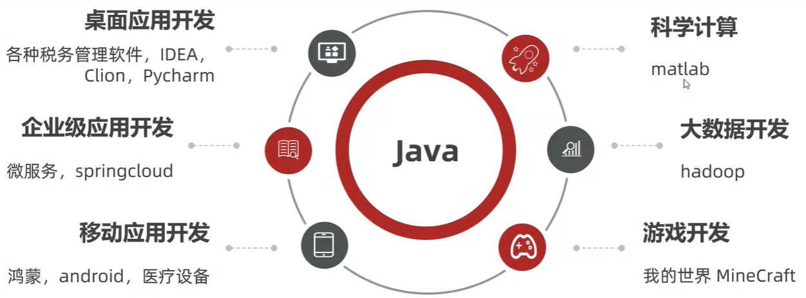

# Java 入门

## 一、Windows 上的 CMD 命令

### 1.CMD 窗口打开

1. 按下快捷键：win + R。
2. 在运行窗口中输出 cmd
3. 输入回车

### 2.常用 CMD 命令

常见的CMD命令如下：

| 操作               | 说明                                                   |
| ------------------ | ------------------------------------------------------ |
| 盘符名称:          | 盘符切换。比如：`E:` + 回车，表示切换到 E 盘。         |
| dir                | 查看当前路径下的内容（文件、文件夹，包含隐藏的内容）。 |
| cd 目录            | 进入单级目录。比如：`cd workshop`                      |
| cd ..              | 回退到上一级目录。                                     |
| cd 目录1\目录2\... | 进入多级目录。比如：`cd workshop\java`                 |
| cd \               | 回退到盘符目录。                                       |
| cls                | 清屏。                                                 |
| exit               | 退出命令提示符窗口。                                   |

> 扩展：
>
> Windows 的 CMD 命令，在很多资料中都被说成是 DOS 命令，其实是不对的。
>
> DOS 命令源于 1981 年微软和 IBM 出品的 MS-DOS 操作系统中的命令。
>
> 在 Windows 操作系统的历史中，win98 之前的操作系统是以非图形化的 DOS 为基础的，可以叫做 DOS 命令。
>
> 到了 2000 年以后，windows 操作系统逐渐的以图形化界面为主了，这个时候就不能叫 DOS 命令了，他只是模拟了 DOS 环境而已，很多的原本的 DOS 命令已经无法使用了，所以这个时候叫做 CMD 命令会更准确一些。

### 3.CMD 命令打开 QQ

1.QQ 在 D 盘，进入 D 盘；

```cmd
D:
```

2.进入 QQ 的运行文件（qq.exe）所在目录。

```cmd
cd qq\Bin
```

- cmd 命令不区分大小写

3.打开 QQ

```cmd
qq.exe
```

## 二、环境变量

如果想要在 CMD 的任意目录下，都可以启动某一个软件（比如 QQ），那么要把这个软件的路径，配置到环境变量中的 `PATH` 里面。

在启动软件的时候，

1. 操作系统会先在当前路径下找；
2. 如果在当前目录没有，再到环境变量的路径 `PATH` 中去找。
3. 如果都找不到就提示无法启动。

在 Window 系统中，设置环境变量 `PATH` 的步骤如下：

1. 右键我的电脑，选择属性；
2. 点击左侧的高级系统设置；
3. 选择高级，再点击下面的环境变量；
4. 找系统变量里面的 `PATH`；
5. 把软件的完整路径，配置到 `PATH` 当中就可以了；
6. （可做可不做）就是把自己配置的路径，移动到最上面。

## 三、JDK 下载和安装

在 [Oracle 官网](https://www.oracle.com/java/technologies/downloads/#jdk17-windows) 下载 jdk17。

下载完成后，进行安装，点击下一步即可。默认的安装路径是在 `C:\Program Files` 下。建议更改：

- 安装路径不要有中文，不要有空格等一些特殊的符号。
- 以后开发相关的所有软件建议都安装在同一个文件夹中，方便管理。

### 1.JDK 的安装目录

| 目录名称 | 说明                                                         |
| -------- | ------------------------------------------------------------ |
| bin      | 该路径下存放了 JDK 的各种工具命令。`javac` 和 `java` 就放在这个目录。 |
| conf     | 该路径下存放了 JDK 的相关配置文件。                          |
| include  | 该路径下存放了一些平台特定的头文件。                         |
| jmods    | 该路径下存放了 JDK 的各种模块。                              |
| legal    | 该路径下存放了 JDK 各模块的授权文档。                        |
| lib      | 该路径下存放了 JDK 工具的一些补充 JAR 包。                   |

## 四、Java 代码编写并运行

Java 代码不能在操作系统中直接运行。要将它翻译为操作系统能够识别的机器码。

> 新版本的 jdk（比如 JDK17），在无需配置环境变量的情况下，也可以使用 `javac` 命令、`Java` 命令。
>
> - `javac` 是 JDK 提供的一个编译工具。
> - `java` 是 JDK 提供的运行字节码（.class）文件的工具。
>
> 这是因为，Windows 系统中，JDK17 在安装完成后，会在 `PATH` 环境变量中，配置 `C:\Program Files\Common Files\Oracle\Java\javapath`
>
> 它将 `java`、`javac` 两个工具，链接到了这个路径下。

步骤如下：

### 1.编写 java 文件

创建一个 `HelloWorld.java` 文件，在其中编写代码：

demo-project/demo/src/HelloWorld.java

```java
public class HelloWorld {
    public static void main(String[] args) {
        System.out.println("HelloWorld");
    }
}
```

- `System.out.print` 输出中文时，默认是乱码，要设置代码编辑工具的字符编码。

### 2.编译 java 文件

使用 jdk 的 bin 目录下 `javac` 工具，去编译这个文件：

在代码所在目录，打开 cmd 命令窗口，输入命令：

```cmd
javac HelloWorld.java
```

在目录下，会生成一个 `HelloWorld.class` 文件，这个文件是编译后的字节码（.class）文件。

### 3.运行编译好的字节码文件

然后使用 `java` 工具，执行这个字节码文件，输入命令：

```cmd
java HelloWorld
```

- 执行字节码文件时，不需要加后缀名 .class

## 五、Java 环境变量

来到系统环境变量的设置界面。

> 新版本的 JDK，默认在环境变量 `PATH` 进行了配置；
>
> 新版本的 JDK，安装后会默认在环境变量 `PATH` 下配置 `C:\Program Files\Common Files\Oracle\Java\javapath`；
>
> 以前下载的老版本的 JDK，是没有自动配置的，而且新版本 JDK 默认配置的这个目录下，只包含了 4 个工具。
>
> 所以我们需要删掉自动配置的 `PATH` 环境变量，再次重新配置 `PATH` 环境变量。

在 `PATH` 中，直接配置该目录 `D:\Devtools\Java\jdk-17\bin` 是最简单粗暴的方式。但不推荐这么做，因为可能会覆盖掉系统中的其它命令。

### 1.JAVA_HOME 环境变量配置

`JAVA_HOME` 环境变量配置方式如下：

- 在环境变量中，创建一个 `JAVA_HOME` 的环境变量，值设为 JDK 的安装目录，即：`D:\Devtools\Java\jdk-17`；

### 2.PATH 环境变量中引用 JAVA_HOME

然后再 `PATH` 环境变量中，新增一条 `%JAVA_HOME%\bin\`，即可；

以后用到的开发工具，如果引用了 Java 相关工具，就会去这个目录下查找。

## 六、Java 语言的发展

1990 年，Sun（Stanford University Network）公司，James Gosling 领导了 Green 计划，要为下一代家电（电视机、微波炉、电话）编写一个通用的控制系统。

- 原本打算使用 C++ 来编写这个项目，但是发现 C++ 有很多不方便的地方；
- 于是 James Gosling 创建了 Oak（橡树）语言。

1992 年，Green 计划已完成了新平台的部分功能，包括 Green 操作系统；Oak 的程序设计语言，类库等等。同年 11 月，Sun 公司成立了一个新子公司，名为 FirstPerson。但该公司一度因经营不善，差点凉凉，Oak 语言也差点消失。

1994 年，互联网行业进入快速发展阶段，James Gosling 改写了 Oak 语言，在同年秋天，完成了第一个 Oak 语言编写的网页浏览器 WebRunner。Sun 公司也准备为 Oak 语言注册商标，但发现该名称已被注册，遂改名为 Java。

1995 年，Sun 公司正式推出 Java。

### 1.Java 的版本历史

1996 年，Sun 公司发布 Java 1.0

1997 年，Sun 公司发布 Java 1.1

1998 年，Sun 公司发布 Java 1.2

2000 年，Sun 公司发布 Java 1.3

2002 年，Sun 公司发布 Java 1.4

2004 年，Sun 公司发布 Java 5.0，Java 从此开始以大版本号发布。

2006 年，Sun 公司发布 Java 6.0

2009 年，甲骨文（Oracle）公司收购 Sun 公司。

2011 年，甲骨文发布 Java 7.0

2014 年，甲骨文发布 Java 8.0（LTS0）

2017 年，甲骨文发布 Java 9.0

2017 年 9 月，甲骨文发布 Java 9.0

2018 年 3 月，甲骨文发布 Java 10.0

2018 年 9 月，甲骨文发布 Java 11.0（LTS0）

2019 年 3 月，甲骨文发布 Java 12.0

2019 年 9 月，甲骨文发布 Java 13.0

2020 年 3 月，甲骨文发布 Java 14.0

2020 年 9 月，甲骨文发布 Java 15.0

2021 年 3 月，甲骨文发布 Java 16.0

2021 年 9 月，甲骨文发布 Java 17.0（LTS0）

## 七、Java 三大平台（有什么用）

Java 有三大领域的应用。分别是：

- JavaSE
- JavaME
- JavaEE

### 1.JavaSE

JavaSE，是 Java 语言的标准版，用于桌面应用的开发。

- 然而，桌面应用常用的复杂动画，Java 加载的速度有可能很慢；
- 在桌面应用领域，最合适的语言仍然是是 C 和 C++。

同时 JavaSE 也是其他两个版本的基础。

### 2.JavaME

JavaME 是 Java 语言的小型版，用于嵌入式消费类电子设备或者小型移动设备的开发。

- 比如：电视、微波炉、数码相机等等。
- 比如：诺基亚早期使用的塞班系统，就是使用 JavaME 编写的。

目前小型移动设备的开发（手机）渐渐的没落了，已经被安卓和 IOS 替代。

> 安卓也是可以用 Java 来开发的。

### 3.JavaEE

用于 Web 方向的网站开发（主要从事后台服务器的开发）。

在服务器领域，Java 是当之无愧的龙头老大。

企业级应用，本质上就是服务器的开发。



## 八、Java 主要特性

Java 主要有以下特性：

- 面向对象
- 安全性
- 多线程
- 简单易用
- 开源
- 跨平台（write once，run anywhere）

### 1.Java 跨平台的原理

高级语言要在机器上执行，通常分为三步：

1. 编程：Java 代码在 `.java` 文件中编写；C 语言代码在 `.c` 文件中编写；python 代码在 `.py` 文件中编写。
2. 编译：编译就是将代码文件，转为机器认识的由 0、1 组成的机器码的过程。
3. 运行：让机器执行编译后的指令。

针对编译、运行这两个步骤，高级语言可分为：

- 编译型语言；
  - 比如：C 语言要针对不同平台进行编译（比如 arm 平台编译器、x86 平台编译器）。
- 解释性语言；
  - 比如：python，编写好代码后，边解释，边执行（按行翻译）。
  - Java，C 语言被编译后，都会产生一个编译文件；但 python 是直接使用 .py 文件来运行代码的。也就是说 python 必须要将源代码交给运行环境来运行，而不像 Java、C 语言一样，仅需要将编译好的编译文件交给机器运行。

- 混合型语言（半编译、半解释）。
  - 比如：Java。

Java 的编译运行方式如下：


Java 不会直接在操作系统上运行，而是运行在 Java 虚拟机（JVM）中的。

我们只需针对不同的操作系统，安装不同的虚拟机，就可以运行 Java 编译后的字节码文件了。

## 九、JRE、JDK

Java 代码编写，编译，运行的整个过程，需要用到下方的三部分内容：

- 第一部分：**Java 虚拟机（JVM）**，Java 虚拟机（JVM）是真正运行 Java 字节码文件的地方。

- 第二部分：**Java 核心类库**。Java 已经写好的东西，可以直接使用。

  ```java
  System.out.println("HelloWorld");
  ```

  - 上方代码中，`System`、`out`、`println` 都是核心类库中定义好的。

- 第三部分：**Java 开发工具**：其中有：

  - `javac`，编译工具；

  - `Java`，运行工具；

  - `jdb`，调试工具；

  - `jhat`，内存分析工具。
  - ...

上方三部分内容，组成了 **JDK（Java Development Kit**）

上方的 **Java 虚拟机（JVM）** 、**Java 核心类库**两部分内容，和 **Java 运行工具**（比如 `Java`）组成了 **JRE（Java Runtime Environment）**，表示 Java 运行环境。JRE 仅仅用来执行编译好的字节码文件。


JDK 包含了 JRE；

JRE 包含了 JVM。
