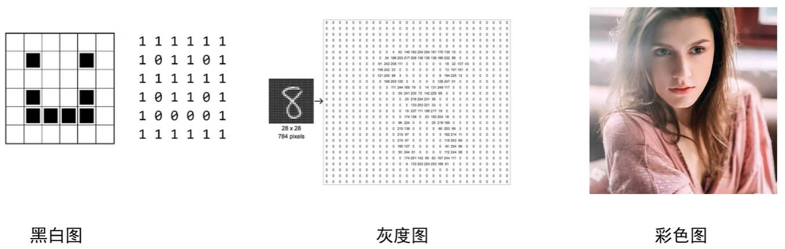
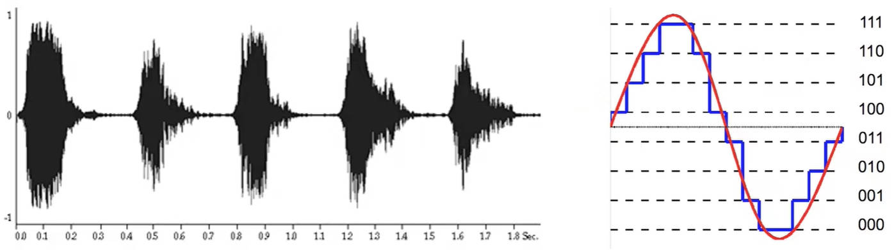

# Java 基础概念

## 一、Java 的注释

注释是对代码的解释和说明文字。Java 中的注释分为三种：

### 1.单行注释

```java
// 单行注释
```

### 2.多行注释

多行注释不能嵌套使用。

```java
/*
这是多行注释文字
这是多行注释文字
这是多行注释文字
*/
```

### 3.文档注释

使用 Java 自带的 doc 工具，可以根据代码中的文档注释，生成文档。

```java
/**
这是多行注释文字
这是多行注释文字
这是多行注释文字
*/
```

为前面编写的代码，写上注释：

```java
public class HelloWorld {
    // main 方法，表示程序的主入口。
    public static void main(String[] args) {
        /* ——输出语句（打印语句）
         * 可以把小括号里的内容，进行输出打印 */
        System.out.println("你好");
    }
}
```

## 二、Java 关键字

Java 中的关键字，表示被 Java 赋予了特定含义的英文单词。

- 关键字的字母，全部是小写的；
- 常见的代码编辑器，针对关键字有特殊标记，非常直观。

Java 中有五十多个关键字，不用刻意去记。

| 关键字         | 关键字           | 关键字        | 关键字         | 关键字     |
| -------------- | ---------------- | ------------- | -------------- | ---------- |
| **abstract**   | **assert**       | **boolean**   | **break**      | **byte**   |
| **case**       | **catch**        | **char**      | **class**      | **const**  |
| **continue**   | **default**      | **do**        | **double**     | **else**   |
| **enum**       | **extends**      | **final**     | **finally**    | **float**  |
| **for**        | **goto**         | **if**        | **implements** | **import** |
| **instanceof** | **int**          | **interface** | **long**       | **native** |
| **new**        | **package**      | **private**   | **protected**  | **public** |
| **return**     | **strictfp**     | **short**     | **static**     | **super**  |
| **switch**     | **synchronized** | **this**      | **throw**      | **throws** |
| **transient**  | **try**          | **void**      | **volatile**   | **while**  |

### 1.class 关键字

`class` 关键字，表示定义一个类。创建一个类。

类是 Java 项目最基本的组成单元，一个完整的 Java 项目有可能会有成千上万个类来组成的。

`class` 关键字后面，跟随的就是这个类的名字（类名）。

```java
public class HelloWorld {

}
```

- `class` 表示定义类；
- `HelloWorld` 表示类名；
- 类名后面的大括号，表示这个类的范围。

## 三、Java 字面量

字面量：用于告诉程序员，数据在程序中的书写格式。

### 1.Java 字面量类型

Java 中的字面量类型，有以下几种：

| **字面量类型** | **说明**                                  | **程序中的写法**               |
| -------------- | ----------------------------------------- | ------------------------------ |
| 整数           | 不带小数的数字                            | `666`，`-88`                   |
| 小数           | 带小数的数字                              | `13.14`，`-5.21`               |
| 字符           | 必须使用单引号，有且仅能有一个字符        | `‘A’`，`‘0’`，`‘我’`           |
| 字符串         | 必须使用双引号，内容可有可无              | `“HelloWorld”`，`“你是程序员”` |
| 布尔值         | 布尔值，表示真假，只有两个值：true，false | `true`、`false`                |
| 空值           | 一个特殊的值，表示空值                    | `null`                         |

常见的字面量类型的值，在代码中的书写：

demo-project/demo/src/ValueDemo1.java

```java
public class ValueDemo1 {
    public static void main(String[] args) {
        // 整数
        System.out.println(666);
        System.out.println(-71);

        // 小数
        System.out.println(3.14);
        System.out.println(-3.14);

        // 字符串
        System.out.println("zzt");
        System.out.println("Haha");

        // 字符
        System.out.println('女');
        System.out.println('A');

        // 布尔
        System.out.println(true);
        System.out.println(false);

        // 空（null 不能直接打印，否则会报错，为它加上双引号）
        System.out.println("null");
    }
}
```

字面量类型有以下区分技巧：

1. 不带小数点的数字，都是整数类型的字面量。
2. 只要带了小数点，那么就是小数类型的字面量。
3. 只要用双引号包裹的，不管里面的内容是什么，不管里面有没有内容，都是字符串类型的字面量。
4. 字符类型的字面量必须用单引号包裹，不管内容是什么，但是字符个数有且只能有一个。
5. 布尔类型的字面量只有两个值，`true`、`false`。
6. 空类型的字面量只有一个值，`null`。

### 2.特殊字符

Java 中的特殊字符字面量，可以使用单引号（''）或者双引号（""）包裹。

比如：`'\t'`，表示制表符，作用是在打印的时候，把前面的字符串长度补齐到 8 或者 8 的整数倍，最少补 1 个空格，最多补 8 个空格。

demo-project/demo/src/ValueDemo2.java

```java
public class ValueDemo2 {
    public static void main(String[] args) {
        System.out.println("name" + '\t' + "age"); // '\t' 补充了 4 个空格。
        System.out.println("tom" + '\t' + 23); // '\t' 补充了 5 个空格
    }
}
```

## 四、Java 变量（一）

变量，就在程序中临时存储数据的容器。但是这个容器中只能存一个值，其值有可能发生改变。

### 1.Java 变量的使用

#### 1.Java 变量的定义

Java 变量的定义格式：`数据类型 变量名 = 数据值;`

- 数据类型：限定了变量当中能存储什么类型的数据。

  - 如果要存 10，那么数据类型就需要写整数类型。
  - 如果要存 10.0，那么数据类型就需要写小数类型。

- 变量名：其实就是这个容器的名字。

  - 当以后想要使用变量里面的数据时，直接使用变量名就可以了。

- 数据值：真正存储在容器中的数据。

- 分号：表示语句的结束，就跟以前写作文时候的句号是一样的。

> Java 中常用的数据类型有如下：
>
> | 数据类型 | 关键字   |
> | -------- | -------- |
> | 整数     | `int`    |
> | 浮点数   | `double` |

变量定义后，可以输出打印，

demo-project/demo/src/VariableDemo1.java

```java
public class VariableDemo1 {
    public static void main(String[] args) {
        int a = 10;

        System.out.println(a); // 10
    }
}
```

#### 2.Java 变量参与计算

变量也可以参与计算。

demo-project/demo/src/VariableDemo1.java

```java
public class VariableDemo1 {
    public static void main(String[] args) {
        int a = 10;
        int b = 20;

        int c = a + b;

        System.out.println(c); // 30
    }
}
```

#### 2.Java 变量的修改

变量也可以修改值。

demo-project/demo/src/VariableDemo1.java

```java
public class VariableDemo1 {
    public static void main(String[] args) {
        int a = 10;
        int b = 20;

        a = 30;

        int c = a + b;

        System.out.println(c); // 50
    }
}
```

### 2.Java 变量的注意事项

#### 1.Java 变量只能保存一个值

demo-project/demo/src/VariableDemo2.java

```java
public class VariableDemo1 {
    public static void main(String[] args) {
        int a = 10;
    }
}
```

#### 2.Java 变量名不能重复定义

demo-project/demo/src/VariableDemo2.java

```java
public class VariableDemo1 {
    public static void main(String[] args) {
        int a = 10;

        int a = 20; // 报错
    }
}
```

#### 3.Java 变量可以在一条语句当中，定义多个

变量之间用 `,` 号分隔。

demo-project/demo/src/VariableDemo2.java

```java
public class VariableDemo2 {
    public static void main(String[] args) {
        int a = 10, b = 20, c = 30;

        System.out.println(a);
        System.out.println(b);
        System.out.println(c);
    }
}
```

#### 4.Java 变量在使用之前，一定要进行赋值

demo-project/demo/src/VariableDemo2.java

```java
public class VariableDemo2 {
    public static void main(String[] args) {
        int d;

        System.out.println(d); // 报错
    }
}
```

应改为：

demo-project/demo/src/VariableDemo2.java

```java
public class VariableDemo2 {
    public static void main(String[] args) {
        int d;
        d = 100;

        System.out.println(d); // 报错
    }
}

```

- 定义变量时，建议直接赋值；而不是将变量的定义和赋值分开。

#### 5.Java 变量只能在作用域范围内使用

后续讲解。

### 3.Java 变量练习

需求：说出公交车到终点站之后，车上一共有多少乘客？

- 一开始没有乘客。
- 第一站：上去一位乘客，没有下来乘客。
- 第二站：上去两位乘客，下来一位乘客。
- 第三站：上去两位乘客，下来一位乘客。
- 第四站：没有上去乘客，下来一位乘客。
- 第五站：上去一位乘客，没有下来乘客。
- 问：到了终点站之后，车上一共多少乘客？

demo-project/demo/src/VariableTest.java

```java
public class VariableTest {
    public static void main(String[] args) {
      //一开始没有乘客。
      int count = 0;

      //第一站：上去一位乘客
      count = count + 1;

      //第二站：上去两位乘客，下来一位乘客
      count = count + 2 - 1;

      //第三站：上去两位乘客，下来一位乘客
      count = count + 2 - 1;

      //第四站：下来一位乘客
      count = count - 1;

      //第五站：上去一位乘客
      count = count + 1;

      //请问：到了终点站，车上一共几位乘客。
      System.out.println(count);//3
    }
}
```

## 五、计算机的存储规则

计算机中，只能存储三种类型的数据：文字，图片，声音（视频就是图片和声音的组合）。它们都是以二进制的形式存储的。

常见的进制，以及代码中的表示方式（JDK1.7）：

- 二进制，由 `0`、`1` 组成，代码中以 `0b` 开头；
- 十进制，代码中前面不加前缀；
- 八进制，由 `0-7` 组成；代码中以 `0` 开头；
- 十六进制，由 `0-9` 和 `a-f` 组成。代码中以 `0x` 开头；

demo-project/demo/src/VariableDemo3.java

```java
public class VariableDemo3 {
    public static void main(String[] args) {
        System.out.println(17); // 十进制

        System.out.println(017); // 八进制

        System.out.println(0b123); // 语法报错，123 不是二进制数

        System.out.println(0x123); // 十六进制
    }
}
```

十进制计算规则

- 十进制，逢十进一，借一当十；

二进制计算规则

- 二进制，逢二进一，借一当二。

### 1.进制转换

#### 1.任意进制转十进制

公式：系数 \* 基数的权次幂；相加

- 系数：就是每一位上的数；
- 基数：当前进制数（二进制就是 2）；
- 权：从右往左，依次为 0, 1, 2, 3, ....

> 二进制转十进制，有一个简单的方法，8421 转换法。
>
> - 因为每一个二进制值的 1，都是代表一个固定的值。
> - 把每一位的 1 代表的十进制数相加，得到的结果，就是它所代表的十进制数。

#### 2.十进制转其它进制进制

除基取余法：不断的除以基数，得到余数，直到商为 0，再将余数倒着拼起来即可。

### 2.文字的存储

文字在计算机中存储，会转为二进制进行存储，它们的对应关系如下：

字母转二进制：

- 在 ASCLL 码表中，每一个字母，与唯一的一个数字，产生对应关系。

汉字转二进制：

- 在 GB2312 码表中，每一个汉字，与唯一的一个数字，会产生对应关系。

> GB2312 编码，是 1981 年 5 月 1 日 发布的简体中文汉字编码国家标准。收录 7445 个图形字符，其中包括 6763 个汉字。
>
> BIG5 编码，是 1984 年实施的台湾地区繁体中文标准字符集，共收录 13053 个中文字。
>
> GBK 编码，是 2000 年 3 月 17 日发布，收录 21003 个汉字，包含国家标准 GB13000-1 中的全部中日韩汉字，有 BIG5 编码中的所有汉字。
>
> Unicode 编码，国际标准字符集，它将世界各种语言的每个字符定义一个唯一的编码，以满足跨语言、跨平台的文本信息转化。
>
> 这些编码（码表）在每一个操作系统中，都有配置。

### 3.图片的存储

图片有三个概念：分辨率，像素，三原色。

在计算机中图片分为：黑白图，灰度图、彩色图；



黑白图：就是给图片中的每一个像素，涂抹黑色或白色，像素点为 1，则涂成白色；像素点为 0，则涂成黑色；

灰度图：需要用到一个概念“灰度表”，其中 `0` 代表纯黑，`255` 代表纯白。中间是不同层次的灰色。图片中的每一个像素，根据灰度值来上色。

彩色图，同样的，要为每一个像素点，记录颜色。计算机中每一个像素点都有**光学三原色（红、绿、蓝）**，将它们组合起来，就能生成彩色的像素点。红、绿、蓝三种颜色记录的数值范围，同样也是 0-255.

- 比如 `255, 0, 0`，代表纯红色；
- 比如 `0, 255, 0`，代表纯绿色；
- 比如 `0, 0, 255`，代表纯蓝色。

### 4.声音的存储

描述一段声音，可以使用波形图，波形图上的每个点，同样也可以使用数字来标记。



计算机在存储声音的时候，会对声波进行采样，声波波形图上的每一个点，都会有相应的数字标记：

- 在音乐软件中氪金的高品质音源，采样的声波图，记录的点就比较多，可以最大程度的还原音乐。
- 在音乐软件中的低品质音源，采样的声波图，记录的点就比较少。

## 六、Java 数据类型

Java 中数据类型分为两类：

- 基本数据类型
- 引用数据类型（面向对象的时候再深入介绍）

### 1.Java 基本数据类型

Java 中的基本数据类型，分为四类八种。如下方所示：

| 数据类型 | 关键字  | 内存占用 |                     取值范围                     |
| :------: | :-----: | :------: | :----------------------------------------------: |
|   整数   |  `byte`   |    1     |    负的 2 的 7 次方 ~ 2 的 7 次方-1 (**-128~127**)    |
|          |  `short`  |    2     | 负的 2 的 15 次方 ~ 2 的 15 次方-1 (-32768~32767) |
|          |   `int`   |    4     |        负的 2 的 31 次方 ~ 2 的 31 次方-1 (-2147483648~2147483648)        |
|          |  `long`   |    8     |        负的 2 的 63 次方 ~ 2 的 63 次方-1 (-9223372036854775808~9223372036854775808)        |
|  浮点数  |  `float`  |    4     |           -3.401298e-38 ~ 3.402823e+38           |
|          | `double`  |    8     |          4.9000000e-324 ~ 1.797693e+308          |
|   字符   |  `char`   |    2     |                     0-65535                      |
|   布尔   | `boolean` |    1     |                   true，false                    |

除了以上这些，还有 `String` 字符串类型，后续介绍。

#### 1.数据类型的使用

整数类型的取值范围大小关系：double > float > long > int > short > byte

demo-project/demo/src/VariableDemo4.java

```java
public class VariableDemo4 {
    public static void main(String[] args) {
        //1.定义 byte 类型的变量
        byte a = 10;

        System.out.println(a);

        //2.定义 short 类型的变量
        short b = 20;

        System.out.println(b);

        //3.定义 int 类型的变量
        int c = 30;

        System.out.println(c);

        //4.定义 long 类型的变量
        long d = 123456789123456789L;

        System.out.println(d);
    }
}
```

- long 类型的变量，在定义时，需要在数值后加“L”或者“l”，推荐大写的“L”，容易区分。

#### 2.浮点数类型的使用

demo-project/demo/src/VariableDemo4.java

```java
public class VariableDemo4 {
    public static void main(String[] args) {
        //5.定义 float 类型的变量
        float e = 10.1F;

        System.out.println(e);

        //6.定义 double 类型的变量
        double f = 20.3;

        System.out.println(f);
    }
}
```

- float 类型的变量，在定义时，需要在数值后加“F”或者“f”，推荐大写的“F”，容易区分。

#### 3.字符类型的使用

demo-project/demo/src/VariableDemo4.java

```java
public class VariableDemo4 {
    public static void main(String[] args) {
        //7.定义 char 类型的变量
        char g = 'a';

        System.out.println(g);
    }
}
```

#### 4.布尔类型的使用

demo-project/demo/src/VariableDemo4.java

```java
public class VariableDemo4 {
    public static void main(String[] args) {
        //8.定义 boolean 类型的变量
        boolean h = true;

        System.out.println(h);
    }
}
```

### 2.Java 引用数据类型

后续面向对象再深入介绍。

### 3.Java 数据类型练习

输出我的个人信息：

demo-project/demo/src/VariableTest2.java

```java
public class VariableTest2 {
    public static void main(String[] args) {
      //1.定义字符串类型的变量记录老师的姓名
      String name = "zzt";

      //2.定义整数类型的变量记录老师的年龄
      int age = 18;

      //3.定义字符类型的变量记录老师的性别
      char gender = '男';

      //4.定义小数类型的变量记录老师的身高
      double height = 188.89;

      //5.定义布尔类型的变量记录老师的婚姻状况
      boolean flag = true;

      //输出5个变量的值
      System.out.println(name);
      System.out.println(age);
      System.out.println(gender);
      System.out.println(height);
      System.out.println(flag);
    }
}
```

输出电影的信息：

需求：将（电影名称，主演，年份，评分）四个信息，选择不同类型的变量，随后打印出来。

demo-project/demo/src/VariableTest3.java

```java
public class VariableTest3 {
    public static void main(String[] args) {
      //1.定义字符串变量记录电影的名称
      String movie = "送初恋回家";

      //2.定义三个变量记录主演的名字
      String name1 = "刘鑫";
      String name2 = "张雨提";
      String name3 = "高媛";

      //3. 定义整数类型的变量记录年龄的年份
      int year = 2020;

      //4.定义小数类型的变量记录电影的评分
      double score = 9.0;

      //打印变量的信息
      System.out.println(movie);
      System.out.println(name1);
      System.out.println(name2);
      System.out.println(name3);
      System.out.println(year);
      System.out.println(score);
    }
}
```

输出商品的信息。

需求：选择其中一部手机，将（手机价格，手机品牌）两个信息选择不同类型的变量，随后打印出来。

demo-project/demo/src/VariableTest4.java

```java
public class VariableTest4 {
    public static void main(String[] args) {
      //1.定义小数类型的变量记录手机的价格
      double price = 5299.0;

      //2.定义字符串类型的变量记录手机的品牌
      String brand = "华为";

      //输出变量记录的值
      System.out.println(price);
      System.out.println(brand);
    }
}
```

## 七、Java 标识符

在 Java 中，标识符就是给类、方法、变量起的名字。

业内大多数程序员，都在遵守阿里巴巴的命名规则。

### 1.Java 标识符硬性要求

Java 中的标识符，必须满足以下规则，否则代码会报错。

- 必须由数字、字母、下划线 `_`、美元符号 `$` 组成；
- 不能以数字开头；
- 不能是关键字；
- 区分大小写的。

比如现有以下标识符，判断它们是否符合：

- `2b`，不符合，因为它以数字开头。
- `_2b`，符合。
- `class`，不符合，因为它是 Java 中的关键字。
- `Class`，符合，因为 Java 中的关键字都是小写的，又因为标识符区分大小写的，所以它可以用作标识符。

### 2.Java 标识符软性建议

如果不采纳以下建议，代码不会报错，但是会让代码显得比较 low。

小驼峰命名法，适用于**变量名**和**方法名**：

- 如果是一个单词，那么全部小写，比如：`name`；
- 如果是多个单词，那么从第二个单词开始，首字母大写，比如：`firstName`、`maxAge`。

大驼峰命名法，适用于**类名**：

- 如果是一个单词，那么首字母大写。比如：`Demo`、`Test`；
- 如果是多个单词，那么每一个单词首字母都需要大写。比如：`HelloWorld`；

不管起什么名字，都要做到见名知意。

以下是一些阿里巴巴命名规范细节：

- 尽量不要用拼音。但是一些国际通用的拼音可视为英文单词。
  - 正确：`alibaba`、`hangzhou`、`nanjing`；
  - 错误：`jiage`、`dazhe`

- 平时在给变量名、方法名、类名起名字的时候，不要使用下划线或美元符号。
  - 错误：`_name`、`$name`；
  - 正确：`name`。

## 八、键盘录入

键盘录入的实际功能，Java 已经写好了一个 `Scanner` 类，我们只要直接使用 `Scanner` 这个类就可以了。

### 1.Scanner 类的使用步骤

`Scanner` 类的使用步骤：

1. 第一步：导包：表示要找到的 `Scanner` 这个类在哪，并引入进文件中；

   ```java
   import java.util.Scanner;
   ```

2. 第二步：创建对象：表示申明准备开始用 `Scanner` 这个类了

   ```java
   Scanner sc = new Scanner(System.in);
   ```

3. 第三步：接收数据：表示真正干活的代码。

   ```java
   int i = sc.nextInt();
   ```

### 2.Scanner 类的使用

`Scanner` 类的使用，在控制台输入一个数字，并打印。

demo-project/demo/src/ScannerDemo1.java

```java
// 1.导包
import java.util.Scanner;

public class ScannerDemo1 {
    public static void main(String[] args) {
        // 2.创建对象，
        Scanner sc = new Scanner(System.in);

        // 3.接收数据
        System.out.println("请输入一个数字");

        int i = sc.nextInt();

        System.out.println(i);

        sc.close();
    }
}
```

`Scanner` 类的使用，在控制台使用键盘录入两个整数，输出两数之和。

demo-project/demo/src/ScannerTest.java

```java
// 1.导报
import java.util.Scanner;

public class ScannerTest {
    public static void main(String[] args) {
        // 2.创建对象
        Scanner sc = new Scanner(System.in);

        // 3.键盘录入
        System.out.println("请输入一个整数：");

        int num1 = sc.nextInt();

        System.out.println("请输入二个整数：");

        int num2 = sc.nextInt();

        System.out.println("两数之和为：" + (num1 + num2));

        sc.close();
    }
}
```
