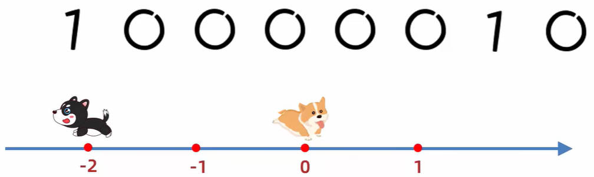
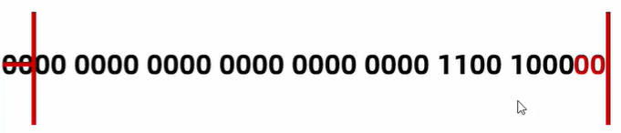
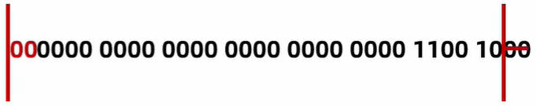

# Java 运算符

**Java 运算符**，就是对常量或者变量进行操作的符号。

**Java 表达式**，用运算符把常量或者变量连接起来的，符合 Java 语法的式子就是表达式。

以下是一些 Java 表达式：

```java
int a = 10;
int b = 20;

int c = a + b;
```

- `a + b` 这个整体就是表达式。其中 `+` 是**算术运算符**的一种，所以这个表达式也称之为**算术表达式**。

## 一、Java 算数运算符

Java 算数运算符，分为加（`+`）、减（`-`）、乘（`*`）、除（`/`）、取模（`%`）；

### 1 整数、小数的算数运算

#### 1.整数的加（+）、减（-）、乘（\*）

整数的加（`+`）、减（`-`）、乘（`*`）算数表达式：

demo-project/base-code/day03/src/com/kkcf/arithmetic_operators/ArithmeticOperatorsDemo01.java

```java
package com.kkcf.arithmetic_operators;

public class ArithmeticOperatorsDemo01 {
    public static void main(String[] args) {
        // 整数的 +、-、*
        System.out.println(3 + 2); // 5

        System.out.println(5 - 1); // 4

        System.out.println(7 * 9); // 63
    }
}
```

- 结论：全部由整数参与的加（`+`）、减（`-`）、乘（`*`）运算，得到的结果也是整数。

#### 2.小数的加（+）、减（-）、乘（\*）

小数的加（`+`）、减（`-`）、乘（`*`）算数表达式：

demo-project/base-code/day03/src/com/kkcf/arithmetic_operators/ArithmeticOperatorsDemo01.java

```java
package com.kkcf.arithmetic_operators;

public class ArithmeticOperatorsDemo01 {
    public static void main(String[] args) {
        // 小数的 +、-、*
        System.out.println(1.1 + 1.1); // 2.2

        System.out.println(1.1 + 1.01); // 2.1100000000000003

        System.out.println(1.1 - 1.01); // 0.09000000000000008

        System.out.println(1.1 * 1.01); // 1.1110000000000002
    }
}
```

- 结论：小数直接参与的加（`+`）、减（`-`）、乘（`*`）运算，得到的结果也是小数，并且有可能不精确（具体原因后续介绍）。

#### 3.整数的除（/）运算

demo-project/base-code/day03/src/com/kkcf/arithmetic_operators/ArithmeticOperatorsDemo01.java

```java
package com.kkcf.arithmetic_operators;

public class ArithmeticOperatorsDemo01 {
    public static void main(String[] args) {
        // 整数 /
        System.out.println(10 / 2); // 5

        System.out.println(10 / 3); // 3
    }
}
```

- 结论：整数相除（`/`）结果只能得到整除。

#### 4.小数的除（/）运算

demo-project/base-code/day03/src/com/kkcf/arithmetic_operators/ArithmeticOperatorsDemo01.java

```java
package com.kkcf.arithmetic_operators;

public class ArithmeticOperatorsDemo01 {
    public static void main(String[] args) {
        // 小数 /
        System.out.println(10.0 / 3); // 3.3333333333333335
    }
}
```

- 结论：小数参与的除（`/`）运算，结果也是小数；并且结果有可能不精确（具体原因后续介绍）。

#### 5.整数的取模（%）运算

demo-project/base-code/day03/src/com/kkcf/arithmetic_operators/ArithmeticOperatorsDemo01.java

```java
package com.kkcf.arithmetic_operators;

public class ArithmeticOperatorsDemo01 {
    public static void main(String[] args) {
        // 整数 %
        System.out.println(10 % 3); // 1
    }
}
```

- 结论：整数参与的取模（`%`）运算，结果也是整数。

#### 6.小数的取模（%）运算

demo-project/base-code/day03/src/com/kkcf/arithmetic_operators/ArithmeticOperatorsDemo01.java

```java
package com.kkcf.arithmetic_operators;

public class ArithmeticOperatorsDemo01 {
    public static void main(String[] args) {
        // 小数 %
        System.out.println(10.1 % 3); // 1.0999999999999996
    }
}
```

- 结论 1：小数参与的取模（`%`）运算，结果也是小数；并且得到的结果有可能不精确（具体原因后续介绍）。

> 取模运算的应用场景：
>
> - 判断一个数是否能被另一个数整除。
> - 判断一个数是偶数还是奇数。
> - 模拟斗地主游戏中，为三个玩家发牌，把每一张牌都定义一个序号，拿序号对 3 取模：
>   - 如果结果为 1，就发给第一个玩家；
>   - 如果结果为 2，就发给第二个玩家；
>   - 如果结果为 0，就发给第三个玩家；

### 2.一个数的十位、百位、千位等等

练习一；需求：键盘录入一个三位数，将其拆分为个位、十位、百位后，打印在控制台

公式总结：

- 个位：数值 % 10
- 十位：数值 / 10 % 10
- 百位：数值 / 100 % 10
- 千位：数值 / 1000 % 10

demo-project/base-code/day03/src/com/kkcf/arithmetic_operators_test/Test1.java

```java
package com.kkcf.arithmetic_operators_test;

import java.util.Scanner;

public class Test1 {
    public static void main(String[] args) {
        // 键盘输入
        System.out.println("请输入一个三位数：");

        Scanner sc = new Scanner(System.in);
        int num = sc.nextInt();

        sc.close();

        // 获取数值的个、十、百位
        int ge = num % 10;
        int shi = num / 10 % 10;
        int bai = num / 100 % 10;

        System.out.println("个位：" + ge + " 十位：" + shi + " 百位：" + bai);
    }
}
```

### 3.数字运算的数据类型转换

不同数据类型的数值，不能进行运算，需要转成一致的类型，才能运算。

数值进行运算时，数据类型的转换方式，分为两种：

- 第一种：**隐式转换**（也称**自动类型提升**），表示取值范围小的数值，转为取值范围大的数值。
- 第二种：**强制转换**，表示取值范围大的数值，转为取值范围小的数值。

#### 1.隐式转换数字类型

**隐式转换**，是程序执行时，默认进行的。**隐式转换的规则**有两点：

- 规则一：取值范围小的，和取值范围大的数据类型的两个数，进行运算时，取值范围小的数据类型，会先提升为取值范围大的数据类型，再进行运算。
- 规则二：`byte`、`short`、`char` 三种数据类型的值，在运算的时候，都会先直接提升为 `int` 数据类型，再进行运算。

> 数据类型取值范围大小关系：double > float > long > int > short > byte

案例理解：

案例一：整数类型字面量 `10`，赋值给了一个 double 类型的标识符 `d`；默认会进行隐式转换。

demo-project/base-code/day03/src/com/kkcf/arithmetic_operators/ArithmeticOperatorsDemo02.java

```java
package com.kkcf.arithmetic_operators;

public class ArithmeticOperatorsDemo02 {
    public static void main(String[] args) {
        double d = 10;

        System.out.println(d); // 10.0
    }
}
```

- 字面量 `10` 是 int 整数类型。
- 把一个 int 类型的值，赋值给了一个 double 类型的标识符。相当于把一个取值范围小的数据类型，赋值给一个取值范围大的数据类型，这是被允许的，程序执行时默认会进行隐式转换。

案例二：将 byte 类型的数值，赋值给 int 类型的数值；默认会进行隐式转换。

demo-project/base-code/day03/src/com/kkcf/arithmetic_operators/ArithmeticOperatorsDemo02.java

```java
package com.kkcf.arithmetic_operators;

public class ArithmeticOperatorsDemo02 {
    public static void main(String[] args) {
        byte b = 100;
        int i = b;

        System.out.println(i);
    }
}
```

案例三：int 类型的数据与 double 类型的数据相加，int 类型的数据隐式转换为了 double 类型，再进行的运算：

demo-project/base-code/day03/src/com/kkcf/arithmetic_operators/ArithmeticOperatorsDemo02.java

```java
package com.kkcf.arithmetic_operators;

public class ArithmeticOperatorsDemo02 {
    public static void main(String[] args) {
        int a = 10;
        double b = 12.3;

        double c = a + b; // a 的数据类型被隐式转为了 double，再进行运算

        System.out.println(c);
    }
}
```

案例四：byte 类型的数据与 byte 类型的数据相加，它们都被隐式转换为了 int 类型，再进行运算：

demo-project/base-code/day03/src/com/kkcf/arithmetic_operators/ArithmeticOperatorsDemo02.java

```java
package com.kkcf.arithmetic_operators;

public class ArithmeticOperatorsDemo02 {
    public static void main(String[] args) {
        byte d = 10;
        byte e = 20;

        int f = d + e; //  d、e 的数据类型被隐式转为了 double，再进行运算。
        System.out.println(f);
    }
}
```

#### 2.强制转换数字类型

如果要把一个取值范围大的数据类型的数值，赋值给另一个取值范围小的数据类型的标识符。是不允许直接操作的。

如果一定要这么干，就需要加入**强制转换**。格式如下：

- `目标数据类型 变量名 = （目标数据类型）被强转的数据;`

案例理解：

案例一：将 `double` 类型的变量 `a`，强制转换成 `int` 类型：

demo-project/base-code/day03/src/com/kkcf/arithmetic_operators/ArithmeticOperatorsDemo03.java

```java
package com.kkcf.arithmetic_operators;

public class ArithmeticOperatorsDemo03 {
    public static void main(String[] args) {
        double a = 12.3;

        int b = (int) a;

        System.out.println(b); // 12
    }
}
```

- 结论：强制转换有可能会导致数据发生错误（数据的精度丢失）。

案例二：将 `byte` 类型的变量 `b1`、`b1` 相加，在运算时，它们会隐式转为 `int` 类型；

然后，将 `int` 类型的运算结果，强制转为 `byte` 类型。

demo-project/base-code/day03/src/com/kkcf/arithmetic_operators/ArithmeticOperatorsDemo03.java

```java
package com.kkcf.arithmetic_operators;

public class ArithmeticOperatorsDemo03 {
    public static void main(String[] args) {
        byte b1 = 100;
        byte b2 = 100;

        byte result = (byte)(b1 + b2);
        System.out.println(result); // -56
    }
}
```

- 结论：强制转换有可能会导致数据发生错误（数据的精度丢失）；`byte` 类型数值的取值范围是 `-128~127`。

### 4.字符串（+）运算

当 `+` 操作中出现字符串时，它就是字符串的连接符；

- 会将前后的数据进行拼接，并产生一个新的字符串。

当连续进行 `+` 操作时，是从左到右逐个执行的。

案例理解：

案例一：将数字与字符串拼接。

demo-project/base-code/day03/src/com/kkcf/arithmetic_operators/ArithmeticOperatorsDemo04.java

```java
package com.kkcf.arithmetic_operators;

public class ArithmeticOperatorsDemo04 {
    public static void main(String[] args) {
        System.out.println(1 + "abc" + 1); // 1abc1
    }
}
```

案例二：将数字相加后，再与字符串进行拼接。

demo-project/base-code/day03/src/com/kkcf/arithmetic_operators/ArithmeticOperatorsDemo04.java

```java
package com.kkcf.arithmetic_operators;

public class ArithmeticOperatorsDemo04 {
    public static void main(String[] args) {
        System.out.println(1 + 2 + "abc" + 2 + 1); // 3abc21
    }
}
```

案例三：将小数，布尔值，字符类型的值，与字符串拼接：

demo-project/base-code/day03/src/com/kkcf/arithmetic_operators/ArithmeticOperatorsDemo04.java

```java
package com.kkcf.arithmetic_operators;

public class ArithmeticOperatorsDemo04 {
    public static void main(String[] args) {
        System.out.println(3.7 + "abc"); // 3.7abc

        System.out.println("abc" + true); // abctrue

        System.out.println('中' + "abc" + true); // 中abctrue
    }
}
```

### 5.字符（+）运算

我们知道，不同数据类型进行运算，隐式转换的规则之一是：

- `byte`、`short`、`char` 三种数据类型的值，在运算的时候，都会先直接提升为 `int` 数据类型，再进行运算。

字符（`+`）运算的规则：

- 当（`+`）操作中出现了 `char` 字符类型的数值，会将字符数值转为计算机内置的 ASCII 码表中对应的数字，然后再进行计算。

> 需要记住，在 ASCLL 码表中，`a` 对应 `97`，`A` 对应 `65`；

案例理解：

案例一，将数字 `1` 与字符 `'a'` 相加。

demo-project/base-code/day03/src/com/kkcf/arithmetic_operators/ArithmeticOperatorsDemo05.java

```java
package com.kkcf.arithmetic_operators;

public class ArithmeticOperatorsDemo05 {
    public static void main(String[] args) {
        System.out.println(1 + 'a'); // 98
    }
}
```

- 结论：`char` 字符类型与数字相加，`char` 字符类型的数值，会隐式转为 `int` 类型，并根据码表映射数字。

案例二：将数字 `'a'` 与字符串 `"abc"` 相加。

demo-project/base-code/day03/src/com/kkcf/arithmetic_operators/ArithmeticOperatorsDemo05.java

```java
package com.kkcf.arithmetic_operators;

public class ArithmeticOperatorsDemo05 {
    public static void main(String[] args) {
        System.out.println('a' + "abc"); // aabc
    }
}
```

- 结论：`char` 字符类型与字符串类型的值相加，会应用字符串的拼接规则。

## 二、Java 自增自减运算符

自增自减运算符有两个：

- **自增运算符** `++`；
  - 变量的前面有 `++`，称为**前置自增运算符**，比如：`++a`；表示”先加后用“。
  - 变量的后面有 `++` ，称为**后置自增运算符**。 比如：`a++`。表示”先用后加“。
- **自减运算符** `--`。
  - 变量的前面有 `--`，称为**前置自增运算符**，比如：`--a`；表示”先减后用“
  - 变量的后面有 `--`，称为**后置自增运算符**。 比如：`a--`。表示”先用后减“。

自增自减运算符在处理 `byte`、`short`、`char` 类型时，同样会先隐式转换（自动类型提升）为 `int` 类型，再计算。

案例一：

demo-project/base-code/day03/src/com/kkcf/arithmetic_operators/ArithmeticOperatorsDemo06.java

```java
package com.kkcf.arithmetic_operators;

public class ArithmeticOperatorsDemo06 {
    public static void main(String[] args) {
        int x = 10;
        int y = x++;
        int z = ++x;

        System.out.println("x = " + x); // x = 12
        System.out.println("y = " + y); // y = 10
        System.out.println("z = " + z); // z = 12
    }
}
```

案例二：

```java
package com.kkcf.ternary_operator;

public class Test05 {
    public static void main(String[] args) {
        char a = 'a';

        a++;

        System.out.println(a); // b
    }
}
```

- 结论：对 `char` 类型变量使用自增/自减运算符时，Java 会将它们提升为 `int` 类型进行运算，然后再转换回 `char` 类型。

自增/自减运算符的应用场景：

某些情况下，变量需要进行加 1 或者减 1 的操作时使用。

- 比如：过生日多一岁，就用到了自增运算符。
- 比如：购物车中，增加商品数量，也用到了自增或者自减运算符。

## 三、Java 赋值运算符

Java 中的赋值运算符，有如下这些：

| 符号 | 作用       | 说明                                  |
| ---- | ---------- | ------------------------------------- |
| =  | 赋值       | `int a = 10`，将 10 赋值给变量 `a`    |
| += | 加后赋值   | `a += b`，将 a + b 的和，赋值给 `a`   |
| -= | 减后赋值   | `a -= b`，将 a - b 的差，赋值给 `a`   |
| *= | 乘后赋值   | `a *= b`，将 a \* b 的积，赋值给 `a`  |
| /= | 除后赋值   | `a /= b`，将 a / b 的商，赋值给 `a`   |
| %= | 取模后赋值 | `a %= b`，将 a % b 的余数，赋值给 `a` |

除了 `=` 赋值运算符以外，其它赋值运算符，在赋值运算时，还包含了一个强制转换。

- 它们将运算结果，强制转为运算符左边的标识符的数据类型。

demo-project/base-code/day03/src/com/kkcf/arithmetic_operators/ArithmeticOperatorsDemo07.java

```java
package com.kkcf.arithmetic_operators;

public class ArithmeticOperatorsDemo07 {
    public static void main(String[] args) {
        int a = 10;
        int b = 20;

        a += b; // 等同于 a = (int)(a + b)

        System.out.println(a); // 30
        System.out.println(b); // 20

        short s = 1;

        s += 1; // 等同于 s = (short)(s + 1)

        System.out.println(s); // 2
    }
}
```

## 四、Java 关系运算符（比较运算符）

Java 中的关系运算符，也称为比较运算符。本质上就是拿运算符左边与右边进行比较。

| 符号 | 解释                                                         |
| ---- | ------------------------------------------------------------ |
| ==   | 判断左边跟右边是否相等，如果成立就是 `tru`，如果不成立就是 `false` |
| !=   | 判断左边跟右边是否不相等，如果成立就是 `true`，如果不成立就是 `false` |
| >    | 判断左边是否大于右边，如果成立就是 `true`，如果不成立就是 `false` |
| >=   | 判断左边是否大于等于右边，如果成立就是 `tru`，如果不成立就是 `false` |
| <    | 判断左边是否小于右边，如果成立就是 `true`，如果不成立就是 `false` |
| <=   | 判断左边是否小于等于右边，如果成立就是 `tru`，如果不成立就是 `false` |

关系运算符的结构，都是布尔类型的，要么是 `true`，要么是 `false`。

demo-project/base-code/day03/src/com/kkcf/Increment_decrement_operators/IncrementDecrementOperatorsDemo01.java

```java
package com.kkcf.Increment_decrement_operators;

public class IncrementDecrementOperatorsDemo01 {
    public static void main(String[] args) {
        int a = 10;
        int b = 10;
        int c = 20;

        System.out.println(a == b); // true
        System.out.println(a == c); // false
    }
}
```

案例：你和你的约会对象，在餐厅约会，键盘录入两个整数，表示你和你的约会对象衣服的时髦程度。如果你衣服的时髦程度大于你约会对象的时髦程度，表示约会成功，否则表示约会失败。

demo-project/base-code/day03/src/com/kkcf/Increment_decrement_operators/IncrementDecrementOperatorsTest.java

```java
package com.kkcf.Increment_decrement_operators;

import java.util.Scanner;

public class IncrementDecrementOperatorsTest {
    public static void main(String[] args) {
        Scanner sc = new Scanner(System.in);

        System.out.println("请输入你的衣服时髦度：");
        int me = sc.nextInt();

        System.out.println("请输入你的约会对象的衣服时髦度：");
        int girl = sc.nextInt();

        sc.close();

        boolean result = me > girl;

        System.out.println("约会" + (result ? "成功" : "失败"));
    }
}
```

## 五、Java 逻辑运算符

Java 中的逻辑运算符，分为四种：

| 符号 | 作用         | 说明                                                                 |
| ---- | ------------ | -------------------------------------------------------------------- |
| &    | 逻辑与（且） | 表示“并且”，两边都为真，结果才为真，只要有一个为假，那么结果就是假。 |
| \|   | 逻辑或       | 表示“或者”，两边都为假，结果才为假，只要有一个为真，那么结果就是真。 |
| ^    | 逻辑异或     | 相同为假，不相同为真                                                 |
| !    | 逻辑非       | 取反                                                                 |

### 1.逻辑与、逻辑或

逻辑与（&），逻辑或（|）代码演示

D:\Workshop\tutorial\JAVA\demo-project\base-code\day03\src\com\kkcf\logic_operator\LogicOperatorDemo01.java

```java
package com.kkcf.logic_operator;

public class LogicOperatorDemo01 {
    public static void main(String[] args) {
        System.out.println(true & true); // true
        System.out.println(true & false); // false
        System.out.println(false & true); // false
        System.out.println(false & false); // false

        System.out.println(true | true); // true
        System.out.println(true | false); // true
        System.out.println(false | true); // true
        System.out.println(false | false); // false
    }
}
```

### 2.逻辑异或

逻辑异或（^）代码演示，用的很少。

D:\Workshop\tutorial\JAVA\demo-project\base-code\day03\src\com\kkcf\logic_operator\LogicOperatorDemo01.java

```java
package com.kkcf.logic_operator;

public class LogicOperatorDemo01 {
    public static void main(String[] args) {
        System.out.println(true ^ true); // false
        System.out.println(true ^ false); // true
        System.out.println(false ^ true); // true
        System.out.println(false ^ false); // false
    }
}
```

### 3.逻辑非

逻辑非（!）表示取反，代码演示

在 Java 中，取反（!）符号，要么不写，呀么只写一次。

D:\Workshop\tutorial\JAVA\demo-project\base-code\day03\src\com\kkcf\logic_operator\LogicOperatorDemo01.java

```java
package com.kkcf.logic_operator;

public class LogicOperatorDemo01 {
    public static void main(String[] args) {
        System.out.println(!true); // false
        System.out.println(!false); // true
    }
}
```

### 4.短路逻辑运算符

Java 中的短路逻辑运算符，分为**短路与（&&）**和**短路或（||）**。

| 符号 | 作用   | 说明                                   |
| ---- | ------ | -------------------------------------- |
| &&   | 短路与 | 运算结果和 & 相同，但是有短路的效果。  |
| \|\| | 短路或 | 运算结果和 \| 相同，但是有短路的效果。 |

短路与，短路或代码演示。

demo-project/base-code/day03/src/com/kkcf/logic_operator/LogicOperatorDemo02.java

```java
package com.kkcf.logic_operator;

public class LogicOperatorDemo02 {
    public static void main(String[] args) {
        System.out.println(true && true); // true
        System.out.println(true && false); // false
        System.out.println(false && true); // false
        System.out.println(false && false); // false

        System.out.println(true || true); // true
        System.out.println(true || false); // true
        System.out.println(false || true); // true
        System.out.println(false || false); // false*/
    }
}
```

短路与，和逻辑与的区别，代码演示：

短路与

demo-project/base-code/day03/src/com/kkcf/logic_operator/LogicOperatorTest01.java

```java
package com.kkcf.logic_operator;

public class LogicOperatorTest01 {
    public static void main(String[] args) {
        int a = 10;
        int b = 10;

        boolean result = ++a < 5 && ++b < 5;
        System.out.println(result); // false

        System.out.println(a); // 11
        System.out.println(b); // 10
    }
}
```

逻辑与

demo-project/base-code/day03/src/com/kkcf/logic_operator/LogicOperatorTest01.java

```java
package com.kkcf.logic_operator;

public class LogicOperatorTest01 {
    public static void main(String[] args) {
        int a = 10;
        int b = 10;

        boolean result = ++a < 5 & ++b < 5;
        System.out.println(result); // false

        System.out.println(a); // 11
        System.out.println(b); // 11
    }
}
```

> 开发中常用的逻辑运算符有：短路与（&&），短路或（||），取反（!）。

案例练习：6 是一个伟大的数字，键盘录入两个数字，如果其中一个是 6，或者两个数字之和为 6 的倍数，那么可以输出 true，否则输出 false。

demo-project/base-code/day03/src/com/kkcf/logic_operator/LogicOperatorTest02.java

```java
package com.kkcf.logic_operator;

import java.util.Scanner;

public class LogicOperatorTest02 {
    public static void main(String[] args) {
        Scanner sc = new Scanner(System.in);

        System.out.println("请输入第一个整数：");
        int num1 = sc.nextInt();

        System.out.println("请输入第二个整数：");
        int num2 = sc.nextInt();

        sc.close();

        System.out.println(num1 == 6 || num2 == 6 || (num1 + num2) % 6 == 0);
    }
}
```

## 六、Java 三元运算符

Java 中的三元运算符，又叫“三元表达式”，或者“问好冒号表达式”。

它的语法如下：`关系表达式 ? 表达式1 : 表达式2 ;`

三元运算符（三元表达式）的结果，**一定要被使用**，比如：

- 可以将结果赋值给一个变量；
- 也可以将结果输出打印。
- ...

demo-project/base-code/day03/src/com/kkcf/ternary_operator/TernaryOperatorDemo01.java

```java
package com.kkcf.ternary_operator;

public class TernaryOperatorDemo01 {
    public static void main(String[] args) {
        int a = 10;
        int b = 20;

        System.out.println(a > b ? a : b); // 20

        int max = a > b ? a : b;
        System.out.println(max); // 20
    }
}
```

案例练习一：动物园有两只老虎，键盘录入它们的体重，比较它们的体重是否相等。

demo-project/base-code/day03/src/com/kkcf/ternary_operator/TernaryOperatorTest01.java

```java
package com.kkcf.ternary_operator;

import java.util.Scanner;

public class TernaryOperatorTest01 {
    public static void main(String[] args) {
        Scanner sc = new Scanner(System.in);

        System.out.println("请输入第一只老虎的体重：");
        int weight1 = sc.nextInt();

        System.out.println("请输入第二只老虎的体重：");
        int weight2 = sc.nextInt();

        sc.close();

        System.out.println(weight1 == weight2 ? "它们的体重相等" : "它们的体重不相等");
    }
}
```

案例练习二：一座寺庙里住着三个和尚，已知他们的身高分别是 150cm，210cm，165cm，请用程序实现获取这三个和尚的最高身高。

demo-project/base-code/day03/src/com/kkcf/ternary_operator/TernaryOperatorTest02.java

```java
package com.kkcf.ternary_operator;

public class TernaryOperatorTest02 {
    public static void main(String[] args) {
        int height1 = 150;
        int height2 = 210;
        int height3 = 165;

        int temp = height1 > height2 ? height1 : height2;
        int max = temp > height3 ? temp : height3;

        System.out.println(max); // 210
    }
}
```

## 七、Java 运算符的优先级

Java 中，运算符的优先级，从高到低，如下表所示。

| 优先级 | 运算符                     |
| ------ | -------------------------- |
| 1      | .、()、{}                  |
| 2      | !、~、++、--               |
| 3      | \*、/、%                   |
| 4      | +、-                       |
| 5      | <<、>>、>>>                |
| 6      | <、<=、>、>=、instanceof   |
| 7      | ==、!=                     |
| 8      | &                          |
| 9      | ^                          |
| 10     | !                          |
| 11     | &&                         |
| 12     | \|\|                       |
| 13     | ? :                        |
| 14     | =、+=、-=、\*=、/=、%=、&= |

记住：`()` 优先级最高。

## 八、Java 中的原码、反码、补码

**原码**：十进制数据的二进制表现形式，最左边是符号位，`0` 为正，`1` 为负。

**反码**：正数的反码是其原码本身，负数的反码是其原码的符号位保持不变，其余位取反。

**补码**：正数的补码是其原码本身，负数的补码是其反码的基础上 +1。

### 1.原码

十进制数字 `56`，转为二进制为 `0011 1000`，其中：

- 第一个 `0` 为符号位，表示正数（如果是 `1`，则表示正数）；
- 后面的 `011 1000` 为数值。

> **比特**：在计算机中，一个 `0`，或者 `1`，表示一个比特（bit），它能表示的信息非常少。
>
> **字节**：八个比特（bit）组成了一个字节（byte），字节是计算机中最小的存储单元。

一个字节，能表示的

- 最大数是：符号位 `0`（表示正数），加数值 `111 1111`，即 `0111 1111`，即十进制数 `127`；
- 最小数是：符号位 `1`（表示负数），加数值 `111 1111`，即 `1111 1111`，即十进制数 `-127`

原码对正数进行运算，不会有问题。

#### 1.原码的弊端

然而，原码在进行负数运算时，是有问题的；比如：

- 运算 `-1 + 1` 时，在原码中的表现为：`1000 0001 + 1 = 1000 0010`，即最终结果为 `-2`。



所以，如果使用原码进行负数运算，结果会出错，实际的运算结果，跟我们预期的结果是相反的。

### 2.反码

反码，是为了解决原码不能计算负数的问题，而出现的。

反码的计算规则：

- 正数计算时，反码就是数字的原码；
- 负数计算时，反码是在数字的原码的基础上，符号位不变，数值取反（即 `0` 变 `1`，`1` 变 `0`）。

以数字 `56` 举例：

- `56` 的原码是：符号位 `0`（表示正数），加数字 `011 1000`，即 `0011 1000`；
- `-56` 的原码是：符号位 `1`（表示负数），加数字 `011 1000`，即 `1011 1000`。
- `-56` 的反码是：符号位 `1`（与原码保持一致，表示负数），加数字 `100 0111`（在原码的基础上取反），即 `1100 0111`。

现在计算 `-56 + 1`：

- 上面的分析可知，`-56` 的反码是 `1100 0111`，给它加 `1`，得到 `1100 1000`；
- 再将该值符号位不变，其它位数取反，得到 `1011 0111`，得到了 `-55`。

#### 1.反码的缺陷

如果有负数参与的计算，最终得到的结果大于等于 `0`（跨越了 `0`），那么使用反码计算，也会出现问题。

比如现在计算 `-5 + 6`

- `-5` 的反码是 `1111 1010`；
- `6` 的原码是 `0000 0110`
- 将它们相加，得到 `1 0000 0000`，超出一个字节的位数不管，取一个字节（即后八位）`0000 0000`。转为十进制后得到 `0`
- 然而 `-5 + 6`  正确的结果是 `1`，与 `0` 不符，它们之间差生了 `1` 的误差，

产生 `1` 的误差的原因，是因为 `0` 的反码有两种形态，即 `0000 0000` 和 `1111 1111`。

这时，就需要使用补码来解决这个误差。

### 3.补码

负数的补码，就是在其反码的基础上，加 `1`；

在补码中，`0` 就只有一种表示方式，即 `0000 0000`，这样就解决了误差的问题。

计算机中，所有的数字存储和计算，都是以补码的形式进行的。

计算机中，存储的数字，对应的原码、反码、补码如下图所示：

| 十进制数字 | 原码      | 反码      | 补码      |
| ---------- | --------- | --------- | --------- |
| +0         | 0000 0000 | 0000 0000 | 0000 0000 |
| -0         | 1000 0000 | 1111 1111 | 0000 0000 |
| -1         | 1000 0001 | 1111 1110 | 1111 1111 |
| -2         | 1000 0010 | 1111 1101 | 1111 1110 |
| -3         | 1000 0011 | 1111 1100 | 1111 1101 |
| -4         | 1000 0100 | 1111 1011 | 1111 1100 |
| ...        |           |           |           |
| -126       | 1111 1110 | 1000 0001 | 1000 0010 |
| -127       | 1111 1111 | 1000 0000 | 1000 0001 |
| -128       | 无        | 无        | 1000 0000 |

计算机中存储数字都是以补码的形式来存储的，由上表可知，一个字节的取值范围就是 `-128 - 127`。

在一个字节的取值范围中，`-128` 没有原码和反码。

#### 1.基本数据类型的补码

现在，我们可以在补码的层面，来理解四个基本数据类型，比如：

- byte 类型的 `10`（一个字节）的表示方式：`0000 1010`；
- short 类型的 `10`（二个字节）的表示方式：`0000 0000 0000 1010`；
- int 类型的 `10`（四个字节）的表示方式：`0000 0000 0000 0000 0000 0000 0000 1010`；
- long 类型的 `10`（八个字节）的表示方式：`0000 0000 0000 0000 0000 0000 0000 0000 0000 0000 0000 0000 0000 0000 0000 1010`；

#### 2.隐式转换中的补码

从补码的角度，分析 Java 中的隐式转换：

demo-project/base-code/day03/src/com/kkcf/original_inverse_complement_code/Test01.java

```java
package com.kkcf.original_inverse_complement_code;

public class Test01 {
    public static void main(String[] args) {
        byte a = 10; // 0000 1010

        int b = a; // 0000 0000 0000 0000 0000 0000 0000 1010

        System.out.println(b);
    }
}
```

- byte 类型的 a 变量是一个正数 `10`，它的原、反、补码的表现形式一致，即 `0000 1010`。
- int 类型的 b 变量，是变量 a 隐式转换后的值，它的原、反、补码的表现形式为 `0000 0000 0000 0000 0000 0000 0000 1010`。

Java 中的隐式转换（取值类型小的数据类型，转为取值类型大的数据类型），就是在前面补 0。

#### 3.强制转换中的补码

从补码的角度，分析 Java 中的强制转换：

demo-project/base-code/day03/src/com/kkcf/original_inverse_complement_code/Test02.java

```java
package com.kkcf.original_inverse_complement_code;

public class Test02 {
    public static void main(String[] args) {
        int a = 300; // 0000 0000 0000 0000 0000 0001 0010 1100

        byte b = (byte) a; // 0010 1100

        System.out.println(b); // 44
    }
}
```

- 强制类型转换（取值范围大的数据类型，转为取值范围小的数据类型），就是将补码前面的字节位数干掉。

demo-project/base-code/day03/src/com/kkcf/original_inverse_complement_code/Test02.java

```java
package com.kkcf.original_inverse_complement_code;

public class Test02 {
    public static void main(String[] args) {
        int a = 200; // 0000 0000 0000 0000 0000 0000 1100 1000

        byte b = (byte) a; // 1100 1000

        System.out.println(b); // -56
    }
}
```

- 强制类型转换（取值类型大的数据类型，转为取值类型小的数据类型），补码前面的字节位数被干掉后。剩余的字节位数，第一位仍表示符号位（即 `1` 表示负号，`0` 表示正号）。

#### 4.运算符的补码运算

从补码的角度，分析 Java 中的运算符进行的运算：

##### 1.数字的逻辑与（&）、逻辑或（|）的运算

| 运算符 | 含义   | 运算规则              |
| ------ | ------ | --------------------- |
| &      | 逻辑与 | 0 位 false，1 为 true |
| \|     | 逻辑或 | 0 位 false，1 为 true |

逻辑与，计算两个数字。

demo-project/base-code/day03/src/com/kkcf/original_inverse_complement_code/Test03.java

```java
package com.kkcf.original_inverse_complement_code;

public class Test03 {
    public static void main(String[] args) {
        int a  = 200; // 0000 0000 0000 0000 0000 0000 1100 1000

        int b = 10; // 0000 0000 0000 0000 0000 0000 0000 1010

        System.out.println(a & b); // 0000 0000 0000 0000 0000 0000 0000 1000
        // 即 8
    }
}
```

逻辑或，计算两个数字。

demo-project/base-code/day03/src/com/kkcf/original_inverse_complement_code/Test03.java

```java
package com.kkcf.original_inverse_complement_code;

public class Test03 {
    public static void main(String[] args) {
        int a  = 200; // 0000 0000 0000 0000 0000 0000 1100 1000

        int b = 10; // 0000 0000 0000 0000 0000 0000 0000 1010

        System.out.println(a | b); // 0000 0000 0000 0000 0000 0000 1100 1010
        // 即 202
    }
}
```

计算数字的逻辑与，逻辑或，没有短路的用法。

##### 2.数字的左移、右移运算

| 运算符 | 含义       | 运算规则                                                     |
| ------ | ---------- | ------------------------------------------------------------ |
| <<     | 左移       | 向左移动，低位补 0                                           |
| >>     | 右移       | 向右移动，高位符号位补 0 或 1（原来是正数，就补 0；原来是负数，就补 1），高位数值位补 0 |
| >>>    | 无符号右移 | 向右移动，高位补 0（不管原来是正数还是负数，符号位都补 0）   |

左移，代码理解

demo-project/base-code/day03/src/com/kkcf/original_inverse_complement_code/Test04.java

```java
package com.kkcf.original_inverse_complement_code;

public class Test04 {
    public static void main(String[] args) {
        int a = 200; // 0000 0000 0000 0000 0000 0000 1100 1000

        System.out.println(a << 2); // 800
    }
}
```

上方代码，执行的操作如下：



> 左移 n，相当于 * 2^n^

右移，代码理解

demo-project/base-code/day03/src/com/kkcf/original_inverse_complement_code/Test04.java

```java
package com.kkcf.original_inverse_complement_code;

public class Test04 {
    public static void main(String[] args) {
        int a = 200; // 0000 0000 0000 0000 0000 0000 1100 1000

        System.out.println(a >> 2); // 50
    }
}
```

上方代码，执行的操作如下：



> 右移 n，相当于 / 2^n^
