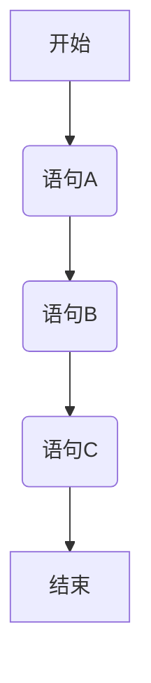
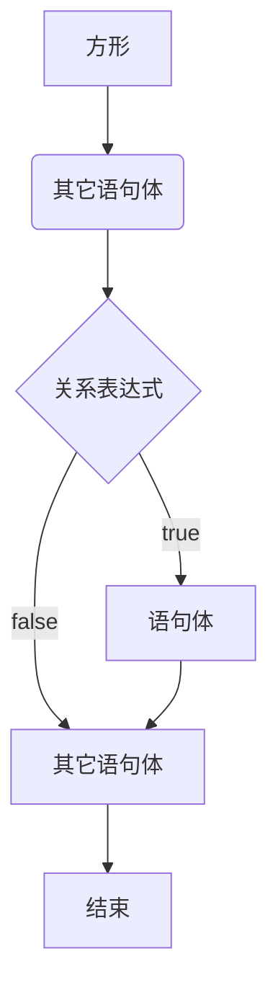
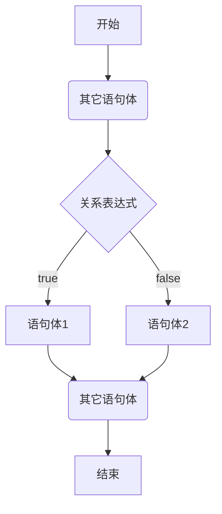

# Java 判断和循环

Java 中，有三种流程控制语，分别是：

- 顺序语句；
- 判断和选择结构（if 语句, switch 语句）；
- 循环结构（for 语句, while 语句, do…while 语句）。

## 一、顺序语句

顺序结构是程序中最简单最基本的流程控制，没有特定的语法结构，按照代码的先后顺序，依次执行，程序中大多数的代码都是这样执行的。

顺序结构执行流程图：



demo-project/base-code/day03/src/com/kkcf/process_control/SequentialStatements.java

```javascript
package com.kkcf.process_control;

public class SequentialStatements {
    public static void main(String[] args) {
        System.out.println("全名制作人们大家好!");
        System.out.println("我是练习时两年半的个人练习生蔡徐坤");
        System.out.println("我喜欢唱、跳、rap、篮球");
        System.out.println("music！");
    }
}
```

## 二、分支结构

Java 的分支结构，有两种语句，分别是 if 语句和 switch 语句。

### 1.if 语句

if 语句用于做做判断，

#### 1.if 语句格式1

if 语句的第一种写法如下：

```java
if (关系表达式) {
  语句体;
}
```

这种写法的执行流程如下：



案例一：键盘录入一个数，表示女婿的酒量，如果女婿的酒量大于 2 斤，老丈人就搭理他，否则就不搭理他。

demo-project/base-code/Day04/src/com/kkcf/process_control/IfDemo1.java

```java
package com.kkcf.process_control;

import java.util.Scanner;

public class IfDemo1 {
    public static void main(String[] args) {
        Scanner sc = new Scanner(System.in);

        System.out.println("请输入女婿的酒量：");
        int wine = sc.nextInt();

        sc.close();

        if (wine > 2) {
            System.out.println("小伙子，不错哦！");
        }
    }
}
```

这种格式的 if 语句，有两点需要注意：

1. 如果我对一个布尔类型的变量进行判断，不要用比较运算符 `==`，直接把变量写在小括号中即可。

2. 如果大括号中的语句体只有一条，那么大括号可以省略不写，if 语句的大括号省略后，if 语句只能控制距离它最近的那一条语句。


demo-project/base-code/Day04/src/com/kkcf/process_control/IfTest01.java

```java
package com.kkcf.process_control;

public class IfTest01 {
    public static void main(String[] args) {
        int a = 10;

        boolean result = a >= 10;
        
        if (result)
            System.out.println("a大于等于10");
    }
}
```

#### 2.if 语句格式2

if 语句第二种写法如下：

```java
if (关系表达式) {
  语句体1;
} else {
  语句体2;
}
```

这种写法的执行流程如下：



案例一：键盘录入一个数，表示我身上携带的钱，如果大于 100，就去网红餐厅；否则就去经济实惠的的沙县小吃。

demo-project/base-code/Day04/src/com/kkcf/process_control/IfDemo03.java

```java
package com.kkcf.process_control;

import java.util.Scanner;

public class IfDemo03 {
    public static void main(String[] args) {
        Scanner sc = new Scanner(System.in);

        System.out.println("请输入你带的钱：");
        int money = sc.nextInt();

        sc.close();

        if (money > 100) {
            System.out.println("去网红餐厅");
        } else {
            System.out.println("去经济实惠的沙县小吃");
        }
    }
}
```

案例二：电影院卖了 100 张票，票的序号位 1-100，其中奇数票号坐左边，偶数票号坐右边。键盘录入一个整数，表示电影票号，根据不同的情况，给出不同的提示。

demo-project/base-code/Day04/src/com/kkcf/process_control/IfTest02.java

```java
package com.kkcf.process_control;

import java.util.Scanner;

public class IfTest02 {
    public static void main(String[] args) {
        Scanner sc = new Scanner(System.in);

        System.out.println("请输入电影票号：");
        int ticket = sc.nextInt();

        sc.close();

        if (ticket >= 0 && ticket <= 100) {
            if (ticket % 2 == 0)
                System.out.println("坐右边");
            else
                System.out.println("坐左边");
        }

    }
}
```

#### 3.if 语句格式3