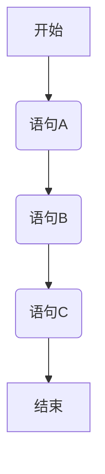
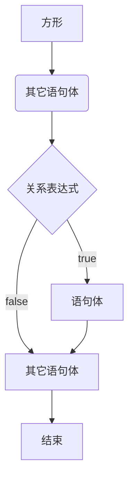
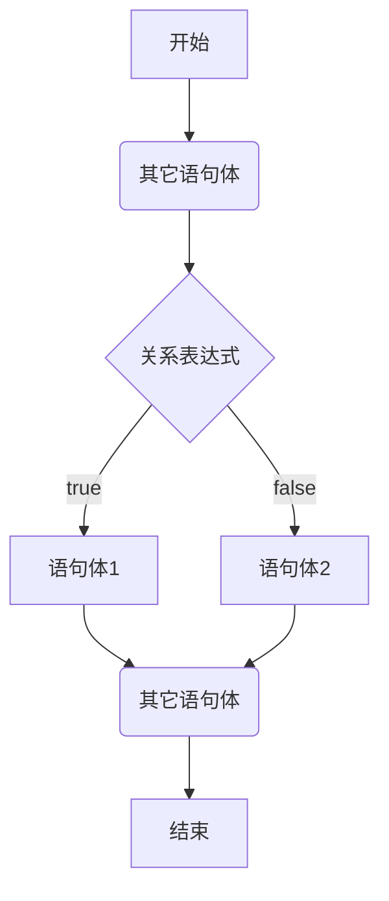
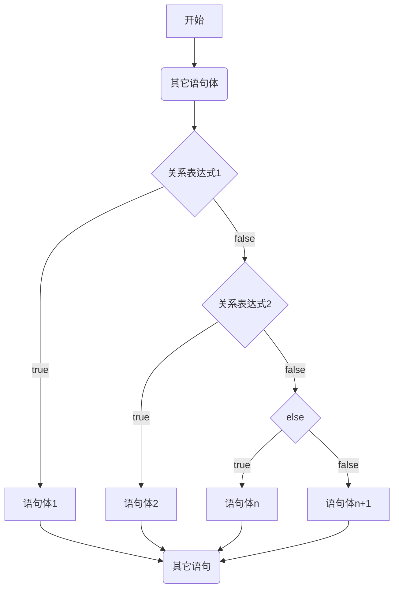
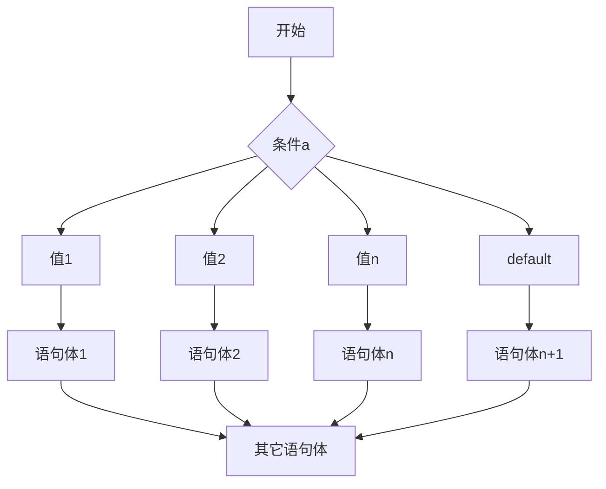

# Java 判断和循环

Java 中，有三种流程控制结构，分别是：

- 顺序结构；
- 选择结构，即判断语句：if 语句、switch 语句；
- 循环结构，即循环结构：for 语句, while 语句, do…while 语句。

## 一、顺序语句

顺序结构，是程序中最简单、最基本的流程控制；

顺序结构，没有特定的语法结构，按照代码的先后顺序，依次执行，程序中大多数的代码，都是这样执行的。

顺序结构执行流程图：



demo-project/base-code/day03/src/com/kkcf/process_control/SequentialStatements.java

```javascript
package com.kkcf.process_control;

public class SequentialStatements {
    public static void main(String[] args) {
        System.out.println("全名制作人们大家好!");
        System.out.println("我是练习时两年半的个人练习生蔡徐坤");
        System.out.println("我喜欢唱、跳、rap、篮球");
        System.out.println("music！");
    }
}
```

## 二、分支结构

Java 的分支结构，有两种语句，分别是 if 语句，和 switch 语句。

### 1.if 语句

if 语句用于做判断，

#### 1.if 语句格式 1

if 语句的第一种写法如下：

```java
if (关系表达式) {
  语句体;
}
```

这种写法的执行流程如下：



案例一：键盘录入一个数，表示女婿回村开的汽车排面，如果女婿的排面大于 8，去老丈人家可以先动筷，否则就不能先动筷。

demo-project/base-code/Day04/src/com/kkcf/process_control/IfDemo1.java

```java
package com.kkcf.process_control;

import java.util.Scanner;

public class IfDemo1 {
    public static void main(String[] args) {
        Scanner sc = new Scanner(System.in);

        System.out.println("请输入女婿车的排面：");
        int wine = sc.nextInt();

        sc.close();

        if (wine > 8) {
            System.out.println("先动筷！");
        }
    }
}
```

这种格式的 if 语句，有两点需要注意：

1. 如果对一个布尔类型的变量进行判断，不要再用比较运算符 `==`，直接把布尔类型的变量写在小括号中即可。
2. 如果大括号中的语句体只有一条，那么大括号可以省略不写。
   - if 语句的大括号省略后，if 语句只能控制距离它最近的那一条语句。

demo-project/base-code/Day04/src/com/kkcf/process_control/IfTest01.java

```java
package com.kkcf.process_control;

public class IfTest01 {
    public static void main(String[] args) {
        int a = 10;

        boolean result = a >= 10;

        if (result)
            System.out.println("a大于等于10");
    }
}
```

#### 2.if 语句格式 2

if 语句第二种写法如下：

```java
if (关系表达式) {
  语句体1;
} else {
  语句体2;
}
```

这种写法的执行流程如下：



案例一：键盘录入一个数，表示我身上携带的钱，如果大于 100，就去网红餐厅；否则就去经济实惠的的沙县小吃。

demo-project/base-code/Day04/src/com/kkcf/process_control/IfDemo03.java

```java
package com.kkcf.process_control;

import java.util.Scanner;

public class IfDemo03 {
    public static void main(String[] args) {
        Scanner sc = new Scanner(System.in);

        System.out.println("请输入你带的钱：");
        int money = sc.nextInt();

        sc.close();

        if (money > 100) {
            System.out.println("去网红餐厅");
        } else {
            System.out.println("去经济实惠的沙县小吃");
        }
    }
}
```

案例二：电影院卖了 100 张票，票的序号为 1-100，其中奇数票号坐左边，偶数票号坐右边。键盘录入一个整数，表示电影票号，根据不同的情况，给出不同的提示。

demo-project/base-code/Day04/src/com/kkcf/process_control/IfTest02.java

```java
package com.kkcf.process_control;

import java.util.Scanner;

public class IfTest02 {
    public static void main(String[] args) {
        Scanner sc = new Scanner(System.in);

        System.out.println("请输入电影票号：");
        int ticket = sc.nextInt();

        sc.close();

        if (ticket >= 0 && ticket <= 100) {
            if (ticket % 2 == 0)
                System.out.println("坐右边");
            else
                System.out.println("坐左边");
        }

    }
}
```

#### 3.if 语句格式 3

if 语句第三种写法如下：

```java
if (关系表达式1) {
  语句体1
} else if (关系表达式2) {
  语句体2
}
...
else {
  语句体 n + 1
}
```

从上往下依次判断，只要有一个判断为真，就执行对应的语句体，如果所有的判断都为假，就执行 else 的语句体。

这种写法的执行流程如下：



案例理解：小明快要期末考试了，小明爸爸会根据他不同的考试成绩，送他不同的礼物，

demo-project/base-code/Day04/src/com/kkcf/process_control/IIfDemo04.java

```java
package com.kkcf.process_control;

import java.util.Scanner;

public class IIfDemo04 {
    public static void main(String[] args) {
        Scanner sc = new Scanner(System.in);

        System.out.println("请输入小明的成绩");
        int score = sc.nextInt();

        sc.close();

        if (score >= 0 && score <= 100) {
            if (score >= 95 && score <= 100) {
                System.out.println("送自行车一辆");
            } else if (score >= 90 && score <= 94) {
                System.out.println("游乐场玩一天");
            } else if (score >= 80 && score <= 89) {
                System.out.println("变形金刚一个");
            } else {
                System.out.println("胖揍一顿");
            }
        } else {
            System.out.println("分数不合法");
        }
    }
}
```

由上面的案例可知：

- if 语句格式 1，用于一个条件的判断；
- if 语句格式 2，用于两个条件的判断；
- if 语句格式 3，用于多个条件的判断。

### 2.switch 语句

switch 语句，用于根据不同的值，执行不同的语句体。

它的写法如下：

```java
switch (表达式) {
  case 1:
    语句体1;
    break;
  case 2:
    语句体2;
    break;
  ...
  default:
    语句体n+1;
    break;
}
```

switch 语句的格式说明：

- `表达式`，表示将要匹配的值，只能匹配 `byte`，`short`，`int`，`char` 类型的值，
  - JDK5 以后，可以是枚举类型的值；
  - JDK7 以后可以是 `String` 类型的值。
- `case` 后面跟的值，**只能是字面量，不能是变量**，不能重复；用于和表达式的结果进行 `==` 比较。
- `break` 表示中断、结束的意思，用来结束 switch 语句。
- `default` 表示所有情况都不匹配的时候，就执行该处的内容，和 if 语句的 else 相似。

这种写法的执行流程如下：



switch 语句的执行流程：

1. 首先，计算出表达式的值 ，得到一个明确的结果；
2. 然后，将这个结果，与 `case` 依次比较，一旦有对应的值，就会执行相应的语句，在执行的过程中，遇到 `break` 就会结束。
3. 最后，如果所有的 `case` 都和结果不匹配，就会执行 `default` 语句体部分，然后程序结束掉。

案例理解：键盘录入星期数，显示今天的减肥活动。

demo-project/base-code/Day04/src/com/kkcf/process_control/IIfDemo04.java

```java
package com.kkcf.process_control;

import java.util.Scanner;

public class IfDemo05 {
    public static void main(String[] args) {
        Scanner sc = new Scanner(System.in);

        System.out.println("请输入今天是星期几：");
        int day = sc.nextInt();

        sc.close();

        switch (day) {
            case 1:
                System.out.println("跑步");
                break;
            case 2:
                System.out.println("游泳");
                break;
            case 3:
                System.out.println("慢走");
                break;
            case 4:
                System.out.println("动感单车");
                break;
            case 5:
                System.out.println("拳击");
                break;
            case 6:
                System.out.println("爬山");
                break;
            case 7:
                System.out.println("好好吃一顿");
                break;
            default:
                System.out.println("没有这个星期");
        }
    }
}
```

#### 1.default 的位置和省略

switch 语句中的 `default` 语句，可以省略，但是不建议。因为一旦省略后，就没有备用选项了。

switch 语句中的 `default` 语句，不一定写在最下方，只是习惯性的写在最下方。

如果 `defaul`  语句写在其它地方，记得加上 `break` 语句。

demo-project/base-code/Day04/src/com/kkcf/process_control/IIfDemo04.java

```java
package com.kkcf.process_control;

import java.util.Scanner;

public class IfDemo05 {
    public static void main(String[] args) {
        Scanner sc = new Scanner(System.in);

        System.out.println("请输入今天是星期几：");
        int day = sc.nextInt();

        sc.close();

        // 将 default 语句写在 switch 语句的最上方
        switch (day) {
            default:
                System.out.println("没有这个星期");
                break;
            case 1:
                System.out.println("跑步");
                break;
            case 2:
                System.out.println("游泳");
                break;
            case 3:
                System.out.println("慢走");
                break;
            // ...
        }
    }
}
```

#### 2.case 穿透

switch 语句在执行时，

1. 会使用小括号中的表达式，与下面每一个 `case` 进行比较；
2. 如果匹配上了，就会执行对应的语句体；执行完后：
   - 如果发现 `break`，那么就会结束整个 switch 语句。
   - 如果没有发现 `break`，那么就会继续执行下一个 case 语句体，直到遇到 `break` 或者大括号为止。

case 穿透的使用场景：

- 如果多个 case 语句体重复了，那么会考虑使用 case 穿透的特性，简化代码。

案例理解：键盘录入今天是星期几，判断今天是工作日还是休息日。

demo-project/base-code/Day04/src/com/kkcf/process_control/SwitchDemo03.java

```java
package com.kkcf.process_control;

import java.util.Scanner;

public class SwitchDemo03 {
    public static void main(String[] args) {
        Scanner sc = new Scanner(System.in);

        System.out.println("请输入今天是星期几：");
        int day = sc.nextInt();

        sc.close();

        switch (day) {
            case 1:
            case 2:
            case 3:
            case 4:
            case 5:
                System.out.println("工作日");
                break;
            case 6:
            case 7:
                System.out.println("休息日");
                break;
            default:
                System.out.println("输入有误");
        }
    }
}
```

简化的写法如下（JavaScript 中不能这么写）：

demo-project/base-code/Day04/src/com/kkcf/process_control/SwitchDemo03.java

```java
package com.kkcf.process_control;

import java.util.Scanner;

public class SwitchDemo03 {
    public static void main(String[] args) {
        Scanner sc = new Scanner(System.in);

        System.out.println("请输入今天是星期几：");
        int day = sc.nextInt();

        sc.close();

        switch (day) {
            case 1, 2, 3, 4, 5:
                System.out.println("工作日");
                break;
            case 6, 7:
                System.out.println("休息日");
                break;
            default:
                System.out.println("输入有误");
        }
    }
}
```

#### 3.JDK 12 switch 新特性

switch 语句在 JDK 12 及以上有一个新的写法。

这种写法如下，主要是利用大括号，简化掉了 `break` 语句，它不会造成 `case` 穿透。

demo-project/base-code/Day04/src/com/kkcf/process_control/SwitchDemo02.java

```java
package com.kkcf.process_control;

import java.util.Scanner;

public class SwitchDemo02 {
    public static void main(String[] args) {
        Scanner sc = new Scanner(System.in);

        System.out.println("请输入今天是星期几：");
        int day = sc.nextInt();

        sc.close();

        switch (day) {
            case 1 -> {
                System.out.println("跑步");
            }
            case 2 -> {
                System.out.println("游泳");
            }
            case 3 -> {
                System.out.println("慢走");
            }
            case 4 -> {
                System.out.println("动感单车");
            }
            case 5 -> {
                System.out.println("拳击");
            }
            case 6 -> {
                System.out.println("爬山");
            }
            case 7 -> {
                System.out.println("好好吃一顿");
            }
            default -> {
                System.out.println("没有这个星期");
            }
        }
    }
}
```

如果 `case` 语句的大括号中，只有一行代码，那么大括号可以省略。

上方的代码，可以简化为：

demo-project/base-code/Day04/src/com/kkcf/process_control/SwitchDemo02.java

```java
package com.kkcf.process_control;

import java.util.Scanner;

public class SwitchDemo02 {
    public static void main(String[] args) {
        Scanner sc = new Scanner(System.in);

        System.out.println("请输入今天是星期几：");
        int day = sc.nextInt();

        sc.close();

        switch (day) {
            case 1 -> System.out.println("跑步");
            case 2 -> System.out.println("游泳");
            case 3 -> System.out.println("慢走");
            case 4 -> System.out.println("动感单车");
            case 5 -> System.out.println("拳击");
            case 6 -> System.out.println("爬山");
            case 7 -> System.out.println("好好吃一顿");
            default -> System.out.println("没有这个星期");
        }
    }
}
```

案例理解：键盘录入今天是星期几，判断今天是工作日还是休息日。

demo-project/base-code/Day04/src/com/kkcf/process_control/SwitchDemo03.java

```java
package com.kkcf.process_control;

import java.util.Scanner;

public class SwitchDemo03 {
    public static void main(String[] args) {
        Scanner sc = new Scanner(System.in);

        System.out.println("请输入今天是星期几：");
        int day = sc.nextInt();

        sc.close();

        switch (day) {
            case 1, 2, 3, 4, 5 -> System.out.println("工作日");
            case 6, 7 -> System.out.println("休息日");
            default -> System.out.println("输入有误");
        }
    }
}
```

JDK 12 中，如果 switch 语句会返回一个结果，那么还可以用一个变量，来接收这个结果。

后续介绍这种写法（见[10-Java-API、字符串.md](./10-Java-API、字符串.md/###1.罗马数字)）。

#### 4.switch 和 if 语句如何选择

- if 语句格式 3，一般用于对范围的判断。
- switch 语句是把有限个数据一一列举出来进行 `==` 判断，然后任选其一。

## 三、循环结构

循环语句可以在满足循环条件的情况下，反复执行某一段代码，这段被重复执行的代码被称为循环体语句，

当反复执行这个循环体时，需要在合适的时候把循环判断条件修改为 `false`，从而结束循环，否则循环将一直执行下去，形成死循环。

Java 中，循环结构分为三类：

- for 循环；
- while 循环；
- do...while 循环。

### 1.for 循环

for 循环的写法如下：

```java
for(初始化语句; 条件判断语句; 条件控制语句) {
  循环体语句;
}
```

- 初始化语句： 用于表示循环开启时的起始状态，简单说就是循环开始的时候什么样。
- 条件判断语句：用于表示循环反复执行的条件，简单说就是判断循环是否能一直执行下去。
- 循环体语句： 用于表示循环反复执行的内容，简单说就是循环反复执行的事情。
- 条件控制语句：用于表示循环执行中每次变化的内容，简单说就是控制循环是否能执行下去。

for 循环的执行流程如下：

```flow
op=>operation: 初始化语句
cond=>condition: 条件判断语句
xht=>operation: 循环体语句
tjkz=>operation: 条件控制语句
qtyj=>operation: 其它语句
sub1=>subroutine: 子流程
io=>inputoutput: 输入输出框
op->cond
cond(true)->xht->tjkz
tjkz->cond
cond(false)->qtyj(left)
```

for 循环的执行流程：

1. 执行初始化语句（初始化语句只会执行一次）；
2. 执行条件判断语句，判断结果：
   - 如果是 `false`，循环结束；
   - 如果是 `true`，继续执行。
3. 执行循环体语句；
4. 执行条件控制语句；
5. 回到 2 继续执行条件判断语句；

案例理解：打印 1，2，3，4，5；打印 5，4，3，2，1。

demo-project/base-code/Day04/src/com/kkcf/process_control/ForDemo01.java

```java
package com.kkcf.process_control;

public class ForDemo01 {
    public static void main(String[] args) {
        for (int i = 1; i <= 5; i++) {
            System.out.println(i);
        }

        for (int i = 5; i >= 1; i--) {
            System.out.println(i);
        }
    }
}
```

案例理解：计算 1-5 的和。

demo-project/base-code/Day04/src/com/kkcf/process_control/ForDemo02.java

```java
package com.kkcf.process_control;

public class ForDemo02 {
    public static void main(String[] args) {
        int sum = 0;

        for (int i = 1; i <= 5; i++) {
            sum += i;
        }

        System.out.println(sum); // 15
    }
}
```

- 求和的变量 `sum`，不能定义在循环体的里面，因为变量的作用域是所属的大括号里面。
- 如果把求和的变量 `sum`，定义在循环体里面，那么这个变量只能在本次循环中有效，当本次循环结束后，变量就会从内存中消失；第二次循环开始的时候，又会重新定义一个新的变量。

案例理解：计算 1-100 之间偶数的和。

demo-project/base-code/Day04/src/com/kkcf/process_control/ForDemo03.java

```java
package com.kkcf.process_control;

public class ForDemo03 {
    public static void main(String[] args) {
        int sum = 0;

        for (int i = 1; i <= 100; i++) {
            if (i % 2 == 0) {
                sum += i;
            }
        }

        System.out.println(sum);
    }
}
```

案例理解；键盘录入两个数字，表示一个范围，统计这个范围中，能被 3 整除，和能被 5 整除的数字有几个？

demo-project/base-code/Day04/src/com/kkcf/process_control/ForDemo04.java

```java
package com.kkcf.process_control;

import java.util.Scanner;

public class ForDemo04 {
    public static void main(String[] args) {
        Scanner sc = new Scanner(System.in);

        System.out.println("请录入第一个数字，表示范围开始：");
        int start = sc.nextInt();

        System.out.println("请录入第二个数字，表示范围结束：");
        int end = sc.nextInt();

        sc.close();

        int count = 0;

        for (int i = start; i <= end; i++) {
            if (i % 3 == 0 && i % 5 == 0) {
                count++;
            }
        }

        System.out.println(count);
    }
}
```

### 2.while 循环

while 循环的写法如下：

```java
初始化语句;
while(条件判断语句){
  循环体语句;
  条件控制语句;
}
```

- 初始化语句： 用于表示循环开启时的起始状态，简单说就是循环开始的时候什么样。
- 条件判断语句：用于表示循环反复执行的条件，简单说就是判断循环是否能一直执行下去。
- 循环体语句： 用于表示循环反复执行的内容，简单说就是循环反复执行的事情。
- 条件控制语句：用于表示循环执行中每次变化的内容，简单说就是控制循环是否能执行下去。

while 循环的执行流程，与 for 循环相同，如下图所示：

```flow
op=>operation: 初始化语句
cond=>condition: 条件判断语句
xht=>operation: 循环体语句
tjkz=>operation: 条件控制语句
qtyj=>operation: 其它语句
sub1=>subroutine: 子流程
io=>inputoutput: 输入输出框
op->cond
cond(true)->xht->tjkz
tjkz->cond
cond(false)->qtyj(left)
```

while 循环的执行流程，与 for 循环也是一致的：

1. 执行初始化语句（初始化语句只会执行一次）；
2. 执行条件判断语句，判断结果；
   - 如果是 `false`，循环结束；
   - 如果是 `true`，继续执行。
3. 执行循环体语句；
4. 执行条件控制语句
5. 回到 2 继续执行条件判断语句；

for 循环和 while 循环的区别：

- for 循环中，控制循环的变量，因为归属 for 循环的语法结构中，在 for 循环结束后，就不能再次被访问到了。
- while 循环中，控制循环的变量，不归属于 while 循环的语法结构中，在 while 循环结束后，该变量还可以继续使用。
- 然而，当 for 循环中，控制循环体的变量，写在 for 循环体外面，那么效果就与 while 循环相同了，如下方所示。

```java
int i = 0;

for (; i < 100; i++) {
    System.out.println(i);
}
```

for 循环和 while 循环在开发中如何选择？

- 如果知道循环次数或者循环的范围，我们习惯使用 for 循环。
- 如果不知道循环次数或者循环的范围，只知道循环的结束条件，我们习惯使用 while 循环。

案例理解：世界上最高的山峰是珠穆朗玛峰，高度为 8844.43 米，约等于 8844430 毫米，假如有一张足够大的纸，它的厚度为 0.1 毫米，请问折叠多少次，可以达到珠穆朗玛峰的高度。

demo-project/base-code/Day04/src/com/kkcf/process_control/WhileDemo01.java

```java
package com.kkcf.process_control;

public class WhileDemo01 {
    public static void main(String[] args) {
        double paperThickness = 0.1; // 纸张厚度
        double mountThickness = 8844430; // 珠穆朗玛峰高度

        int count = 0;

        while (paperThickness < mountThickness) {
            paperThickness *= 2;
            count++;
        }

        System.out.println(count); // 27
    }
}
```

案例理解：如果 x 是一个回文数，打印 `true`，否则打印 `false`。

- 回文数是指：正序（从左到右）和倒序（从右到左）读都是一样的整数；例如 `121` 是回文数，`123` 不是回文数。

demo-project/base-code/Day04/src/com/kkcf/process_control/WhileDemo02.java

```java
package com.kkcf.process_control;

import java.util.Scanner;

public class WhileDemo02 {
    public static void main(String[] args) {
        Scanner sc = new Scanner(System.in);

        System.out.println("请输入一个数字：");
        int num = sc.nextInt();
        sc.close();

        int numOrigin = num;

        int numReverse = 0; // 记录倒过来的结果

        while (num != 0) {
            int ge = num % 10;

            num = num / 10;

            numReverse = numReverse * 10 + ge;
        }

        System.out.println("numReverse = " + numReverse);
        System.out.println("numOrigin = " + numOrigin);
        System.out.println(numOrigin == numReverse ? "是回文数" : "不是回文数");
    }
}
```

案例理解：给定两个整数，被除数和除数（都是正数，且不超过 int 类型范围），将两数相除，要求不使用 `*`、`/`、`%` 运算符。得到商和余数。

demo-project/base-code/Day04/src/com/kkcf/process_control/WhileDemo02.java

```java
package com.kkcf.process_control;

import java.util.Scanner;

public class WhileDemo03 {
    public static void main(String[] args) {
        Scanner sc = new Scanner(System.in);

        System.out.println("请输入被除数：");
        int dividend = sc.nextInt();

        System.out.println("请输入除数：");
        int divisor = sc.nextInt();

        sc.close();

        int count = 0;

        while (dividend >= divisor) {
            dividend = dividend - divisor;
            count++;
        }

        System.out.println("商：" + count + " 余数：" + dividend);
    }
}
```

### 3.do...while 循环

do...while 循环的写法如下：

```java
初始化语句;
do {
    循环体;
    条件控制语句;
} while (条件判断语句);
```

do...while 循环的执行流程如下：

```flow
op=>operation: 初始化语句
cond=>condition: 条件判断语句
xht=>operation: 循环体语句
tjkz=>operation: 条件控制语句
qtyj=>operation: 其它语句
sub1=>subroutine: 子流程
io=>inputoutput: 输入输出框
op->xht
cond(true)->xht->tjkz
tjkz->cond
cond(false)->qtyj(left)
```

它的特点是先执行，后判断。
