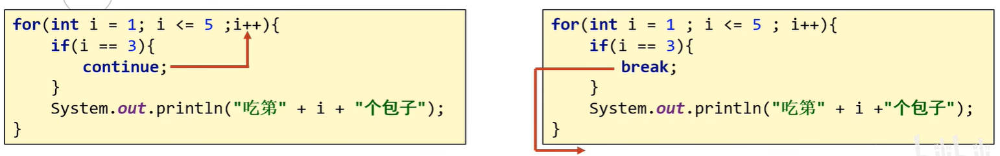

# Java 循环高级、数组

## 一、无限循环

无限循环，又称为死循环，表示循环一直停不下来。

### 1.for 循环无限循环

使用 for 循环，编写一个无限循环。

demo-project/base-code/Day05/src/com/kkcf/loop_array/InfiniteLoop.java

```java
package com.kkcf.process_control;

public class InfiniteLoop {
    public static void main(String[] args) {
        for (; ; ) {
            System.out.println("只因你太美！");
        }
    }
}

```

- 初始化语句可以空着不写，表示循环之前不定义任何的控制变量。
- 条件判断语句可以空着不写，如果不写，默认表示 `true`，循环一直进行。
- 条件控制语句可以空着不写，表示每次循环体执行完毕后，控制变量不做任何变化。

### 2.while 循环无限循环

使用 while 循环，编写一个无限循环。

demo-project/base-code/Day05/src/com/kkcf/loop_array/InfiniteLoop.java

```java
package com.kkcf.process_control;

public class InfiniteLoop {
    public static void main(String[] args) {
        while (true) {
            System.out.println("只因你太美！");
        }
    }
}
```

### 3.do...while 循环无限循环

使用 do...while 循环，编写一个无限循环。

demo-project/base-code/Day05/src/com/kkcf/loop_array/InfiniteLoop.java

```java
package com.kkcf.process_control;

public class InfiniteLoop {
    public static void main(String[] args) {
        do {
            System.out.println("只因你太美！");
        } while (true);
    }
}
```

无限循环的注意事项：

- 无限循环，最为常用的格式是 while 循环。
- 无限循环下面不能再写其他代码了，因为永远执行不到。

## 二、循环的跳转控制语句

条件控制语句，分为两种：

- break 语句；
- continue 语句；

### 1.break 语句

break 语句，不能单独存在，可以用在 switch 和循环中，表示结束，跳出的意思。

demo-project/base-code/Day05/src/com/kkcf/loop_array/JumpControl.java

```java
package com.kkcf.process_control;

public class JumpControl {
    public static void main(String[] args) {
        for (int i = 1; i <= 5; i++) {
            if (i == 3) {
                break;
            }

            System.out.println("吃第" + i + "个包子");
        }
    }
}
```

### 2.continue 语句

continue 语句，不能单独存在。只能存在于循环当中。表示：跳过本次循环，继续执行下次循环。

demo-project/base-code/Day05/src/com/kkcf/loop_array/JumpControl.java

```java
package com.kkcf.loop_array;

public class JumpControl {
    public static void main(String[] args) {
        for (int i = 1; i <= 5; i++) {
            if (i == 3) {
                continue;
            }

            System.out.println("吃第" + i + "个包子");
        }
    }
}
```

continue 语句、break 语句执行的流程，分别如下图所示：



案例理解：求平方根，键盘录入一个大于等于 2 的整数 x，计算并返回 x 的平方根，结果只保留整数部分。思路如下：

- 从 1 开始循环，计算数字的平方，与 x 进行比较。
- 如果小于 x，继续执行循环体；
- 如果等于 x，那么当前数字就是平方根。
- 如果大于 x，那么当前数字的前一个数字，就是平方根的整数部分。

demo-project/base-code/Day05/src/com/kkcf/loop_array/Test01.java

```java
package com.kkcf.loop_array;

import java.util.Scanner;

public class Test01 {
    public static void main(String[] args) {
        Scanner sc = new Scanner(System.in);

        System.out.println("请输入一个整数：");
        int x = sc.nextInt();

        sc.close();

        for (int i = 1; i < x; i++) {
            if (i * i > x) {
                System.out.println(x + " 的平方根是 " + (i - 1));
                break;
            } else if (i * i == x) {
                System.out.println(x + " 的平方根是 " + i);
                break;
            }
        }
    }
}
```

案例理解：求质数，输入一个数 x，判断它是否是一个质数。

- 质数，表示只能被 1 和它自己整除的数，否则这个数就是一个合数。

demo-project/base-code/Day05/src/com/kkcf/loop_array/Test02.java

```java
package com.kkcf.loop_array;

import java.util.Scanner;

public class Test02 {
    public static void main(String[] args) {
        Scanner sc = new Scanner(System.in);

        System.out.println("请输入一个整数：");
        int x = sc.nextInt();

        sc.close();

        boolean isPrime = true; // 是否是一个质数

        for (int i = 2; i < x; i++) {
            if (x % i == 0) {
                isPrime = false;
                break;
            }
        }

        if (isPrime)
            System.out.println(x + " 是质数");
        else
            System.out.println(x + " 不是质数");
    }
}
```

使用数字的平方根，对上方的代码进行优化。

demo-project/base-code/Day05/src/com/kkcf/loop_array/Test02.java

```java
package com.kkcf.loop_array;

import java.util.Scanner;

public class Test02 {
    public static void main(String[] args) {
        Scanner sc = new Scanner(System.in);

        System.out.println("请输入一个整数：");
        int x = sc.nextInt();

        sc.close();

        boolean isPrime = true; // 是否是一个质数

        for (int i = 2; i < Math.sqrt(x); i++) {
            if (x % i == 0) {
                isPrime = false;
                break;
            }
        }

        if (isPrime)
            System.out.println(x + " 是质数");
        else
            System.out.println(x + " 不是质数");
    }
}
```

