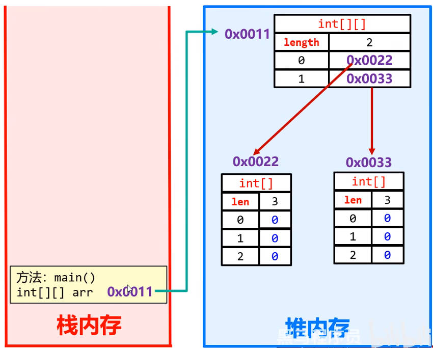
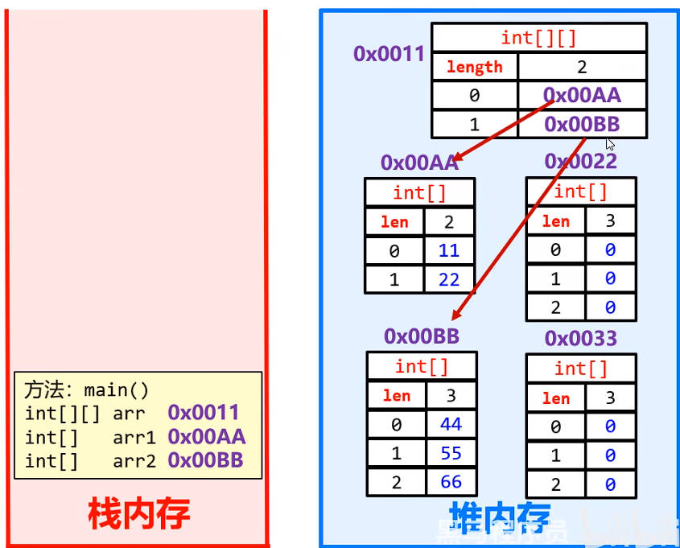

# 综合练习、二维数组

## 一、综合练习

### 1.飞机票

机票价格按照淡季旺季、头等舱和经济舱收费、输入

- 机票原价；
- 月份；
- 头等舱，或经济舱。

按照如下规则计算机票价格：

- 旺季（5-10 月）头等舱 9 折，经济舱 8.5 折；
- 淡季（11 月到来年 4 月）头等舱 7 折，经济舱 6.5 折。

demo-project/base-code/Day07/src/com/kkcf/trainning/Test01.java

```java
package com.kkcf.trainning;

import java.util.Scanner;

public class Test01 {
    public static void main(String[] args) {
        Scanner sc = new Scanner(System.in);

        System.out.println("请输入机票原价：");
        double originPrice = sc.nextDouble();

        System.out.println("请输入月份：");
        int mon = sc.nextInt();

        System.out.println("请输入舱位类型：");
        int seat = sc.nextInt(); // 0 头等舱，1 经济舱

        double price = caculateFlightTicket(originPrice, mon, seat);

        System.out.println(price);
    }

    public static double caculateFlightTicket(double originalPrice, int mon, int seat) {
        double price = 0;

        if (mon < 1 || mon > 12) {
            System.out.println("输入月份有误！");

            return price;
        } else if (mon >= 5 && mon <= 10) {
            double[] counts = {0.9, 0.85};

            price = caculateFlightTicketWithSeat(seat, originalPrice, counts);
        } else {
            double[] counts = {0.7, 0.65};

            price = caculateFlightTicketWithSeat(seat, originalPrice, counts);
        }

        return price;
    }

    public static double caculateFlightTicketWithSeat(int seat, double originalPrice, double[] counts) {
        double price = 0;

        switch (seat) {
            case 0 -> price = originalPrice * counts[0];
            case 1 -> price = originalPrice * counts[1];
            default -> System.out.println("输入错误");
        }

        return price;
    }
}
```

### 2.找质数

需求：判断 101-200 之间有多少个质数（素数），并输出所有质数（素数）。

demo-project/base-code/Day07/src/com/kkcf/trainning/Test02.java

```java
package com.kkcf.trainning;

public class Test02 {
    public static void main(String[] args) {
        int count = 0;

        for (int i = 101; i <= 200; i++) {
            boolean isPrime = true;

            for (int j = 2; j < i; j++) {
                if (i % j == 0) {
                    isPrime = false;
                    break;
                }
            }

            if (isPrime) {
                System.out.println(i + " 是素数");
                count++;
            }
        }

        System.out.println("共有 " + count + " 个质数");
    }
}
```

### 3.验证码

需求：定义方法实现随机产生一个 5 位的验证码；

验证码格式：长度为 5；前四位是大写字母或者小写字母；最后一位是数字；

- 思路：将字母、数字分别放入数组中，再随机取数组的索引。

demo-project/base-code/Day07/src/com/kkcf/trainning/Test03.java

```java
package com.kkcf.trainning;

import java.util.Random;

public class Test03 {
    public static void main(String[] args) {
        char[] chars = new char[52]; // a-z A-Z 共 52 个字母

        // 填充数组
        for (int i = 0; i < chars.length; i++) {
            if (i < 26)
                chars[i] = (char) ('a' + i);
            else
                chars[i] = (char) ('A' + i - 26);
        }

        // 打印数组
        for (int i = 0; i < chars.length; i++)
            System.out.print(chars[i] + " ");
        System.out.println();

        // 获取验证码
        Random r = new Random();

        String code = "";

        for (int i = 0; i < 4; i++) {
            int index = r.nextInt(chars.length);
            code += chars[index];
        }

        int randomNum = r.nextInt(10);
        code += randomNum;

        System.out.println(code);
    }
}
```

### 4.数组元素的赋值

需求：把一个数组中的元素复制到另一个新数组中去。

demo-project/base-code/Day07/src/com/kkcf/trainning/Test04.java

```java
package com.kkcf.trainning;

public class Test04 {
    public static void main(String[] args) {
        // 定义一个数组
        int[] arr = {1, 2, 3, 4, 5, 6, 7, 8, 9, 10};

        // 定义一个新数组
        int[] newArr = new int[arr.length];

        for (int i = 0; i < arr.length; i++)
            newArr[i] = arr[i];

        // 打印新数组
        for (int i = 0; i < newArr.length; i++)
            System.out.print(newArr[i] + " ");
    }
}
```

### 5.评委打分

需求 :  在唱歌比赛中，有 6 名评委给选手打分，分数范围是 [0 - 100] 之间的整数。选手的最后得分为：去掉最高分、最低分后的 4 个评委的平均分，请完成上述过程并计算出选手的得分。

demo-project/base-code/Day07/src/com/kkcf/trainning/Test05.java

```java
package com.kkcf.trainning;

import java.util.Scanner;

public class Test05 {
    public static void main(String[] args) {
        // 1.键盘录入，获取 6 个评委的分数。
        int[] scores = getScores();

        // 打印 scores 数组中的元素
        for (int i = 0; i < scores.length; i++)
            System.out.print(scores[i] + " ");
        System.out.println();

        // 2. 获取最大值
        int max = getMax(scores);

        // 3. 获取最小值
        int min = getMin(scores);

        // 求和，并减去最大值，最小值，算平均分数
        int sum = 0;

        for (int i = 0; i < scores.length; i++)
            sum += scores[i];

        int avg = (sum - max - min) / (scores.length - 2);
        System.out.println("平均分：" + avg);
    }

    public static int[] getScores() {
        Scanner sc = new Scanner(System.in);

        int[] scores = new int[6];

        for (int i = 0; i < scores.length; ) {
            System.out.println("请输入第 " + (i + 1) + " 个评委的打分：");
            int score = sc.nextInt();

            if (score < 1 || score > 100)
                System.out.println("超出打分范围，请重新输入");
            else {
                scores[i] = score;
                i++;
            }
        }

        return scores;
    }

    public static int getMax(int[] arr) {
        int max = arr[0];

        for (int i = 1; i < arr.length; i++)
            if (arr[i] > max)
                max = arr[i];

        return max;
    }

    public static int getMin(int[] arr) {
        int min = arr[0];

        for (int i = 1; i < arr.length; i++)
            if (arr[i] < min)
                min = arr[i];

        return min;
    }
}
```

### 6.数字加密

需求：某系统的数字密码（大于 0），比如 1983，采用加密方式进行传输。

规则如下：先得到每位数，然后每位数都加上 5 , 再对 10 求余，最后将所有数字反转，得到一串新数。

demo-project/base-code/Day07/src/com/kkcf/trainning/Test06.java

```java
package com.kkcf.trainning;

public class Test06 {
    public static void main(String[] args) {
        // 1.把整数（一个大于 0 的数，比如 1983）里的每一位，放到数组当中。
        int num = 1983;
        int temp1 = num;

        // 计算数字的位数
        int count = 0;

        while (temp1 > 0) {
            temp1 /= 10;
            count++;
        }

        // 初始化数组
        int[] nums = new int[count];

        int temp2 = num;
        for (int i = 0; i < nums.length; i++) {
            nums[nums.length - 1 - i] = temp2 % 10;
            temp2 /= 10;
        }

        // 打印 nums 数组
        for (int i = 0; i < nums.length; i++)
            System.out.print(nums[i] + " ");
        System.out.println();

        // 2.加密：每位数 +5
        for (int i = 0; i < nums.length; i++)
            nums[i] += 5;

        // 3.加密：每位数 %10
        for (int i = 0; i < nums.length; i++)
            nums[i] %= 10;

        // 4.将所有数字反转
        for (int i = 0, j = nums.length - 1; i < j; i++, j--) {
            int temp = nums[i];
            nums[i] = nums[j];
            nums[j] = temp;
        }

        // 打印 nums 数组
        for (int i = 0; i < nums.length; i++)
            System.out.print(nums[i] + " ");
        System.out.println();

        // 5.将数组中的数字，组成一个整数
        int result = 0;
        for (int i = 0; i < nums.length; i++)
            result = result * 10 + nums[i];
        System.out.println(result);
    }
}
```

### 7.数字解密

需求：把上一题加密之后的数据进行解密。

demo-project/base-code/Day07/src/com/kkcf/trainning/Test07.java

```java
package com.kkcf.trainning;

public class Test07 {
    public static void main(String[] args) {
        // 1.定义数组，记录解密之后的结果
        int[] nums = {8, 3, 4, 6};

        // 2. 反转
        for (int i = 0, j = nums.length - 1; i < j; i++, j--) {
            int temp = nums[i];
            nums[i] = nums[j];
            nums[j] = temp;
        }


        // 3. 0-9 的数 +5 范围是：5-14，再 %10，那么 0-4 就要 +10，5-9 不变
        for (int i = 0; i < nums.length; i++)
            if (nums[i] >= 0 && nums[i] <= 4)
                nums[i] += 10;

        // 4.每一位 -5
        for (int i = 0; i < nums.length; i++)
            nums[i] -= 5;

        // 5.拼接数组
        int result = 0;
        for (int i = 0; i < nums.length; i++)
            result = result * 10 + nums[i];

        System.out.println(result);
    }
}
```

### 8.抢红包

需求：一个大V直播抽奖，奖品是现金红包，分别有 {2, 588 , 888, 1000, 10000} 五个奖金。请使用代码模拟抽奖，打印出每个奖项，奖项的出现顺序要随机且不重复。

demo-project/base-code/Day07/src/com/kkcf/trainning/Test08.java

```java
package com.kkcf.trainning;

import java.util.Random;

public class Test08 {
    public static void main(String[] args) {
        int[] awards = {2, 588, 888, 1000, 10000};

        int[] randomaward = new int[5];

        Random r = new Random();

        for (int i = 0; i < randomaward.length; ) {
            int index = r.nextInt(awards.length);

            if (!isExist(randomaward, awards[index])) {
                randomaward[i] = awards[index];
                i++;
            }
        }

        // 打印数组
        for (int i = 0; i < randomaward.length; i++)
            System.out.println(randomaward[i] + " ");
    }

    public static boolean isExist(int[] arr, int award) {
        for (int i = 0; i < arr.length; i++)
            if (arr[i] == award) return true;

        return false;
    }
}
```

由上面的代码可知，其实就是将数组中的元素，调换顺序：

优化后：

demo-project/base-code/Day07/src/com/kkcf/trainning/Test08Demo02.java

```java
package com.kkcf.trainning;

import java.util.Random;

public class Test08Demo02 {
    public static void main(String[] args) {
        int[] awards = {2, 588, 888, 1000, 10000};

        Random r = new Random();

        for (int i = 0; i < awards.length; i++) {
            int index = r.nextInt(awards.length);

            int temp = awards[i];
            awards[i] = awards[index];
            awards[index] = temp;
        }

        // 打印数组
        for (int i = 0; i < awards.length; i++)
            System.out.println(awards[i] + " ");
    }
}
```

### 9.双色球

双色球的规则如图所示：


需求：使用程序随机生成一串中奖号码，再让用户输入中奖号码，判断用户中了几等奖。

demo-project/base-code/Day07/src/com/kkcf/trainning/Test09.java

```java
package com.kkcf.trainning;

import java.util.Random;
import java.util.Scanner;

public class Test09 {
    public static void main(String[] args) {
        int[] awards = createAwards();

        // 打印数组
        for (int i = 0; i < awards.length; i++)
            System.out.print(awards[i] + " ");
        System.out.println();

        int[] userNum = getUserNum(awards);

        // 打印数组
        for (int i = 0; i < userNum.length; i++)
            System.out.print(userNum[i] + " ");
        System.out.println();

        int[] counts = getAwardNum(awards, userNum);
        System.out.println("红球中奖个数 = " + counts[0]);
        System.out.println("蓝球中奖个数 = " + counts[1]);

        if (counts[0] == 6 && counts[1] == 1) {
            System.out.println("恭喜你，中奖 1000 万！");
        } else if (counts[0] == 6) {
            System.out.println("恭喜你，中奖 500 万了！");
        } else if (counts[0] == 5 && counts[1] == 1) {
            System.out.println("恭喜你，中奖 3000 元！");
        } else if (counts[0] == 5 || (counts[0] == 4 && counts[1] == 1)) {
            System.out.println("恭喜你，中奖 200 元！");
        } else if (counts[0] == 4 || (counts[0] == 3 && counts[1] == 1)) {
            System.out.println("恭喜你，中奖 10 元！");
        } else if (counts[0] == 3 || (counts[0] == 2 && counts[1] == 1)) {
            System.out.println("恭喜你，中奖 5 元！");
        } else {
            System.out.println("很遗憾，没有中奖！");
        }
    }


    /**
     * 此方法用于，随机生成中奖号码
     *
     * @return
     */
    public static int[] createAwards() {
        // 1.随机生成中奖号码
        Random r = new Random();

        int[] awards = new int[7];

        for (int i = 0; i < awards.length; i++) {
            if (i < awards.length - 1) {
                int num = r.nextInt(32) + 1;

                if (!isExist(awards, num))
                    awards[i] = num;
                else
                    i--;
            } else {
                awards[i] = r.nextInt(15) + 1;
            }
        }

        return awards;
    }

    /**
     * 此方法用于，判断数组中是否存在该元素
     *
     * @param arr   数组
     * @param award 待判断的元素
     * @return
     */
    public static boolean isExist(int[] arr, int award) {
        for (int i = 0; i < arr.length; i++)
            if (arr[i] == award) return true;

        return false;
    }

    /**
     * 此方法用于，获取用户输入的号码
     *
     * @param awards 随机生成的中奖号码
     * @return
     */
    public static int[] getUserNum(int[] awards) {
        // 2.用户输入中奖号码
        Scanner sc = new Scanner(System.in);

        int[] userNum = new int[7];

        for (int i = 0; i < awards.length; ) {
            if (i < awards.length - 1) {
                System.out.println("请输入第 " + (i + 1) + " 个红球号码（范围 1-33）：");
                int num = sc.nextInt();

                if (num < 1 || num > 33) {
                    System.out.println("该号码不符合范围，请重新输入！");
                    continue;
                }

                if (isExist(userNum, num)) {
                    System.out.println("该号码已存在，请重新输入！");
                    continue;
                }

                userNum[i] = num;
                i++;
            } else {
                System.out.println("请输入第 " + 1 + "个蓝球号码（范围 1-16）：");
                int num = sc.nextInt();

                if (num < 1 || num > 16) {
                    System.out.println("该号码不符合范围，请重新输入！");
                    continue;
                }

                userNum[i] = num;
                i++;
            }
        }

        return userNum;
    }

    /**
     * 此方法用于，获取中奖号码和用户输入号码匹配的个数
     *
     * @param awards     随机生成的中奖号码
     * @param userAwards 用户输入的中奖号码
     * @return
     */
    public static int[] getAwardNum(int[] awards, int[] userAwards) {
        int[] counts = {0, 0};

        for (int i = 0; i < userAwards.length; i++) {
            int userAward = userAwards[i];

            for (int j = 0; j < awards.length; j++) {
                if (i < userAwards.length - 1 && userAward == awards[j]) {
                    counts[0]++;
                    break;
                }

                if (i == userAwards.length - 1 && userAward == awards[j])
                    counts[1]++;
            }
        }

        return counts;
    }
}
```

## 二、二维数组

### 1.Java 二维数组的定义

二维数组的定义格式，有两种：

- 第一种：`数据类型[][] 数组名`（一般习惯用这种）。
- 第二种：`数据类型 数组名[][]`。

### 2.Java 二维数组的静态初始化

二维数组的静态初始化，

- 完整格式为：`数据类型[][] 数组名 = new 数据类型[][]{{元素1, 元素2, ...}, {元素1, 元素二}}`；比如：

  ```java
  int[][] arr = new int[][]{{11, 22}, {33, 44}};
  ```

- 简写格式为：`数据类型[][] 数组名 = {{元素1, 元素2, ...}, {元素1, 元素二}}`；比如：

  ```java
  int[][] arr = {{11, 22}, {33, 44}};
  ```

### 3.Java 二维数组的动态初始化

二维数组的动态初始化，格式为：`数据类型[][] 数组名 = new 数据类型[m][n]`

- `m` 表示这个二维数组，可以放多少个一维数组。
- `n` 表示每一个一维数组的长度。

动态初始化一个二维数组，二维数组的长度为 2，一维数组的长度为 3：

```java
int[][] arr = new int[2][3];
```

动态初始化一个二维数组，二维数组的长度为 2，

```java
int[][] arr = new int[2][];
```

- 此时二维数组中的元素，默认为 `null`。

### 4.Java 二维数组的内存图

下方代码，动态初始化了一个二维数组，

```java
int[][] arr = new int[2][3];
```

它在内存中的表现如下图所示：



下方代码，动态初始化了一个二维数组，并将二维数组中引用的一维数组地址值覆盖：

```java
int[][] arr = new int[2][3];

int[] arr1 = {11, 222};
int[] arr2 = {33, 44, 55};

arr[0] = arr1;
arr[1] = arr2;
```

它在内存中的表现如下图所示：



## 三、二维数组练习

某商场每个季度的营业额如下（单位：万元）：

- 第一季度：22, 66, 44
- 第二季度：77, 33, 88
- 第三季度：25, 45, 65
- 第四季度：11, 66, 99

需求：计算出每个季度的营业额和全年的营业额。

demo-project/base-code/Day07/src/com/kkcf/TwnArray/Demo02.java

```java
package com.kkcf.TwnArray;

public class Demo02 {
    public static void main(String[] args) {
        int[][] arrArr = {
                {22, 66, 44},
                {77, 33, 88},
                {25, 45, 65},
                {11, 66, 99},
        };

        int yearSum = 0;

        for (int i = 0; i < arrArr.length; i++) {
            int[] seaArr = arrArr[i];

            int seaSum = getSeaSum(seaArr);
            System.out.println("第 " + (i + 1) + " 季度的营业额为 " + seaSum + " 万元");

            yearSum += seaSum;
        }
      
        System.out.println("全年营业额为 " + yearSum + " 万元");
    }

    public static int getSeaSum(int[] arr) {
        int sum = 0;

        for (int i = 0; i < arr.length; i++)
            sum += arr[i];

        return sum;
    }
}
```
