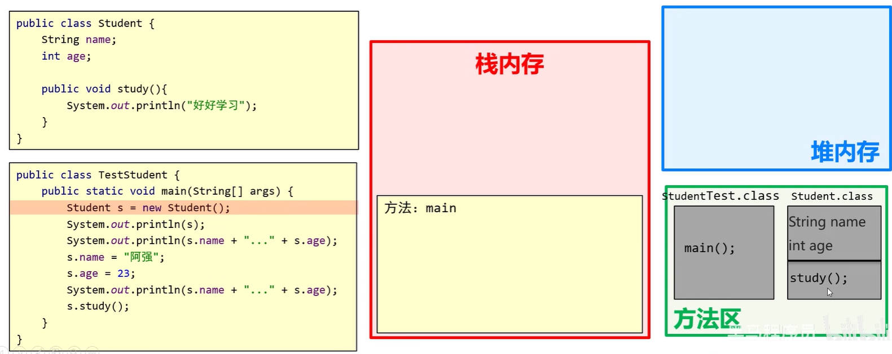
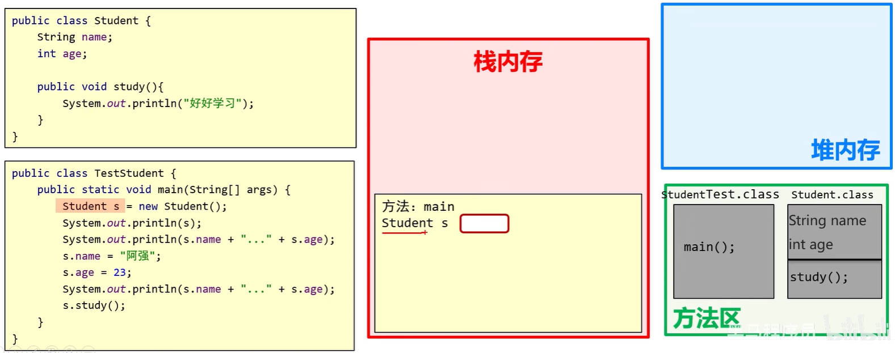
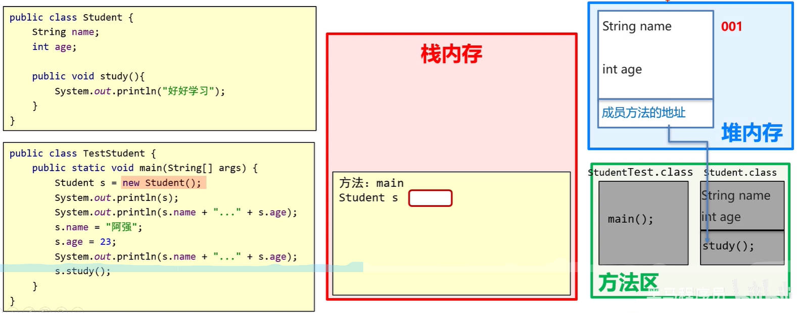
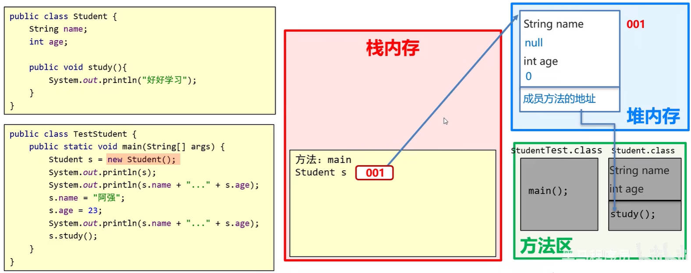
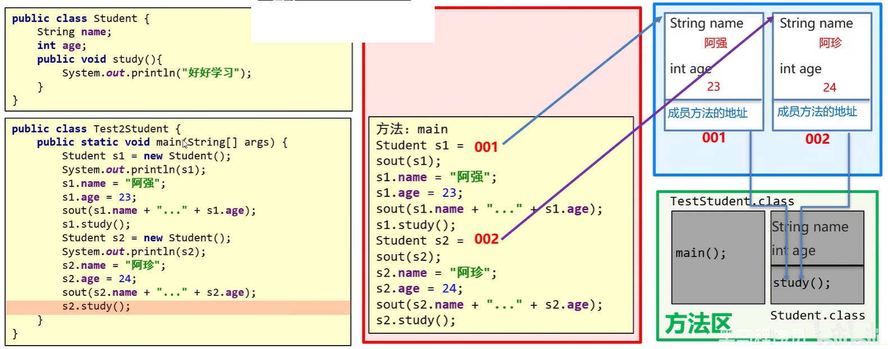
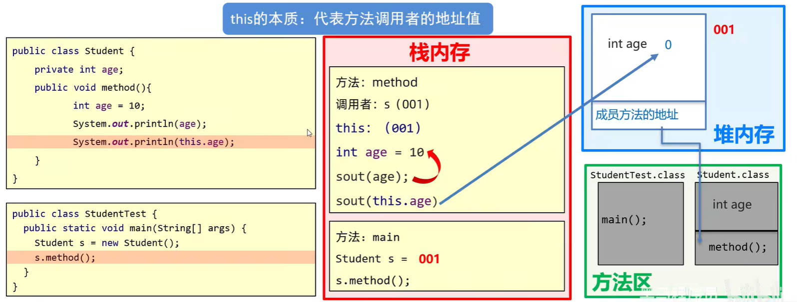

# Java 面向对象

## 一、Java 类和对象

在 Java 中，必须先设计类，才能获取对象。

- 类是共同特征的描述（设计图）；
- 对象是真实存在的具体实例。

一个类里面，可以有

- 成员变量（代表属性，一般是名词形式）
- 成员方法（代表行为，一般是动词）
- 构造器
- 代码块
- 内部类

创建一个手机类。

demo-project/base-code/Day08/src/com/kkcf/object_riented/Phone.java

```java
package com.kkcf.object_riented;

public class Phone {
    double price;
    String brand;

    public void call() {
        System.out.println("手机在打电话");
    }

    public void playGame() {
        System.out.println("手机在玩游戏");
    }
}
```

创建一个手机测试类，在其中

- 通过手机类，创建手机对象；
- 访问对象中的属性；格式：`对象名.成员变量`
- 访问对象中的方法。格式：`对项名.方法名(...)`

demo-project/base-code/Day08/src/com/kkcf/object_riented/PhoneTest.java

```java
package com.kkcf.object_riented;

public class PhoneTest {
    public static void main(String[] args) {
        Phone phone = new Phone();

        phone.price = 1999.98;
        phone.brand = "小米";

        System.out.println(phone.price);
        System.out.println(phone.brand);

        phone.call();
        phone.playGame();
    }
}
```

### 1.Java 类的种类

类名的首字母，建议使用大写的驼峰命名规范，需要做到见名知意，

一个 .java 文件中：

- 可以定义多个 class 类；
- 但是，只能有一个类是 `public` 修饰；
- 而且 `public` 修饰的类名，必须成为 .java 的文件名。

> 建议：一个 .java 文件中，通常只写一个类。

Java 类中：成员变量，完整定义格式为 `修饰符 数据类型 变量名称 = 初始化值;`，一般无需指定初始化值，存在默认值，规则如下：

| 数据类型     | 明细                   | 默认值 |
| ------------ | ---------------------- | ------ |
| 基本数据类型 | byte、short、int、long | 0      |
|              | float、double          | 0.0    |
|              | boolean                | false  |
| 引用类型     | 类、接口、数组、String | null   |

demo-project/base-code/Day08/src/com/kkcf/object_riented/GirlFriend.java

```java
package com.kkcf.object_riented;

public class GirlFriend {
    private String name = "aoi";
    private int age = 18;
}
```

#### 1.JavaBean 类

用来描述一类事物的类，专业叫做 JavaBean 类。在 JavaBean 类中，是不写 `main` 方法的。

#### 2.测试类

编写 `main` 方法的类，叫做测试类。

我们通常会在测试类中，创建 JavaBean 类的实例对象。

### 2.Java 类的设计

名词提炼法：将需求中的名词，提炼为类的属性。

动词提炼法：将需求中的动词，提炼为类的方法。

## 二、Java 封装

封装、继承、多态，是面向对象的三大特征。

封装的思想，让我们正确的设计类中的属性和方法。

封装思想的重要原则：**对象代表什么，就得封装对应的数据，并提供数据对应的行为**。

需求：人关门，请针对这个需求进行面向对象设计。

- 应该把“关门”的方法，设计在“门”这个类里。

demo-project/base-code/Day08/src/com/kkcf/object_riented/Door.java

```java
package com.kkcf.object_riented;

public class Door {
    boolean isOpen = false;

    public void close() {
        isOpen = false;
        System.out.println("门被关上了");
    }
}
```

又比如 Java 核心类库中封装好的 `String` 类，其中也有诸多的方法，以便开发者来使用：

demo-project/base-code/Day08/src/com/kkcf/object_riented/Test01.java

```java
package com.kkcf.object_riented;

public class Test01 {
    public static void main(String[] args) {
        String s = "never mind scandal and libel";

        int len = s.length();
        System.out.println(len);

        String ss = s.toUpperCase();
        System.out.println(ss);
    }
}
```

### 1.private 关键字

private 是 Java 中的关键字，它

- 表示一个权限修饰符；
- 可以修饰类中的成员（成员变量、成员方法）。
- 被修饰的成员，只能在本类中才嫩访问。
- 针对 private 修饰的成员变量，如果需要被其它类使用，要提供相应的操作：
  - 提供 `setXxx(参数)` 方法，用于给成员变量赋值，方法用 `public` 修饰。
  - 提供 `getXxx()` 方法，用于获取成员变量的值，方法用 `public` 修饰

针对每个私有化的成员变量，都要提供 get、set 方法。

demo-project/base-code/Day08/src/com/kkcf/object_riented/GirlFriend.java

```java
package com.kkcf.object_riented;

public class GirlFriend {
    private String name = "aoi";
    private int age = 18;
    private String gender = "萌妹子";

    public void setName(String n) {
        name = n;
    }

    public String getName() {
        return name;
    }

    public void setAge(int a) {
        if (a > 18 && a < 50)
            age = a;
        else
            System.out.println("非法参数");
    }

    public int getAge() {
        return age;
    }

    public void setGender(String g) {
        gender = g;
    }

    public String getGender() {
        return gender;
    }
}
```

demo-project/base-code/Day08/src/com/kkcf/object_riented/Test02.java

```java
package com.kkcf.object_riented;

public class Test02 {
    public static void main(String[] args) {
        GirlFriend gf = new GirlFriend();
        //gf.age = 18; // 报错

        gf.setName("kumiko");
        gf.setAge(19);
        gf.setGender("萌妹子");

        System.out.println(gf.getName());
        System.out.println(gf.getAge());
        System.out.println(gf.getGender());
    }
}
```

### 2.成员变量、局部变量

在 Java 类的成员方法中，使用变量，遵守“**就近原则**”，即使用最近的同名变量。

demo-project/base-code/Day08/src/com/kkcf/object_riented/GirlFriend.java

```java
package com.kkcf.object_riented;

public class GirlFriend {
    private int age = 18;

    public void setName(String name) {
        int age = 10;
        System.out.println(age); // 10
    }
}
```

成员变量，局部变量作用域类中，它们的区别是

- 类中位置不同：
  - 成员变量：类中方法外，没有顺序要求，一般习惯写在类的最上方；
  - 局部变量：方法内部或方法声明上。
- 内存中位置不同：
  - 成员变量：堆内存；
  - 局部变量：栈内存。
- 生命周期不同：
  - 成员变量：随着对象的存在而存在，随着对象的消失而消失；
  - 局部变量：随着方法的调用而存在，醉着方法的调用完毕而消失。
- 初始化值不同：
  - 成员变量：有默认初始化值；
  - 局部变量：没有默认初始化值，必须先定义，赋值才能使用。
- 作用域不同：
  - 成员变量：整个类中有效。
  - 局部变量：当前方法中有效。

### 3.this 关键字

`this` 关键字，修饰的变量用于指代成员变量，其主要作用是（区分局部变量和成员变量的重名问题）

- 方法的形参如果与成员变量同名，不带 `this` 关键字的变量，指的是形参，而不是成员变量；
- 方法的形参没有与成员变量同名，不带 `this` 关键字的变量，指的是成员变量。

demo-project/base-code/Day08/src/com/kkcf/object_riented/GirlFriend.java

```java
package com.kkcf.object_riented;

public class GirlFriend {
    private int age = 18;

    public void setName(String name) {
        int age = 10;
        System.out.println(this.age); // 18
    }
}
```

使用 `this` 关键字，重构上方的 `GirlFriend` 类。

demo-project/base-code/Day08/src/com/kkcf/object_riented/GirlFriend.java

```java
package com.kkcf.object_riented;

public class GirlFriend {
    private String name = "aoi";
    private int age = 18;
    private String gender = "萌妹子";

    public void setName(String name) {
        this.name = name;
    }

    public String getName() {
        return this.name;
    }

    public void setAge(int age) {
        if (age > 18 && age < 50)
            this.age = age;
        else
            System.out.println("非法参数");
    }

    public int getAge() {
        return this.age;
    }

    public void setGender(String gender) {
        this.gender = gender;
    }

    public String getGender() {
        return this.gender;
    }
}
```

## 三、Java 类构造方法

Java 类中的构造方法，也称构造器，构造函数。

Java 类中的构造方法并不是用来创建对象实例的，而是在使用类创建对象实例时，给成员变量进行初始化。

- Java 类创建对象实例，是由 `new` 关键字发起的。

Java 类中的构造方法的编写格式如下：

```java
public class Demo01 {
    修饰符 类名(参数) {
        方法体;
    }
}
```

- 构造方法的方法名，与类名完全相同（大小写保持一致）；
- 没有返回值类型，连 `void` 都没有；
- 没有具体的返回值（不能由 `return` 返回结果数据）。

### 1.空参构造方法、带参构造方法

Java 类中的构造方法，分为**空参构造方法**，和**带参构造方法**。

- 如果一个 Java 类中，没有写构造方法，那么当使用这个类创建对象实例时，JVM 虚拟机会自动给这个类，加上一个空参构造方法。
- 如果一个 Java 类中，明确写了构造方法，那么当使用这个类创建对象实例时，JVM 虚拟机不会给这个类，加上一个空参构造方法。

Java 类中的构造方法的执行时机：

1. 使用 Java 类创建对象实例的时候，由 JVM 虚拟机调用，不能手动调用构造方法。
2. 每创建一次对象，就会调用一次构造方法。

为 `Student` 类，编写构造方法，和 getter、setter 访问器：

demo-project/base-code/Day08/src/com/kkcf/object_riented/Student.java

```java
package com.kkcf.object_riented;

public class Student {
    private String name;
    private int age;

    // 空参构造方法
    public Student() {
        System.out.println("看看我执行了吗~");
    }

    // 带参构造方法
    public Student(String name, int age) {
        this.name = name;
        this.age = age;
    }

    public String getName() {
        return name;
    }
    public void setName(String name) {
        this.name = name;
    }
    public int getAge() {
        return age;
    }
    public void setAge(int age) {
        this.age = age;
    }
}
```

- 在开发中编写一个类，通常会加上空参构造方法。

调用 `Student` 类中的构造方法，创建对象实例，并访问其中的属性。

demo-project/base-code/Day08/src/com/kkcf/object_riented/Test03.java

```java
package com.kkcf.object_riented;

public class Test03 {
    public static void main(String[] args) {
        Student stu = new Student("zzt", 18);
        System.out.println(stu.getName());
        System.out.println(stu.getAge());
    }
}
```

### 2.构造方法的重载

空参构造方法，和带参构造方法，两者方法名相同，但是参数不同，这叫做构造方法的重载。

在实际开发中，建议在任何时候，都手动写上空参和带全部参数的构造方法。

## 四、JavaBean 类的标准

一个标准的 JavaBean 类，需要满足以下几点条件：

- 类名需要见名知意（采用大写的驼峰命名规范）。
- 为了保证数据的安全性，成员变量使用 `private` 关键字修饰。
- 提供至少两个构造方法：
  - 空参构造方法；
  - 带参（全部参数）的构造方法。
- 成员方法
  - 提供每一个成员变量对应的 `setXxx()` / `getXxx()`。
  - 如果还有其它行为，也需要写上。

按照标准的 JavaBean 类规范，写一个 `User` 类：

demo-project/base-code/Day08/src/com/kkcf/object_riented/User.java

```java
package com.kkcf.object_riented;

public class User {
    // 成员变量
    private String username;
    private String password;
    private String email;
    private String gender;
    private String age;

    // 空参构造
    public User() {}

    // 带参构造
    public User(String username, String password, String email, String gender, String age) {
        this.username = username;
        this.password = password;
        this.email = email;
        this.gender = gender;
        this.age = age;
    }

    // getter、setter 访问器
    public String getUsername() {
        return username;
    }

    public void setUsername(String username) {
        this.username = username;
    }

    public String getPassword() {
        return password;
    }

    public void setPassword(String password) {
        this.password = password;
    }

    public String getEmail() {
        return email;
    }

    public void setEmail(String email) {
        this.email = email;
    }

    public String getGender() {
        return gender;
    }

    public void setGender(String gender) {
        this.gender = gender;
    }

    public String getAge() {
        return age;
    }

    public void setAge(String age) {
        this.age = age;
    }
}
```

## 五、Java 对象的内存表现

由前面介绍的 Java 内存分配可知，

- JVM 内存空间：方法区中，是字节码文件加载时，进入的内存。
- JVM 内存空间：栈内存中，是方法运行时，所进入的内存，变量的声明也在该内存中。、
- JVM 内存空间：堆内存中，被 `new` 操作符创建出来的对象，会在其中开辟内存空间，并产生地址值。


### 1.一个对象内存表现

使用 `new` 操作符，创建一个对象，如下方代码所示：

```java
Student stu = new Student();
```

会执行以下步骤：

1. 加载 .class 文件（字节码文件加载到方法区）。
2. 声明局部变量（创建对象左边的声明的标识符，用于存储创建的对象的地址值）。
3. 在堆内存中，开辟一个空间。
4. 默认初始化（成员变量根据其数据类型生成默认初始值）。
5. 显示初始化（成员变量赋默认值）。
6. 构造方法初始化（构造方法给成员变量初始化值）。
7. 将堆内存中的地址值，赋值给左边的局部变量。

4，5，6 步骤，都是对第 3 步中的变量，进行赋值的操作。

现有下方的 JavaBean 类和测试类：

demo-project/base-code/Day08/src/com/kkcf/object_riented/Student.java

```java
package com.kkcf.object_riented;

public class Student {
    String name;
    int age;

    public void study() {
        System.out.println("好好学习");
    }
}
```

demo-project/base-code/Day08/src/com/kkcf/object_riented/Test03.java

```java
package com.kkcf.object_riented;

public class Test03 {
    public static void main(String[] args) {
        Student s = new Student();

        System.out.println(s);
        System.out.println(s.name + "..." + s.age);

        s.name = "阿强";
        s.age = 23;

        System.out.println(s.name + "..." + s.age);

        s.study();
    }
}
```

上方代码的内存表现形式，如下图所示：

1.加载 .class 文件



2.声明局部变量



3.在堆内存中，开辟一块空间



4.默认初始化


5.显示初始化

上方代码中，没有进行显示初始化。

6.构造方法初始化

上方代码中，也没有进行构造方法初始化。

7.将堆内存中的地址值，赋值给左边的局部变量。



> 堆空间中开辟的内存，如果没有变量再指向它，那么会作为垃圾被回收。

### 2.多个对象内存表现

与一个对象内存表现不同的是，当使用同一个类，创建多个对象实例时：

- 第一步，加载 .class 文件，只会进行一次。
- 第三步，在堆内存中，开辟一块空间，其中的成员方法，指向的是方法区中，同一个 class 文件。



### 2.两个引用指向同一个对象内存表现

编写一个测试类，实现两个引用指向同一个对象的场景：

demo-project/base-code/Day08/src/com/kkcf/object_riented/Test03.java

```java
package com.kkcf.object_riented;

public class Test03 {
    public static void main(String[] args) {
        Student s1 = new Student();
        s.name = "阿强";

        Student s2 = s1
        s.name = "阿珍";

        System.out.println(s1.name); // 阿珍
        System.out.println(s2.name); // 阿珍

        s1 = null;

        System.out.println(s1.name); // 报错 NullPointException
        System.out.println(s2.name); // 阿珍

        s2 = null;
    }
}
```

上方代码的内存表现，如下图所示：


## 六、Java 基本数据类型、引用数据类型

从内存的角度，来看 Java 的基本数据类型，和引用数据类型。

基本数据类型：数据值存储在自己的空间中；

- 特点：赋值给其它变量，也是赋的真实的值。

引用数据类型：数据值存储再其它空间中，自己空间存储的是地址值。

- 特点：赋值给其它变量，赋的是地址值。

## 七、Java this 关键字内存表现

在 Java 的类中，this 关键字，用于区分局部变量和成员变量。

this 关键字的本质，其实就是所在方法调用者的地址值。

编写一个 JavaBean 类如下：

demo-project/base-code/Day08/src/com/kkcf/object_riented/Student.java

```java
package com.kkcf.object_riented;

public class Student {
    private int age;

    public void method() {
        int age = 10;
        System.out.println(age);
        System.out.println(this.age);
    }
}
```

为它编写一个测试类：

demo-project/base-code/Day08/src/com/kkcf/object_riented/Test03.java

```java
package com.kkcf.object_riented;

public class Test03 {
    public static void main(String[] args) {
        Student s = new Student();
        s.method();
    }
}
```

上方代码的内存表现如下图所示：


