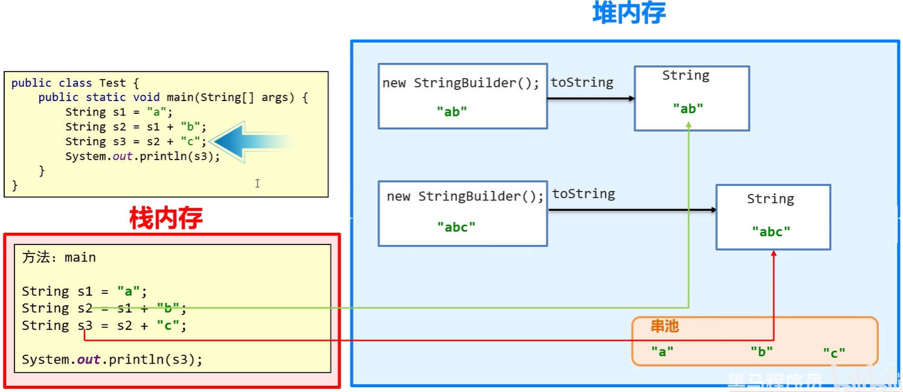
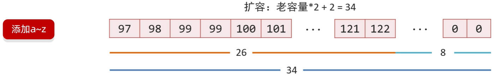
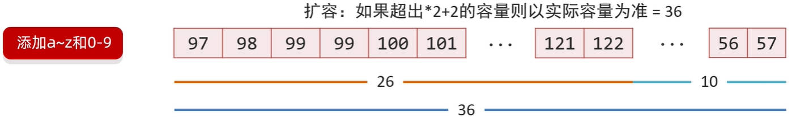

# Java API、字符串

在 Java 面向对象中，我们需要掌握：如何设计一个类；如何使用别人写好的类；

## 一、API、字符串

API（Application Programming Interface）：表示应用程序编程接口。

java 中的 API，指的就是 JDK 中提供的各种功能的 Java 类，这些类将底层的实现封装了起来；

我们不需要关心这些类是如何实现的，只需要学习这些类如何使用即可，我们可以通过帮助文档来学习这些 API 如何使用。

使用 `java.lang` 包中的 API 时，是不需要导包的。

- 在 `java.lang` 包中，找到 `String` 类；
- 点击 API 帮助文档左上角“显示”，点击“索引”，进行搜索。

Java 字符串的常见操作有：比较、替换、截取、查找、切割、检索、加密、打乱内容、大小写转换、......

Java 字符串相关的类有 `String`、`StringBuilder`、`StringJonier`（JDK 8）、`StrinBuffer`、`Pattern`、`Matcher`、……

## 二、String 类

`String` 类在 `java.lang` 包下，所以使用的时候不需要导包。

`String` 类用于创建字符串对象。

Java 程序中的所有字符串（例如`“abc”`）都被实现为此类的实例对象；

也就是说，Java 程序中，所有的双引号包裹的字符串，都是 `String` 类的实例对象。

### 1.String 类特点

`String` 类创建的字符串对象，有以下特点：

特点一：`String` 类创建的字符串对象不可变，它们的值在创建后不能被更改。比如说：

下方代码，一共产生了三个 `String` 类创建的对象。

```java
String abc = "abc";
String cba = "cba";

System.out.println(abc + cba);
```

下方代码，一共产生了两个 `String` 类创建的对象。

```java
String abc = "abc";

abc = "cba";
```

特点二：虽然 `String` 类的实例对象的值是不可变的，但是它们可以被共享。

特点三：字符串效果上相当于字符数组（`char[]`），但是底层原理是字节数组（`byte[]`）根据字符集编码进行转换。

### 2.String 类创建对象

`String` 类创建对象有两种方式：

- 第一种：字面量赋值；比如：`String name = "zzt";`（最常用的方式）。
- 第二种：使用 `new` 操作符，调用 `String` 类的构造方法，常用的构造方法如下。

| 构造方法                         | 说明                                                   |
| -------------------------------- | ------------------------------------------------------ |
| `public String()`                | 创建空白字符串，不含任何内容                           |
| `public String(String original)` | 根据传入的字符串，创建字符串对象（没有意义，一般不用） |
| `public String(char[] chs)`      | 根据字符数组，创建字符串对象                           |
| `public String(byte[] bytes)`    | 根据字节数组，创建字符串对象                           |

使用 `String` 类的构造方法，创建 `String` 字符串对象。

demo-project/base-code/Day10/src/com/kkcf/string/Demo01.java

```java
package com.kkcf.string;

public class Demo01 {
    public static void main(String[] args) {
        String s1 = "abcd";
        System.out.println(s1); // abcd

        String s2 = new String();
        System.out.println("@" + s2 + "!"); // @!

        String s3 = new String(s1);
        System.out.println(s3); // abcd

        // 使用场景：修改字符串的内容时，先把字符串转为字符数组，再转为字符串。
        char[] chs = {'a', 'b', 'c', 'd'};
        String s4 = new String(chs);
        System.out.println(s4); // abcd

        // 使用场景：网络传输中都是字节信息，将这些字节信息放入数组，再转成字符串
        byte[] bytes = {97, 98, 99, 100};
        String s5 = new String(bytes);
        System.out.println(s5); // abcd
    }
}
```

### 3.String 类创建对象内存表现

JVM 内存模型中，有一块区域称为 **StringTable（串池）**，用来存放字面量类型的字符串。

JDK7 以前，StringTable（串池）在方法区当中；


JDK7 以后，StringTable（串池）在堆内存当中。


#### 1.字符串字面量直接赋值

下方代码中，使用字符串字面量，直接赋值给标识符

```java
package com.kkcf.string;

public class Demo01 {
    public static void main(String[] args) {
        String s1 = "abc";
        String s2 = "abc";
    }
}
```

它的内存表现如下：


结论：当使用字符串字面量（双引号包裹）直接赋值给标识符时，系统会检查该字符串在 StringTable 串池中是否存在；

- 不存在，则在 StringTable 串池中创建新的；
- 存在，则直接引用其地址；

字符串字面量直接赋值的方式，既简洁，也节约内存。一般采用这种方式创建字符串对象。

#### 2.new 操作符创建字符串对象

下方代码中，使用 `new` 操作符，调用 `String` 类的构造函数，传入字符数组，创建字符串对象。

```java
package com.kkcf.string;

public class Demo01 {
    public static void main(String[] args) {
        char[] chs = {'a', 'b', 'c'};

        String s1 = new String(chs);
        String s2 = new String(chs);
    }
}
```

它的内存表现如下图所示：


- 结论：`new` 操作符创建的字符串对象，不能复用 StringTable 串池中的地址值。

### 4.String 类字符串对象内存地址比较

`==` 号在比较数据的时候：

- 比较两个基本数据类型，比较的是值。
- 比较两个引用数据类型，比较的是地址值。

下方代码，比较了 String 类的字符串对象。结合上文【String 类创建对象的内存表现】来理解比较结果。

`new` 操作符创建的 String 类的对象，地址值不同。

```java
package com.kkcf.string;

public class Demo01 {
    public static void main(String[] args) {
        String s1 = new String("abc");
        String s2 = new String("abc");

        System.out.println(s1 == s2); // false
    }
}
```

字面量直接赋值的 String 类的对象，在 StringTable（串池）中可直接复用地址值，所以地址值相同。

```java
package com.kkcf.string;

public class Demo01 {
    public static void main(String[] args) {
        String s1 = "abc";
        String s2 = "abc";

        System.out.println(s1 == s2); // true
    }
}
```

字面量直接赋值的 String 类的对象，和 `new` 操作符创建的 String 类的对象，地址值也不相同。

```java
package com.kkcf.string;

public class Demo01 {
    public static void main(String[] args) {
        String s1 = new String("abc");
        String s2 = "abc";

        System.out.println(s1 == s2); // false
    }
}
```

### 5.String 类字符串对象值比较

如果要比较 String 类的字符串对象中的值是否相同，需要使用 `String` 类中封装的方法，比如：

- `public boolean equals(Object anObject)`，用于比较字符串对象中的值。
- `public boolean equalsIgnoreCase(String anotherString)`，用于比较字符串对象中的值，忽略大小写进行比较。

demo-project/base-code/Day10/src/com/kkcf/string/Demo01.java

```java
package com.kkcf.string;

public class Demo01 {
    public static void main(String[] args) {
        String s1 = new String("abc");
        String s2 = "Abc";

        System.out.println(s1 == s2); // false

        System.out.println(s1.equals(s2)); // false

        System.out.println(s1.equalsIgnoreCase(s2)); // true
    }
}
```

案例理解：已知正确的用户名和密码，请用程序实现模拟用户登录。总共给三次机会，登录之后给出相应的提示。

demo-project/base-code/Day10/src/com/kkcf/string/Test01.java

```java
package com.kkcf.string;

import java.util.Scanner;

public class Test01 {
    public static void main(String[] args) {
        String accurateUsername = "zhangsan";
        String accuratePassword = "123456";

        Scanner sc = new Scanner(System.in);

        for (int i = 0; i < 3; i++) {
            System.out.println("请输入用户名：");
            String username = sc.next();
            System.out.println("请输入密码：");
            String password = sc.next();

            if (accurateUsername.equals(username) && accuratePassword.equals(password)) {
                System.out.println("登录成功");
                break;
            } else {
                System.out.println(i == 2 ? "账号被锁定，请联系管理员" : "登录失败，还剩下 " + (2 - 1) + " 次机会");
            }
        }
    }
}
```

### 6.String 类字符串对象的遍历

遍历 String 类创建的字符串对象中的每个字符，需要用到 String 类中封装的方法，常用的有以下几种：

- `public char charAt(int index)`，用于返回指定索引处的 char 值。
- `public int length()`，用于返回此字符串的长度。
- `public char[] toCharArray()`，方法将字符串转换为字符数组。

> 数组对象的 `length` 是属性，String 类的字符串对象的 `length` 是方法。

案例理解：键盘录入一个字符串，遍历其中的每一个字符。

demo-project/base-code/Day10/src/com/kkcf/string/Demo03.java

```java
package com.kkcf.string;

import java.util.Scanner;

public class Demo03 {
    public static void main(String[] args) {
        Scanner sc = new Scanner(System.in);
        System.out.println("请输入一个字符串：");
        String str = sc.next();

        for (int i = 0; i < str.length(); i++) {
            char c = str.charAt(i);
            System.out.println(c);
        }
    }
}
```

案例理解：键盘录入一个字符串，分别统计其中的大写字母、小写字母，数字字符出现的次数。

demo-project/base-code/Day10/src/com/kkcf/string/Test02.java

```java
package com.kkcf.string;

import java.util.Scanner;

public class Test02 {
    public static void main(String[] args) {
        Scanner sc = new Scanner(System.in);
        System.out.println("请输入一个字符串：");
        String str = sc.nextLine();

        int upCaseCount = 0;
        int lowCaseCount = 0;
        int numCount = 0;

        for (int i = 0; i < str.length(); i++) {
            char c = str.charAt(i);

            if (c >= 'A' && c <= 'Z')
                upCaseCount++;
            else if (c >= 'a' && c <= 'z')
                lowCaseCount++;
            else if (c >= '0' && c <= '9')
                numCount++;
        }

        System.out.println("大写字母：" + upCaseCount);
        System.out.println("小写字母：" + lowCaseCount);
        System.out.println("数字：" + numCount);
    }
}
```

- char 类型的字符，在运算时，会根据 ASCLL 码表，隐式转为 int 整数类型。

### 7.String 类字符串对象的拼接

案例理解：定义一个方法，把 int 数组中的数据，按照指定的格式拼接成一个字符串返回，调用该方法，并在控制台输出结果。

数组为：`int[] arr = {1, 2, 3}`；执行方法后的输出结果为 `[1, 2, 3]`

demo-project/base-code/Day10/src/com/kkcf/string/Test03.java

```java
package com.kkcf.string;

public class Test03 {
    public static void main(String[] args) {
        int[] arr = {1, 2, 3};

        System.out.println(arr2String(arr));
    }

    public static String arr2String(int[] arr) {
        if (arr == null) return "";

        if (arr.length == 0) return "[]";

        String str = "[";

        for (int i = 0; i < arr.length; i++)
            str += i != arr.length - 1 ? (arr[i] + ", ") : (arr[i]);

        str += "]";

        return str;
    }
}
```

### 8.String 类字符串对象的反转

案例理解：定义一个方法，实现字符串的反转：

键盘录入一个字符串，调用该方法后，在控制台输出结果，

例如：键盘录入“abc”，输出结果“cba”。

demo-project/base-code/Day10/src/com/kkcf/string/Test04.java

```java
package com.kkcf.string;

import java.util.Scanner;

public class Test04 {
    public static void main(String[] args) {
        Scanner sc = new Scanner(System.in);

        System.out.println("请输入一个字符串：");
        String str = sc.nextLine();

        String result = reverse(str);
        System.out.println(result);
    }

    public static String reverse(String str) {
        int len = str.length();

        char[] chs = new char[len];

        for (int i = len - 1; i >= 0; i--) {
            char c = str.charAt(i);
            chs[len - 1 - i] = c;
        }

        String result = new String(chs);

        return result;
    }
}
```

### 9.金额转换

案例理解，将一个数字表示的金额，转为中文大写的金额描述。

- 思路：使用”查表法“的思想，将数组索引，和中文数字大写字符对应起来。

demo-project/base-code/Day10/src/com/kkcf/string/Test05.java

```java
package com.kkcf.string;

import java.util.Scanner;

public class Test05 {
    public static void main(String[] args) {
        Scanner sc = new Scanner(System.in);

        int money;
        while (true) {
            System.out.println("请输入一个金额：");
            int i = sc.nextInt();

            if (i >= 0 && i <= 9999999) {
                money = i;
                break;
            } else {
                System.out.println("输入的金额无效");
            }
        }

        String moneyStr = "";
        while (money > 0) {
            int num = money % 10;
            moneyStr = getCapitelNumber(num) + moneyStr;
            money /= 10;
        }

        // 在前面补“零”
        int count = 7 - moneyStr.length();
        for (int i = 0; i < count; i++)
            moneyStr = "零" + moneyStr;

        String[] arr = {"佰", "拾", "万", "仟", "佰", "拾", "元"};
        String result = "";
        for (int i = 0; i < moneyStr.length(); i++) {
            char c = moneyStr.charAt(i);
            result += c + arr[i];
        }

        System.out.println(result);
    }

    /**
     * 此函数用于，使用”查表法获取大写数字
     * @param num
     * @return
     */
    public static String getCapitelNumber(int num) {
        String[] arr = {"零", "壹", "贰", "叁", "肆", "伍", "陆", "柒", "捌", "玖"};
        return arr[num];
    }
}
```

### 10.String 类字符串对象的截取

截取 `String` 类字符串对象中的字符串，需要用到 `String` 类中封装的方法

- `public String substring(int beginIndex, int endIndex)`，返回一个新字符串，它是此字符串的一个子字符串。
  - 该子字符串从指定的 `beginIndex` 处开始，直到索引 `endIndex - 1` 处的字符（包头不包尾，包左不包右）。
  - 因此，该子字符串的长度为 `endIndex-beginIndex`。

- `public String substring(int beginIndex)`，返回一个新的字符串，它是此字符串的一个子字符串。
  - 该子字符串从指定索引处的字符开始，直到此字符串末尾。

案例理解：将手机号码中间四位数字，用 `****` 代替。

demo-project/base-code/Day10/src/com/kkcf/string/Demo04.java

```java
package com.kkcf.string;

public class Demo04 {
    public static void main(String[] args) {
        String phoneNum = "13812345678";

        String start = phoneNum.substring(0, 3);
        String end = phoneNum.substring(7);

        String result = start + "****" + end;
        System.out.println(result);
    }
}
```

案例理解：身份证号每一位代表的含义：

- 1、2 位，省份；
- 3、4 位，城市；
- 5、6 位，区县；
- 7 - 14 位，出生年月日；
- 15、16 位，所在地派出所。
- 17 位，性别（奇数：男；偶数：女）

根据一个身份证号码，输出这个人的出生年月日和性别。

demo-project/base-code/Day10/src/com/kkcf/string/Test06.java

```java
package com.kkcf.string;

public class Test06 {
    public static void main(String[] args) {
        String id = "430202200612124321";

        String year = id.substring(6, 10);
        String mon = id.substring(10, 12);
        String day = id.substring(12, 14);

        System.out.println("出生年月日：" + year + " 年 " + mon + " 月 " + day + " 日 ");

        char c = id.charAt(id.length() - 1);
        int num = c - '0';

        System.out.println("性别：" + (num % 2 == 0 ? "女" : "男"));
    }
}
```

### 11.String 类字符串对象的替换

替换 String 类字符串对象中的子字符串，需要用到 String 类中封装的方法:

- `public String replace(CharSequence target, CharSequence replacement)`，使用指定的字面值替换序列替换此字符串所有匹配字面值目标序列的子字符串。该替换从字符串的开头朝末尾执行，例如，用 "b" 替换字符串 "aaa" 中的 "aa" 将生成 "ba" 而不是 "ab"。

案例理解：将一些敏感词，替换为 `***`

demo-project/base-code/Day10/src/com/kkcf/string/Test07.java

```java
package com.kkcf.string;

public class Test07 {
    public static void main(String[] args) {
        String talk = "你玩的真好，SB，以后别玩了，CNM，NMSL";

        String[] arr = {"SB", "CNM", "NMSL", "MLGB", "TMD"};

        for (int i = 0; i < arr.length; i++)
            talk = talk.replace(arr[i], "***");

        System.out.println(talk);
    }
}
```

## 三、StringBuilder 类

`StringBuilder` 类创建的字符串对象，可以看成是一个容器，要操作的字符串可放入其中，对象创建之后里面的内容是可变的。

当我们在拼接字符串，和反转字符串的时候会使用到。

### 1.StringBuilder 构造方法

`StringBuilder` 类常用的构造方法有两个：

- `public StringBuilder()`，构造一个其中不带字符的字符串生成器，初始容量为 16 个字符。
- `public StringBuilder(String str)`，构造一个字符串生成器，并初始化为指定的字符串内容。初始容量为 16 加上字符串参数的长度。

### 2.StringBuilder 成员方法

`StringBuilder` 类常用的成员方法有：

- `public StringBuilder append(任意类型)`，添加数据，并返回对象本身。
- `public StringBuilder reverse()`，反转容器中的内容。
- `public int length()`，返回长度（字符出现的个数）。
- `public String toString()`，把 StringBuilder 类型的字符串对象，转为 String 类型的字符串对象。

StringBuilder 是 Java 已经写好的类，Java 在底层对它做了一些特殊处理，使得打印对象时，输出的不是地址值，而是属性值。

```java
package com.kkcf.string;

public class Demo05 {
    public static void main(String[] args) {
        StringBuilder sb = new StringBuilder("哈哈");

        System.out.println(sb); // 哈哈
    }
}
```

StringBuilder 类的基本使用：

demo-project/base-code/Day10/src/com/kkcf/string/Demo05.java

```java
package com.kkcf.string;

public class Demo05 {
    public static void main(String[] args) {
        StringBuilder sb = new StringBuilder();

        // 字符串拼接
        sb.append("aaa");
        sb.append("bbb");
        sb.append("ccc");
        sb.append("ddd");

        // 反转
        sb.reverse();

        // 获取长度
        System.out.println(sb.length()); // 12

        // 生成字符串
        String str = sb.toString();
        System.out.println(str); // dddcccbbbaaa
    }
}
```

### 3.链式编程思想

链式编程，指的是在调用一个方法的时候，不用变量接收它的结果，而是继续调用其它方法。

使用链式编程，重构上方的代码：

demo-project/base-code/Day10/src/com/kkcf/string/Demo05.java

```java
package com.kkcf.string;

public class Demo05 {
    public static void main(String[] args) {
        StringBuilder sb = new StringBuilder();

        // 字符串拼接、反转，生成字符串
        String str = sb.append("aaa").append("bbb").append("ccc").append("ddd").reverse().toString();

        System.out.println(str.length()); // 12
        System.out.println(str); // dddcccbbbaaa
    }
}
```

案例理解：键盘录入一个字符串，判断该字符串是否是对称字符串，并在控制台打印“是”或“不是”。

例如：对称字符串有“123321”、“111”

demo-project/base-code/Day10/src/com/kkcf/string/Test08.java

```java
package com.kkcf.string;

import java.util.Scanner;

public class Test08 {
    public static void main(String[] args) {
        Scanner sc = new Scanner(System.in);
        System.out.println("请输入一个字符串：");
        String str = sc.nextLine();
        sc.close();

        String strReverse = new StringBuilder().append(str).reverse().toString();;
        System.out.println((str.equals(strReverse) ? "是" : "不是") + "对称字符串");
    }
}
```

### 2.StringBuilder 使用场景

`StringBuilder` 类的使用场景主要有两个：

- 场景一：字符串的拼接；
- 场景二：字符串的反转。

案例理解，使用 `StringBuilder` 类，重构上方 `String` 类拼接字符串的方法。

demo-project/base-code/Day10/src/com/kkcf/string/Test09.java

```java
package com.kkcf.string;

public class Test09 {
    public static void main(String[] args) {
        int arr[] = {1, 2, 3};

        System.out.println(arr2String(arr));
    }

    public static String arr2String(int[] arr) {
        StringBuilder sb = new StringBuilder();

        sb.append("[");

        for (int i = 0; i < arr.length; i++)
            sb.append(i == arr.length - 1 ? arr[i] : arr[i] + ",");

        sb.append("]");

        return sb.toString();
    }
}
```

## 四、StringJoiner 类

`StringJoiner` 类是 JDK8 之后出现的新特性。

`StringJoiner` 类与 `StringBuilder` 类相似，也可以看成是一个容器，创建之后里面的内容是可变的。

`StringJoiner` 的作用，是提高字符串的操作效率，而且代码编写特别简洁，

### 1.StringJoiner 构造方法

`StringJoiner` 类常用的构造方法有两个（它没有空参构造方法）：

- `public StringJoiner(CharSequence delimiter)`，创建一个 StringJoiner 对象，指定间隔符号。
- `public StringJoiner(CharSequence delimiter, CharSequence prefix, CharSequence suffix)`，创建一个 StringJonier 对象，指定拼接时的间隔符号，开始符号，结束符号。

> 在 Java 中，`CharSequence` 是一个接口，表示一个可读的字符序列。它是字符串类（如 `String`、`StringBuilder`、`StringBuffer`）的父接口，提供了字符序列的一般化表示。主要特点有：
>
> - 它定义了几个方法允许访问和操作字符序列：比如：
>
>   - `length()`
>   - `charAt(int index)`
>   - subSequence(int start, int end)` 和 `toString()`，
>
> - `CharSequence` 接口的实现类包括 `String`、`StringBuilder`、`StringBuffer`、`CharBuffer`……。

### 2.StringJoiner 成员方法

`StringJoiner` 类常用的成员方法有以下几个：

- `public StringJoiner add(CharSequence newElement)`，添加数据，并返回对象本身。
- `public int length()`，返回长度，字符出现的个数。
- `public String toString()`，返回一个字符串，该字符串就是拼接后的结果。

使用 `StringJoiner` 类，将三段字符串，用连字符（-）拼接。

```java
package com.kkcf.string;

import java.util.StringJoiner;

public class Demo06 {
    public static void main(String[] args) {
        StringJoiner sj = new StringJoiner("-");

        sj.add("aaa").add("bbb").add("ccc");

        System.out.println(sj); // aaa-bbb-ccc
    }
}
```

使用 `StringJoiner` 类，打印一个数组格式的字符串。

demo-project/base-code/Day10/src/com/kkcf/string/Demo06.java

```java
package com.kkcf.string;

import java.util.StringJoiner;

public class Demo06 {
    public static void main(String[] args) {
        StringJoiner sj = new StringJoiner(", ", "[", "]");

        sj.add("aaa").add("bbb").add("ccc");

        System.out.println(sj.length()); // 15
        System.out.println(sj.toString()); // [aaa, bbb, ccc]
    }
}
```

### 1.StringJoiner 使用场景

`StringJoiner` 的使用场景主要就是字符串的拼接；

## 五、Java 字符串原理

### 1.字符串存储的内存原理

前面已详细介绍过，这里做总结：

- 字符串字面量直接赋值给变量，会使用 StringTable（串池）中的地址值。
- 使用 `new` 操作符，创建一个 String 类的对象，会在堆内存中开辟一块新的空间。

### 2.字符串 == 号的比较

前面已详细介绍过，这里做总结：

- Java 中的字符串，是引用数据类型，== 号只能用于字符串的地址值的比较。
- Java 中的字符串，要比较其值是否相同，就要使用 `equals` 方法。

### 3.字符串拼接的底层原理

String 类创建的字符串对象，在进行拼接的时候，分为两种情况。

#### 1.字面量的字符串拼接

情况一：字符串字面量的拼接。如下方代码所示：

```java
String s = "a" + "b" + "c";

System.out.println(s);
```

- 这会触发字符串的优化机制，在代码编译时，即 .java 文件转为 .class 文件的过程中（还没运行 .class 文件），就已经是最终的结果，即"abc"了。
- 相当于直接给 `s` 变量赋值`"abc"`。

根据上方结论，理解这段代码：

```java
package com.kkcf.string;

public class Demo07 {
    public static void main(String[] args) {
        String s1 = "abc";
        String s2 = "a" + "b" + "c";

        System.out.println(s1 == s2); // true
    }
}
```

#### 2.变量参与的字符串拼接

情况二：有变量参与的字符串拼接。如下方代码所示：

```java
String s1 = "a";
String s2 = s1 + "b";
String s3 = s2 + "c";

System.out.println(s3);
```

##### 1.JDK8 以前

上方代码，在 JDK 8 以前：

- 会在 StringTable（串池）中，创建"a"和"b"两个字符串对象；
- 并在堆内存中，创建一个 StringBuilder 对象，将"a"和"b"放入到该容器中，使用 `append` 方法拼接，再将 StringBuilder 对象，转回 String 字符串对象。依此类推……。
- 所以，变量参与的 String 字符串对象拼接，一个 `+` 号，至少会在内存中创建两个对象。



##### 2.JDK8 以后

上方代码，在 JDK 8 及以后：

- 会对字符串变量相 `+` 后的字符串长度，进行**预估**；
- 在内存中创建一个预估长度的数据，将字符串变量放入其中，这样，内存中就只会创建一个对象。
- 然而，预估也是非常耗时的，所以不推荐在字符串拼接时，使用 `+` 号。

根据上方结论，理解下方代码：

```java
package com.kkcf.string;

public class Demo07 {
    public static void main(String[] args) {
        String s1 = "abc";
        String s2 = "ab";
        String s3 = s2 + "c";

        System.out.println(s1 == s3); // false
    }
}
```

### 4.字符串 StringBuilder 类提高效率的原理图

StringBuilder 创建的对象，是一个可变的容器，当字符串进行拼接时，会将所有的字符串对象，都放入其中。步骤如下：

Ⅰ、StringBuilder 使用空参构造方法创建对象时，会创建一个长度为 `0`，默认容量为 `16` 的字节（byte）数组。

> 长度和容量是不一样的：
>
> - 容量，表示最多能装多少。
> - 长度，表示实际装了多少。


Ⅱ、如果把字符串"abc"放入 StringBuilder 对象中，它的表现形式如下，可知


- 字节数组中，实际存储的是：字符对应的 ASCLL 码表数值。
- 此时字节数组的长度为 `3`，容量为 `16`.

Ⅲ、如果把"a"-"z"，26 个英文字母组成的字符串，添加到 StringBuilder 对象中；

这时超出了 StringBuilder 字符串对象原来 `16` 的容量，那么它会自动扩容，即 `老容量(16) * 2 + 2 = 34`。



- 此时字节数组的长度为 `26`，容量为 `34`.

Ⅳ、如果把"a"-"z"，"0"-"9" 共 36 个字符组成的字符串，添加到空参构造方法创建的 StringBuilder 容器中，这时超出了 StringBuilder 容器自动扩容的最大容量 `16`，那么他会按照实际要存储的字符串长度，来创建字节数组的容量。



- 此时字节数组的长度为 `36`，容量为 `36`.

上方步骤，使用代码表示为：

> StringBuilder 类的 `capacity` 方法，用于返回对象的容量。

demo-project/base-code/Day10/src/com/kkcf/string/Demo07.java

```java
package com.kkcf.string;

public class Demo07 {
    public static void main(String[] args) {
        StringBuilder sb = new StringBuilder();

        System.out.println(sb.capacity()); // 16
        System.out.println(sb.length()); // 0

        sb.append("abc");

        System.out.println(sb.capacity()); // 16
        System.out.println(sb.length()); // 3

        sb.append("defghijklmnopqrstuvwxyz");

        System.out.println(sb.capacity()); // 34
        System.out.println(sb.length()); // 26

        StringBuilder sb2 = new StringBuilder();
        sb2.append("abcdefghijklmnopqrstuvwxyz0123456789");

        System.out.println(sb2.capacity()); // 36
        System.out.println(sb2.length()); // 36
    }
}
```

总的来说，使用 StringBuilder 创建的对象，会将所有字符串放在一个容器中，不会创建很多无用的空间，可以节约内存。

## 六、Java 字符串综合练习

### 1.罗马数字

键盘录入一个字符串。

- 要求 1：长度小于等于 9；
- 要求 2：只能是数字。

将内容变成罗马数字。

注意：罗马数字中，没有 0，如果键盘录入的数字包含 0，可以变成长度为 0 的字符串。

demo-project/base-code/Day10/src/com/kkcf/string/Test10.java

```java
package com.kkcf.string;

import java.util.Scanner;

public class Test10 {
    public static void main(String[] args) {
        Scanner sc = new Scanner(System.in);

        String str;
        while (true) {
            System.out.println("请输入一个字符串：");
            str = sc.next();

            boolean flag = checkString(str);
            if (flag) break;
            else System.out.println("输入的字符串不符合要求，请重新输入！");
        }

        sc.close();

        StringBuilder sb = new StringBuilder();

        for (int i = 0; i < str.length(); i++) {
            char c = str.charAt(i);
            String s = changeRoman(c - '0');

            sb.append(s);
        }

        System.out.println(sb.toString());
    }

    /**
     * 此函数用于，检查输入的字符串是否符合要求
     * @param str
     * @return
     */
    public static boolean checkString(String str) {
        if (str.length() > 9) return false;

        for (int i = 0; i < str.length(); i++) {
            char c = str.charAt(i);
            if (c < '0' || c > '9') return false;
        }

        return true;
    }

    /**
     * 此函数用于，使用查表法，将阿拉伯数字转换为罗马数字
     * @param num 阿拉伯数字
     * @return
     */
    public static String changeRoman(int num) {
        String[] romaNum = {"", "Ⅰ", "Ⅱ", "Ⅲ", "Ⅳ", "Ⅴ", "Ⅵ", "Ⅶ", "Ⅷ", "Ⅸ"};
        return romaNum[num];
    }
}
```

#### 1.JDK12 switch 语句新特性

上方代码，`changeRoman` 方法，可以使用 JDK12 switch 语句新特性来重构。

- JDK 12 switch 语句新特性，使用变量接收 switch 语句的返回结果。

```java
public static String changeRoman(int num) {
    String str = switch (num) {
        case 0 -> "";
        case 1 -> "Ⅰ";
        case 2 -> "Ⅱ";
        case 3 -> "Ⅲ";
        case 4 -> "Ⅳ";
        case 5 -> "Ⅴ";
        case 6 -> "Ⅵ";
        case 7 -> "Ⅶ";
        case 8 -> "Ⅷ";
        case 9 -> "Ⅸ";
        default -> "";
    };

    return str;
}
```

### 2.旋转字符串

给定两个字符串 A 和 B，A 的旋转操作，就是将 A 最左边的字符移动到最右边。

- 例如：若 A = "abcde"，在旋转一次之后，结果就是 "bcdea"。

如果在若干次旋转操作之后，A 能变成 B，那么返回 `true`，否则返回 `false`。

> String 类创建的字符串是不可修改的，如果要修改字符串，有两种办法：
>
> - 第一种：`substring` 方法，对字符串进行截取。把左边的字符串取出来，拼接到右边。
> - 第二种：`toCharArray` 方法，把字符串，先变为一个字符数组，然后调整字符数组里面的元素，然后再把数组转为字符串。

第一种解法：

demo-project/base-code/Day10/src/com/kkcf/string/Test11Case1.java

```java
package com.kkcf.string;

public class Test11Case1 {
    public static void main(String[] args) {
        String strTarget = "cdeab";
        String str = "abcde";

        boolean result = check(strTarget, str);
        System.out.println(result);
    }

    public static boolean check(String strTarget, String str) {
        for (int i = 0; i < str.length(); i++) {
            str = rotate(str);

            if (str.equals(strTarget))
                return true;
        }

        return false;
    }

    public static String rotate(String str) {
        char first = str.charAt(0);
        String end = str.substring(1);

        return end + first;
    }
}
```

第二种解法：使用字符数组的方式，重构 `rotate` 方法。

demo-project/base-code/Day10/src/com/kkcf/string/Test11Case1.java

```java
public static String rotate(String str) {
  char[] chars = str.toCharArray();

  char temp = chars[0];

  for (int i = 0; i < chars.length; i++)
      if (i != chars.length - 1)
          chars[i] = chars[i + 1];
      else
          chars[i] = temp;

  return new String(chars);
}
```

### 3.打乱字符串

案例理解：键盘录入一个字符串，打乱字符串里面的内容。

demo-project/base-code/Day10/src/com/kkcf/string/Test12.java

```java
package com.kkcf.string;

import java.util.Random;
import java.util.Scanner;

public class Test12 {
    public static void main(String[] args) {
        Scanner sc = new Scanner(System.in);

        System.out.println("请输入一个字符串：");
        String str = sc.next();

        sc.close();

        char[] chars = str.toCharArray();

        Random r = new Random();

        for (int i = 0; i < chars.length; i++) {
            int index = r.nextInt(chars.length);

            char temp = chars[i];
            chars[i] = chars[index];
            chars[index] = temp;
        }

        System.out.println(new String(chars));
    }
}
```

### 4.生成验证码

案例理解：生成验证码。验证码可以是大写或小写的英文字母，也可以是数字。

验证码的长度为 5，字母有 4 个，数字有 1 个。数字的位置可以是任意位置。

demo-project/base-code/Day10/src/com/kkcf/string/Test13.java

```java
package com.kkcf.string;

import java.util.Random;

public class Test13 {
    public static void main(String[] args) {
        // 初始化英文字母数组
        char[] letterChars = new char[52]; // 26 个小写英文字母 + 26 个大写英文字母

        for (int i = 0; i < 26; i++) {
            letterChars[i] = (char) ('a' + i);
            letterChars[i + 26] = (char) ('A' + i);
        }

        // 初始化数字数组
        char[] numChars = new char[10];

        for (int i = 0; i < 10; i++)
            numChars[i] = (char) ('0' + i);

        // 随机生成字符串
        Random r = new Random();
        char[] resChars = new char[5];

        int len = resChars.length;

        for (int i = 0; i < len; i++)
            if (i != len - 1)
                resChars[i] = letterChars[r.nextInt(letterChars.length)];
            else
                resChars[i] = numChars[r.nextInt(numChars.length)];

        // 将最后一位数字，与前面随机一位字母对调。
        int randomIndex = r.nextInt(len);

        char temp = resChars[randomIndex];
        resChars[randomIndex] = resChars[len - 1];
        resChars[len - 1] = temp;

        String result = new String(resChars);
        System.out.println(result);
    }
}
```

### 5.字符串相乘

案例理解：给定两个以字符串形式表示的非负整数 `num1` 和 `num2`，返回 `num1` 和 `num2` 的乘积。

demo-project/base-code/Day10/src/com/kkcf/string/Test14.java

```java
package com.kkcf.string;

public class Test14 {
    public static void main(String[] args) {
        String numStr1 = "123";
        String numStr2 = "456789";

        // 遍历字符串，得到每一位的数字字符。
        int num1 = 0;
        for (int i = 0; i < numStr1.length(); i++) {
            char c = numStr1.charAt(i);
            int n = c - '0';
            num1 = num1 * 10 + n;
        }

        int num2 = 0;
        for (int i = 0; i < numStr2.length(); i++) {
            char c = numStr2.charAt(i);
            int n = c - '0';
            num2 = num2 * 10 + n;
        }

        System.out.println(num1 * num2);
    }
}
```

### 6.单词长度

案例理解：给你一个字符串 a，它由若干单词组成，单词前后用一些空格字符隔开，返回字符串中最后一个单词的长度。单词是指仅由字母组成，不包含任何空格字符的最大子字符串。

- 思路：倒着遍历字符串，直到遇到空格，遍历的次数，就是单词中的字母的个数。

demo-project/base-code/Day10/src/com/kkcf/string/Test15.java

```java
package com.kkcf.string;

public class Test15 {
    public static void main(String[] args) {
        String str = "fly me to the moon";

        System.out.println(caculate(str)); // 4
    }

    public static int caculate(String str) {
        int result = 0;

        for (int i = str.length() - 1; i >= 0; i--) {
            char c = str.charAt(i);

            if (c == ' ')
                return result;
            else
                result++;
        }

        return result;
    }
}

```
