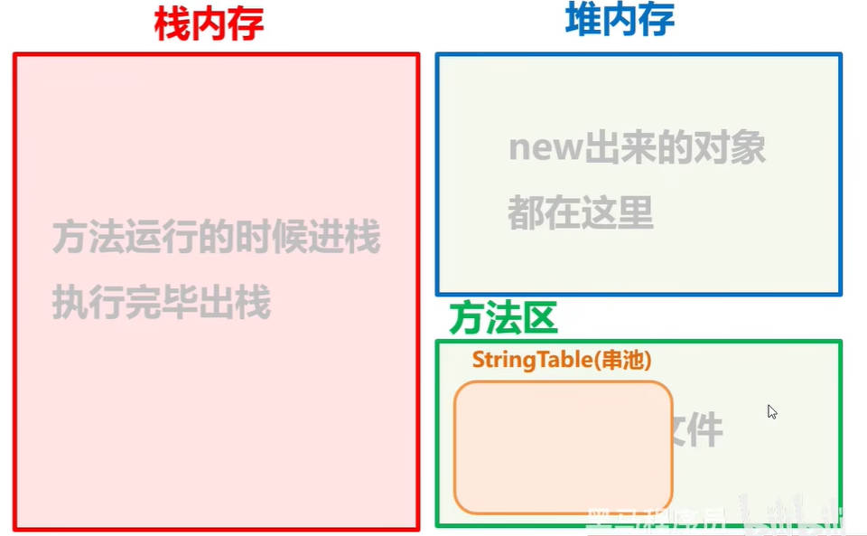
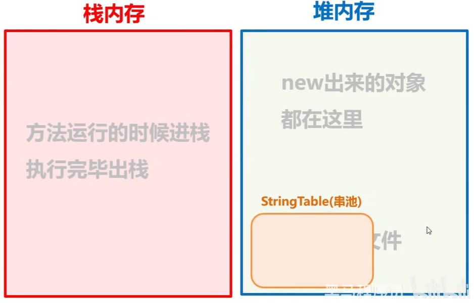
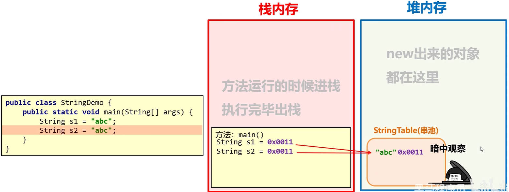
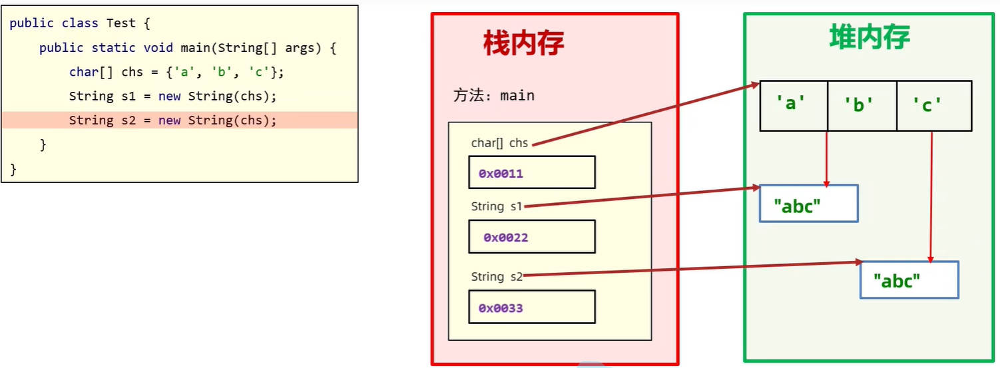

# Java API、字符串

在 Java 面向对象中，我们需要掌握：如何设计一个类；如何使用别人写好的类；

## 一、API、字符串

API（Application Programming Interface）：表示应用程序编程接口。

java 中的 API，指的就是 JDK 中提供的各种功能的 Java 类，这些类将底层的实现封装了起来，我们不需要关心这些类是如何实现的，只需要学习这些类如何使用即可，我们可以通过帮助文档来学习这些 API 如何使用。

使用 `java.lang` 包中的 API 时，是不需要导包的。

- 在 `java.lang` 包中，找到 `String` 类；
- 点击 API 帮助文档左上角“显示”，点击“索引”，进行搜索。

Java 字符串的常见操作有：比较、替换、截取、查找、切割、检索、加密、打乱内容、大小写转换、......

Java 字符串相关的类有 `String`、`StringBuilder`、`StringJonier`（JDK 8）、`StrinBuffer`、`Pattern`、`Matcher`、……

## 二、String 类

java.lang.String 类代表字符串。

Java 程序中的所有字符串文字（例如“abc”）都被实现为此类的实例。也就是说，Java 程序中所有的双引号字符串，都是 String 类的对象。

String 类在 java.lang 包下，所以使用的时候不需要导包！

### 1.String 类特点

String 类创建的字符串对象，有以下特点：

特点一：String 类创建的字符串对象不可变，它们的值在创建后不能被更改。

下方代码，一共产生了三个 String 类创建的对象。

```java
String abc = "abc";
String cba = "cba";

System.out.println(abc + cba);
```

下方代码，一共产生了两个 String 类创建的对象。

```java
String abc = "abc";
abc = "cba";
```


- 虽然 String 的值是不可变的，但是它们可以被共享。
- 字符串效果上相当于字符数组( char[] )，但是底层原理是字节数组( byte[] )

### 2.String 类创建对象

String 类创建对象有两种方式：

- 第一种：直接赋值；比如：`String name = "zzt";`（最常用的方式）。
- 第二种：使用 `new` 操作符，调用 `String` 类的构造方法，常用的构造方法如下。

| 构造方法                         | 说明                             |
| -------------------------------- | -------------------------------- |
| `public String()`                | 创建空白字符串，不含任何内容     |
| `public String(String original)` | 根据传入的字符串，创建字符串对象 |
| `public String(char[] chs)`      | 根据字符数组，创建字符串对象     |
| `public String(byte[] bytes)`    | 根据字节数组，创建字符串对象     |

demo-project/base-code/Day10/src/com/kkcf/string/Demo01.java

```java
package com.kkcf.string;

public class Demo01 {
    public static void main(String[] args) {
        String s1 = "abcd";
        System.out.println(s1);

        String s2 = new String();
        System.out.println("@" + s2 + "!");

        String s3 = new String(s1);
        System.out.println(s3);

        // 使用场景：修改字符串的内容时，先把字符串转为字符数组，再转为字符串。
        char[] chs = {'a', 'b', 'c', 'd'};
        String s4 = new String(chs);
        System.out.println(s4);

        // 使用场景：网络传输中都是字节信息，将这些字节信息放入数组，再转成字符串
        byte[] bytes = {97, 98, 99, 100};
        String s5 = new String(bytes);
        System.out.println(s5);
    }
}
```

### 3.String 类创建对象内存表现

JVM 内存模型中，有一块区域 StringTable（串池），用来存放字面量类型的字符串。

JDK7 以前，StringTable（串池）在方法区当中；



JDK7以后，StringTable（串池）在堆内存当中。



#### 1.字符串字面量直接赋值

下方代码中，使用字符串字面量，直接赋值给标识符

```java
package com.kkcf.string;

public class Demo01 {
    public static void main(String[] args) {
        String s1 = "abc";
        String s2 = "abc";
    }
}
```

它的内存表现如下：



结论：当使用字符串字面量（索引号包裹）直接赋值给标识符时，系统会检查该字符串在串池中，是否存在；不存在，则创建新的；存在，则直接复用；

> 字符串字面量直接赋值的方式，即简洁，也节约内存。

#### 2.new 操作符创建字符串对象

下方代码中，使用 `new` 操作符，调用 `String` 类的构造函数，传入字节数组，创建字符串对象。

```java
package com.kkcf.string;

public class Demo01 {
    public static void main(String[] args) {
        char[] chs = {'a', 'b', 'c'};
        String s1 = new String(chs);
        String s2 = new String(chs);
    }
}
```

它的内存表现如下图所示：



- 结论：new 操作符创建的字符串对象，不能复用。

### 4.String 类字符串对象内存地址比较

== 号在比较数据的时候，分两种情况：

- 第一种情况：比较两个基本数据类型，比较的是值。
- 第二种情况，标胶两个引用数据类型，比较的是地址值。

下方代码，比较了 String 类的字符串对象。结合上文【String 类创建对象的内存表现】来理解比较结果。

`new` 操作符创建的 String 类的对象，地址值不同。

```java
package com.kkcf.string;

public class Demo01 {
    public static void main(String[] args) {
        String s1 = new String("abc");
        String s2 = new String("abc");

        System.out.println(s1 == s2); // false
    }
}
```

字面量直接赋值的 String 类的对象，在 StringTable（串池）中的地址值相同。

```java
package com.kkcf.string;

public class Demo01 {
    public static void main(String[] args) {
        String s1 = "abc";
        String s2 = "abc";

        System.out.println(s1 == s2); // true
    }
}
```

字面量直接赋值的 String 类的对象，`new` 操作符创建的 String 类的对象，地址值也不相同。

```java
package com.kkcf.string;

public class Demo01 {
    public static void main(String[] args) {
        String s1 = new String("abc");
        String s2 = "abc";

        System.out.println(s1 == s2); // false
    }
}
```

### 5.String 类字符串对象值比较

如果要比较 String 类的字符串对象中的值是否相同，需要使用 `String` 类中封装的方法，比如：

- `public boolean equals(Object anObject)`，用于比较字符串对象中的值。
- `public boolean equalsIgnoreCase(String anotherString)`，用于比较字符串对象中的值，忽略大小写进行比较。

demo-project/base-code/Day10/src/com/kkcf/string/Demo01.java

```java
package com.kkcf.string;

public class Demo01 {
    public static void main(String[] args) {
        String s1 = new String("abc");
        String s2 = "Abc";

        System.out.println(s1 == s2); // false

        System.out.println(s1.equals(s2)); // false

        System.out.println(s1.equalsIgnoreCase(s2)); // true
    }
}
```

案例理解：已知正确的用户名和密码，请用程序实现模拟用户登录。总共给三次机会，登录之后给出相应的提示。

demo-project/base-code/Day10/src/com/kkcf/string/Test01.java

```java
package com.kkcf.string;

import java.util.Scanner;

public class Test01 {
    public static void main(String[] args) {
        String accurateUsername = "zhangsan";
        String accuratePassword = "123456";

        Scanner sc = new Scanner(System.in);

        for (int i = 0; i < 3; i++) {
            System.out.println("请输入用户名：");
            String username = sc.next();
            System.out.println("请输入密码：");
            String password = sc.next();

            if (accurateUsername.equals(username) && accuratePassword.equals(password)) {
                System.out.println("登录成功");
                break;
            } else {
                System.out.println(i == 2 ? "账号被锁定，请联系管理员" : "登录失败，还剩下 " + (2 - 1) + " 次机会");
            }
        }
    }
}
```

### 6.String 类字符串对象的遍历

遍历 String 类字符串对象中的每个字符，需要用到 String 类中封装的方法

- `public char charAt(int index)`，用于返回指定索引处的 char 值。
- `public int length()`，用于返回此字符串的长度。

> 数组对象的 `length` 是属性，String 类的字符串对象的 `length` 是方法。

案例理解：键盘录入一个字符串，遍历其中的每一个字符。

demo-project/base-code/Day10/src/com/kkcf/string/Demo03.java

```java
package com.kkcf.string;

import java.util.Scanner;

public class Demo03 {
    public static void main(String[] args) {
        Scanner sc = new Scanner(System.in);
        System.out.println("请输入一个字符串：");
        String str = sc.next();

        for (int i = 0; i < str.length(); i++) {
            char c = str.charAt(i);
            System.out.println(c);
        }
    }
}
```

案例理解：键盘录入一个字符串，统计其中的大写字母字符，小写字母字符，数字字符出现的次数。

demo-project/base-code/Day10/src/com/kkcf/string/Test02.java

```java
package com.kkcf.string;

import java.util.Scanner;

public class Test02 {
    public static void main(String[] args) {
        Scanner sc = new Scanner(System.in);
        System.out.println("请输入一个字符串：");
        String str = sc.nextLine();

        int upCaseCount = 0;
        int lowCaseCount = 0;
        int numCount = 0;

        for (int i = 0; i < str.length(); i++) {
            char c = str.charAt(i);

            if (c >= 'A' && c <= 'Z')
                upCaseCount++;
            else if (c >= 'a' && c <= 'z')
                lowCaseCount++;
            else if (c >= '0' && c <= '9')
                numCount++;
        }

        System.out.println("大写字母：" + upCaseCount);
        System.out.println("小写字母：" + lowCaseCount);
        System.out.println("数字：" + numCount);
    }
}
```

- char 类型的字符，在运算时，会根据 ASCLL 码表，隐式转为 int 整数类型。