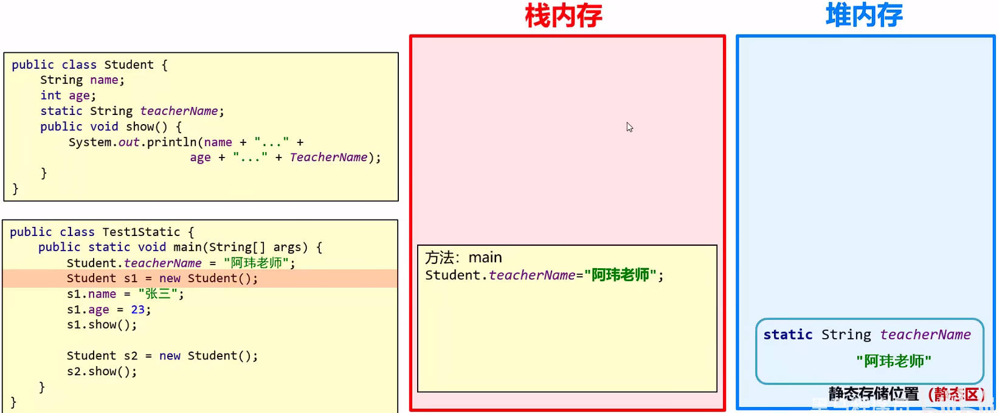
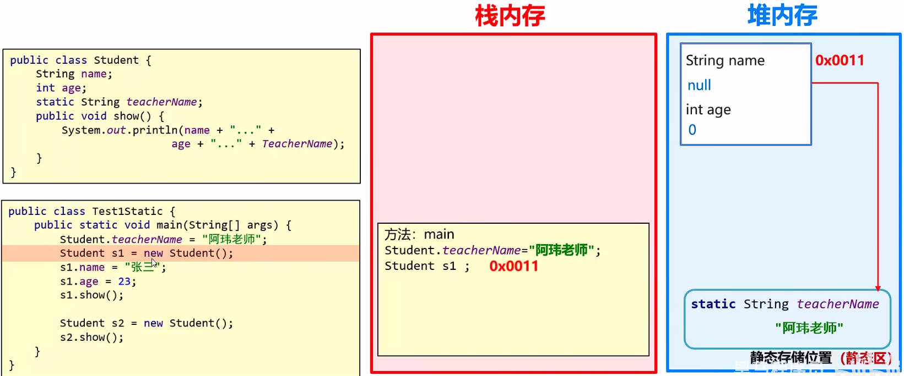
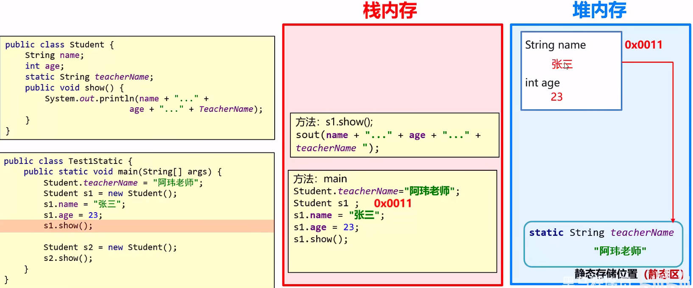

# 面向对象之 static

## 一、static 关键字

`static` 关键字，表示“静态”，是 Java 中的一个修饰符，可以修饰类中的成员方法，成员变量，代码块，内部类。

- 被 `static` 关键字修饰的成员变量，叫做**静态变量**。
- 被 `static` 关键字修饰的成员方法，叫做**静态方法**。

类中的静态变量，静态方法，可以被类的所有对象**共享**。使用方式有：

- 类名调用（推荐）。
- 对象名调用。

静态变量、静态方法等等类的静态成员，不属于对象，属于类。

它们随着类的加载而加载，优先于对象出现。

Java 中的静态方法，多用在测试类或工具类中；Javabean 类中很少用，如果使用，也是存在某种特殊的设计模式。

## 二、static 内存表现

现有如下 JavaBean 类：

```java
package com.kkcf.staticc;

public class Student {
    String name;
    int age;
    static String teacher;

    public void show() {
        System.out.println(name + " " + age + " " + teacher);;
    }
}
```

测试类：

```java
package com.kkcf.staticc;

public class Demo01 {
    public static void main(String[] args) {
        Student.teacher = "阿玮老师";

        Student s1 = new Student();
        s1.name = "zhagnsan";
        s1.age = 18;
        s1.show();

        Student s2 = new Student();
        s2.show();
    }
}
```

代码执行时，内存表现如下：

Ⅰ、程序启动，测试类中的 `main` 方法进栈，

Ⅱ、当使用 `Student` 类，获取其中的静态变量 `teacher` 时：

1. `Student` 类的字节码文件（.class），被加载到了**方法区**；
2. 并在**堆内存**当中，创建了一个单独存放静态变量的空间，称为”**静态区**“。
3. 在静态区中，存放了 `teacher` 静态变量。

> JDK8 以前，静态区，在**方法区**中；
>
> JDK8 及以后，静态区，在**堆内存**中。
>
> 静态方法，仍在方法区中字节码文件（.class）的缓存中。



静态变量、静态方法，是随着类的加载而加载的，优先于对象出现的。

所以，现在在内存当中，没有任何对象，只有类的静态变量、静态方法。

Ⅲ、创建 `Student` 类的对象，在堆内存中开辟一块空间，将这块空间的地址值，赋值给 `s1` 变量。

- 这块空间中，存放着类中的成员变量。
- 这块空间，可以访问静态区中对应的静态变量。



Ⅳ、使用 `s1` 调用 `show` 方法，`show` 方法入栈，并通过 `s1` 引用的对象，找到成员变量，静态变量。



## 三、static 与工具类

Java 中的静态方法，多用在**测试类**或**工具类**中；Javabean 类中很少用，如果使用，也是存在某种特殊的设计模式。

> 回顾：
>
> JavaBean 类，是用来描述一类事物的类。比如：Student、Teacher、Dog、Cat、……
>
> 测试类，用来检查其它类是否书写正确，带有 `main` 方法的类，`main` 方法是程序的入口。

工具类，是用来帮助我们做一些事情的类。它要求：

- **类名见名知意**，比如 `Math` 类，用来提供一些数学操作；`ArrUtil` 类，用来提供一些数组的操作。
- **私有化构造方法**，使得外界不能创建这个类的对象。因为工具类不描述事物，创建它的对象没有意义。
- **方法都定义为静态方法**，方便外界调用。

案例理解：在实际开发中，经常会遇到一些用于数组操作的工具类，请按照如下要求，编写一个数组的工具类 `ArrUtil`：

- 提供一个工具类方法 `printArr`，用于返回整数数组的内容。
- 提供一个工具类方法 `getAerage`，用于返回平均分。

demo-project/base-code/Day12/src/com/kkcf/staticc/ArrUtil.java

```java
package com.kkcf.staticc;

import java.util.StringJoiner;

public class ArrUtil {
    private ArrUtil() {}

    public static String printArr(int[] arr) {
        StringJoiner sj = new StringJoiner(", ", "[", "]");

        for (int j : arr) sj.add(String.valueOf(j));

        return sj.toString();
    }

    public static double getAerage(double[] arr) {
        double sum = 0;

        for (double v : arr) sum += v;

        return sum / arr.length;
    }
}
```

定义一个测试类，`TestDemo`，调用该工具类的工具方法，并返回结果。

demo-project/base-code/Day12/src/com/kkcf/staticc/TestDemo.java

```java
package com.kkcf.staticc;

public class TestDemo {
    public static void main(String[] args) {
        int[] arr1 = {1, 2, 3, 4, 5};
        String str = ArrUtil.printArr(arr1);
        System.out.println(str);

        double[] arr2 = {1.1, 2.2, 3.3, 4.4, 5.5};
        double average = ArrUtil.getAerage(arr2);
        System.out.println(average);
    }
}
```

案例理解：定义一个集合，用于存储 3 个学生对象。学生类的属性为：name，age，gender；

再定义一个工具类，用于获取集合中年龄最大的学生。

Student JavaBean 类。

demo-project/base-code/Day12/src/com/kkcf/staticc/Student.java

```java
package com.kkcf.staticc;

public class Student {
    private String name;
    private int age;
    private char gender;

    public Student() {
    }

    public Student(String name, int age, char gender) {
        this.name = name;
        this.age = age;
        this.gender = gender;
    }

    public String getName() {
        return name;
    }

    public void setName(String name) {
        this.name = name;
    }

    public int getAge() {
        return age;
    }

    public void setAge(int age) {
        this.age = age;
    }

    public char getGender() {
        return gender;
    }

    public void setGender(char gender) {
        this.gender = gender;
    }

    @Override
    public String toString() {
        return "Student{" +
                "name='" + name + '\'' +
                ", age=" + age +
                ", gender=" + gender +
                '}';
    }
}
```

StudentUtil 工具类：

demo-project/base-code/Day12/src/com/kkcf/staticc/StudentUtil.java

```java
package com.kkcf.staticc;

import java.util.ArrayList;

public class StudentUtil {
    private StudentUtil() {}

    public static int getMaxAgeStu(ArrayList<Student> list) {
        int maxAge = list.get(0).getAge();

        for (int i = 1; i < list.size(); i++) {
            int age = list.get(i).getAge();
            if (age > maxAge) maxAge = age;
        }

        return maxAge;
    }
}
```

测试类：

demo-project/base-code/Day12/src/com/kkcf/staticc/TestDemo.java

```java
package com.kkcf.staticc;

import java.util.ArrayList;

public class TestDemo02 {
    public static void main(String[] args) {
        ArrayList<Student> list = new ArrayList<>();

        list.add(new Student("张三", 18, '男'));
        list.add(new Student("李四", 19, '男'));
        list.add(new Student("王五", 20, '男'));

        int age = StudentUtil.getMaxAgeStu(list);
        System.out.println(age);
    }
}
```

## 四、static 注意事项

### 1.static 静态方法

类中的静态方法，有以下特点：

- 静态方法，只能访问静态变量、静态方法；
- 非静态方法，可以访问静态变量、静态方法，也可以访问成员变量、成员方法。
- 静态方法里，没有 `this` 关键字。

#### 1.从代码的角度分析

类中普通的成员方法调用，都有一个隐含的 `this` 来调用它，比如下方的 JavaBean 类 `Student`。

demo-project/base-code/Day12/src/com/kkcf/staticc/Student2.java

```java
package com.kkcf.staticc;

public class Student2 {
    String name;
    int age;
    static String teacher;

    // public void show() { // 等同于 👇
    public void show(Student2 this) {
        System.out.println(name + " " + age + " " + teacher);;

        // show2() // 等同于 👇
        this.show2();
    }


    public void show2(Student2 this) {
        System.out.println(name + " " + age + " " + teacher);;
    }
}
```

`Student2 this` 形参，是在调用方法时，JVM 虚拟机自动加上的，我们不能显示的传对应的实参。

demo-project/base-code/Day12/src/com/kkcf/staticc/Student2.java

```java
package com.kkcf.staticc;

public class Student2 {
    String name;
    int age;
    static String teacher;

    public void show(Student2 this) {
        System.out.println(name + " " + age + " " + teacher);;

        // 直接报错 👇
        this.show2(this);
    }


    public void show2(Student2 this) {
        System.out.println(name + " " + age + " " + teacher);;
    }
}
```

#### 2.从内存的角度分析

静态变量，静态方法等等静态成员，不属于对象，属于类。随着类的加载而加载，加载时机优先于对象。

只要没有创建对象，非静态的数据，就不会出现在内存当中。所以：

- 静态方法，可以访问静态变量、静态方法。
- 非静态方法（成员方法），也可以访问静态变量、静态方法。
- 静态方法，不能访问成员变量、成员方法。

## 五、static 修饰的 main 方法

现在，我们可以重新认识测试类中的 `main` 方法。现有如下代码：

```java
package com.kkcf.staticc;

public class Test01 {
    public static void main(String[] args) {
        System.out.println("Hello Frog");
    }
}
```

- `public` 修饰的 `main` 方法被 JVM 虚拟机调用，访问权限要足够大；
- `static` 修饰的 `main` 方法被 JVM 虚拟机调用，应是静态方法，不用创建对象，直接用类名访问。
  - 因为 `main` 方法是静态的，所以 `main` 方法中调用的其它方法，也必须是静态的。
- `void` 类型返回值，表示 `main` 方法被 JVM 虚拟机调用，不需要给 JVM 虚拟机返回值。
- `main`，一个通用的名称，虽然不是关键字，但是会**被 JVM 虚拟机识别**。
- `String[] args`，早期用于接收键盘录入数据，现在已不用，但是为了保持向下兼容，依然保留作为 `main` 方法的参数。
