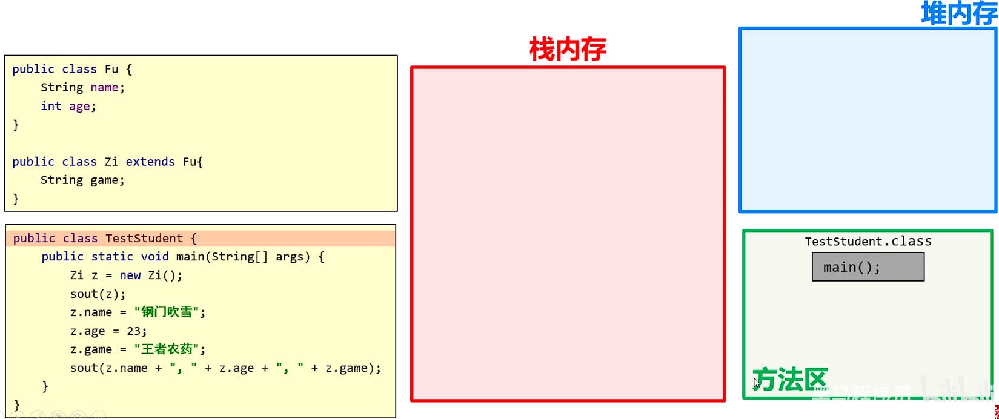
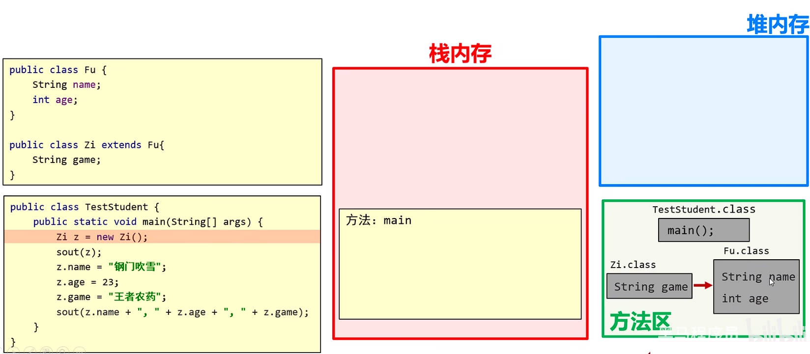
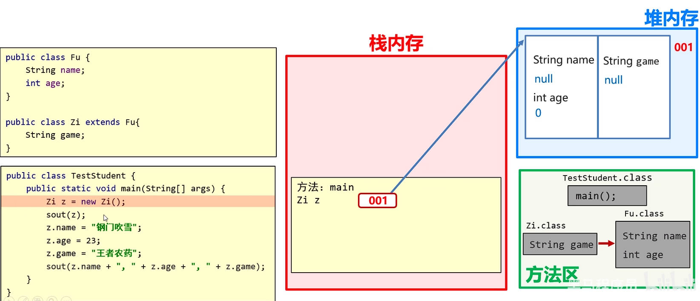
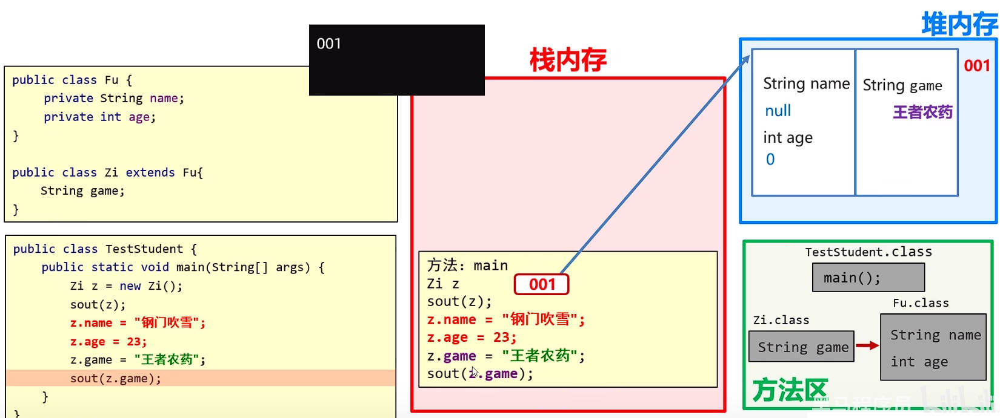
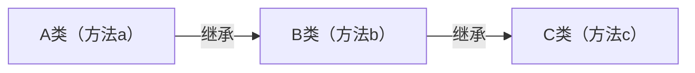
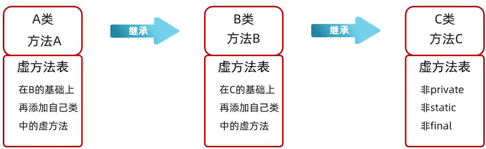
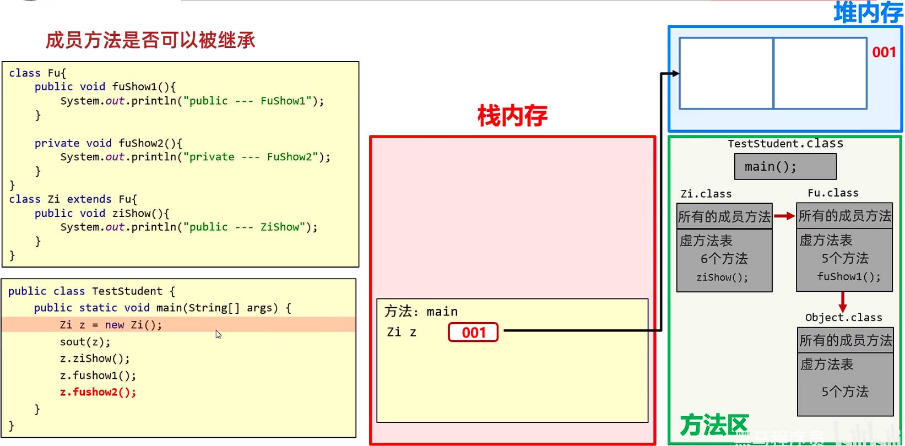
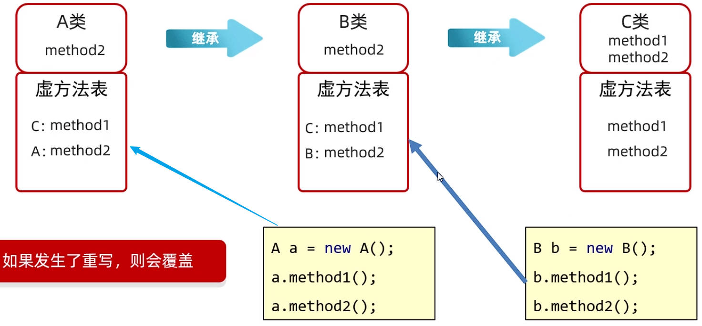

# 面向对象-继承

继承，是面向对象三大特征之一。

Java 中提供一个关键字 `extend`，用它可以让一个类和另一个类，建立起继承关系。格式为：`public class 子类 extends 父类 {}`；比如：`public class Student extends Person {}`，其中：

- `Student` 称为子类（或派生类）
- `Person` 称为父类（或基类、超类）。

Java 继承，可用于：

- 抽取多个类中共有的属性，方法，提高代码的复用性。
- 子类可以在父类的基础上，增加其它的功能，使子类更加强大。

在 Java 继承中，我们要掌握：1.自己设计继承结构；2.使用别人写好的继承结构。

## 一、Java 继承结构设计

### 1.Java 继承结构设计原则

当类与类之间，满足以下两种情况，才考虑使用继承：

- 存在相同（共性）的内容，
- 并满足子类是父类中的一种，

### 2.Java 继承结构设计技巧

画图法：从下到上，画图分析，抽取下层中的共性内容到上层。

代码书写：从上到下：先写上层的父类，再写下层的子类。

## 二、Java 继承特点

Java 只支持单继承，不支持多继承，但支持多层继承。

- 单继承：一个子类，只能继承一个父类。
- 多层继承，存在子类，直接父类，间接父类的关系。

在 Java 中，每一个类，都直接或间接的继承自 `Object` 类。

> 当定义一个类时，如果这个类没有继承自任何类，那么 JVM 虚拟机在加载这个类时，会为它默认继承 `Object` 类。

案例理解：现有四种动物，布偶猫、中国狸花猫、哈士奇、泰迪。

暂时不考虑属性，只考虑行为。请按照继承的思想特点，进行继承体系的设计。

- 布偶猫：吃饭、喝水、抓老鼠；
- 中国狸花猫：吃饭、喝水、抓老鼠；
- 哈士奇：吃饭、喝水、看家、拆家；
- 泰迪：吃饭、喝水、看家、蹭一蹭。

创建动物类 `Animal`

demo-project/base-code/Day12/src/com/kkcf/extendss/Animal.java

```java
package com.kkcf.extendss;

public class Animal {
    public void eat() {
        System.out.println("动物吃食物");
    }


    public void drink() {
        System.out.println("动物喝水");
    }
}
```

创建猫类 `Cat`

demo-project/base-code/Day12/src/com/kkcf/extendss/Cat.java

```java
package com.kkcf.extendss;

public class Cat extends Animal {
    public void catchmice() {
        System.out.println("猫在抓老鼠");
    }
}
```

创建狗类 `Dog`

demo-project/base-code/Day12/src/com/kkcf/extendss/Dog.java

```java
package com.kkcf.extendss;

public class Dog extends Animal {
    public void houseKeeping() {
        System.out.println("狗在看家");
    }
}
```

创建布偶猫类 `CatPlus`

demo-project/base-code/Day12/src/com/kkcf/extendss/CatPlus.java

```java
package com.kkcf.extendss;

public class CatPlus extends Cat{
}
```

创建狸花猫类 `LiHua`

demo-project/base-code/Day12/src/com/kkcf/extendss/LiHua.java

```java
package com.kkcf.extendss;

public class LiHua extends Cat{
}
```

创建哈士奇类 `Husky`

demo-project/base-code/Day12/src/com/kkcf/extendss/Husky.java

```java
package com.kkcf.extendss;

public class Husky extends Dog {
    public void breakHouse() {
        System.out.println("哈士奇在拆家");
    }
}
```

创建泰迪类 `Teddy`

demo-project/base-code/Day12/src/com/kkcf/extendss/Teddy.java

```java
package com.kkcf.extendss;

public class Teddy extends Dog {
    public void rub() {
        System.out.println("泰迪在蹭一蹭");
    }
}
```

创建测试类，进行测试：

demo-project/base-code/Day12/src/com/kkcf/extendss/Test.java

```java
package com.kkcf.extendss;

public class Test {
    public static void main(String[] args) {
        // 创建布偶猫对象
        CatPlus cp = new CatPlus();
        cp.eat(); // 动物吃食物
        cp.drink(); //动物喝水
        cp.catchmice(); // 猫在抓老鼠

        // 创建哈士奇对象
        Husky husky = new Husky();
        husky.eat(); // 动物吃食物
        husky.drink(); // 动物喝水
        husky.breakHouse(); // 哈士奇在拆家
        husky.houseKeeping(); // 狗在看家
    }
}
```

> 子类只能访问父类中非私有（private）的成员。

## 三、Java 继承的内存表现

Java 继承中，存在以下误区：

- 父类私有的东西，子类就无法继承；
- 父类中非私有的成员，都被子类继承下来了。

我们知道，一个类中的成员，主要有三部分组成：

- 构造方法；
- 成员变量；
- 成员方法。

子类可以继承父类的哪些部分：

| 成员     | 非私有             | 私有                          |
| -------- | ------------------ | ----------------------------- |
| 构造方法 | 不能               | 不能                          |
| 成员变量 | public（能）       | private（能，但不能直接使用） |
| 成员方法 | 在虚方法表中（能） | 不在虚方法表中（不能）        |

现有如下 Java 类代码，用于理解继承的内存表现：

### 1.成员变量的继承

父类：

demo-project/base-code/Day12/src/com/kkcf/extendss/Fu.java

```java
package com.kkcf.extendss;

public class Fu {
    String name;
    int age;
}
```

子类：

demo-project/base-code/Day12/src/com/kkcf/extendss/Zi.java

```java
package com.kkcf.extendss;

public class Zi extends Fu {
    String game;
}
```

测试类：

demo-project/base-code/Day12/src/com/kkcf/extendss/TestStudent.java

```java
package com.kkcf.extendss;

public class TestStudent {
    public static void main(String[] args) {
        Zi z = new Zi();
        System.out.println(z);

        z.name = "钢门吹雪";
        z.age = 23;
        z.game = "王者农药";

        System.out.println(z.name + " " + z.age + " " + z.game);
    }
}
```

代码执行的内存表现图如下：

Ⅰ、测试类 `TestStudent` 执行，该类的字节码文件（.class）被加载到方法区。



Ⅱ、执行 `main` 方法，`main` 方法进栈。

- 其中有 `Zi` 类，将 `Zi` 类的字节码文件（.class）加载到方法区；
- 又因为 `Zi` 类继承自 `Fu` 类，再将 `Fu` 类的字节码文件（.class）加载到方法区中；
- 又因为 `Fu` 类在加载时，JVM 会为它隐式的继承 `Object` 类，方法区中还会加载 `Object` 类的字节码文件（.class）。



> 事实上，JVM 虚拟机会先加载父类的字节码文件（.class），再加载子类的。

Ⅲ、`new` 操作符创建 `Zi` 类的对象，会在堆内存中开辟一块空间；因为现在 `Zi` 类继承自 `Fu` 类，所以该空间会分为两部分：

- 一部分记录父类的成员变量，
- 一部分记录子类的成员变量。



Ⅳ、给 `z.name`，`z.age`，`z.game` 赋值，

- 先找引用指向的堆内存地址中，子类区域有没有对应的成员变量；
- 如果没有，再找引用指向的堆内存地址中，父类区域有没有对应的成员变量。


总结：继承的内存表现与非继承的内存变现的区别：

- 加载字节码文件（.class）的时候，会把父类的字节码文件（.class）一起加载过来。
- 在堆内存中开辟空间时，会有两部分：子类的成员变量空间，和父类的成员变量空间。

如果 `Fu` 类中的成员变量，使用 `private` 修饰，那么 `Zi` 类会继承这些成员变量，但不能直接使用。

所以，下方代码在给 `z.name`，`z.age` 赋值时，无法赋值。



### 2.成员方法的继承

现在有如下继承关系：



C 类是最上层的父类，它其中满足以下条件的方法，会被放入一个“**虚方法表**”

- 满足非 `private` 修饰；
- 满足非 `static` 修饰；
- 满足非 `final` 修饰。

在继承的时候，

1. C 类会将它的虚方法表，交给 B 类；
2. B 类在 C 类的虚方法表基础上，添加自己的虚方法表；
3. 依此类推……



有了虚方法表，程序的性能，就会大大提高（后面介绍的方法重写的关键，也在虚方法表中）。

所以，使用 A 类创建的对象，调用方法 c 时，就能在 A 类自己的虚方法表中，直接找到方法 c。

总结：只有父类虚方法表中的方法，才能被子类继承。

现有如下代码：

父类：

demo-project/base-code/Day12/src/com/kkcf/extendss/Fu.java

```java
package com.kkcf.extendss;

public class Fu {
    public void fuShow1() {
        System.out.println("publicc--------fuShow1");
    }

    private void fuShow2() {
        System.out.println("publicc--------fuShow2");
    }
}
```

子类：

demo-project/base-code/Day12/src/com/kkcf/extendss/Zi.java

```java
package com.kkcf.extendss;

public class Zi extends Fu {
    public void ziShow() {
        System.out.println("public-------ziShow");
    }
}
```

测试类：

demo-project/base-code/Day12/src/com/kkcf/extendss/TestStudent.java

```java
package com.kkcf.extendss;

public class TestStudent {
    public static void main(String[] args) {
        Zi z = new Zi();

        System.out.println(z);

        z.ziShow();
        z.fuShow1();
        // 报错 👇
        z.fuShow2();
    }
}
```

上方代码的内存表现如下图所示：

Ⅰ、执行测试类的 `main` 方法中，会先加载 `Zi` 类的字节码文件（.class），这会连同它的父类和虚方法表一起加载到方法区。



> `Object` 类，有 5 个虚方法。

Ⅱ、当 `Zi` 类对象，调用 `ziShow`，`fuShow1` 方法时，会去自己的虚方法表中查找，找到了就会直接调用；

当 `Zi` 类对象，调用 `fushow2` 方法时，子类在自己虚方法表中没有找到，就会去父类中查找，发现该方法是 `private` 修饰的，所以会报错不能被调用。

## 四、Java 继承的成员变量

Java 继承中的成员变量访问特点，依然遵循**就近原则**。

### 1.访问成员变量的就近原则

成员变量访问的就近原则指的是：

1. 先在局部位置找；
2. 如果没有找到。再到本类成员位置找；
3. 如果没有找到。再到父类成员位置找；
4. 逐级往上……。

现有如下代码：

父类：

demo-project/base-code/Day12/src/com/kkcf/extendss/Fu.java

```java
package com.kkcf.extendss;

public class Fu {
    String name = "Fu";
}
```

子类：

demo-project/base-code/Day12/src/com/kkcf/extendss/Zi.java

```java
package com.kkcf.extendss;

public class Zi extends Fu {
    String name = "zi";

    public void ziShow() {
        String name = "ziShow";
        System.out.println(name); // ziShow
        System.out.println(this.name); // zi
        System.out.println(super.name); // Fu
    }
}
```

- 子类中，只能使用 1 个 `super`，即只能访问直接父类中的成员变量。

测试类：

demo-project/base-code/Day12/src/com/kkcf/extendss/TestStudent.java

```java
package com.kkcf.extendss;

public class TestStudent {
    public static void main(String[] args) {
        Zi z = new Zi();

        z.ziShow();
    }
}
```

就近原则案例理解：

测试类：

demo-project/base-code/Day12/src/com/kkcf/extendss/Test2.java

```java
package com.kkcf.extendss;

public class Test2 {
    public static void main(String[] args) {
        Zii zii = new Zii();
        zii.show();
    }
}

class Fuu {
    String name = "Fu";
    String hobby = "喝茶";
}

class Zii extends Fuu {
    String name = "Zi";
    String game = "吃鸡";

    public void show() {
        // 打印 Zi 的方式
        System.out.println(name); // Zi
        System.out.println(this.name); // Zi

        // 打印 Fu 的方式
        System.out.println(super.name); // Fu

        // 打印喝茶的方式
        System.out.println(hobby); // 喝茶
        System.out.println(this.hobby); // 喝茶
        System.out.println(super.hobby); // 喝茶

        // 打印吃鸡
        System.out.println(game); // 吃鸡
        System.out.println(this.game);; // 吃鸡
    }
}
```

## 五、Java 继承的成员方法

### 1.访问成员方法的就近原则

Java 继承中的成员方法的访问，同样也遵循**就近原则**；同时也可以使用 `super` 关键字，直接访问父类。

理解下方代码：

demo-project/base-code/Day12/src/com/kkcf/extendss/Test3.java

```java
package com.kkcf.extendss;

public class Test3 {
    public static void main(String[] args) {
        Student s = new Student();

        s.lunch();;
    }
}

class Person {
    public void eat() {
        System.out.println("吃饭");
    }

    public void drink() {
        System.out.println("喝水");
    }
}

class Student extends Person {
    public void lunch() {
        eat();
        drink();

        // 等同于 👇
      
        this.eat();
        this.drink();

        // 等同于 👇
      
        super.eat();
        super.drink();
    }
}
```

Java 继承成员方法的访问特点：

- `this` 调用：就近原则（先在本类找，找不到再到父类中找）；
- `super` 调用：直接找父类的方法。

### 2.方法的重写

下面的代码，是一个方法重写的案例。

demo-project/base-code/Day12/src/com/kkcf/extendss/Test3.java

```java
package com.kkcf.extendss;

public class Test3 {
    public static void main(String[] args) {
        OverseasStudent s = new OverseasStudent();

        s.lunch();
    }
}

class Person {
    public void eat() {
        System.out.println("吃米饭，吃菜");
    }

    public void drink() {
        System.out.println("喝开水");
    }
}

class OverseasStudent extends Person {
    public void eat() {
        System.out.println("吃意大利面");
    }

    public void drink() {
        System.out.println("喝凉水 ");
    }

    public void lunch() {
        eat(); // 吃意大利面
        drink(); // 喝凉水

        super.eat(); // 吃米饭，吃菜
        super.drink(); // 喝开水
    }
}
```

在继承体系中，子类中出现了和父类**一模一样**的方法声明，我们就称子类的这个方法是**重写**的方法。

#### 1.方法重写的设计原则

当父类的方法，不能满足子类的需求时，就要进行方法的重写。

#### 2.方法重写的实现

`@Override` 方法重写注解，是放在重写方法上的：

- 用于 JVM 虚拟机校验子类重写的方法的语法是否正确；加上该注解后，如果有红色波浪线，表示语法错误。
- 建议所有重写的方法，都加上该注解，这样代码更加安全，优雅。

使用 `@Override` 注解，重构上面的代码：

demo-project/base-code/Day12/src/com/kkcf/extendss/Test3.java

```java
package com.kkcf.extendss;

public class Test3 {
    public static void main(String[] args) {
        OverseasStudent s = new OverseasStudent();

        s.lunch();
    }
}

class Person {
    public void eat() {
        System.out.println("吃米饭，吃菜");
    }

    public void drink() {
        System.out.println("喝开水");
    }
}

class OverseasStudent extends Person {
    @Override
    public void eat() {
        System.out.println("吃意大利面");
    }

    @Override
    public void drink() {
        System.out.println("喝凉水 ");
    }

    public void lunch() {
        eat(); // 吃意大利面
        drink(); // 喝凉水

        super.eat(); // 吃米饭，吃菜
        super.drink(); // 喝开水
    }
}
```

#### 3.方法重写的本质

方法的重写，本质上，就是覆盖了子类从父类继承下来的虚方法表中的方法。



#### 4.方法重写的注意事项

- 只有被添加到**虚方法表**中的方法，才能被重写。
- 子类重写的**方法名称**、**形参列表**必须与父类中的方法保持一致。
- 子类重写的方法，访问权限必须大于等于父类被重写的方法（权限修饰符：`private` < `空着不写` < `protected` < `public`）。
- 子类重写的方法，返回值数据类型必须小于等于父类被重写的方法。

案例理解：现在有三种动物：哈士奇、沙皮狗、中华田园犬

暂时不考虑属性，只考虑行为，请按照继承思想特点，进行继承体系设计。

- 哈士奇：吃饭（吃狗粮）、喝水、看家、拆家；
- 沙皮狗：吃饭（吃狗粮、吃骨头）、喝水、看家；
- 中华田园犬：吃饭（吃剩饭）、喝水、看家；

狗类：

demo-project/base-code/Day12/src/com/kkcf/extendss/Dog1.java

```java
package com.kkcf.extendss;

public class Dog1 {
    public void eat() {
        System.out.println("吃狗粮");
    }

    public void keepHouse() {
        System.out.println("狗在看家");
    }

    public void drink() {
        System.out.println("狗在喝水");
    }
}
```

哈士奇类：

demo-project/base-code/Day12/src/com/kkcf/extendss/Husky1.java

```java
package com.kkcf.extendss;

public class Husky1 extends Dog1 {
    public void breakHouse() {
        System.out.println("狗在拆家");
    }
}
```

沙皮狗类

demo-project/base-code/Day12/src/com/kkcf/extendss/SharPai.java

```java
package com.kkcf.extendss;

public class SharPai extends Dog1{
    // 父类方法，不能满足子类方法需求
    @Override
    public void eat() {
        super.eat();
        System.out.println("狗在吃狗粮，吃骨头");
    }
}
```

中华田园犬类

demo-project/base-code/Day12/src/com/kkcf/extendss/ChineseDog.java

```java
package com.kkcf.extendss;

public class ChineseDog extends Dog1{
    @Override
    public void eat() {
        // 因为用不到父类方法中的代码，所以不需要使用 super 进行嗲用
        System.out.println("狗在吃剩菜");
    }
}
```

## 六、Java 类不继承构造方法

在 Java 中，首先要明确，父类中的构造方法，不会被子类继承。

### 1.子类构造方法中调用父类构造方法

#### 1.调用空参构造方法

子类中所有的构造方法，默认会先执行父类方法中的空参构造方法，再执行自己。

- 一个类执行空参构造方法，实际上是在给类中的成员变量，进行**默认初始化**。
- 如果子类中的构造方法，不执行父类中的空参构造方法，那么子类继承下来的成员变量就没有默认值。

所以，子类构造方法的第一行语句，默认都是 `super()`（如果不写，在执行该构造方法时虚拟机会自动加上），而且必须在第一行。

#### 2.调用有参构造方法

在子类的构造方法中，如果要调用父类的有参构造方法，必须手动显示的调用。

现有如下代码：

父类 Person2：

demo-project/base-code/Day12/src/com/kkcf/extendss/Person2.java

```java
package com.kkcf.extendss;

public class Person2 {
    String name;
    int age;

    public Person2() {
        System.out.println("Person2 constructor");
    }

    public Person2(String name, int age) {
        this.name = name;
        this.age = age;
    }
}
```

学生类 Student2：

demo-project/base-code/Day12/src/com/kkcf/extendss/Student2.java

```java
package com.kkcf.extendss;

public class Student2 extends Person2 {
    public Student2() {
        System.out.println("Student2 constructor");
    }

    public Student2(String name, int age) {
        super(name, age);
    }
}
```

测试类：

demo-project/base-code/Day12/src/com/kkcf/extendss/Test4.java

```java
package com.kkcf.extendss;

public class Test4 {
    public static void main(String[] args) {
        Student2 s = new Student2();
        // Person2 constructor
        // Student2 constructor

        Student2 s2 = new Student2("zhangsan", 23);
    }
}
```

### 2.子类构造方法中调用子类构造方法

`this(...)` 的使用，表示调用本类的其它构造方法，常用于赋默认值。

- `this(...)` 会调用子类其它构造方法，如果这其中没有手动调用 `super(...)`，虚拟机在执行时，会默认在第一行加上 `super()`。所以在使用 `this(...)` 的构造方法中，虚拟机不会再在第一行默认调用 `super()`。
- `this(...)` 同样也要写在构造方法的第一行。

理解下方代码：

学生类：

demo-project/base-code/Day12/src/com/kkcf/extendss/Student2.java

```java
package com.kkcf.extendss;

public class Student2 extends Person2 {
    private String schoole;

    public Student2() {
        this(null, 0, null);
        System.out.println("Student2 constructor");
    }

    public Student2(String name, int age, String schoole) {
        super(name, age);
        this.schoole = schoole;
    }
}
```

## 七、this、super 关键字使用总结

| 关键字 | 访问成员变量                             | 访问成员方法                                  | 访问构造方法                         |
| ------ | ---------------------------------------- | --------------------------------------------- | ------------------------------------ |
| this   | `this.成员变量`，表示访问本类的成员变量  | `this.成员方法(...)`，表示访问本类的成员方法  | `this(...)`，表示访问本类的构造方法  |
| super  | `super.成员变量`，表示访问父类的成员变量 | `super.成员方法(...)`，表示访问父类的成员方法 | `super(...)`，表示访问父类的构造方法 |

案例理解：设计带有继承结构的标准 JavaBean 类：

1.经理类：Manager

- 成员变量：工号，姓名，工资，管理奖金。
- 成员方法：工作（管理其他人），吃饭（吃米饭）。

2.厨师类 Cooker

- 成员变量：工号，姓名，工资。
- 成员方法;：工作（炒菜），吃饭（吃米饭）

员工类：

demo-project/base-code/Day12/src/com/kkcf/extendss/Employee.java

```java
package com.kkcf.extendss;

public class Employee {
    private String workNo;
    private String name;
    private double salary;

    public Employee() {
    }

    public Employee(String workNo, String name, double salary) {
        this.workNo = workNo;
        this.name = name;
        this.salary = salary;
    }

    public String getWorkNo() {
        return workNo;
    }

    public void setWorkNo(String workNo) {
        this.workNo = workNo;
    }

    public String getName() {
        return name;
    }

    public void setName(String name) {
        this.name = name;
    }

    public double getSalary() {
        return salary;
    }

    public void setSalary(double salary) {
        this.salary = salary;
    }
  
    // 成员方法
    public void work() {
        System.out.println("员工在工作");
    }

    public void eat() {
        System.out.println("员工在吃米饭");
    }
}
```

经理类：

demo-project/base-code/Day12/src/com/kkcf/extendss/Manager.java

```java
package com.kkcf.extendss;

public class Manager extends Employee {
    private double managementBonus;

    public Manager() {
    }

    public Manager(String workNo, String name, double salary, double managementBonus) {
        super(workNo, name, salary);
        this.managementBonus = managementBonus;
    }

    public double getManagementBonus() {
        return managementBonus;
    }

    public void setManagementBonus(double managementBonus) {
        this.managementBonus = managementBonus;
    }

    @Override
    public void work() {
        System.out.println("管理其他人");
    }
}
```

厨师类：

demo-project/base-code/Day12/src/com/kkcf/extendss/Cook.java

```java
package com.kkcf.extendss;

public class Cook extends Employee{
    public Cook() {
    }

    public Cook(String workNo, String name, double salary) {
        super(workNo, name, salary);
    }

    @Override
    public void work() {
        System.out.println("厨师在炒菜");
    }
}
```

测试类：

demo-project/base-code/Day12/src/com/kkcf/extendss/Test5.java

```java
package com.kkcf.extendss;

public class Test5 {
    public static void main(String[] args) {
        Manager m = new Manager("1", "张三", 16000, 8000);
        System.out.println(m.getName() + " " + m.getWorkNo() + " " + m.getSalary() + " " + m.getManagementBonus());
        m.eat();
        m.work();

        Cook c = new Cook();
        c.setWorkNo("2");
        c.setName("李四");
        c.setSalary(10000);
        System.out.println(c.getName() + " " + c.getWorkNo() + " " + c.getSalary());
        c.eat();
        c.work();
    }
}
```
