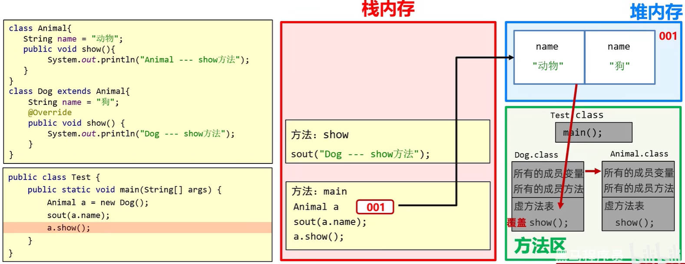

# Java 面向对象之-多态

多态，是面向对象的三大特性之一。

- 有了封装，才有了面向对象，有了面向对象，才有了继承、多态。
- 继承，又是多态的前提条件（没有继承，就没有多态）。

## 一、Java 多态的概念

多态，就是同类型的对象，表现出的不同形态。

多态的表现形式为：`父类类型 对象名 = 子类对象;`

多态的条件：

- 有继承，或实现（与接口有关）关系；
- 有父类引用指向子类对象；比如：`Fu f = new Zi();`
- 有方法的重写。

理解下方代码：

人类：

demo-project/base-code/Day13-14/src/com/kkcf/a01polymorphismdemo1/Person.java

```java
package com.kkcf.a01polymorphismdemo1;

public class Person {
    private String name;
    private int age;

    public Person() {
    }

    public Person(String name, int age) {
        this.name = name;
        this.age = age;
    }

    public String getName() {
        return name;
    }

    public void setName(String name) {
        this.name = name;
    }

    public int getAge() {
        return age;
    }

    public void setAge(int age) {
        this.age = age;
    }

    public void show() {
        System.out.println(name + ", " + age);
    }
}
```

学生类，继承自人类：

demo-project/base-code/Day13-14/src/com/kkcf/a01polymorphismdemo1/Student.java

```java
package com.kkcf.a01polymorphismdemo1;

public class Student extends Person {
    public Student() {
    }

    public Student(String name, int age) {
        super(name, age);
    }

    @Override
    public void show() {
        System.out.println("学生的信息为：" + getName() + "，" + getAge());
    }
}
```

老师类，继承自人类

demo-project/base-code/Day13-14/src/com/kkcf/a01polymorphismdemo1/Teacher.java

```java
package com.kkcf.a01polymorphismdemo1;

public class Teacher extends Person {
    public Teacher() {
    }

    public Teacher(String name, int age) {
        super(name, age);
    }

    @Override
    public void show() {
        System.out.println("老师的信息为：" + getName() + "，" + getAge());
    }
}
```

管理员类继承自人类

demo-project/base-code/Day13-14/src/com/kkcf/a01polymorphismdemo1/Administator.java

```java
package com.kkcf.a01polymorphismdemo1;

public class Administator extends Person {
    public Administator() {
    }

    public Administator(String name, int age) {
        super(name, age);
    }

    @Override
    public void show() {
        System.out.println("管理员的信息为：" + getName() + " " + getAge());;
    }
}
```

测试类，用于测试多态：

demo-project/base-code/Day13-14/src/com/kkcf/a01polymorphismdemo1/Test.java

```java
package com.kkcf.a01polymorphismdemo1;

public class Test {
    public static void main(String[] args) {
        Teacher t = new Teacher("易爱平", 55);;
        Student s = new Student("张三", 20);
        Administator a = new Administator("李四", 40);

        register(t); // 老师的信息为：易爱平，30
        register(s); // 学生的信息为：张三，20
        register(a); // 管理员的信息为：李四 40
    }

    public static void register(Person p) {
        p.show();
    }
}
```

- 使用父类类型作为参数，可以接收所有子类对象。体现了多态的扩展性与便利。

## 二、Java 多态的特点

在 Java 中，使用多态的特性，访问成员变量、调用成员方法，分别有如下的特性：

特性一：访问成员变量：**编译看左边，运行也看左边**。

- 编译看左边：`javac` 工具在编译 .java 文件中的代码的时候，会检查变量声明语句中，左边的父类里，有没有这个要访问的变量；如果有，编译成功；如果没有，编译失败。
- 运行也看左边：`java` 工具运行编译好的字节码文件（.class）时，实际获取的就是子类对象中，继承下来的父类中的成员变量的值。

特性二：调用成员方法：**编译看左边，运行看右边**。

- 编译看左边：`javac` 工具在编译 .java 文件中的代码的时候，会检查变量声明语句中，左边的父类里，有没有这个要调用的成员方法；如果有，编译成功；如果没有，编译失败；
- 运行看右边：`java` 工具运行编译好的字节码文件（.class）时，实际调用的就是子类虚方法表中的成员方法。

理解上面的规律：

子类会继承父类中的所有成员变量。

- 如果用父类型的变量，访问子类中的成员变量，那么访问的就是子类继承下来的父类中的成员变量。

子类对象会在虚方法表中调用继承下来的成员方法。

- 如果用父类型的变量，调用子类中的成员方法，那么调用的就是子类虚方法表中重写的成员方法。

上方代码的内存表现，如下图所示：



> JVM 虚拟机在加载字节码文件到方法区时，永远是先加载父类的字节码文件。

## 三、Java 多态的优势

优势一：在多态的形式下，右边的对象可以实现解耦合，便于扩展和维护。

```java
Person p = new Student();

p.work(); // 业务逻辑改变时，代码无需修改。
```

优势二：定义方法的时候，使用父类类型作为参数，可以接收所有子类对象。体现了多态的扩展性与便利。

## 四、Java 多态的弊端

多态的弊端，就是不能调用子类中的特有方法（非继承，或重写的方法）。

多态中，调用成员方法：遵循“编译看左边，运行看右边”的规则。

- 在编译时，左边的父类，没有子类特有的成员方法，所以会直接报错。

理解下方代码：

demo-project/base-code/Day13-14/src/com/kkcf/a03polymorphismdemo3/Test.java

```java
package com.kkcf.a03polymorphismdemo3;

public class Test {
    public static void main(String[] args) {
        Animal a = new Dog();

        // 直接报错 👇
        a.lookHome();
    }
}

class Animal {
    String name = "动物";

    public void eat() {
        System.out.println("动物吃东西");
    }
}

class Dog extends Animal {
    String name = "狗";

    @Override
    public void eat() {
        System.out.println("狗吃骨头");
    }

    public void lookHome() {
        System.out.println("狗看家");
    }
}
```

### 1.多态弊端的解决方案

对于上述多态的弊端，解决方案是：强制转换父类类型为实际创建的子类类型。

- 使用 `instanceof` 操作符，用于判断要强制转换的对象，是否是要强制转换的类的实例对象。

demo-project/base-code/Day13-14/src/com/kkcf/a03polymorphismdemo3/Test.java

```java
public class Test {
    public static void main(String[] args) {
        Animal a = new Dog();

        // 直接报错 👇
        // a.lookHome();

        // 解决方案
        if (a instanceof Dog) {
            Dog d = (Dog) a;
            d.lookHome();
        } else if (a instanceof Cat) {
            Cat c = (Cat) a;
            c.catchMice();
        } else {
            System.out.println("没有这个类型，无法检测");
        }
    }
}
```

### 2.instanceof 操作符新特性

JDK14 中，使用 `instanceof` 操作符，有一个新特性，比如下方代码：

```java
if (a instanceof Dog d) {
    d.lookHome();
}
```

- `instanceof` 所在的表达式中，判断了 `a` 是否为 `Dog` 类型：
  - 如果是，则将 `a` 强转成 `Dog` 类型，再赋值给变量 `d`；
  - 如果不是，则直接返回 `false`。

重构上方的代码：

demo-project/base-code/Day13-14/src/com/kkcf/a03polymorphismdemo3/Test.java

```java
public class Test {
    public static void main(String[] args) {
        Animal a = new Dog();

        if (a instanceof Dog d) {
            d.lookHome();
        } else if (a instanceof Cat c) {
            c.catchMice();
        } else {
            System.out.println("没有这个类型，无法检测");
        }
    }
}
```

总结：

- Java 中的多态，本身是一种自动类型提升（隐式转换），既取值范围小的类型，转为取值范围大的类型。
- Java 中的多态，在调用子类特有的方法时，要进行强制类型转换。
  - 这个过程，对象转换类型，与对象真实类型，可能会出现不一致的情况，导致报错。
  - 所以，为避免错误，转换时要用 `instanceof` 操作符进行判断。

## 五、Java 多态练习

案例理解：需求：根据需求完成代码:

1.定义狗类：

- 属性：年龄，颜色
- 行为：`eat(String something)`，something 表示吃的东西；`lookHome` 方法，表示看家（无参数）

2.定义猫类

- 属性：年龄，颜色
- 行为：`eat(String something)`，方法；something 表示吃的东西；`catchMouse` 方法（无参数），表示逮老鼠；

3.定义 Person 类，表示饲养员

- 属性：姓名，年龄
- 行为：`keepPet(Dog dog, String something)` 方法，功能：喂养宠物狗，something 表示喂养的东西；
- 行为：`keepPet(Cat cat, String something)` 方法，功能：喂养宠物猫，something 表示喂养的东西。
- 生成空参有参构造，setter 和 getter 方法

4.定义测试类，完成以下打印效果:

- `keepPet(Dog dog, String somethind)` 方法打印内容如下：
  - 年龄为30岁的老王养了一只黑颜色的2岁的狗
  - 2岁的黑颜色的狗两只前腿死死的抱住骨头猛吃
- `keepPet(Cat cat, String somethind)` 方法打印内容如下：
  - 年龄为25岁的老李养了一只灰颜色的3岁的猫
  - 3岁的灰颜色的猫眯着眼睛侧着头吃鱼

5.思考:

- 1.`Dog`和 `Cat` 都是 `Animal` 的子类，以上案例中针对不同的动物，定义了不同的 `keepPet` 方法，过于繁琐，能否简化，并体会简化后的好处？
- 2.`Dog` 和 `Cat` 虽然都是 `Animal` 的子类，但是都有其特有方法，能否想办法在 `keepPet` 中调用特有方法？

动物类：

demo-project/base-code/Day13-14/src/com/kkcf/a04polymorphismdemo4/Animal.java

```java
package com.kkcf.a04polymorphismdemo4;

public class Animal {
    private int age;
    private String color;

    public Animal() {
    }

    public Animal(int age, String color) {
        this.age = age;
        this.color = color;
    }

    public int getAge() {
        return age;
    }

    public void setAge(int age) {
        this.age = age;
    }

    public String getColor() {
        return color;
    }

    public void setColor(String color) {
        this.color = color;
    }

    // 成员方法
    public void eat(String something) {
        System.out.println("动物在吃" + something);;
    }
}
```

狗类：

demo-project/base-code/Day13-14/src/com/kkcf/a04polymorphismdemo4/Dog.java

```java
package com.kkcf.a04polymorphismdemo4;

public class Dog extends Animal {
    public Dog() {
    }

    public Dog(int age, String color) {
        super(age, color);
    }

    @Override
    public void eat(String something) {
        System.out.println(getAge() + "岁的" + getColor() + "颜色的狗两只前腿死死的抱住" + something + "猛吃");
    }

    public void lookHome() {
        System.out.println("狗在看家");
    }
}
```

猫类：

demo-project/base-code/Day13-14/src/com/kkcf/a04polymorphismdemo4/Cat.java

```java
package com.kkcf.a04polymorphismdemo4;

public class Cat extends Animal {
    public Cat() {
    }

    public Cat(int age, String color) {
        super(age, color);
    }

    @Override
    public void eat(String something) {
        System.out.println(getAge() + "岁的" + getColor() + "颜色的猫眯着眼睛侧着头吃" + something);
    }

    public void catchMouse() {
        System.out.println("猫在抓老鼠");
    }
}
```

人类：

- 使用方法的重载。

demo-project/base-code/Day13-14/src/com/kkcf/a04polymorphismdemo4/Person.java

```java
package com.kkcf.a04polymorphismdemo4;

public class Person {
    private String name;
    private int age;

    public Person() {
    }

    public Person(String name, int age) {
        this.name = name;
        this.age = age;
    }

    public String getName() {
        return name;
    }

    public void setName(String name) {
        this.name = name;
    }

    public int getAge() {
        return age;
    }

    public void setAge(int age) {
        this.age = age;
    }

    public void keepPet(Dog d, String something) {
        System.out.println("年龄为" + age + "岁的" + name + "养了一只" + d.getColor() + "颜色的" + d.getAge() + "岁的狗");
        d.eat(something);;
    }

    public void keepPet(Cat c, String something) {
        System.out.println("年龄为" + age + "岁的" + name + "养了一只" + c.getColor() + "颜色的" + c.getAge() + "岁的猫");
        c.eat(something);;
    }
}
```

测试类：

demo-project/base-code/Day13-14/src/com/kkcf/a04polymorphismdemo4/Test.java

```java
package com.kkcf.a04polymorphismdemo4;

public class Test {
    public static void main(String[] args) {
        Person p1 = new Person("老王", 35);
        p1.keepPet(new Dog(2, "黑"), "骨头");

        Person p2 = new Person("老李", 25);
        p2.keepPet(new Cat(3, "灰"), "小鱼干");
    }
}
```

使用多态，重构人类中的 `keepPet` 方法。

demo-project/base-code/Day13-14/src/com/kkcf/a04polymorphismdemo4/Person.java

```java
public void keepPet(Animal a, String something) {
    String animal = a instanceof Dog ? "狗"
            : a instanceof Cat ? "猫"
            : "未知";

    System.out.println("年龄为" + age + "岁的" + name + "养了一只" + a.getColor() + "颜色的" + a.getAge() + "岁的" + animal);
    a.eat(something);
}
```
