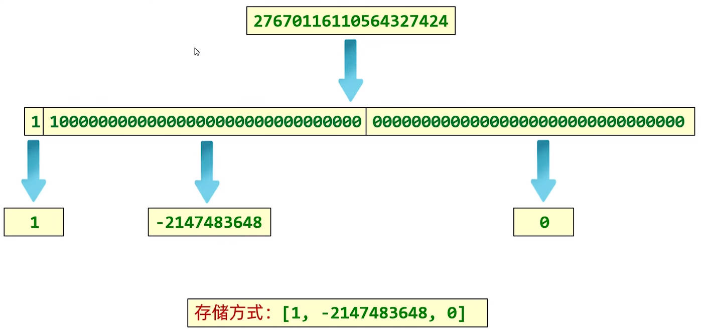
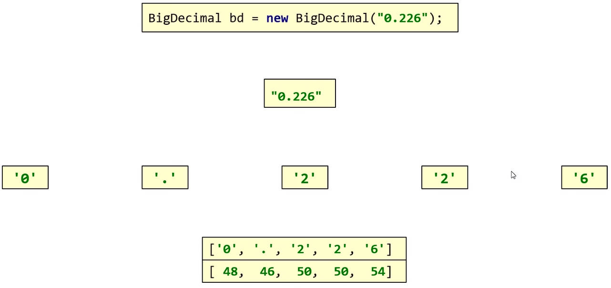
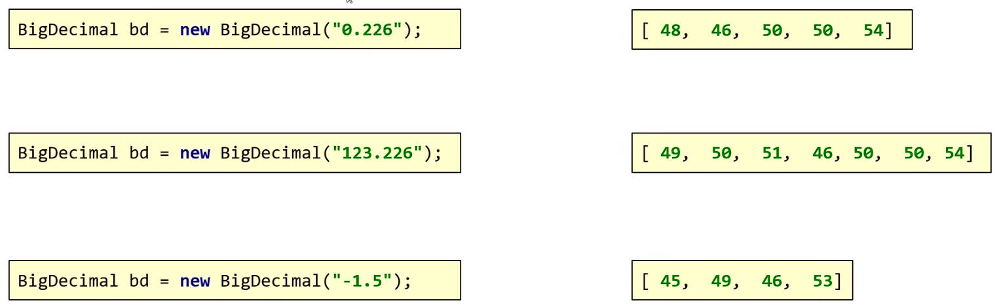

# Java 常见 API 之 BigInteger、BigDecimal

## 一、BigInteger 类

在 Java 中，整数有四种类型，分别是 byte、short、int、long，它们占用的字节数，分别是：1、2、4、8 个；

long 类型，能表示的最大的数字是 `01111111 11111111 11111111 11111111 11111111 11111111 11111111 11111111`，转为十进制是 `9223372036854775807`。

超过该数字的**整数**，long 类型也无法正常表示，这时就要使用 `BigInteger` 类（它无法表示小数）。

当 `BigInteger` 对象创建后，内部记录的值，不允许发生改变；

- 只要用 `BigInteger` 对象进行计算，那么都会产生一个新的对象。

### 1.BigInteger 构造方法有

`BigInteger` 的构造方法有：

| 方法名                                     | 说明                                        |
| ------------------------------------------ | ------------------------------------------- |
| `public BigInteger(int num, Random r)`     | 获取随机大整数，范围：[0 ~ 2 的 num 次方-1] |
| `public BigInteger(String val)`            | 获取指定的大整数                            |
| `public BigInteger(String val, int radix)` | 获取指定进制的大整数                        |

获取一个 [0, 2^4^ - 1] 的随机大整数对象：

demo-project/base-code/Day18/src/com/kkcf/myapi/BigIntegerDemo01.java

```java
package com.kkcf.myapi;

import java.math.BigInteger;
import java.util.Random;

public class BigIntegerDemo01 {

    public static void main(String[] args) {
        BigInteger bigInteger = new BigInteger(4, new Random());

        System.out.println(bigInteger);
    }
}
```

获取一个指定的大整数对象（在实际开发中，用的较多）：

demo-project/base-code/Day18/src/com/kkcf/myapi/BigIntegerDemo01.java

```java
package com.kkcf.myapi;

import java.math.BigInteger;
import java.util.Random;

public class BigIntegerDemo01 {

    public static void main(String[] args) {
        BigInteger bigInteger = new BigInteger("12345");

        System.out.println(bigInteger); // 12345
    }
}
```

如果字符串中，是小数，或者字母，那么就会报错：

demo-project/base-code/Day18/src/com/kkcf/myapi/BigIntegerDemo01.java

```java
package com.kkcf.myapi;

import java.math.BigInteger;
import java.util.Random;

public class BigIntegerDemo01 {

    public static void main(String[] args) {
        BigInteger bigInteger1 = new BigInteger("1.1"); //  java.lang.NumberFormatException: For input string: "1.1"

        BigInteger bigInteger2 = new BigInteger("abc"); // java.lang.NumberFormatException: For input string: "abc"
    }
}
```

获取一个指定进制的大整数对象：

demo-project/base-code/Day18/src/com/kkcf/myapi/BigIntegerDemo01.java

```java
package com.kkcf.myapi;

import java.math.BigInteger;
import java.util.Random;

public class BigIntegerDemo01 {

    public static void main(String[] args) {
        BigInteger bigInteger = new BigInteger("4", 10);

        System.out.println(bigInteger); // 4

        BigInteger bigInteger1 = new BigInteger("100", 2);

        System.out.println(bigInteger1); // 4
    }
}

```

`BigInteger` 构造方法的细节：

- 传入的字符串，必须是整数；
- 传入的字符串中的数字，必须要跟进制吻合（比如："123" 不能用于二进制转化）。

### 2.BigInteger 静态方法

`BigInteger` 常用的静态方法如下，用于获取 `BigInteger` 的对象。

| 方法名                                       | 说明                                       |
| -------------------------------------------- | ------------------------------------------ |
| `public static BigInteger valueOf(long val)` | 静态方法获取 BigInteger 的对象，内部有优化 |

demo-project/base-code/Day18/src/com/kkcf/myapi/BigIntegerDemo01.java

```java
package com.kkcf.myapi;

import java.math.BigInteger;

public class BigIntegerDemo01 {

    public static void main(String[] args) {
        System.out.println(BigInteger.valueOf(100)); // 100
    }
}
```

细节：

- `valueOf` 静态方法，返回的结果，能表示的范围较小；传入的整数参数，只能在 long 数据类型的取值范围之内；
- `valueOf` 静态方法，在内部对常用整数 `-16-16` 进行了优化；提前创建了这个范围内，数字的 `BigInteger` 实例对象，如果多次获取不会重新创建对象。

demo-project/base-code/Day18/src/com/kkcf/myapi/BigIntegerDemo01.java

```java
package com.kkcf.myapi;

import java.math.BigInteger;
import java.util.Objects;
import java.util.Random;

public class BigIntegerDemo01 {

    public static void main(String[] args) {
        BigInteger b1 = BigInteger.valueOf(16);
        BigInteger b2 = BigInteger.valueOf(16);

        System.out.println(b1 == b2); // true

        BigInteger b3 = BigInteger.valueOf(17);
        BigInteger b4 = BigInteger.valueOf(17);

        System.out.println(b3 == b4); // false
    }
}
```

`BigInteger` 的静态方法 `valueOf` 源码分析：

java/math/BigInteger.java

```java
public static BigInteger valueOf(long val) {
    // If -MAX_CONSTANT < val < MAX_CONSTANT, return stashed constant
    if (val == 0)
        return ZERO;
    if (val > 0 && val <= MAX_CONSTANT)
        return posConst[(int) val];
    else if (val < 0 && val >= -MAX_CONSTANT)
        return negConst[(int) -val];

    return new BigInteger(val);
}
```

### 3.BigInteger 成员方法

`BigInteger` 常用的成员方法如下：

| 方法名                                                   | 说明                                |
| -------------------------------------------------------- | ----------------------------------- |
| `public BigInteger add(BigInteger val)`                  | 加法                                |
| `public BigInteger subtract(BigInteger val)`             | 减法                                |
| `public BigInteger multiply(BigInteger val)`             | 乘法                                |
| `public BigInteger divide(BigInteger val)`               | 除法、获取商                        |
| `public BigInteger[] divideAndRemainder(BigInteger val)` | 除法，获取商和余数                  |
| `public boolean equals(Object x)`                        | 比较是否相同                        |
| `public BigInteger pow(int exponent)`                    | 次幂、次方                          |
| `public BigInteger max/min(BigInteger val)`              | 返回较大值/较小值                   |
| `public int intValue(BigInteger val)`                    | 转为 int 类型整数，超出范围数据有误 |

#### 1.add 方法

`add` 方法的使用：

demo-project/base-code/Day18/src/com/kkcf/myapi/BigIntegerDemo02.java

```java
package com.kkcf.myapi;

import java.math.BigInteger;

public class BigIntegerDemo02 {
    public static void main(String[] args) {
        BigInteger bd1 = BigInteger.valueOf(10);
        BigInteger bd2 = BigInteger.valueOf(5);

        BigInteger bd3 = bd1.add(bd2);

        System.out.println(bd3); // 15
    }
}
```

#### 2.divideAndRemainder 方法

`divideAndRemainder` 方法的使用：

demo-project/base-code/Day18/src/com/kkcf/myapi/BigIntegerDemo02.java

```java
package com.kkcf.myapi;

import java.math.BigInteger;

public class BigIntegerDemo02 {
    public static void main(String[] args) {
        BigInteger bd1 = BigInteger.valueOf(10);
        BigInteger bd2 = BigInteger.valueOf(3);

        BigInteger[] bds = bd1.divideAndRemainder(bd2);

        System.out.println(bds[0]); // 3，表示商 3
        System.out.println(bds[1]); // 1，表示余 1
    }
}
```

#### 3.equals 方法

`equals` 方法的使用：

demo-project/base-code/Day18/src/com/kkcf/myapi/BigIntegerDemo02.java

```java
package com.kkcf.myapi;

import java.math.BigInteger;

public class BigIntegerDemo02 {
    public static void main(String[] args) {
        BigInteger bd1 = BigInteger.valueOf(10);
        BigInteger bd2 = BigInteger.valueOf(3);

        System.out.println(bd1.equals(bd2)); // false

        BigInteger bd3 = BigInteger.valueOf(15);
        BigInteger bd4 = BigInteger.valueOf(15);

        System.out.println(bd3.equals(bd4)); // true
    }
}
```

#### 4.pow 方法

`pow` 方法的使用：

demo-project/base-code/Day18/src/com/kkcf/myapi/BigIntegerDemo02.java

```java
package com.kkcf.myapi;

import java.math.BigInteger;

public class BigIntegerDemo02 {
    public static void main(String[] args) {
        BigInteger bd1 = BigInteger.valueOf(10);

        BigInteger bd3 = bd1.pow(2);

        System.out.println(bd3); // 100
    }
}
```

#### 5.max 方法

`max` 方法的使用：

demo-project/base-code/Day18/src/com/kkcf/myapi/BigIntegerDemo02.java

```java
package com.kkcf.myapi;

import java.math.BigInteger;

public class BigIntegerDemo02 {
    public static void main(String[] args) {
        BigInteger bd1 = BigInteger.valueOf(10);
        BigInteger bd2 = BigInteger.valueOf(3);

        BigInteger max = bd1.max(bd2);

        System.out.println(max); // 10
        System.out.println(max == bd1); // true
    }
}
```

#### 6.intValue 方法

`intValue`、`longValue`、`doubleValue` 方法的使用。

demo-project/base-code/Day18/src/com/kkcf/myapi/BigIntegerDemo02.java

```java
package com.kkcf.myapi;

import java.math.BigInteger;

public class BigIntegerDemo02 {
    public static void main(String[] args) {
        BigInteger bd1 = BigInteger.valueOf(10);

        int i = bd1.intValue();

        long l = bd1.longValue();

        double d = bd1.doubleValue();

        System.out.println(i); // 10
        System.out.println(l); // 10
        System.out.println(d); // 10.0
    }
}
```

### 4.BigInteger 的底层实现

对于计算机而言，其实是没有数据类型的概念的，数据存储的形式都是 0、1 组成的机器码；

数据类型，是编程语言自己规定的。

`BigInteger` 在底层存储数字的原理如下图：



将数据，变成二进制的补码形式，以 32 比特位（4 个字节）为一组，分成 n 组，再转为十进制，放入一个 int 类型的数组中。

- 数组的最大长度（int 的最大值）`2147483647`，即 21 亿多.
- 数组中每一位能表示的数字为 `-2147483648-2147483647`，即 42 亿多.
- 所以，BigInteger 能存储的最大值是：42 亿的 21 忆次方（现实中没有计算机的内存能存储这么大的数字）。

## 二、BigDecimal 类

在 Java 中，直接使用小数进行计算，结果可能不精确：

demo-project/base-code/Day18/src/com/kkcf/myapi/Test01.java

```java
package com.kkcf.myapi;

public class Test01 {
    public static void main(String[] args) {
        System.out.println(0.09 + 0.01); // 0.09999999999999999
        System.out.println(0.216 - 0.1); // 0.11599999999999999
        System.out.println(0.226 * 0.01); // 0.0022600000000000003
        System.out.println(0.09 / 0.1); // 0.8999999999999999
    }
}
```

计算机中的小数，以十进制的 `69.875` 为例，转为二进制后：

- 整数部分表示为：`0100 0101`；
- 小数部分表示为：`111`，即 1 \* 2^-1^ + 1 \* 2^-2^ + 1 \* 2^-3^ -> 0.5 + 0.25 + 0.125 = 0.875

依此类推：`0.9` 转为二进制，就是一个 45 比特位的二进制数字；`0.226` 转为二进制，就是一个 55 比特位的二进制数。

在 Java 中，用于存储浮点数的两个类型如下：

| 类型   | 占用字节数 | 总 bit 位 | 小数部分 bit 位 |
| ------ | ---------- | --------- | --------------- |
| float  | 4          | 32        | 23              |
| double | 8          | 64        | 52              |

当一个小数的二进制位数，超过数据类型所能表示的范围时，就会出现精度错误。

`BigDecimal` 类，就是为了解决这个问题，它可以：

- 用于小数的精确计算；
- 用来表示很大的小数。

`BigDecimal` 类，一旦创建对象后，其中保存的值就不可变了。

### 1.BigDecimal 构造方法

`BigDecimal` 常用的构造方法有：

| 方法名                          | 说明                                                         |
| ------------------------------- | ------------------------------------------------------------ |
| `public BigDecimal(double val)` | 传入 double 类型的小数，创建对象（结果可能不精确，不建议使用）。 |
| `public BigDecimal(String val)` | 传入 String 类型的字符串，创建对象，**结果精确**。           |

`public BigDecimal(double val)` 的使用，结果可能不精确。

demo-project/base-code/Day18/src/com/kkcf/myapi/BigDecimalDemo01.java

```java
package com.kkcf.myapi;

import java.math.BigDecimal;

public class BigDecimalDemo01 {
    public static void main(String[] args) {
        BigDecimal bd1 = new BigDecimal(0.01);
        BigDecimal bd2 = new BigDecimal(0.09);

        System.out.println(bd1); // 0.01000000000000000020816681711721685132943093776702880859375
        System.out.println(bd2); // 0.0899999999999999966693309261245303787291049957275390625
    }
}
```

`public BigDecimal(String val)` 的使用：

demo-project/base-code/Day18/src/com/kkcf/myapi/BigDecimalDemo01.java

```java
package com.kkcf.myapi;

import java.math.BigDecimal;

public class BigDecimalDemo01 {
    public static void main(String[] args) {
        BigDecimal bd1 = new BigDecimal("0.01");
        BigDecimal bd2 = new BigDecimal("0.09");

        System.out.println(bd1); // 0.01
        System.out.println(bd2); // 0.09

        BigDecimal bd3 = bd1.add(bd2);

        System.out.println(bd3); // 0.10
    }
}

```

### 2.BigDecimal 静态方法

`BigDecimal` 常用的静态方法如下：

| 方法名                                                  | 说明                                       |
| ------------------------------------------------------- | ------------------------------------------ |
| `public static BigDecimal valueOf(double/long/int val)` | 通过传入的参数，创建一个实例对象，并返回。 |

如果要表示的小数不大，没有超过 double 类型的取值范围，建议使用该种方式创建对象；

否则，建议使用构造方法的形式传入字符串，创建对象。

demo-project/base-code/Day18/src/com/kkcf/myapi/BigDecimalDemo01.java

```java
package com.kkcf.myapi;

import java.math.BigDecimal;

public class BigDecimalDemo01 {
    public static void main(String[] args) {
        BigDecimal bd1 = BigDecimal.valueOf(10);

        System.out.println(bd1); // 10
    }
}
```

类似于 `BigInteger` 类中的 `valueOf` 方法，为了节约内存，为该方法传递 `[0, 10]` 范围内的**整数**，作为参数，那么方法会返回已经创建好的对象。

demo-project/base-code/Day18/src/com/kkcf/myapi/BigDecimalDemo01.java

```java
package com.kkcf.myapi;

import java.math.BigDecimal;

public class BigDecimalDemo01 {
    public static void main(String[] args) {
        BigDecimal bd1 = BigDecimal.valueOf(10);
        BigDecimal bd2 = BigDecimal.valueOf(10);

        System.out.println(bd1 == bd2); // true

        BigDecimal bd3 = BigDecimal.valueOf(10.0);
        BigDecimal bd4 = BigDecimal.valueOf(10.0);

        System.out.println(bd3 == bd4); // false
    }
}
```

`valueOf` 静态方法底层，也是调用了`public BigDecimal(String val)` 方法，来创建 `BigDecimal` 的实例对象的。

java/math/BigDecimal.java

```java
public static BigDecimal valueOf(double val) {
    // Reminder: a zero double returns '0.0', so we cannot fastpath
    // to use the constant ZERO.  This might be important enough to
    // justify a factory approach, a cache, or a few private
    // constants, later.
    return new BigDecimal(Double.toString(val));
}
```

### 3.BigDecimal 成员方法

`BigDecimal` 常用的成员方法如下：

| 方法名                                                       | 说明     |
| ------------------------------------------------------------ | -------- |
| `public BigDecimal add(BigDecimal value)`                    | 加法运算 |
| `public BigDecimal subtract(BigDecimal value)`               | 减法运算 |
| `public BigDecimal multiply(BigDecimal value)`               | 乘法运算 |
| `public BigDecimal divide(BigDecimal value)`                 | 除法运算 |
| `public BigDecimal divide(BigDecimal value, 精确几位, 舍入模式)` | 除法运算 |
| `public int compareTo(BigDecimal bg)`                        | 比较     |

#### 1.add、subtract、multiply 方法

`add`、`subtract`、`multiply` 方法使用如下：

demo-project/base-code/Day18/src/com/kkcf/myapi/BigDecimalDemo02.java

```java
package com.kkcf.myapi;

import java.math.BigDecimal;

public class BigDecimalDemo02 {
    public static void main(String[] args) {
        BigDecimal bd1 = BigDecimal.valueOf(10.0);
        BigDecimal bd2 = BigDecimal.valueOf(2.0);

        BigDecimal bd3 = bd1.add(bd2);
        System.out.println(bd3); // 12.0

        BigDecimal bd4 = bd1.subtract(bd2);
        System.out.println(bd4); // 8.0

        BigDecimal bd5 = bd1.multiply(bd3);
        System.out.println(bd5); // 20.00
    }
}
```

#### 2.divide 方法

`divide` 方法的使用：

使用法 `public BigDecimal divide(BigDecimal value)` ，被除数，与除数进行除法运算，如果除不尽会报错；

应该使用该方法 `public BigDecimal divide(BigDecimal value, 精确几位, 舍入模式)`

demo-project/base-code/Day18/src/com/kkcf/myapi/BigDecimalDemo02.java

```java
package com.kkcf.myapi;

import java.math.BigDecimal;
import java.math.RoundingMode;

public class BigDecimalDemo02 {
    public static void main(String[] args) {
        BigDecimal bd1 = BigDecimal.valueOf(10.0);
        BigDecimal bd2 = BigDecimal.valueOf(2.0);
        BigDecimal bd3 = BigDecimal.valueOf(3.0);
        BigDecimal bd4 = BigDecimal.valueOf(4.0);

        BigDecimal bd5 = bd1.divide(bd2);
        System.out.println(bd3); // 5

        BigDecimal bd6 = bd1.divide(bd4);
        System.out.println(bd6); // 2.5

        //BigDecimal bd7 = bd1.divide(bd3); //  java.lang.ArithmeticException: Non-terminating decimal expansion; no exact representable decimal result.
        BigDecimal bd7 = bd1.divide(bd3, 2, RoundingMode.HALF_UP); // RoundingMode.HALF_UP 表示四舍五入模式
        System.out.println(bd7);
    }
}
```

#### 3.compareTo 方法

`BigDecimal` 提供了 `compareTo()` 方法来进行数值比较。这个方法不会考虑小数点后多余的零，而是比较数字的大小。它返回：

- `0`：如果两个 `BigDecimal` 数值相等。
- `-1`：如果第一个 `BigDecimal` 小于第二个。
- `1`：如果第一个 `BigDecimal` 大于第二个。

```java
BigDecimal val1 = new BigDecimal("5500.00");
BigDecimal val2 = new BigDecimal("5500");

int result = val1.compareTo(val2);

if (result == 0) {
    System.out.println("两者相等");
} else if (result < 0) {
    System.out.println("val1 小于 val2");
} else {
    System.out.println("val1 大于 val2");
}
```

### 4.BigDecimal 底层实现

以小数 `0.226` 为例，它转为二进制有 55 位。

当使用字符串 `"0.226"`创建一个 `BigDecimal` 对象时，底层会遍历字符串中每一个字符，并将它门的 ASCLL 码，存入到一个数组中。原理如下图所示：



依此类推，如果是有整数部分的小数，比如 `"123.226"`；或者带负号的小数，比如 `"-1.5"`；

都会将字符串中的字符，转为 ASCLL 码，存入一个数组中（正数不会存符号位的 ASCLL 码）。



综上所述，`BigDecimal` 所能记录的小数，也是有最大值的，即数组的最大长度（int 的最大值）`2147483647`，即 21 亿多位数字所能表示的小数。

实际计算机内存无法存储这么大的数字，所以可以把 `BigDecimal` 能存储的最大数字认为是无限大的。
