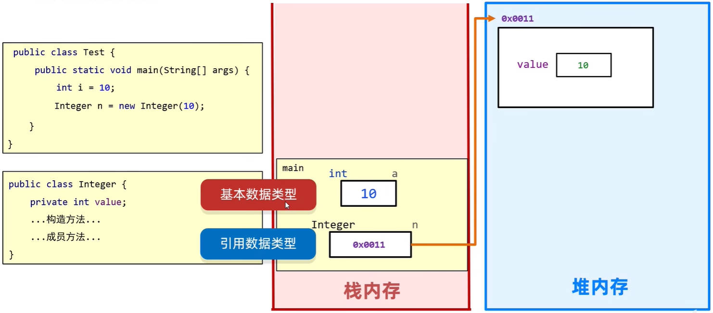

# Java 常用 API 之包装类、综合练习

包装类，就是基本数据类型，对应的引用数据类型；它将基本数据类型，变成了一个对象。

包装类，在内存中的表现，如下图所示：



包装类的使用场景：

- 在 Java 中，万物皆对象，又因为有多态的特性，所有对象都可以被 Object 类型的变量引用，包装类也不例外。
- 集合中不能存储基本数据类型，只能存包装类的对象。

在 Java 中，基本数据类型，对应的包装类如下：

| 基本类型 | 包装类（位于 java.lang 包中） |
| -------- | ----------------------------- |
| byte     | Byte                          |
| short    | Short                         |
| int      | **Integer**                   |
| long     | Long                          |
| float    | Float                         |
| double   | Double                        |
| char     | **Character**                 |
| boolean  | Boolean                       |

Integer 是开发中使用最多的包装类。

## 一、Integer 包装类

Integer 包装类中，常用方法如下：

| 方法名                                    | 说明                                      |
| ----------------------------------------- | ----------------------------------------- |
| `public Integer(int value)`               | 根据 int 值创建 Integer 对象（已过时）    |
| `public Integer(String s)`                | 根据 String 值创建 Integer 对象（已过时） |
| `public static Integer valueOf(int i)`    | 返回表示指定的 int 值的 Integer 实例      |
| `public static Integer valueOf(String s)` | 返回保存指定 String 值的 Integer 对象     |

### 1.Integer 构造方法、valueOf 静态方法

#### 1.JDK5 前 Integer 对象创建、计算

在 JDK5 以前，要通过手动的方式，创建 Integer 对象，或者将 Integer 对象转为 int 类型。

如下方代码所示：

demo-project/base-code/Day20/src/com/kkcf/integer/IntegerDemo01.java

```java
package com.kkcf.integer;

public class IntegerDemo01 {
    public static void main(String[] args) {
        Integer i1 = new Integer(123);
        Integer i2 = new Integer("123");

        System.out.println(i1); // 123
        System.out.println(i2); // 123

        Integer i3 = Integer.valueOf(123);
        Integer i4 = Integer.valueOf("123");
        Integer i5 = Integer.valueOf("123", 8); // 八进制

        System.out.println(i3); // 123
        System.out.println(i4); // 123
        System.out.println(i4); // 123
    }
}
```

`valueOf` 静态方法，与构造方法，获取 Integer 对象的区别：

理解下方代码：

demo-project/base-code/Day20/src/com/kkcf/integer/IntegerDemo02.java

```java
package com.kkcf.integer;

public class IntegerDemo02 {
    public static void main(String[] args) {
        Integer i1 = Integer.valueOf(127);
        Integer i2 = Integer.valueOf(127);
        System.out.println(i1 == i2); // true

        Integer i3 = Integer.valueOf(128);
        Integer i4 = Integer.valueOf(128);
        System.out.println(i3 == i4); // false

        Integer i5 = new Integer(127);
        Integer i6 = new Integer(127);
        System.out.println(i5 == i6); // false

        Integer i7 = new Integer(128);
        Integer i8 = new Integer(128);
        System.out.println(i7 == i8); // false
    }
}
```

- `valueOf` 静态方法，会将 -128-127 之间的数字，先创建好 Integer 对象，放入一个 cache 数组中。
- 当为该方法传入 -128-127 之间的数字时，会使用创建好的 Integer 对象。
- 这种做法本质上是为了优化性能，节约内存。

对象之间，不能直接进行计算，如果要进行计算，应执行如下步骤：

1. 把对象进行拆箱，变成基本数据类型；
2. 计算；
3. 将计算的结果进行装箱，再变回包装类。

demo-project/base-code/Day20/src/com/kkcf/integer/IntegerDemo03.java

```java
package com.kkcf.integer;

public class IntegerDemo03 {
    public static void main(String[] args) {
        // 装箱
        Integer i1 = Integer.valueOf(1);
        Integer i2 = Integer.valueOf(2);

        // 拆箱，并计算
        int result = i1.intValue() + i2.intValue();
      
        // 装箱
        Integer i3 = new Integer(result);

        System.out.println(i3); // 3
    }
}
```

#### 2.JDK5 及以后 Integer 对象创建

在 JDK5，提出了自动装箱、自动拆箱的机制。

- 自动装箱：把基本数据类型，自动变为包装类型。
- 自动拆箱：把包装类型，自动变为基本数据类型。

demo-project/base-code/Day20/src/com/kkcf/integer/IntegerDemo04.java

```java
package com.kkcf.integer;

public class IntegerDemo04 {
    public static void main(String[] args) {
        Integer i1 = 10;
    }
}
```

上面代码是自动装箱的体现，本质上也是调用 `Integer.valueOf` 静态方法，得到一个 Integer 对象。

demo-project/base-code/Day20/src/com/kkcf/integer/IntegerDemo04.java

```java
package com.kkcf.integer;

public class IntegerDemo04 {
    public static void main(String[] args) {
        // 自动装箱
        Integer i1 = 10;

        Integer i2 = Integer.valueOf(10);

        System.out.println(i1 == i2); // true

        // 自动拆箱
        int i = i2;
    }
}
```

上面代码是自动装箱、自动拆箱的体现，

在 JDK5 以后，int 类型和 Integer 包装类型可以看作是同一个东西，因为在执行代码时会自动转化。

### 2.Integer 其它静态方法

| 方法名                                | 说明                                  |
| ------------------------------------- | ------------------------------------- |
| `static string tobinarystring(int i)` | 得到二进制                            |
| `static string tooctalstring(int i)`  | 得到八进制                            |
| `static string toHexstring(int i)`    | 得到十六进制                          |
| `static int parseInt(string s)`       | 将字符串类型的整数转成 int 类型的整数 |

Integer 中，获取进制数的静态方法，返回的都是 String 类型，这是因为：

- 二进制有可能以 0 开头（数字的补码形式），如果是数字类型就不能正确表示。
- 数字类型比如 int 最大值是 21 亿多，即 10 位数字，用于表示二进制可能不够。

`tobinarystring`、`tooctalstring`、`toHexstring` 静态方法的使用

demo-project/base-code/Day20/src/com/kkcf/integer/IntegerDemo05.java

```java
package com.kkcf.integer;

public class IntegerDemo05 {
    public static void main(String[] args) {
        String str1 = Integer.toBinaryString(100);
        String str2 = Integer.toOctalString(100);
        String str3 = Integer.toHexString(100);

        System.out.println(str1); // 1100100
        System.out.println(str2); // 144
        System.out.println(str3); // 64
    }
}
```

Java 是强类型语言，在数据计算时，如果数据之间不是同一种数据类型，是无法直接计算的，要进行类型转换。

`parseInt` 静态方法的使用

```java
package com.kkcf.integer;

public class IntegerDemo05 {
    public static void main(String[] args) {
        int i1 = Integer.parseInt("123");

        System.out.println(i1); // 123
        System.out.println(i1 + 1); // 124
    }
}
```

- 在类型转换时，传入的参数，必须是数字组成的字符串。

- 八种包装类中，除了 `Character` 类以外，都有对应的 `parseXxx` 方法，进行类型转换。比如下方代码：

  ```java
  boolean flag = Boolean.parseBoolean("true");
  
  System.out.println(flag); // true
  ```

案例理解：重构键盘录入，使用 `nextLine` 方法来接收录入的值。

- 当使用 `next`、`nextInt`、`nextDouble` 在接收数据的时候，遇到空格、回车、制表符就会停止。
- 结合包装类中的 `parseXxx` 方法与 `nextLine` 方法，接收键盘录入的字符串，并转为对应的数据类型

demo-project/base-code/Day20/src/com/kkcf/integer/Test01.java

```java
package com.kkcf.integer;

import java.util.Scanner;

public class Test01 {
    public static void main(String[] args) {
        Scanner sc = new Scanner(System.in);

        System.out.println("请输入一个浮点数");
        String s = sc.nextLine();
        double v = Double.parseDouble(s);

        System.out.println(v + 1);
    }
}
```

## 二、时间类、包装类综合练习

### 1.练习一

练习一：键盘录入一些 1~100 之间的整数，并添加到集合中。直到集合中所有数据和超过 200 为止。

demo-project/base-code/Day20/src/com/kkcf/test/Test01.java

```java
package com.kkcf.test;

import java.util.ArrayList;
import java.util.Scanner;

public class Test01 {
    public static void main(String[] args) {
        Scanner sc = new Scanner(System.in);
        ArrayList<Integer> list = new ArrayList<>();

        do {
            System.out.println("请输入一个整数：");
            String str = sc.nextLine();

            int i = Integer.parseInt(str);

            // 边界判断
            if (i < 0 || i > 100) {
                System.out.println("输入有误，请重新输入：");
                continue;
            }

            // 添加数据时，触发了自动装箱
            list.add(i);
        } while (calcSum(list) < 200);
    }

    public static int calcSum(ArrayList<Integer> list) {
        int sum = 0;

        for (Integer num : list)
            sum += num;

        return sum;
    }
}
```

### 2.练习二

练习二：自己实现 `Integer.parseInt` 方法的效果，将字符串形式的数据，转成整数。

要求：字符串中只能是数字，不能有其他字符，最少 1 位，最多 10 位，且不能以 0 开头。

demo-project/base-code/Day20/src/com/kkcf/test/Test02.java

```java
package com.kkcf.test;

public class Test02 {
    public static void main(String[] args) {
        String str = "12345";

        // 正则表达式，验证字符串格式
        boolean flag = str.matches("[0-9]\\d{0,9}");

        if (!flag) {
            System.out.println("数据格式错误");
            return;
        }

        int result = 0;
        for (int i = 0; i < str.length(); i++) {
            char c = str.charAt(i);

            int num = c - '0';
            result = result * 10 + num;
        }

        System.out.println(result); // 12345
    }
}
```

### 3.练习三

练习三：定义一个方法自己实现 `Integer.toBinaryString` 方法的效果，将一个十进制整数转成字符串表示的二进制。

demo-project/base-code/Day20/src/com/kkcf/test/Test3.java

```java
package com.kkcf.test;

public class Test3 {
    public static void main(String[] args) {
        int i = 123;

        StringBuilder sb = new StringBuilder();
        while (i > 0) {
            int i1 = i % 2;
            i /= 2;
            //sb.append(i1);
            sb.insert(0, i1);
        }

        //String result = sb.reverse().toString();
        String result = sb.toString();
        System.out.println(result);
    }
}
```

- StringBuilder 类的 `insert` 方法，用于指定索引，插入元素。

### 4.练习四

请计算你活了多少天，用 JDK7 和 JDK8 两种方式完成：

demo-project/base-code/Day20/src/com/kkcf/test/Test04.java

```java
package com.kkcf.test;

import java.text.ParseException;
import java.text.SimpleDateFormat;
import java.time.LocalDate;
import java.time.temporal.ChronoUnit;
import java.util.Date;

public class Test04 {
    public static void main(String[] args) throws ParseException {
        long days1 = calcDays1();
        System.out.println("间隔" + days1 + "天");

        long days2 = calcDays2();
        System.out.println("间隔" + days2 + "天");
    }

    /**
     * 此方法用于：使用 JDK7 以前的方式，计算活了所少天
     * @return 活了多少天
     * @throws ParseException 时间字符串转化错误
     */
    private static long calcDays1() throws ParseException {
        // 生日时间 Date 对象
        String birthStr = "1997-10-16";
        SimpleDateFormat sdf = new SimpleDateFormat("yyyy-MM-dd");
        Date birthDate = sdf.parse(birthStr);
        long birthTime = birthDate.getTime();

        // 当前时间 Date 对象
        long nowTime = System.currentTimeMillis();

        long intervalTime = nowTime - birthTime;

        return intervalTime / (1000 * 60 * 60 * 24);
    }

    /**
     * 此方法用于：使用 JDK8 以后的方式，计算活了所少天
     * @return 活了多少天
     */
    private static long calcDays2() {
        LocalDate birthLd = LocalDate.of(1997, 10, 16);
        LocalDate nowLd = LocalDate.now();

        return ChronoUnit.DAYS.between(birthLd, nowLd);
    }
}
```

- `ChronoUnit.DAYS.between` 传的参数，小的时间在前，大的时间在后，返回的结果才是正数值。

### 5.练习五

判断任意的一个年份，是闰年还是平年？

要求：用 JDK7 和 JDK8 两种方式判断。

提示：二月有 29 天是闰年，一年有 366 天是闰年

JDK7 前的解法：

- 思路 1：计算每一年的 1 月 1 日 0 时 0 分，到 12 月 31 日 23 时 59 分间隔的毫秒数，再转为天数，看是否是 365 天。
- 思路 2：计算每一年的 2 月 1 日 0 时 0 分，到 3 月 1 日 0 时 0 分间隔的毫秒数，再转为天数，看是否是 29 天。
- 思路 3，利用 Calendar 类，将每一年的 3 月 1 日减去一天，如果结果的日期是 2 月 29 日，说明是闰年。
- 思路 4：利用 Calendar 类，将每一年的 1 月 1 日减去一天，如果结果的日期是一年中的第 366 天，说明前一年是闰年。

思路 3、思路 4 更加简洁：下方代码用思路 3 实现：

JDK8 的解法，

- 思路 1：与上方思路 3 类似，只不过使用的是 JDK8 中的日历类 LocalDate。
- 思路 2：直接使用 LocalDate 类的方法 `isLeapYear`，判断当前日历对象所在年份是否是闰年。

demo-project/base-code/Day20/src/com/kkcf/test/Test05.java

```java
package com.kkcf.test;

import java.time.LocalDate;
import java.util.Calendar;

public class Test05 {
    public static void main(String[] args) {
        int year = 2001;

        jdk7Method(year);

        jdk8Method1(year);

        jdk8Method2(year);
    }

    /**
     * 此方法用于，使用 JDK7 的 API，计算今年是否是闰年。
     * @param year 年份
     */
    private static void jdk7Method(int year) {
        Calendar c = Calendar.getInstance();
        c.set(year, Calendar.MARCH, 1); // 这里 Calendar.MARCH 是常量 2 表示 3 月。

        c.add(Calendar.DAY_OF_MONTH, -1);

        int day = c.get(Calendar.DAY_OF_MONTH);

        System.out.println(day);

        System.out.println(year + (day == 29 ? "是" : "不是") + "闰年");
    }

    /**
     * 此方法用于，使用 JDK8 的 API，计算今年是否是闰年。
     * @param year 年份
     */
    private static void jdk8Method1(int year) {
        LocalDate date = LocalDate.of(year, 3, 1); // 这里的 3，就表示 3 月。
        date = date.minusDays(1);

        int dayOfMonth = date.getDayOfMonth();

        System.out.println(dayOfMonth);

        System.out.println(year + (dayOfMonth == 29 ? "是" : "不是") + "闰年");
    }

    /**
     * 此方法用于，使用 JDK8 的 API，计算今年是否是闰年。
     * @param year 年份
     */
    private static void jdk8Method2(int year) {
        LocalDate ld1 = LocalDate.of(year, 2, 1);

        boolean flag = ld1.isLeapYear();

        System.out.println(year + (flag ? "是" : "不是") + "闰年");
    }
}
```
