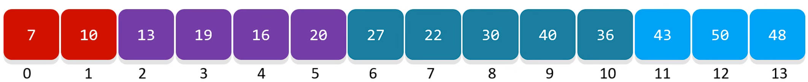
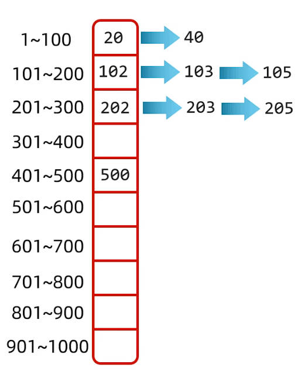
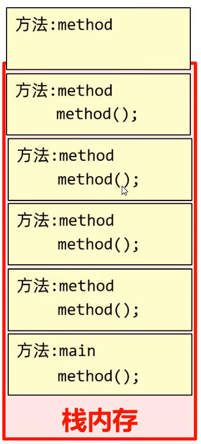
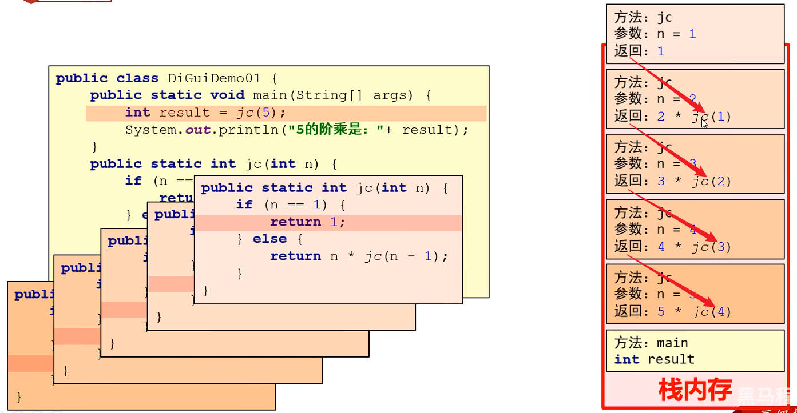

# Java 常见算法

## 一、Java 查找算法

常见的查找算法有：基本查找（也称顺序查找）、二分查找（也称折半查找）、分块查找

### 1.Java 基本查找

基本查找，又称为顺序查找，用于在一系列数据中，查找某一数据是否存在。

一般是定义一个容器，将数据放入容器当中，再从 0 索引开始，挨个往后查找。

案例理解：在一系列数字 {131, 127, 147, 81, 103, 23, 7, 79} 中，查找数字 81 是否存在，并返回它的索引值，考虑数据重复的情况。

demo-project/base-code/Day21/src/com/kkcf/search/BasicSearchDemo01.java

```java
package com.kkcf.search;

import java.util.ArrayList;

public class BasicSearchDemo01 {
    public static void main(String[] args) {
        int[] arr = {131, 127, 147, 81, 103, 23, 7, 79, 81};
        int i = 81;

        ArrayList<Integer> indexs = findIndex(arr, i);
        System.out.println(indexs);
    }

    /**
     * 此方法用于，普通查找
     * @param arr 数据列表
     * @param i 查找的数据
     * @return 查找数据的索引
     */
    private static ArrayList<Integer> findIndex(int[] arr, int i) {
        ArrayList<Integer> list = new ArrayList();

        for (int j = 0; j < arr.length; j++)
            if (arr[j] == i)
                list.add(j);

        return list;
    }
}
```

### 2.Java 二分查找

二分查找，前提条件是数组中的数据，必须是有序的。

- 如果是无序的数组，要先排序，才能进行二分查找；
- 在无序序列中，先排序，再二分查找，只能用于证明元素是否存在，因为排序可能打乱元素顺序，查找到的元素索引无意义。
- 在有序序列中，二分查找可以用于查找元素索引。

二分查找，核心思路是每次排除一半的查找范围。

二分查找算法步骤实现：

1. 定义两个索引值 `min` 和 `max`，表示当前要查找的范围；
2. 再定义一个索引值 `mid`，表示 `min`、`max` 中间的元素索引；
3. 如果要查找的元素，在 `mid` 的左边，缩小范围时 `min` 不变，`max` 等于 `mid - 1`；反之，`max` 不变，`min` 等于 `mid + 1`。
4. 当 `min > max` 时，如果还未找到，则表示要查询的元素不存在，结束查询。

案例理解：在一个有序数组中，使用二分查找，查找指定的元素

demo-project/base-code/Day21/src/com/kkcf/search/BinarySearchDemo01.java

```java
package com.kkcf.search;

public class BinarySearchDemo01 {
    public static void main(String[] args) {
        int[] arr = {7, 23, 79, 81, 103, 127, 131, 147};

        System.out.println(binarySearch(arr, 131));
    }

    public static int binarySearch(int[] arr, int target) {
        int min = 0;
        int max = arr.length - 1;
        int mid;

        while (min < max) {
            mid = (min + max) / 2;

            if (arr[mid] > target) {
                max = mid - 1;
            } else if (arr[mid] < target) {
                min = mid + 1;
            } else {
                return mid;
            }
        }
        return -1;
    }
}
```

### 3.Java 分块查找

#### 1.分块查找-有规律的序列

将有规律的序列，分为几块，其中有两个原则

- 分块查找原则 1：前一块中最大的数据，小于后一块中所有的数据（块内无序，块间有序）。
- 分块查找原则 2：快数数量一般等于序列长度开根号，比如：长度为 16 的序列一般分为 4 快左右。

分块查找核心思路：先确定要查找的元素在哪一块，然后在块内挨个查找。

比如下面这组数字，分为了四块：



分好的块，要放入一个容器中进行管理，这个容器称为“索引表”

实现步骤如下：

1. 创建数组 `blockArr` 作为索引表，存放每一个块对象的信息；
2. 先遍历 `blockArr`，确定要查找的数据属于哪一块；
3. 再单独遍历这一块数据即可。

demo-project/base-code/Day21/src/com/kkcf/search/BlockSearchDemo01.java

```java
package com.kkcf.search;

public class BlockSearchDemo01 {
    private static class Block {
        private int max;
        private int startIndex;
        private int endIndex;

        public Block() {
        }

        public Block(int max, int startIndex, int endIndex) {
            this.max = max;
            this.startIndex = startIndex;
            this.endIndex = endIndex;
        }

        public int getMax() {
            return max;
        }

        public void setMax(int max) {
            this.max = max;
        }

        public int getStartIndex() {
            return startIndex;
        }

        public void setStartIndex(int startIndex) {
            this.startIndex = startIndex;
        }

        public int getEndIndex() {
            return endIndex;
        }

        public void setEndIndex(int endIndex) {
            this.endIndex = endIndex;
        }
    }

    /**
     * 此方法用于，在索引表中，查找元素所在块的索引
     * @param blockArr 索引表
     * @param target   目标元素
     * @return 所在块的索引
     */
    private static int findIndexBlock(Block[] blockArr, int target) {
        for (int i = 0; i < blockArr.length; i++)
            if (target < blockArr[i].getMax())
                return i;

        return -1;
    }

    /**
     * 此方法用于，在序列中，找到目标元素的索引
     * @param blockArr 索引表
     * @param arr 数组
     * @param target 目标元素
     * @return 目标元素的索引
     */
    private static int getIndex(Block[] blockArr, int[] arr, int target) {
        int indexBlock = findIndexBlock(blockArr, target);

        if (indexBlock == -1)
            return indexBlock;

        Block targetBlock = blockArr[indexBlock];
        int startIndex = targetBlock.getStartIndex();
        int endIndex = targetBlock.getEndIndex();

        // 这里可用顺序查找，或者二分查找实现，下面使用的是顺序查找
        for (int i = startIndex; i <= endIndex; i++)
            if (arr[i] == target)
                return i;


        return -1;
    }

    public static void main(String[] args) {
        int[] arr = {16, 5, 9, 12, 21, 18,
                32, 23, 37, 26, 45, 34,
                50, 48, 61, 52, 73, 66};

        Block b1 = new Block(21, 0, 5);
        Block b2 = new Block(45, 6, 11);
        Block b3 = new Block(73, 12, 17);

        Block[] blockArr = {b1, b2, b3};

        int target = 12;

        int index = getIndex(blockArr, arr, target);

        System.out.println(index == -1 ? "未找到该元素" : "该元素在数组中的索引为：" + index);
    }
}
```

#### 2.分块查找-无规律的序列

使用分块查找，查找一组完全没有规律的数据，

每个分块相对于其它分块，应该有一个独立的区间值，即有最大值和最小值。

demo-project/base-code/Day21/src/com/kkcf/search/BlockSearchDemo02.java

```java
package com.kkcf.search;

public class BlockSearchDemo02 {
    private static class Block {
        private int max;
        private int min;
        private int startIndex;
        private int endIndex;

        public Block() {
        }

        public Block(int max, int min, int startIndex, int endIndex) {
            this.max = max;
            this.min = min;
            this.startIndex = startIndex;
            this.endIndex = endIndex;
        }

        public int getMax() {
            return max;
        }

        public void setMax(int max) {
            this.max = max;
        }

        public int getMin() {
            return min;
        }

        public void setMin(int min) {
            this.min = min;
        }

        public int getStartIndex() {
            return startIndex;
        }

        public void setStartIndex(int startIndex) {
            this.startIndex = startIndex;
        }

        public int getEndIndex() {
            return endIndex;
        }

        public void setEndIndex(int endIndex) {
            this.endIndex = endIndex;
        }
    }

    /**
     * 此方法用于，在索引表中，查找元素所在块的索引
     * @param blockArr 索引表
     * @param target   目标元素
     * @return 所在块的索引
     */
    private static int findIndexBlock(Block[] blockArr, int target) {
        for (int i = 0; i < blockArr.length; i++)
            if (target <= blockArr[i].getMax() && target >= blockArr[i].getMin())
                return i;

        return -1;
    }

    /**
     * 此方法用于，在数组中，找到目标元素的索引
     * @param blockArr 索引表
     * @param arr 数组
     * @param target 目标元素
     * @return 目标元素的索引
     */
    private static int getIndex(Block[] blockArr, int[] arr, int target) {
        int indexBlock = findIndexBlock(blockArr, target);

        if (indexBlock == -1)
            return indexBlock;

        Block targetBlock = blockArr[indexBlock];
        int startIndex = targetBlock.getStartIndex();
        int endIndex = targetBlock.getEndIndex();

        // 这里使用顺序查找
        for (int i = startIndex; i <= endIndex; i++)
            if (arr[i] == target)
                return i;


        return -1;
    }

    public static void main(String[] args) {
        int[] arr = {27, 22, 30, 40, 36,
                13, 19, 16, 20,
                7, 10,
                43, 50, 48};

        Block b1 = new Block(40, 22, 0, 4);
        Block b2 = new Block(20, 13, 5, 8);
        Block b3 = new Block(10, 7, 9, 10);
        Block b4 = new Block(50, 43, 11, 13);

        Block[] blockArr = {b1, b2, b3, b4};

        int target = 16;

        int index = getIndex(blockArr, arr, target);

        System.out.println(index == -1 ? "未找到该元素" : "该元素在数组中的索引为：" + index);
    }
}
```

### 5.Java 哈希查找（了解）

分块查找的最终优化方案，是哈希查找。

需求：在 1-1000 之间，获取 100 个随机数，要求数据不重复。

创建一个容器，它的容量为 100 开根号，然后分别把不同范围内的数据，作为“块”存入容器中，如下图所示：



### 3.Java 插值查找

插值查找，同样也只能用于有序序列中元素的查找；且有序序列中的元素要分布均匀，不然效率很低。

插值查找，在二分查找的基础上，优化了 `mid` 索引的初始值，使它更加贴近要查找的元素索引。

插值查找，`mid` 初始化值的公式为：`mid = min + key - arr[min]) / (arr[max] - arr[min]) * (max - min)`。

demo-project/base-code/Day21/src/com/kkcf/search/InterpolationSearchDemo01.java

```java
package com.kkcf.search;

public class InterpolationSearchDemo01 {

    public static void main(String[] args) {
        int[] array = {10, 12, 13, 16, 18, 19, 20, 21, 22, 23, 24, 33, 35, 42, 47};
        int key = 18;

        int index = interpolationSearch(array, key);

        if (index != -1)
            System.out.println("Element found at index " + index);
        else
            System.out.println("Element not found");

    }

    // 插值查找算法
    public static int interpolationSearch(int[] arr, int key) {
        int min = 0;
        int max = arr.length - 1;

        while (min <= max && key >= arr[min] && key <= arr[max]) {
            // 计算插值位置
            int pos = min + ((key - arr[min]) * (max - min)) / (arr[max] - arr[min]);

            // 找到目标值
            if (arr[pos] == key)
                return pos;

            // 如果目标值大于当前位置的值，则在右侧子数组中查找
            if (arr[pos] < key) {
                min = pos + 1;
            }
            // 如果目标值小于当前位置的值，则在左侧子数组中查找
            else {
                max = pos - 1;
            }
        }

        // 未找到目标值
        return -1;
    }
}
```

### 4.Java 斐波那契查找（了解）

斐波那契查找（Fibonacci Search）是一种基于斐波那契数列的查找算法，同样仅适用于已排序的数组。

它利用斐波那契数列来确定查找范围，从而逐步缩小搜索区间。

demo-project/base-code/Day21/src/com/kkcf/search/FibonacciSearchDemo01.java

```java
package com.kkcf.search;

public class FibonacciSearchDemo01 {
    // 获取斐波那契数列中的第 n 个数
    public static int fib(int n) {
        if (n <= 1) {
            return n;
        }
        return fib(n - 1) + fib(n - 2);
    }

    // 斐波那契查找算法
    public static int fibonacciSearch(int[] array, int key) {
        int n = array.length;

        // 找到第一个大于或等于 n 的斐波那契数
        int fibMMm2 = 0; // (m-2)'th Fibonacci No.
        int fibMMm1 = 1; // (m-1)'th Fibonacci No.
        int fibM = fibMMm2 + fibMMm1; // m'th Fibonacci

        while (fibM < n) {
            fibMMm2 = fibMMm1;
            fibMMm1 = fibM;
            fibM = fibMMm2 + fibMMm1;
        }

        // 标记用于已查找范围
        int offset = -1;

        while (fibM > 1) {
            // 检查有效范围内的第一个小于 fibM-2 的位置
            int i = Math.min(offset + fibMMm2, n - 1);

            // 如果 key 大于 array[i]，切换至右子数组
            if (array[i] < key) {
                fibM = fibMMm1;
                fibMMm1 = fibMMm2;
                fibMMm2 = fibM - fibMMm1;
                offset = i;
            }
            // 如果 key 小于 array[i]，切换至左子数组
            else if (array[i] > key) {
                fibM = fibMMm2;
                fibMMm1 = fibMMm1 - fibMMm2;
                fibMMm2 = fibM - fibMMm1;
            }
            // 找到目标值
            else {
                return i;
            }
        }

        // 如果最后一个元素是目标值
        if (fibMMm1 == 1 && array[offset + 1] == key) {
            return offset + 1;
        }

        // 未找到目标值
        return -1;
    }

    public static void main(String[] args) {
        int[] array = {10, 22, 35, 40, 45, 50, 80, 82, 85, 90, 100};
        int key = 85;

        int index = fibonacciSearch(array, key);

        if (index != -1) {
            System.out.println("Element found at index " + index);
        } else {
            System.out.println("Element not found");
        }
    }
}
```

### 5.Java 树表查找（了解）

后续在数据结构中介绍。

## 二、Java 字符串匹配算法（了解）

基本查找、KMP 算法。

正则表达式中，用的就是 KMP 算法

## 三、Java 排序算法

冒泡排序、选择排序、插入排序、快速排序

### 1.Java 冒泡排序

冒泡排序，核心思路是相邻的数据，两两比较，小的放前面，大的放后面。

1. 第一轮比较，会将序列中的最大值，放在最右边；
2. 第二轮比较，会将序列中的次大值，放在最大值的左边；
3. 依此类推……
4. 如果容器中有 n 个数据，总共执行 n-1 轮比较。

demo-project/base-code/Day21/src/com/kkcf/sort/BubbleDemoSortDemo01.java

```java
package com.kkcf.search;

public class BubbleDemoSortDemo01 {
    public static void main(String[] args) {
        int[] arr = {2, 4, 5, 3, 1};

        // 外循环：表示比较的轮数
        for (int i = 0; i < arr.length - 1; i++) {
            // 内循环：比较相邻的两个数，并找到最大值
            // -1 为了防止索引越界
            // -i 为了提高效率
            for (int j = 0; j < arr.length - 1 - i; j++) {
                if (arr[j] > arr[j + 1]) {
                    int temp = arr[j];
                    arr[j] = arr[j + 1];
                    arr[j + 1] = temp;
                }
            }
        }

        printArr(arr);
    }

    /**
     * 此方法用于，打印数组
     * @param arr 要打印的数组
     */
    private static void printArr(int[] arr) {
        for (int i : arr) {
            System.out.print(i + " ");
        }
    }
}
```

### 2.Java 选择排序

核心思路是：从容器的 0 索引开始，与后面的元素一一比较，小的元素就进行位置交换。

1. 第一轮比较结束后，容器中最小的元素，放在了容器的最左边。
2. 第二轮比较结束后，容器中第二小的元素，放在了容最小元素的右边。
3. 依此类推……
4. 如果容器中有 n 个数据，总共执行 n-1 轮比较。

如下图所示：


demo-project/base-code/Day21/src/com/kkcf/sort/SelectionSortDemo01.java

```java
package com.kkcf.sort;

public class SelectionSortDemo01 {
    public static void main(String[] args) {
        int[] arr = {2, 4, 5, 3, 1};

        // 外循环：表示比较的轮数
        // i 表示在这一轮比较中，用哪个索引与后面的元素进行比较
        for (int i = 0; i < arr.length - 1; i++) {
            // 内循环：使用 i 索引对应的元素，与后面的元素比较，小的放前面，大的放后面。
            for (int j = i + 1; j < arr.length; j++) {
                if (arr[i] > arr[j]) {
                    int temp = arr[i];
                    arr[i] = arr[j];
                    arr[j] = temp;
                }
            }
        }

        printArr(arr);
    }

    /**
     * 此方法用于，打印数组
     * @param arr 要打印的数组
     */
    private static void printArr(int[] arr) {
        for (int i : arr) {
            System.out.print(i + " ");
        }
    }
}
```

### 3.Java 插入排序

插值排序核心思路：将 0 索引的元素，到 n 索引（0-最大索引）的元素，看作是有序的；把 n + 1 索引的元素，到最后一个元素，看作是无序的。

遍历无序的元素，将遍历到的元素，插入有序序列中的适当位置；如果遇到相同的元素，就插在该元素后面。

如下图所示:


demo-project/base-code/Day21/src/com/kkcf/sort/InsertionSortDemo01.java

```java
package com.kkcf.sort;

import java.util.Arrays;

public class InsertionSortDemo01 {
    public static void main(String[] args) {
        int[] arr = {3, 44, 38, 5, 47, 15, 36, 26, 27, 2, 46, 4, 19, 50, 48};

        // 找到无序组开始的索引
        int startIndex = -1;
        for (int i = 0; i < arr.length - 1; i++) {
            if (arr[i] > arr[i + 1]) {
                startIndex = i + 1;
                break;
            }
        }

        // 从无序组第一个索引开始，遍历无序组元素
        for (int i = startIndex; i < arr.length; i++) {
            int j = i;

            while (j > 0 && arr[j] < arr[j - 1]) {
                // 交换元素
                int temp = arr[j];
                arr[j] = arr[j - 1];
                arr[j - 1] = temp;
                j--;
            }
        }

        printArr(arr);
    }

    /**
     * 此方法用于，打印数组
     * @param arr 要打印的数组
     */
    private static void printArr(int[] arr) {
        for (int i : arr) {
            System.out.print(i + " ");
        }
    }
}
```

### 4.递归算法

在介绍快速排序前，要先了解递归算法。

递归，指的就是在方法中，再去调用方法本身的行为。

下方代码，使用递归的方式，调用方法 `method`，会报一个错误 `Exception in thread "main" java.lang.StackOverflowError`

```java
package com.kkcf.sort;

public class Test01 {
    public static void main(String[] args) {
        method();
    }

    public static void method() {
        method();
    }
}
```

上方代码的内存表现如下：



因此，在使用递归时，一定要有出口，否则就会造成栈内存溢出。

递归，指的是用少量的程序，描述出解题过程所需要的多次重复计算。

递归，用于把一个复杂的问题，层层转化为一个与原问题相似的规模较小的问题来求解。

递归使用时，有两个核心要素：

- 找出口，递归停止的条件，方法内部再次调用方法时，参数必须更加靠近出口。
- 找规则，如何把大问题变为规模较小的问题。

案例理解：使用递归，计算 1-100 的和。

demo-project/base-code/Day21/src/com/kkcf/sort/Test02.java

```java
package com.kkcf.sort;

public class Test02 {
    public static void main(String[] args) {
        System.out.println(getSum(100));
    }

    public static int getSum(int num) {
        if (num == 1) return 1;
        return num + getSum(num - 1);
    }
}
```

案例理解：使用递归，求 5 的阶乘；

5 的阶乘，表示为：`5! = 5 * 4 * 3 * 2 * 1`

demo-project/base-code/Day21/src/com/kkcf/sort/Test03.java

```java
package com.kkcf.sort;

public class Test03 {
    public static void main(String[] args) {
        System.out.println(getfactorial(5));
    }

    public static int getfactorial(int num) {
        if (num == 1) return 1;
        return num * getfactorial(num - 1);
    }
}
```

上方代码的内存表现，如下图所示：



### 5.Java 快速排序

快速排序的核心思路：

1. 从数列中挑出一个元素，一般都是左边第一个数字，称为 "基准数";
2. 创建两个指针，一个从前往后走，一个从后往前走。
3. 先执行后面的指针，找出第一个比基准数小的数字
4. 再执行前面的指针，找出第一个比基准数大的数字
5. 交换两个指针指向的数字
6. 直到两个指针相遇
7. 将基准数跟指针指向位置的数字交换位置，这个步骤称为”基准数归位“。
8. 第一轮结束之后，基准数左边的数字，都是比基准数小的；基准数右边的数字，都是比基准数大的。
9. 把基准数左边看做一个序列，把基准数右边看做另一个序列，按照上述的规则递归排序。

如下图所示：


demo-project/base-code/Day21/src/com/kkcf/sort/QuickSortDemo01.java

```java
package com.kkcf.sort;

import java.util.Arrays;

public class QuickSortDemo01 {
    public static void main(String[] args) {
        int[] arr = {1, 3, 5, 7, 9, 2, 4, 6, 8};

        quickSort(arr, 0, arr.length - 1);

        printArr(arr);
    }

    public static void quickSort(int[] arr, int left, int right) {
        int start = left;
        int end = right;

        // 递归出口
        if (start > end) return;

        // 记录基准数
        int pivot = arr[start];

        // 找到要交换的数字
        while (start != end) {
            while (end > start && arr[end] >= pivot) {
                end--;
            }

            while (end > start && arr[start] <= pivot) {
                start++;
            }

            // left、right 索引指向的元素进行交换
            int temp = arr[start];
            arr[start] = arr[end];
            arr[end] = temp;
        }

        // 基准数归位：将 left 索引指向的基准数，与 start、end 索引指向元素交换
        int temp = arr[left];
        arr[left] = arr[start];
        arr[start] = temp;

        // 确定基准数左边的范围，重复刚刚所做的事情
        quickSort(arr, left, start - 1);

        // 确定基准数右边的范围，重复刚刚所做的事情
        quickSort(arr, start + 1, right);
    }

    /**
     * 此方法用于，打印数组
     * @param arr 要打印的数组
     */
    private static void printArr(int[] arr) {
        for (int i : arr) {
            System.out.print(i + " ");
        }
    }
}
```

- 找到要交换的数字时，先移动 `end`，再移动 `start`，顺序不能变。

