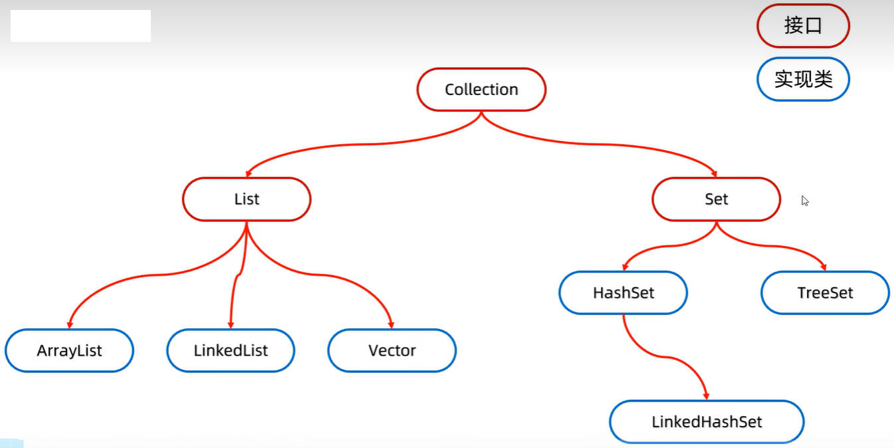

# Java 常见 API 集合进阶之、集合体系结构、Collection 单列集合、List

Java 中有很多集合

## 一、Java 集合体系结构

Java 中的集合，可分为两类：

- Collection 单列集合，添加数据时，添加一个元素。
- Map 双列集合，添加数据时，添加一对数据。

## 二、Java Collection 单列集合

Collection 接口，的继承体系结构，如下图所示：



Collection 是单列集合的祖宗接口，它的功能是全部单列集合都可以继承使用的。

List 系列集合实现了 Collection 接口，实现 List 接口的类，其对象要求添加的元素是有序、可重复、有索引的。

- 有序：指的是存、取的元素（遍历）顺序是一致的（与元素值的大小顺序无关）。
- 可重复：表示集合中存储的元素，是可重复的。
- 有索引，表示可以通过索引，获取集合中存放的元素。

> Vector 再 JDK1.2 时就已经弃用。

Set 系列集合实现了 Collection 接口，与 List 系列集合相反，实现 Set 接口的类，其对象要求添加的元素无序、不重复、无索引。

- 无序：指的是存、取的元素顺序是不一致的。
- 不重复：表示集合中存储的元素，是不可重复的。可用于做去重。
- 无索引，表示不能通过索引，获取集合中存放的元素。

### 1.Collection 接口中的方法

Collection 接口中有如下方法：

| 方法名                              | 说明                               |
| :---------------------------------- | :--------------------------------- |
| `public boolean add(E e)`           | 添加元素                           |
| `public void clear()`               | 清空集合中的元素                   |
| `public boolean remove(Object o)`   | 从集合中移除指定的元素             |
| `public boolean removeIf(Object o)` | 根据条件进行移除                   |
| `public boolean contains(Object o)` | 判断集合中是否存在指定的元素       |
| `public boolean isEmpty()`          | 判断集合是否为空                   |
| `public int size()`                 | 集合的长度，也就是集合中元素的个数 |

Collection 是一个接口，不能直接创建对象，必须用它的实现类创建对象。下方用 ArrayList 实现类做演示。

#### 1.add(E e) 方法

`public boolean add(E e)` 方法的使用，用于添加元素；其中有如下细节：

- 细节 1：如果给 List 系列集合中添加数据，那么方法永远返回 `true`，因为 List 系列集合允许元素的重复。
- 细节 2：如果给 Set 系列集合中添加数据，添加的元素不存在，返回 `true`；否则，返回 `false`；

demo-project/base-code/Day22/src/com/kkcf/collection/MyCollectionDemo01.java

```java
package com.kkcf.collection;

import java.util.ArrayList;
import java.util.Collection;

public class MyCollectionDemo01 {
    public static void main(String[] args) {
        Collection<String> coll = new ArrayList<>();

        boolean flag = coll.add("aaa");

        System.out.println(flag);
    }
}
```

#### 2.clear 方法

`public void clear()` 方法的使用，用于清空集合：

demo-project/base-code/Day22/src/com/kkcf/collection/MyCollectionDemo01.java

```java
package com.kkcf.collection;

import java.util.ArrayList;
import java.util.Collection;

public class MyCollectionDemo01 {
    public static void main(String[] args) {
        Collection<String> coll = new ArrayList<>();

        coll.add("aaa");
        coll.add("bbb");
        coll.add("ccc");

        System.out.println(coll); // [aaa, bbb, ccc]

        coll.clear();

        System.out.println(coll); // []
    }
}
```

#### 3.remove 方法

`public boolean remove(Object o)` 方法的使用，用于删除集合中的元素，返回一个布尔值，表示删除是否成功。

- 细节 1：Collection 接口里定义的是共性的方法，因为 Set 系列集合没有索引，所以该方法不能通过索引进行删除，只能通过元素的对象进行删除。
- 细节 2：如果要删除的元素存在，返回 `true`；否则，返回 `false`。

demo-project/base-code/Day22/src/com/kkcf/collection/MyCollectionDemo01.java

```java
package com.kkcf.collection;

import java.util.ArrayList;
import java.util.Collection;

public class MyCollectionDemo01 {
    public static void main(String[] args) {
        Collection<String> coll = new ArrayList<>();

        coll.add("aaa");
        coll.add("bbb");
        coll.add("ccc");

        System.out.println(coll); // [aaa, bbb, ccc]

        boolean flag = coll.remove("aaa");
        System.out.println(flag); // true

        System.out.println(coll); // [bbb, ccc]
    }
}
```

#### 4.contanis 方法

`public boolean contains(Object o)` 方法的使用，用于判断集合中是否存在某一个元素。

- 细节 1：底层是依赖元素对象的 `equals` 方法，进行判断的。

demo-project/base-code/Day22/src/com/kkcf/collection/MyCollectionDemo01.java

```java
package com.kkcf.collection;

import java.util.ArrayList;
import java.util.Collection;

public class MyCollectionDemo01 {
    public static void main(String[] args) {
        Collection<String> coll = new ArrayList<>();

        coll.add("aaa");
        coll.add("bbb");
        coll.add("ccc");

        boolean flag = coll.contains("ddd");
        System.out.println(flag); // false

        System.out.println(coll); // [bbb, ccc]
    }
}
```

#### 5.isEmpty 方法

`public boolean isEmpty()` 方法，用于判断集合是否为空。

demo-project/base-code/Day22/src/com/kkcf/collection/MyCollectionDemo01.java

```java
package com.kkcf.collection;

import java.util.ArrayList;
import java.util.Collection;

public class MyCollectionDemo01 {
    public static void main(String[] args) {
        Collection<String> coll = new ArrayList<>();

        coll.add("aaa");
        coll.add("bbb");
        coll.add("ccc");

        boolean flag = coll.isEmpty();
        System.out.println(flag); // false
    }
}
```

#### 6.size 方法

`public int size()` 方法，用于获取集合中有多少元素。

demo-project/base-code/Day22/src/com/kkcf/collection/MyCollectionDemo01.java

```java
package com.kkcf.collection;

import java.util.ArrayList;
import java.util.Collection;

public class MyCollectionDemo01 {
    public static void main(String[] args) {
        Collection<String> coll = new ArrayList<>();

        coll.add("aaa");
        coll.add("bbb");
        coll.add("ccc");

        int size = coll.size();
        System.out.println(size); // 3
    }
}
```

### 2.Collection 的遍历方式

Collection 单列集合的遍历方式，有三种：

- 迭代器遍历；
- 增强 for 遍历；
- forEach + Lambda 表达式遍历。

> 以上的遍历方式，是 Collection 接口实现类的通用方式。
>
> 以前使用的普通的 for 遍历，只适用于 List 集合，因为 Set 集合没有索引。

#### 1.Collection 迭代器遍历

迭代器的对象，可以从头开始，获取集合中的元素。

迭代器不依赖索引。它通过指针移动的方式，获取元素。

Java 中的迭代器类是 Iterator，用于集合的遍历。

Collection 接口中，用于获取迭代器的      方法如下

| 方法名                   | 说明                                      |
| ------------------------ | ----------------------------------------- |
| `Iterator<E> iterator()` | 返回迭代器对象，默认指向当前集合的 0 索引 |

Iterator 接口中常用方法：

| 方法名              | 说明                                                      |
| ------------------- | --------------------------------------------------------- |
| `boolean hasNext()` | 判断当前位置是否有元素，有则返回 `true`；否则返回 `false` |
| `E next()`          | 返回当前位置的元素，并将迭代器对象移向下一个位置          |

demo-project/base-code/Day22/src/com/kkcf/collection/MyCollectionDemo02.java

```java
package com.kkcf.collection;

import java.util.ArrayList;
import java.util.Collection;
import java.util.Iterator;

public class MyCollectionDemo02 {
    public static void main(String[] args) {
        Collection<String> coll = new ArrayList<>();

        coll.add("aaa");
        coll.add("bbb");
        coll.add("ccc");

        // 获取迭代器对象
        Iterator<String> it = coll.iterator();

        // 迭代器遍历
        while (it.hasNext()){
            String str = it.next();
            System.out.println(str);
        }
    }
}
```

迭代器遍历的细节：

- 当迭代器指针，指向没有元素的位置时，再调用 `next` 方法，会报错 `NoSuchElementException`。
- 迭代器遍历完毕，指针不会复位；要重头遍历，要重新创建一个迭代器对象。
- 在遍历时，每个循环体，最好只调用一次 `next` 方法。不然容易报错 `NoSuchElementException`
- 迭代器遍历的过程中，不能用集合的 `add`、`remove` 方法，进行增加、删除的操作，否则会报错 `ConcurrentModificationException` 表示并发修改异常。
  - 如果要删除元素，应使用迭代器中的 `remove` 方法删除元素。
  - 如果要添加元素，暂时还没有办法。

demo-project/base-code/Day22/src/com/kkcf/collection/MyCollectionDemo02.java

```java
package com.kkcf.collection;

import java.util.ArrayList;
import java.util.Collection;
import java.util.Iterator;

public class MyCollectionDemo02 {
    public static void main(String[] args) {
        Collection<String> coll = new ArrayList<>();

        coll.add("aaa");
        coll.add("bbb");
        coll.add("ccc");
        coll.add("ddd");
        coll.add("eee");

        // 获取迭代器对象
        Iterator<String> it = coll.iterator();

        // 迭代器遍历
        while (it.hasNext()) {
            String str = it.next();

            if ("bbb".equals(str)) it.remove();
        }

        System.out.println(coll); // [aaa, ccc, ddd, eee]
    }
}
```

#### 2.Collection 增强 for 遍历

在 JDK5 出现了增强 for 遍历，底层也是用迭代器遍历实现的。

所有的 Collection 单列集合，以及数组，都可以使用增强 for 遍历（双列集合不行）。

增强 for 的书写格式如下：

```java
for(元素的数据类型 变量名 : 数组或者单列集合) {

}
```

demo-project/base-code/Day22/src/com/kkcf/collection/MyCollectionDemo03.java

```java
package com.kkcf.collection;

import java.util.ArrayList;
import java.util.Collection;

public class MyCollectionDemo03 {
    public static void main(String[] args) {
        Collection<String> coll = new ArrayList<>();

        coll.add("aaa");
        coll.add("ccc");
        coll.add("ddd");

        for (String s : coll) {
            System.out.println(s);
        }
    }
}
```

细节：修改增强 for 循环中的第三方变量，不会改变集合中原本的数据。

demo-project/base-code/Day22/src/com/kkcf/collection/MyCollectionDemo03.java

```java
package com.kkcf.collection;

import java.util.ArrayList;
import java.util.Collection;

public class MyCollectionDemo03 {
    public static void main(String[] args) {
        Collection<String> coll = new ArrayList<>();

        coll.add("aaa");
        coll.add("ccc");
        coll.add("ddd");

        for (String s : coll) {
            s = "xxx";
        }

        System.out.println(coll); // [aaa, ccc, ddd]
    }
}
```

#### 3.Collection forEach + Lambda 表达式遍历

JDK8 以后，出现了 Lambda 表达式，可用于书写更简单，更直接的遍历集合的方式：

底层使用的是 Collection 接口中的 `forEach` 方法（继承自 Iterable 接口）：

| 方法名                                             | 说明                   |
| -------------------------------------------------- | ---------------------- |
| `default void forEach(Consumer<? super T> action)` | 结合 Lambda 遍历集合。 |

先使用 `forEach` 方法，结合匿名内部类的方式，进行遍历：

demo-project/base-code/Day22/src/com/kkcf/collection/MyCollectionDemo03.java

```java
package com.kkcf.collection;

import java.util.ArrayList;
import java.util.Collection;
import java.util.function.Consumer;

public class MyCollectionDemo03 {
    public static void main(String[] args) {
        Collection<String> coll = new ArrayList<>();

        coll.add("aaa");
        coll.add("ccc");
        coll.add("ddd");

        coll.forEach(new Consumer<String>() {
            @Override
            public void accept(String s) {
                System.out.println(s);
            }
        });
    }
}
```

- `forEach` 方法中，也会自己遍历集合，依次得到每一个元素；
- 然后把得到的元素，传递给 `Consumer` 接口中的 `accept` 方法。
- `Consumer` 接口，是一个函数式接口。

使用 Lambda 表达式，优化上方的代码：

demo-project/base-code/Day22/src/com/kkcf/collection/MyCollectionDemo03.java

```java
package com.kkcf.collection;

import java.util.ArrayList;
import java.util.Collection;

public class MyCollectionDemo03 {
    public static void main(String[] args) {
        Collection<String> coll = new ArrayList<>();

        coll.add("aaa");
        coll.add("ccc");
        coll.add("ddd");

        coll.forEach(s -> System.out.println(s));
    }
}
```

三种遍历方式使用场景：

- 迭代器遍历，当需要在遍历时，删除集合中的元素，可使用迭代器遍历。
- 增强 for 遍历、forEach + Lambda 遍历，用于单纯的集合遍历。

## 三、List 集合

List 集合有以下特点：

- 有序：指的是存、取的元素（遍历）顺序是一致的（与元素值的大小顺序无关）。
- 可重复：表示集合中存储的元素，是可重复的。
- 有索引，表示可以通过索引，获取集合中存放的元素。

### 1.List 接口中的方法

List 集合，实现了 Collection 接口，所以 Collection 接口中的方法都有。

List 集合，因为有了索引，所以多了很多索引操作的方法，有如下方所示：

| 方法名                        | 描述                                   |
| ----------------------------- | -------------------------------------- |
| `void add(int index, E element)` | 在此集合中的指定位置插入指定的元素     |
| `E remove(int index)`           | 删除指定索引处的元素，返回被删除的元素 |
| `E set(int index, E element)`   | 修改指定索引处的元素，返回被修改的元素 |
| `E get(int index)`              | 返回指定索引处的元素                   |

#### 1.add(int i, E e) 方法

`add(int index, E element)` 方法，用于在集合中的指定索引位置，添加元素。

demo-project/base-code/Day22/src/com/kkcf/collection/MyCollectionDemo03.java

```java
package com.kkcf.collection;

import java.util.ArrayList;
import java.util.List;

public class MyCollectionDemo03 {
    public static void main(String[] args) {
        List<String> coll = new ArrayList<>();

        coll.add("aaa");
        coll.add("ccc");
        coll.add("ddd");

        coll.add(1, "xxx");

        System.out.println(coll); // [aaa, xxx, ccc, ddd]
    }
}
```

- 插入位置及后面的所有元素，都会往后移一位。

#### 2.remove 方法

`E remove(int index)` 方法的使用，用于删除集合中指定索引位置的元素。

```java
package com.kkcf.collection;

import java.util.ArrayList;
import java.util.List;

public class MyCollectionDemo04 {
    public static void main(String[] args) {
        List<String> list = new ArrayList<>();

        list.add("aaa");
        list.add("bbb");
        list.add("ccc");

        String remove = list.remove(0);
        System.out.println(remove); // aaa

        System.out.println(list); // [bbb, ccc]
    }
}
```

特别注意：如果 List 系列集合中，存储的是 Integer 类型的数据。

- 此时，调用集合对象的 `remove` 方法，传入一个 int 类型的数字，不会调用 `public boolean removeIf(Object o)` 将参数自动装箱为 Integer 类型；
- 而是会调用 `E remove(int index)` 方法，表示删除指定索引位置的元素。

demo-project/base-code/Day22/src/com/kkcf/collection/MyCollectionDemo04.java

```java
package com.kkcf.collection;

import java.util.ArrayList;
import java.util.List;

public class MyCollectionDemo04 {
    public static void main(String[] args) {
        List<Integer> list = new ArrayList<>();

        list.add(1);
        list.add(2);
        list.add(3);

        Integer remove = list.remove(1);
        System.out.println(remove); // 2

        System.out.println(list); // [1, 3]
    }
}
```

- Java 中，在调用方法的时候，如果该方法与其它方法有重载关系，那么优先调用与形参类型一致的那个方法。

#### 3.set 方法

`E set(int index, E element)` 方法，用于修改指定索引处的元素，返回被修改的元素。

demo-project/base-code/Day22/src/com/kkcf/collection/MyCollectionDemo04.java

```java
package com.kkcf.collection;

import java.util.ArrayList;
import java.util.List;

public class MyCollectionDemo04 {
    public static void main(String[] args) {
        List<String> list = new ArrayList<>();

        list.add("aaa");
        list.add("bbb");
        list.add("ccc");

        String str = list.set(1, "qqq");
        System.out.println(str); // bbb

        System.out.println(list); // [aaa, qqq, ccc]
    }
}
```

#### 3.get 方法

`E get(int index)` 方法的使用，用于返回指定索引处的元素。

demo-project/base-code/Day22/src/com/kkcf/collection/MyCollectionDemo04.java

```java
package com.kkcf.collection;

import java.util.ArrayList;
import java.util.List;

public class MyCollectionDemo04 {
    public static void main(String[] args) {
        List<String> list = new ArrayList<>();

        list.add("aaa");
        list.add("bbb");
        list.add("ccc");

        String s = list.get(1);
        System.out.println(s); // bbb
    }
}
```

### 2.List 的遍历方式

List 接口继承自 Collection 接口，所以 Collection 的遍历方式，List 都可以使用；

除此之外，List 还有两种特有的遍历方式：

#### 1.List 普通 for 循环遍历

以前用过很多次。

demo-project/base-code/Day22/src/com/kkcf/collection/MyCollectionDemo04.java

```java
package com.kkcf.collection;

import java.util.ArrayList;
import java.util.List;

public class MyCollectionDemo04 {
    public static void main(String[] args) {
        List<String> list = new ArrayList<>();

        list.add("aaa");
        list.add("bbb");
        list.add("ccc");

        for (int i = 0; i < list.size(); i++) {
            String s = list.get(i);
            System.out.println(s);
        }
    }
}
```

#### 2.List 列表迭代器遍历

在 Java 中，`ListIterator` 接口表示列表迭代器。它继承自 `Iterator` 接口。

使用 `ListIterator` 遍历的时候，运行添加元素，使用 `ListIterator` 的 `void add(E e)` 方法。

demo-project/base-code/Day22/src/com/kkcf/collection/MyCollectionDemo04.java

```java
package com.kkcf.collection;

import java.util.ArrayList;
import java.util.List;
import java.util.ListIterator;

public class MyCollectionDemo04 {
    public static void main(String[] args) {
        List<String> list = new ArrayList<>();

        list.add("aaa");
        list.add("bbb");
        list.add("ccc");

        // 获取列表迭代器
        ListIterator<String> lit = list.listIterator();

        // 使用迭代器遍历
        while (lit.hasNext()) {
            String s = lit.next();

            if ("bbb".equals(s)) lit.add("qqq");
        }

        System.out.println(list); // [aaa, bbb, qqq, ccc]
    }
}
```

ListIterator 接口中，还有 `hasPrevious`、`previous` 方法，它们与 `hasNext` 、`next` 方法作用相反，了解即可。

List 遍历方式总结：

- 在遍历时，如果要添加元素，就用列表迭代器的方式。
- 单纯的遍历，使用增强 for 遍历，或者 forEach 方法结合 Lambda 表达式遍历。
- 在遍历时，要操作索引，只能用普通 for 遍历。
