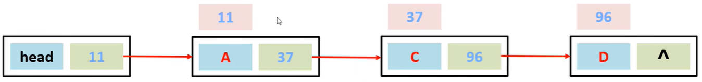
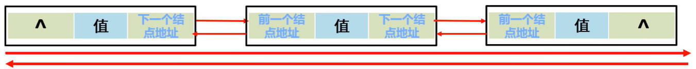

# Java 常见 API 集合进阶之数据结构、ArrayList、LinkedList、Iterator

## 一、Java 数据结构

数据结构，就是计算机存储，组织数据的方式。

不同的业务场景，要使用不同的数据结构，来提高操作（存储、获取）数据的效率。

数据结构的三个要素：

- 每种数据结构长什么样子？
- 如何添加、删除数据？
- 如何修改、查找数据？

### 1.Java 栈结构

栈结构的特点是：先进后出，后进先出。

数据进入栈的过程，称为“压栈”；数据退出栈的过程，称为“弹栈”；

JVM 虚拟机中的栈内存，就是一种栈结构。

### 2.Java 队列结构

队列结构的特点是：先进先出，后进后出。

数据进入队列的过程，称为“入队列”；数据离开队列的过程，称为“出队列”。

### 3.Java 数组结构

Java 中数组，在内存中是一片连续的空间。

数组中元素的查询，速度快：

- 通过索引，直接定位元素；
- 查询任意索引的元素，耗时相同。

数组中元素的添加、删除，效率低：

- 将元素删除的同时，还要将后面所有的元素，向前移一位。
- 将元素添加到指定索引的同时，还要将该索引后面所有的元素，向后移一位。
- 如果添加元素之前，数组已经存满，那么还要创建新数组。

所以，数组是查询快；添加、删除慢的数据结构。

### 4.Java 链表结构

链表结构中的每一个元素，称为一个结点。

链表中的结点，是独立对象，在内存中是不连续的；

每个结点包含

- 数据值；
- 下一个结点的地址值。



链表中，元素的查询，效率低：

- 无论查询哪个元素，都要从头开始，挨个查找结点。

链表中，元素的添加、删除速度快：

- 插入结点，只要修改位置上一个结点记录的地址值，并将插入节点中保存的地址值，指向下一个结点即可。
- 删除结点，只要删除位置上一个结点记录的地址值，并将删除节点中保存的地址值，置为 `null`。

在链表的基础上，还可以拓展双向链表的概念，即一个结点中，存储了

- 数据值；
- 前结点地址值；
- 后结点地址值。

当查询链表中第 n 个结点时：

- 先判断该结点离头结点近，还是离尾结点近；
- 再从近的一端开始挨个查找。查找效率稍微提升了。



## 二、ArrayList 底层原理

`ArrayList` 底层使用数组来实现。类中的成员 `size` 属性，表示容器的长度，也表示下一个元素要插入的位置。

`ArrayList` 类中，不但有 `add` 方法，还有 `addAll` 方法，用于一次性添加很多元素。所以在容器扩容时要考虑这种情况。

`ArrayList` 空参构造创建的集合对象：

1.会在底层创建一个默认长度为 `0` 的数组 `elementData`；

java/util/ArrayList.java

```java
transient Object[] elementData; // non-private to simplify nested class access

private int size;

//...

private static final Object[] DEFAULTCAPACITY_EMPTY_ELEMENTDATA = {};

public ArrayList() {
    this.elementData = DEFAULTCAPACITY_EMPTY_ELEMENTDATA;
}
```

2.当添加一个元素时，底层会创建一个新的长度为 `10` 的数组。

java/util/ArrayList.java

```java
public boolean add(E e) {
    modCount++;
    add(e, elementData, size);
    return true;
}

private void add(E e, Object[] elementData, int s) {
    if (s == elementData.length)
        elementData = grow();
    elementData[s] = e;
    size = s + 1;
}
```

- 如果数组已满，调用 `grow` 方法，进行扩容。

3.当数组存满时，会扩容 1.5 倍。并把原数组中的元素拷贝过来。

java/util/ArrayList.java

```java
private Object[] grow() {
    return grow(size + 1);
}

private Object[] grow(int minCapacity) {
    int oldCapacity = elementData.length;
    if (oldCapacity > 0 || elementData != DEFAULTCAPACITY_EMPTY_ELEMENTDATA) {
        int newCapacity = ArraysSupport.newLength(oldCapacity,
                minCapacity - oldCapacity, /* minimum growth */
                oldCapacity >> 1           /* preferred growth */);
        return elementData = Arrays.copyOf(elementData, newCapacity);
    } else {
        return elementData = new Object[Math.max(DEFAULT_CAPACITY, minCapacity)];
    }
}
```

- `newCapacity` 表示扩容后新数组的长度。
- `newLength` 方法用于计算新数组的长度。

4.如果一次添加多个元素，1.5 倍还放不下，则新创建的数组的长度以实际为准。

jdk/internal/util/ArraysSupport.java

```java
public static int newLength(int oldLength, int minGrowth, int prefGrowth) {
    // preconditions not checked because of inlining
    // assert oldLength >= 0
    // assert minGrowth > 0

    int prefLength = oldLength + Math.max(minGrowth, prefGrowth); // might overflow
    if (0 < prefLength && prefLength <= SOFT_MAX_ARRAY_LENGTH) {
        return prefLength;
    } else {
        // put code cold in a separate method
        return hugeLength(oldLength, minGrowth);
    }
}
```

- `Math.max(minGrowth, prefGrowth)` 表达式分析：
  - 第一种情况，如果一次添加一个元素，那么 `prefGrouwth` 参数一定是 1，表示此时数组只要扩容一个单位就可以了。
  - 第二种情况，如果一次添加多个元素，比如 100，那么第 `prefGrowth` 参数是 100，表示此时数组需要扩容 100 个长度才可以。

## 三、LinkedList 底层原理

`LinkedList` 底层数据结构是双向链表，查询慢；增、删快；但是如果操作的是首尾元素，速度也是极快的。

`LinkedList` 接口中，有很多直接操作首尾元素的 API。如下方所示：

| 方法名                      | 说明                             |
| --------------------------- | -------------------------------- |
| `public void addFirst(E e)` | 在该列表开头插入指定的元素       |
| `public void addLast(E e)`  | 将指定的元素追加到此列表的末尾   |
| `public E getFirst()`       | 返回此列表中的第一个元素         |
| `public E getLast()`        | 返回此列表中的最后一个元素       |
| `public E removeFirst()`    | 从此列表中删除并返回第一个元素   |
| `public E removeLast()`     | 从此列表中删除并返回最后一个元素 |

`LinkedList` 类中，有一个内部类 `Node`，表示结点。

java/util/LinkedList.java

```java
private static class Node<E> {
    E item;
    Node<E> next;
    Node<E> prev;

    Node(Node<E> prev, E element, Node<E> next) {
        this.item = element;
        this.next = next;
        this.prev = prev;
    }
}
```

`LinkedList` 类中，有三个关键的成员变量：

- `size`：表示集合的长度，也表示结点的总个数。
- `first`，表示头结点。
- `last`，表示尾结点，

java/util/LinkedList.java

```java
transient int size = 0;

/**
 * Pointer to first node.
 */
transient Node<E> first;

/**
 * Pointer to last node.
 */
transient Node<E> last;
```

`LinkedList` 空参构造：当利用它创建一个空的 `LinkedList` 集合对象时，上面的三个成员变量，就被默认初始化了。

java/util/LinkedList.java

```java
public LinkedList() {
}
```

在 `LinkedList` 集合对象中，添加元素

java/util/LinkedList.java

```java
public boolean add(E e) {
    linkLast(e);
    return true;
}

void linkLast(E e) {
    final Node<E> l = last;
    final Node<E> newNode = new Node<>(l, e, null);
    last = newNode;
    if (l == null)
        first = newNode;
    else
        l.next = newNode;
    size++;
    modCount++;
}
```

当在 `LinkedList` 集合对象中，添加元素时，它的内存表现如下：


## 四、Iterator 底层原理

当使用 `ArrayList` 集合对象，获取迭代器对象时，要调用 `iterator` 方法。

java/util/ArrayList.java

```java
public Iterator<E> iterator() {
    return new Itr();
}

private class Itr implements Iterator<E> {
    int cursor;       // index of next element to return
    int lastRet = -1; // index of last element returned; -1 if no such
    int expectedModCount = modCount;

    // prevent creating a synthetic constructor
    Itr() {}

    public boolean hasNext() {
        return cursor != size;
    }

    @SuppressWarnings("unchecked")
    public E next() {
        checkForComodification();
        int i = cursor;
        if (i >= size)
            throw new NoSuchElementException();
        Object[] elementData = ArrayList.this.elementData;
        if (i >= elementData.length)
            throw new ConcurrentModificationException();
        cursor = i + 1;
        return (E) elementData[lastRet = i];
    }
}
```

- `iterator` 方法，底层创建了一个 `Itr` 内部类对象，
- `cursor` 是迭代器里的游标，默认指向 `0` 索引的位置。
- `lastRet` 表示上一次操作的索引。
  - `modCount` 表示集合被修改的次数。每次用集合对象，删除、添加元素，该变量都会自增。
- `checkForComodification` 方法，会检查 `modCount` 最新记录的次数，跟一开始记录的次数是否相同。
  - 相同，证明当前集合没有发生改变。
  - 不相同，证明在迭代器遍历集合的过程中，使用了集合中的方法添加，或删除元素。会报并发修改异常 `ConcurrentModificationException` 的错误。
- 为避免迭代器遍历时，发生并发修改异常：不要使用集合对象的方法，添加、修改元素即可。
