# Java 常见 API 集合进阶-数据结构之树（Tree）结构

树结构，由一个个结点（或节点）组成。

结点与结点之间的关系有：父结点，左子结点、右子结点。

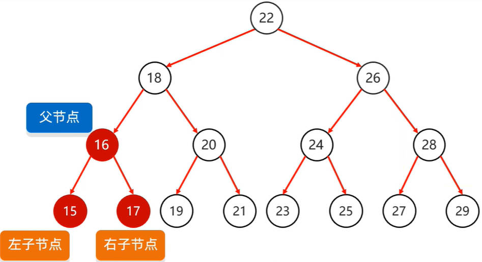

每个结点中，存储了

- 元素值；
- 父结点地址值；
- 左子结点地址值；
- 右子结点地址值。

如果一个结点，没有父结点，或者子结点，那么相应的位置记为 `null`。

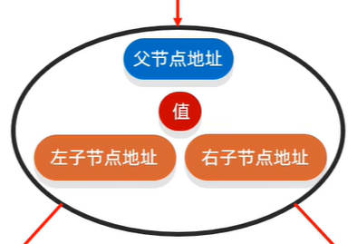

树结构中的专业名词：

- 度：每一个结点的子结点数量。
- 高度：树结构的层数，上图中的二叉树，就是一个高度为 4 的树。
- 根结点：树结构中最顶层的结点。
- 左子结点：当前结点左下方的结点。
- 右子结点：当前结点右下方的结点。
- 左子树：结点左下方的子树。
- 右子树：结点右下方的子树。

## 一、二叉树

在树结构中，任意结点的度，都小于等于 2 的树，称为**二叉树**。

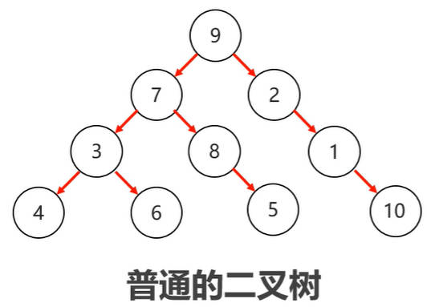

### 1.二叉树遍历

二叉树，有四种遍历方式：

- **前序遍历**：指的是从根结点开始，按照**当前结点，左子结点、右子结点**的顺序遍历。
- **中序遍历**（用得较多）：指的是从根结点开始，按照**左子结点，当前结点，右子结点**的顺序遍历。
  - 使用这种遍历方式，遍历二叉查找树，会按照升序的顺序遍历。
- **后序遍历**：指的是从根结点开始，按照**左子结点，右子结点，当前结点**的顺序遍历。
- **层序遍历**：从根结点开始，一层一层的进行遍历。

二叉树的弊端：元素存储毫无规律，查找时必须要挨个遍历查找。

## 二、二叉查找树

二叉查找树，又称为“二叉排序树”、“二叉搜索树”。

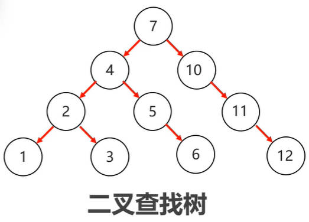

二叉查找树，有如下特点：

- 每一个结点上，最多有两个子结点
- 任意结点，左子树上所有结点的值，都小于当前结点的值
- 任意结点，右子树上所有结点的值，都大于当前结点的值

二叉查找树，在存入元素的时候，遵循的规则是：

- 小的存（查）左边；
- 大的存（查）右边；
- 一样的不存。

二叉查找树的弊端：

- 当二叉查找树结点分布不均匀时，接近于链表的结构，查询效率慢。

## 三、平衡二叉树

平衡二叉树要求：

- 在二叉查找树的基础上，**任意结点**左右子树高度差，不超过 1；
- 任意结点的左右两个子树，都是一颗平衡二叉树。

平衡二叉树，保持平衡要靠**旋转机制**。

- 旋转触发时机：当添加一个结点之后，该树不再是一颗平衡二叉树时。
- 旋转的规则：左旋；右旋。

平衡二叉树，旋转的步骤：

1. 从添加的结点开始，不断的往父结点找不平衡的结点。找到的不平衡结点，作为**支点**，
1. 进行左旋，或者右旋。

### 1.平衡二叉树旋转情况

#### 1.左旋-支点无左子结点

左旋情况一，支点没有左子结点：

1. 从添加的结点开始，找到支点（不平衡的结点）；
2. 晋升支点的右子结点，把支点左旋降级为该结点的左子结点。。

旋转前：

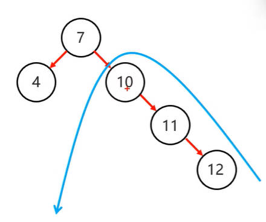

旋转后：

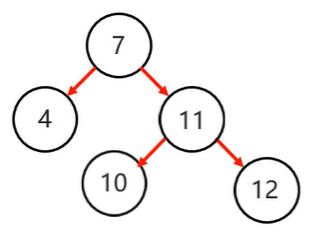

#### 2.左旋-支点有左子结点

左旋情况二，支点有左子结点：

1. 从添加的结点开始，找到支点（不平衡的结点）；
2. 晋升支点的右子结点；
   1. 把支点左旋降级为该结点（晋升的右子结点）的左子结点。
   2. 把该结点（晋升的右子结点）的左子结点，出让给降级支点，作为它的右子结点。

旋转前：

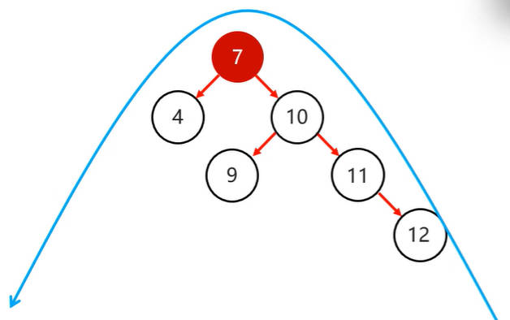

旋转后：

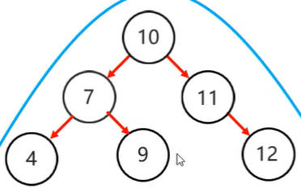

#### 3.右旋-支点无右子结点

右旋情况一，支点没有右子结点：

1. 从添加的结点开始，找到支点（不平衡的结点）；
2. 晋升支点的左子结点，把支点右旋降级为该结点的右子结点。

旋转前：

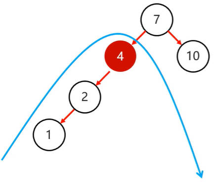

旋转后：

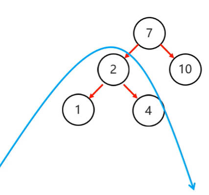

#### 4.右旋-支点有右子结点

右旋情况一，支点有右子结点：

1. 从添加的结点开始，找到支点（不平衡的结点）；
2. 晋升支点的左子结点，
   1. 把支点右旋，降级为该结点（晋升的左子结点）的右子结点。
   2. 把该结点（晋升的左子结点）的右子结点，出让给降级支点，作为它的左子结点。

旋转前：

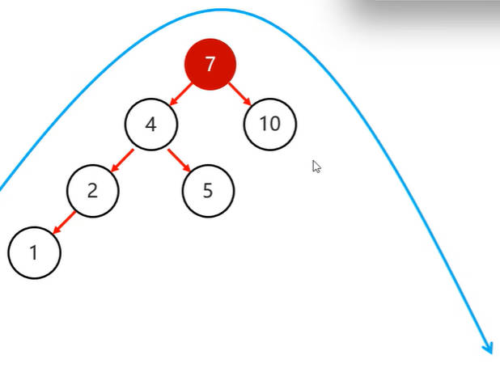

旋转后：

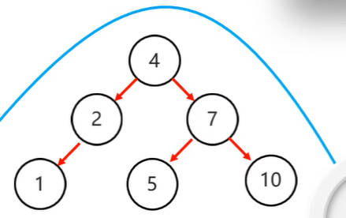

### 2.平衡二叉树旋转机制

#### 1.左左-一次右旋

左左: 当根结点左子树的左子树，有结点插入，导致二叉树不平衡

如何旋转：对整体进行**一次右旋**即可。

#### 2.左右-先左旋后右旋

左右: 当根结点左子树的右子树，有结点插入，导致二叉树不平衡

如何旋转：先在局部左子树对应的结点位置，进行左旋，再对整体进行右旋

在局部左子树对应的结点位置进行左旋：

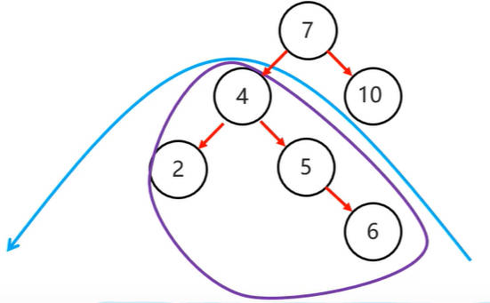

得到：

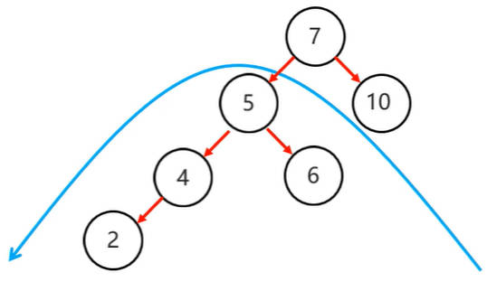

再对整体进行右旋：

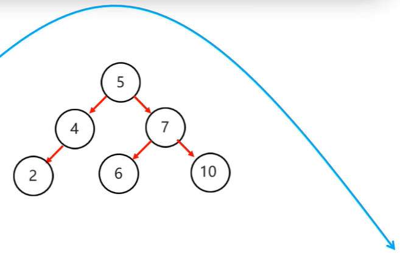

#### 3.右右-一次左旋

右右: 当根结点右子树的右子树，有结点插入，导致二叉树不平衡。

如何旋转: 直接对整体进行**一次左旋**即可。

#### 4.右左-先右旋再左旋

右左：当根结点右子树的左子树，有结点插入，导致二叉树不平衡。

如何旋转：先在右子树对应的结点位置，进行局部右旋，再对整体进行左旋。

先在右子树对应的结点位置进行局部右旋:

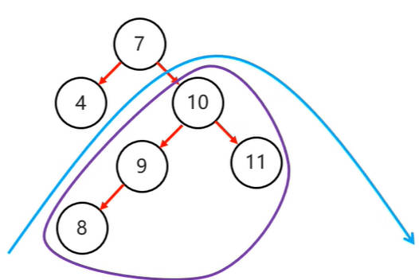

得到：

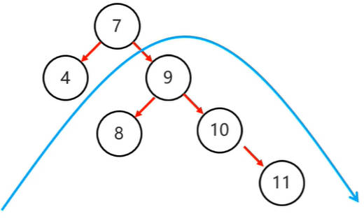

再对整体进行左旋：

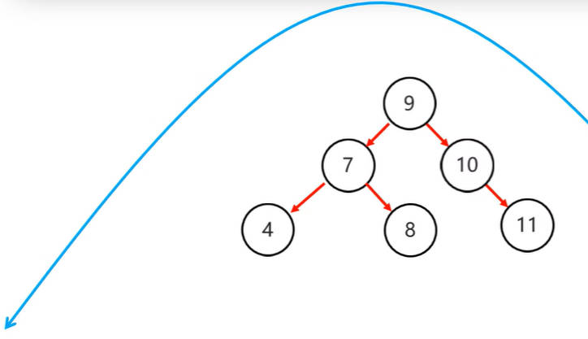

平衡二叉树优势，查找效率高；

平衡二叉树弊端：增、删结点，效率低（旋转次数过多）。

## 四、红黑树

1972 年出现“平衡二叉 B 树”，1978 年改名为如今的“红黑树”。

红黑树，是一种自平衡的**二叉查找树**，是计算机科学中，用到的一种数据结构。

它的每一个结点上，都有表示结点颜色（红或黑）的存储位。

红黑树**不是高度平衡的**，它的平衡通过“**红黑规则**”实现。

### 1.红黑规则

红黑规则，有以下 5 点：

1. 每一个结点要么是红色的，要么是黑色的；

2. 根结点必须是黑色；

3. 如果一个结点没有子结点，或者父结点，则该结点相应的指针属性值为 **Nil**，称为**叶结点,**，每个叶结点（Nill）都是黑色的。

4. 如果某一个结点是红色，那么它的子结点和父节点，必须是黑色（不能出现两个红色结点相连的情况）。

5. 对于每一个结点，从该结点到其所有后代叶结点（Nill）的简单路径上，均包含相同数目的黑色结点。

> 简单路径：只能向后找，不能向前找的路径。

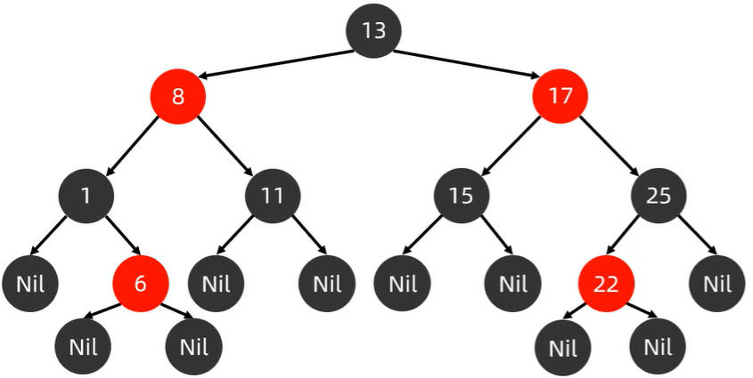

红黑树中的每个结点中，存放了以下数据：

- 父结点地址值。
- 元素值
- 左子结点地址值。
- 右子结点地址值。
- 颜色值。

红黑树，添加结点时，默认是红色的，然后根据红黑规则判断是否要调整它的颜色；这种做法效率最高。

红黑树，添加结点的规则：

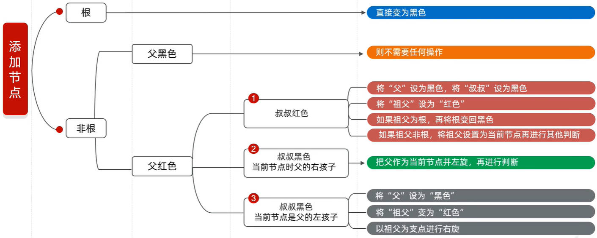

红黑树，增、删、改、查性能都比较高。
