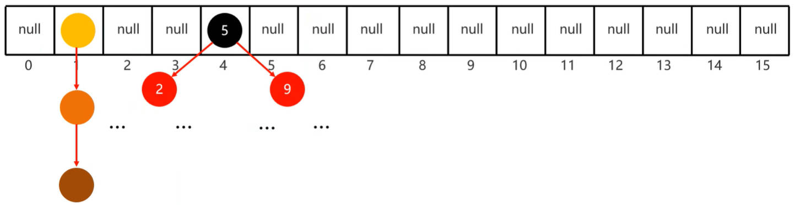
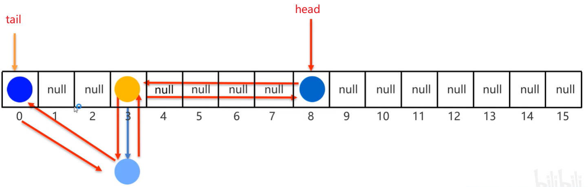

# Java 常见 API 集合进阶之 Set 系列集合

`Set` 系列集合实现了 `Collection` 接口；

与 `List` 系列集合相反，实现 `Set` 接口的集合类，其对象要求其中的元素：

- **无序**：指的是存、取的元素（遍历）顺序是不一致的。
- **不重复**：表示集合中存储的元素，是不可重复的。可用于做去重。
- **无索引**，表示不能通过索引，获取集合中存放的元素。

`Set` 集合的实现类；

- `HashSet`：特点是：无序、不重复、无索引；
- `LinkedHashSet`：特点是：有序、不重复、无索引；
- `TreeSet`：特点是：可排序、不重复、无索引。

案例理解；使用 `Set` 系列集合，添加字符串；

并使用多种方式遍历：

1. 迭代器遍历；
2. 增强 for 遍历；
3. forEach 方法结合 Lambda 表达式。

demo-project/base-code/Day23/src/com/kkcf/set/SetDemo01.java

```java
package com.kkcf.set;

import java.util.HashSet;
import java.util.Set;

public class SetDemo01 {
    public static void main(String[] args) {
        Set<String> set = new HashSet<>();

        // 使用 Set 系列集合的 add 方法，要处理返回值，因为有可能添加不成功。
        boolean flag1 = set.add("张三");
        boolean flag2 = set.add("张三");

        System.out.println(flag1); // true
        System.out.println(flag1); // false

        set.add("李四");
        set.add("王五");

        // Set 系列集合是无序的
        System.out.println(set); // [李四, 张三, 王五]

        // 使用迭代器遍历
        Iterator<String> it = set.iterator();
        while (it.hasNext()) {
            String s = it.next();
            System.out.println(s);
        }

        // 使用增强 for 遍历
        for (String s : set) {
            System.out.println(s);
        }

        // 使用 forEach 方法结合匿名内部类遍历
        /*set.forEach(new Consumer<String>() {
            @Override
            public void accept(String s) {
                System.out.println(s);
            }
        });*/
        // 使用 forEach 方法结合 Lambda 表达式遍历
        set.forEach(s -> System.out.println(s));
    }
}
```

## 一、HashSet 集合

`HashSet` 特点：无序、不重复、无索引。

### 1.哈希表

`HashSet` 集合，底层采用**哈希表**结构存储数据。这是一种增、删、改、查性能都比较高的数据结构。

### 2.哈希值

哈希表中，有一个重要的概念：**哈希值**。

- Java 中的哈希值，是实例对象调用它的 `hashCode` 方法，计算出来的 int 类型的整数；
- `hashCode` 方法，定义在 `Object` 类中，默认**返回实例对象的地址值**；
- 如果自定义类中，不重写 `hashCode` 方法，那么不同实例对象，计算出来的哈希值，都是不一样的。
- 如果自定义类中，重写 `hashCode` 方法，利用对象内部的属性值，计算哈希值。那么不同的实例对象，只要属性值相同，计算出的哈希值就是一样的。

案例理解：创建一个 JavaBean 类 `Student`，并使用它创建两个实例对象，比较它俩的哈希值。

demo-project/base-code/Day23/src/com/kkcf/javabean/Student.java

```java
package com.kkcf.javabean;

public class Student {
    private String name;
    private int age;

    public Student() {
    }

    public Student(String name, int age) {
        this.name = name;
        this.age = age;
    }
  
    // getter、setter……
}
```

demo-project/base-code/Day23/src/com/kkcf/set/SetDemo02.java

```java
package com.kkcf.set;

import com.kkcf.javabean.Student;

public class SetDemo02 {
    public static void main(String[] args) {
        Student stu1 = new Student("zhangsan", 23);
        Student stu2 = new Student("zhangsan", 23);

        System.out.println(stu1.hashCode()); // 990368553
        System.out.println(stu2.hashCode()); // 1096979270
    }
}
```

- 发现这两个实例对象的哈希值是不一样的。

重写 `Student` 类中的 `hashCode` 方法，再对两个实例对象的地址值，进行比较：

demo-project/base-code/Day23/src/com/kkcf/javabean/Student.java

```java
package com.kkcf.javabean;

import java.util.Objects;

public class Student {
    private String name;
    private int age;

    public Student() {
    }

    public Student(String name, int age) {
        this.name = name;
        this.age = age;
    }

    @Override
    public boolean equals(Object o) {
        if (this == o) return true;
        if (o == null || getClass() != o.getClass()) return false;
        Student student = (Student) o;
        return age == student.age && Objects.equals(name, student.name);
    }

    @Override
    public int hashCode() {
        return Objects.hash(name, age);
    }
  
    // getter、setter……
}
```

demo-project/base-code/Day23/src/com/kkcf/set/SetDemo02.java

```java
package com.kkcf.set;

import com.kkcf.javabean.Student;

public class SetDemo02 {
    public static void main(String[] args) {
        Student stu1 = new Student("zhangsan", 23);
        Student stu2 = new Student("zhangsan", 23);

        System.out.println(stu1.hashCode()); // -1461067292
        System.out.println(stu2.hashCode()); // -1461067292
    }
}
```

- 发现这两个实例对象的哈希值一致了。

### 3.哈希碰撞

在哈希值计算时，有可能发生**哈希碰撞**。

- Java 中哈希值是 int 类型的数字，该类型取值范围是 -21 亿多～21 亿多，一共 42 亿多数字；
- 假设创建了 50 亿个对象，那么必会有 8 亿多对象的哈希值是重复的。
- 在小部分情况下，不同属性值，或者不同地址值，计算出来的哈希值也有可能是一样的，称为哈希碰撞。

哈希碰撞的情况：

demo-project/base-code/Day23/src/com/kkcf/set/SetDemo02.java

```java
package com.kkcf.set;

public class SetDemo02 {
    public static void main(String[] args) {
        System.out.println("abc".hashCode()); // 96354
        System.out.println("acD".hashCode()); // 96354
    }
}
```

`String` 类中，重写了 `hashCode` 方法：

java/lang/String.java

```java
public int hashCode() {
    // The hash or hashIsZero fields are subject to a benign data race,
    // making it crucial to ensure that any observable result of the
    // calculation in this method stays correct under any possible read of
    // these fields. Necessary restrictions to allow this to be correct
    // without explicit memory fences or similar concurrency primitives is
    // that we can ever only write to one of these two fields for a given
    // String instance, and that the computation is idempotent and derived
    // from immutable state
    int h = hash;
    if (h == 0 && !hashIsZero) {
        h = isLatin1() ? StringLatin1.hashCode(value)
                       : StringUTF16.hashCode(value);
        if (h == 0) {
            hashIsZero = true;
        } else {
            hash = h;
        }
    }
    return h;
}
```

> `String`、`Integer`……Java 提供的包装类中，已经重写好了 `hashCode`、`equals` 方法。

### 4.重写 hashCode、equals 方法的意义

当在 `HashSet` 中，存储自定义对象时，必须重写该对象类中的 `hashCode`、`equals` 方法。

- 重写 `hashCode` 方法，是为了计算元素的哈希值，将元素存入哈希表底层**数组 table** 的正确位置。
- 重写 `equals` 方法，是为了在进行元素之间的比较时，比较元素内的属性值。用于维持 `Set` 系列集合中元素的唯一性。

### 5.哈希表实现

Java 中，哈希表的实现：

- JDK8 之前，哈希表的实现是数组 + 链表；
- JDK8 以后，哈希表的实现是数组 + 链表 + 红黑树。

创建哈希表，并存入元素，具体的步骤如下：

1. 先创建一个默认长度 `16` ，默认加载因子 `0.75` 的数组（数组名为 `table`）；

2. 结合元素的哈希值，和数组长度，计算出元素应存入的位置：计算公式为：`int index = (数组长度 - 1) & 哈希值;`

3. 判断该位置是否为 `null`，

   - 是，直接存入；

   - 不是，说明该位置已经有元素形成的链表，则调用对象的 `equals` 方法，挨个比较链表中的元素与插入元素是否相等。

     - 相等，则不存（保证 `Set` 集合中元素的唯一）；

     - 不相等，则插入链表：
       - JDK8 以前，老元素挂在新元素下面。
       - JDK8 以后，新元素挂在老元素下面。

4. JDK8 以后，当数组长度大于等于 `64`，并且数组中的链表长度大于 `8` 时，该链表会转为红黑树的数据结构。



> 加载因子，表示数组的扩容时机，比如：
>
> - 加载因子为 `0.75` ，数组长度为 `16` 时；
> - 那么数组会在存储了 `16 * 0.75 = 12` 个元素后，进行扩容（默认扩容 2 倍）。

综上所述：

- `HashSet` 之所以是**无序的**、无索引的、是因为当遍历哈希表底层数组 table 时，是按照数组 table 的索引进行遍历的，这个顺序与元素添加顺序无关。
- `HashSet` 之所以是**不重复的**，是因为元素插入时，会使用该元素的 `equals` 方法进行比较，相同元素会被舍弃。

案例理解：利用 `HashSet` 集合，去除重复元素；

创建一个存储学生对象的集合，学生对象的属性值全部相同，就认为是重复的对象。

JavaBean 类复用上方的 Student 类。

demo-project/base-code/Day23/src/com/kkcf/set/SetDemo02.java

```java
package com.kkcf.set;

import com.kkcf.javabean.Student;

import java.util.HashSet;

public class SetDemo02 {
    public static void main(String[] args) {
        Student stu1 = new Student("zhangsan", 23);
        Student stu2 = new Student("lisi", 24);
        Student stu3 = new Student("wangwu", 25);
        Student stu4 = new Student("zhangsan", 23);

        HashSet<Student> stus = new HashSet<>();

        stus.add(stu1);
        stus.add(stu2);
        stus.add(stu3);
        stus.add(stu4);

        System.out.println(stus); // [Student{name='wangwu', age=25}, Student{name='lisi', age=24}, Student{name='zhangsan', age=23}]
    }
}
```

## 二、LinkedHashSet 集合

`LinkedHashSet` 集合类，继承自 `HashSet` 集合类。

`LinkedHashSet` 集合，特点是：**有序**、不重复、无索引；

- 有序，指的是它会保证元素的存入、取出（遍历）顺序是一致的。

`LinkedHashSet` 底层原理：依然使用哈希表的数据结构存储数据，只是每个元素在存入哈希表时，又额外被添加进了一个双向链表的数据结构，用于记录数据存储的顺序。如下图所示：



`LinkedHashSet` 遍历时，并非遍历哈希表底层数组 table，而是遍历双向链表结构；

所以，遍历时，会有序的遍历元素的存入顺序。

demo-project/base-code/Day23/src/com/kkcf/set/SetDemo03.java

```java
package com.kkcf.set;

import com.kkcf.javabean.Student;

import java.util.LinkedHashSet;

public class SetDemo03 {
    public static void main(String[] args) {
        LinkedHashSet<Student> stus = new LinkedHashSet<>();

        Student stu1 = new Student("zhangsan", 23);
        Student stu2 = new Student("lisi", 24);
        Student stu3 = new Student("wangwu", 25);
        Student stu4 = new Student("zhangsan", 23);

        stus.add(stu1);
        stus.add(stu2);
        stus.add(stu3);
        stus.add(stu4);

        System.out.println(stus); // [Student{name='zhangsan', age=23}, Student{name='lisi', age=24}, Student{name='wangwu', age=25}]
    }
}
```

## 三、TreeSet 集合

`TreeSet` 的特点：**可排序**、不重复、无索引

- 可排序，指的是元素被存入集合后，默认会按照元素值升序排序。

`TreeSet` 集合，底层基于红黑树实现排序；增、删、改、查性能都比较高。

当自定义对象，添加到 `TreeSet` 集合中，不需要重写 `hashCode` 、`equals` 方法。而是需要**指定该自定义对象的排序规则**；

- 根据排序规则，得到的数值如果相等，表示是同一个元素，则舍弃；

案例理解，在 `TreeSet` 集合中，存入一些数字（包装类型），打印集合；

demo-project/base-code/Day23/src/com/kkcf/set/SetDemo04.java

```java
package com.kkcf.set;

import java.util.TreeSet;

public class SetDemo04 {
    public static void main(String[] args) {
        TreeSet<Integer> treeSet = new TreeSet<>();

        treeSet.add(3);
        treeSet.add(2);
        treeSet.add(1);

        System.out.println(treeSet); // [1, 2, 3]
    }
}
```

对于 Java 提供的包装类型 `Integer`、`Double`、……默认都是**升序排序**的。

对于字符包装类 `Character`，字符串类 `String`，会按照字符在 ASCLL 码表中的数值，升序排序。

这是因为，上面这些 Java 提供的包装类，都采用了下方 `TreeSet` 默认排序规则。

### 1.TreeSet 默认排序

`TreeSet` 的默认排序，又称自然排序：

- 指的是存入 `TreeSet` 集合中的对象，它的类实现了 `Comparable` 接口，用于指定该引用类型对象之间的比较规则。

案例理解：创建 `TreeSet` 集合，并添加三个学生 `Student` 对象；

- 学生属性有姓名、年龄；
- 要求按照学生的年龄进行排序；
- 如果同年龄，就按照姓名字母进行排序。

`Student` 类，如果要存入 `TreeSet` 集合，就要实现 `Comparable`（泛型）接口，并实现其中的 `compareTo` 方法。

demo-project/base-code/Day23/src/com/kkcf/javabean/Student.java

```java
package com.kkcf.javabean;

import java.util.Objects;

public class Student implements Comparable<Student> {
    private String name;
    private int age;

    public Student() {
    }

    public Student(String name, int age) {
        this.name = name;
        this.age = age;
    }

    // getter、setter……

    // toString……

    @Override
    public int compareTo(Student o) {
        int result = this.getAge() - o.getAge();
        if (result == 0) result = this.getName().compareTo(o.getName());

        return result;
    }
}
```

- `compareTo` 方法参数 `o`，表示要比较的元素（在这个场景中，表示已经存在于 `TreeSet` 集合底层红黑树中的元素）。
- `compareTo` 返回值是：
  - 负数，认为要添加的元素是小的，存在 `TreeSet` 集合底层红黑树左边。
  - 正数，认为要添加的元素是大的，存在 `TreeSet` 集合底层红黑树右边。
  - 0，认为要添加的元素已经存在，舍弃。·

测试类

demo-project/base-code/Day23/src/com/kkcf/set/SetDemo04.java

```java
package com.kkcf.set;

import com.kkcf.javabean.Student;

import java.util.TreeSet;

public class SetDemo04 {
    public static void main(String[] args) {
        TreeSet<Student> stus = new TreeSet<>();

        Student stu3 = new Student("wangwu", 25);
        Student stu2 = new Student("lisi", 24);
        Student stu1 = new Student("zhangsan", 23);

        stus.add(stu1);
        stus.add(stu2);
        stus.add(stu3);

        stus.add(stu1);
        stus.add(stu2);
        stus.add(stu3);

        System.out.println(stus); // [Student{name='zhangsan', age=23}, Student{name='lisi', age=24}, Student{name='wangwu', age=25}]
    }
}
```

### 2.TreeSet 比较器排序

`TreeSet` 比较器排序指的是：

- 创建 `TreeSet` 集合对象的时候，为 `TreeSet` 构造函数传入一个比较器 `Comparator` 对象，用于指定比较规则；
- 即传入一个 `Comparator` 函数式接口的实现类对象。

案例理解：创建 `TreeSet` 集合，在其中存入字符串。要求按照字符串长度，进行排序。

demo-project/base-code/Day23/src/com/kkcf/set/SetDemo05.java

```java
package com.kkcf.set;

import java.util.TreeSet;

public class SetDemo05 {
    public static void main(String[] args) {
        // 使用匿名内部类的方式实现
        TreeSet<String> treeSet1 = new TreeSet<>(new Comparator<String>() {
            @Override
            public int compare(String o1, String o2) {
                int i = o1.length() - o2.length();

                // 如果长度一样，再使用默认排序规则
                if (i == 0) i = o1.compareTo(o2);

                return i;
            }
        });

        // 使用 Lambda 表达式进行优化
        TreeSet<String> treeSet = new TreeSet<>((o1, o2) -> {
            int i = o1.length() - o2.length();

            // 如果长度一样，再使用默认排序规则
            if (i == 0) i = o1.compareTo(o2);

            return i;
        });

        treeSet.add("qwer");
        treeSet.add("abc");
        treeSet.add("df");
        treeSet.add("c");

        System.out.println(treeSet); // [c, df, abc, qwer]
    }
}
```

`Comparator` 函数式接口中：

- `compare` 方法的参数 `o1` 表示当前**要添加**的元素；`o2` 表示**已经在** `TreeSet` 底层红黑树中存在的元素。
- `compare` 方法，返回值是：
  - 负数，认为要添加的元素是小的，存在 `TreeSet` 底层红黑树左边。
  - 正数，认为要添加的元素是大的，存在 `TreeSet` 底层红黑树右边。
  - 0，认为要添加的元素已经存在，舍弃。·

案例理解：学生类中有属性：姓名，年龄，语文成绩，数学成绩，英语成绩；

创建 5 个学生对象，按照总分从高到低输出到控制台。

- 如果总分一样，按照语文成绩排；
- 如果语文分一样，按照数学成绩排；
- 如果数学分一样，按照英语成绩排；
- 如果英语分一样，按照年龄排；
- 如果年龄一样，按照姓名字母排；
- 如果都一样，认为是同一个学生，不存；

demo-project/base-code/Day23/src/com/kkcf/javabean/Student2.java

```java
package com.kkcf.javabean;

public class Student2 implements Comparable<Student2> {
    private String name;
    private int age;
    private int chinese;
    private int math;
    private int english;

    public Student2() {
    }

    public Student2(String name, int age, int chinese, int math, int english) {
        this.name = name;
        this.age = age;
        this.chinese = chinese;
        this.math = math;
        this.english = english;
    }

    // getter、setter……
  
    // toString……

    @Override
    public int compareTo(Student2 o) {
        String nowName = this.getName();
        int nowAge = this.getAge();
        int nowChinese = this.getChinese();
        int nowMath = this.getMath();
        int nowEnglish = this.getEnglish();
        int nowSum = nowChinese + nowMath + nowEnglish;

        String oldName = o.getName();
        int oldAge = o.getAge();
        int oldChinese = o.getChinese();
        int oldMath = o.getMath();
        int oldEnglish = o.getEnglish();
        int oldSum = oldChinese + oldMath + oldEnglish;

        int result = oldSum - nowSum;
        if (result == 0) result = oldChinese - nowChinese;
        if (result == 0) result = oldMath - nowMath;
        if (result == 0) result = oldEnglish - nowEnglish;
        if (result == 0) result = oldAge - nowAge;
        if (result == 0) result = oldName.compareTo(nowName);

        return result;
    }
}
```

`TreeSet` 排序规则的使用场景：

- 一般使用默认排序，
- 如果满足不了当前需求，再使用比较器排序。

## 四、Collection 单列集合使用场景总结

如果想要集合中的元素可重复，

- 一般用 `ArrayList` 集合；
- 如果增、删操作，比查询操作多，使用 `LinkedList` 集合。

如果想要集合中的元素不可重复：

- 一般使用 `HashSet` 集合；
- 如果要保证元素的存、取（遍历）顺序，使用 `LinkedHashSet` 集合。
- 如果要按照元素值大小排序，使用 `TreeSet` 集合。
