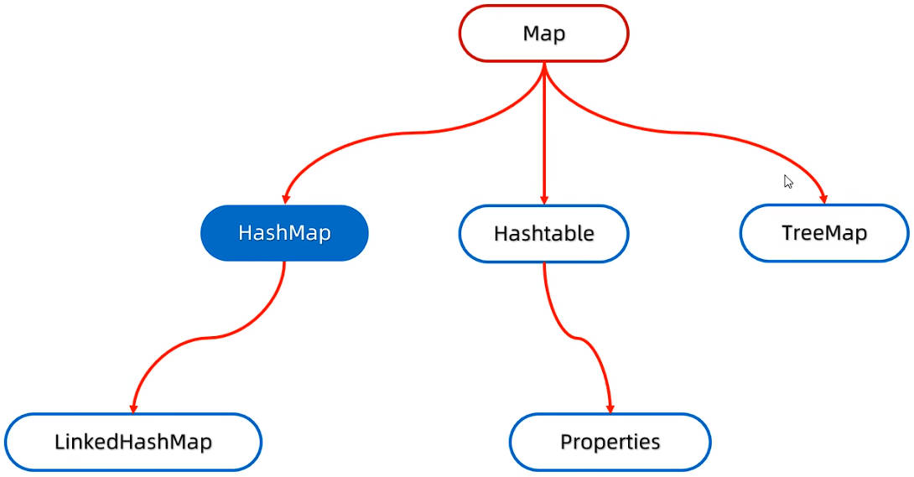

# Java 常见 API 集合进阶之 Map 双列集合、HashMap、LinkedHashMap、TreeMap

`Map` 双列集合，有如下特点：

- 每次添加一个键值对（对象），在 Java 中又称为“Entry 对象”。键与值是一一对应的。
- 在 Map 集合中，键不重复，值可以重复。

`Map` 双列集合，体系结构，如下图所示：



> `Hashtable` 集合，`Properties` 集合，与 I/O 相关，后续详细介绍。

## 一、Map 双列集合方法

`Map` 接口，是双列集合的顶层接口，它其中的方法，所有双列集合都继承了；

其中常用的方法如下：

| 方法名                                | 说明                                 |
| ------------------------------------- | ------------------------------------ |
| `V put(K key, V value)`               | 添加元素                             |
| `V remove(Object key)`                | 根据键，删除键值对对象元素           |
| `void clear()`                        | 移除所有的键值对元素                 |
| `V get(Object key);`                  | 获取键对应的值                       |
| `boolean containsKey(Object key)`     | 判断集合是否包含指定的键             |
| `boolean containsValue(Object value)` | 判断集合是否包含指定的值             |
| `boolean isEmpty()`                   | 判断集合是否为空                     |
| `int size()`                          | 集合的长度，也就是集合中键值对的个数 |

`Map` 接口，是一个泛型接口（`Map<K, V>`），要使用它的实现类创建对象，这里使用 `HashMap` 实现类演示：

### 1.put 方法

`V put(K key, V value)` 方法，用于往双列集合中，添加元素。如果：

- 键不存在，那么直接把键值对对象，添加到集合中，并返回 `null`；
- 键存在，那么会把原有的键值对对象覆盖，并把被覆盖的键值对对象的值返回。

demo-project/base-code/Day24/src/com/kkcf/map/MapDemo01.java

```java
package com.kkcf.map;

import java.util.HashMap;
import java.util.Map;

public class MapDemo01 {
    public static void main(String[] args) {
        // 创建集合对象
        Map<String, String> map = new HashMap<>();

        String val1 = map.put("mochizou", "tamako");
        String val2 = map.put("oreki", "chitanda");
        String val3 = map.put("tsukamoto", "kumiko");

        System.out.println(val1 + val2 + val3); // nullnullnull
        System.out.println(map); // {mochizou=tamako, oreki=chitanda, tsukamoto=kumiko}

        String val4 = map.put("oreki", "satoshi");
        System.out.println(val4); // chitanda

        System.out.println(map); // {mochizou=tamako, oreki=satoshi, tsukamoto=kumiko}
    }
}
```

### 2.remove 方法

`V remove(Object key)` 方法，用于删除集合中的键值对对象元素。返回被删除键值对对象中的值：

demo-project/base-code/Day24/src/com/kkcf/map/MapDemo01.java

```java
package com.kkcf.map;

import java.util.HashMap;
import java.util.Map;

public class MapDemo01 {
    public static void main(String[] args) {
        // 创建集合对象
        Map<String, String> map = new HashMap<>();

        map.put("mochizou", "tamako");
        map.put("oreki", "chitanda");
        map.put("tsukamoto", "kumiko");

        System.out.println(map); // {mochizou=tamako, oreki=chitanda, tsukamoto=kumiko}

        String val1 = map.remove("oreki");
        System.out.println(val1); // chitanda
    }
}
```

### 3.clear 方法

`void clear()` 方法，用于清空双列集合；没有返回值。

demo-project/base-code/Day24/src/com/kkcf/map/MapDemo01.java

```java
package com.kkcf.map;

import java.util.HashMap;
import java.util.Map;

public class MapDemo01 {
    public static void main(String[] args) {
        // 创建集合对象
        Map<String, String> map = new HashMap<>();

        map.put("mochizou", "tamako");
        map.put("oreki", "chitanda ");
        map.put("tsukamoto ", "kumiko");

        System.out.println(map); // {mochizou=tamako, oreki=chitanda , tsukamoto =kumiko}

        map.clear();

        System.out.println(map); // {}
    }
}
```

### 4.containsKey、containsValue 方法

`boolean containsKey(Object key)` 方法，用于判断集合中是否存在指定的键；

`boolean containsValue(Object value)` 方法，用于判断集合中是否存在指定的值；

demo-project/base-code/Day24/src/com/kkcf/map/MapDemo01.java

```java
package com.kkcf.map;

import java.util.HashMap;
import java.util.Map;

public class MapDemo01 {
    public static void main(String[] args) {
        // 创建集合对象
        Map<String, String> map = new HashMap<>();

        map.put("mochizou", "tamako");
        map.put("oreki", "chitanda ");
        map.put("tsukamoto ", "kumiko");

        System.out.println(map); // {mochizou=tamako, oreki=chitanda , tsukamoto =kumiko}

        boolean flag1 = map.containsKey("mochizou");
        System.out.println(flag1); // true

        boolean flag2 = map.containsValue("kumiko");
        System.out.println(flag2); // true
    }
}
```

### 5.isEmpty 方法

`boolean isEmpty()` 方法，用于判断集合是否是空的。

demo-project/base-code/Day24/src/com/kkcf/map/MapDemo01.java

```java
package com.kkcf.map;

import java.util.HashMap;
import java.util.Map;

public class MapDemo01 {
    public static void main(String[] args) {
        // 创建集合对象
        Map<String, String> map = new HashMap<>();

        map.put("mochizou", "tamako");
        map.put("oreki", "chitanda ");
        map.put("tsukamoto ", "kumiko");

        System.out.println(map); // {mochizou=tamako, oreki=chitanda , tsukamoto =kumiko}
        System.out.println(map.isEmpty()); // false

        map.clear();
        System.out.println(map.isEmpty()); // true
    }
}
```

### 6.size 方法

`int size()` 方法，用于获取双列集合中存储键值对对象的个数。

demo-project/base-code/Day24/src/com/kkcf/map/MapDemo01.java

```java
package com.kkcf.map;

import java.util.HashMap;
import java.util.Map;

public class MapDemo01 {
    public static void main(String[] args) {
        // 创建集合对象
        Map<String, String> map = new HashMap<>();

        map.put("mochizou", "tamako");
        map.put("oreki", "chitanda");
        map.put("tsukamoto", "kumiko");

        System.out.println(map); // {mochizou=tamako, oreki=chitanda, tsukamoto=kumiko}

        System.out.println(map.size()); // 3
    }
}
```

## 二、Map 双列集合遍历方式

`Map` 双列集合，有三种遍历方式：

- 方式一：键找值遍历；
- 方式二：键值对对象遍历；
- 方式三：forEach 方法结合 Lambda 表达式遍历。

### 1.Map 双列集合遍历-键找值

使用 `Map` 集合的 `keySet` 方法，返回一个由键组成的 `Set` 集合；

再遍历这个 `Set` 集合，使用 `Map` 集合的 `V get(Object key)` 方法。获取键对应的值。

demo-project/base-code/Day24/src/com/kkcf/map/MapDemo02.java

```java
package com.kkcf.map;

import java.util.HashMap;
import java.util.Map;
import java.util.Set;

public class MapDemo02 {
    public static void main(String[] args) {
        // 创建 Map 集合对象
        Map<String, String> map = new HashMap<>();

        map.put("mochizou", "tamako");
        map.put("oreki", "chitanda ");
        map.put("tsukamoto ", "kumiko");

        // Map 集合遍历
        Set<String> keySet = map.keySet();

        for (String key : keySet) {
            String value = map.get(key);
            System.out.println(key + "=" + value);
        }
    }
}
```

### 2.Map 双列集合遍历-键值对

使用 `Map` 集合的 `entrySet` 方法，返回一个 `Entry` 对象组成的 `Set` 集合。

> `Entry` 接口，是 `Map` 接口中的一个内部接口，可以使用 `Map.Entry` 表示，如下方所示：
>
> ```java
> Set<Map.Entry<String, String>> entries = map.entrySet();
> ```
>
> 或者单独为 `Entry` 接口导包：
>
> ```java
> import java.util.Map.Entry;
>
> // ...
>
> Set<Entry<String, String>> entries = map.entrySet();
> ```

再遍历 `Set` 集合，使用 `Entry` 对象的 `getKey`、`getValue` 方法，获取键值对。

demo-project/base-code/Day24/src/com/kkcf/map/MapDemo02.java

```java
package com.kkcf.map;

import java.util.HashMap;
import java.util.Map;
import java.util.Set;

public class MapDemo02 {
    public static void main(String[] args) {
        // 创建集合对象
        Map<String, String> map = new HashMap<>();

        map.put("mochizou", "tamako");
        map.put("oreki", "chitanda ");
        map.put("tsukamoto ", "kumiko");

        Set<Map.Entry<String, String>> entries = map.entrySet();

        for (Map.Entry<String, String> entry : entries) {
            String key = entry.getKey();
            String value = entry.getValue();

            System.out.println(key + "=" + value);
        }
    }
}
```

### 3.Map 双列集合遍历-forEach 方法结合 Lambda 表达式

使用 `Map` 接口中的默认方法 `default void forEach(BiConsumer<? super K, ? super V> action)` 结合 Lambda 表达式，来遍历双列集合。

- 底层使用的是 `entrySet` 方法得到键值对对象集合，
- 再调用 `BiComsumer` 函数式接口中的 `accept` 方法，传入键值对对象，进行遍历的。

demo-project/base-code/Day24/src/com/kkcf/map/MapDemo02.java

```java
package com.kkcf.map;

import java.util.HashMap;
import java.util.Map;
import java.util.function.BiConsumer;

public class MapDemo02 {
    public static void main(String[] args) {
        // 创建集合对象
        Map<String, String> map = new HashMap<>();

        map.put("mochizou", "tamako");
        map.put("oreki", "chitanda ");
        map.put("tsukamoto ", "kumiko");

        // Map 集合遍历：forEach 方法结合匿名内部类
        map.forEach(new BiConsumer<String, String>() {
            @Override
            public void accept(String key, String value) {
                System.out.println(key + "=" + value);
            }
        });

        // Map 集合遍历：forEach 方法结合 Lambda 表达式
        map.forEach((key, value) -> System.out.println(key + "=" + value));
    }
}
```

## 三、HashMap 集合

`HashMap` 类，实现了 `Map` 接口，其中有 `Map` 接口中的所有方法。

`HashMap` 集合中，键、值都只能是引用数据类型。

`HashMap` 集合中的键，特点是：

- **无序**：在 `HashMap` 集合中，键值对的存、取（遍历）顺序是无序的。
- **不重复**：在 `HashMap` 集合中，键是唯一的。
- **无索引**：在 `HashMap` 集合中，键没有索引。

`HashMap` 集合和 `HashSet` 集合，底层都是使用哈希表结构（JDK8 前：数组 + 链表；JDK8 后：数组 + 链表 + 红黑树）。

- 当创建一个 `HashMap` 集合对象后，会创建一个长度为 `16`，加载因子为 `0.75` 的数组（table）。
- 当使用 `put` 方法，添加键值对时：
  1. 先创建一个 **Entry 对象**，用于记录要添加的键值对。
  2. 再调用键对象的 `hashCode` 方法，计算键的哈希值，用于确定 Entry 对象在数组中存入的位置。如果该位置上：
     - 为 `null`，直接将 Entry 对象添加到该索引位置。
     - 不为 `null`，说明该位置已有 Entry 对象，组成的链表（或红黑树），那么会调用键对象的 `equals` 方法，挨个比较 Entry 对象中的键对象，如果：
       - 是重复的键，则**覆盖**原有的 Entry 对象。
       - 不是重复的键，则添加到链表或红黑树上（JDK8 前，老元素会挂在新元素后；JDK8 后，新元素挂在老元素后）；
         - 当链表长度大于 `8`，并且数组长度大于等于 `64`，链表自动转为红黑树。


所以，如果键位置，要存储自定义对象，那么就要重写键自定义类的 `hashCode`、`equals` 方法；如果值的位置存储自定义对象，则不需要。

案例理解：创建一个 `HashMap` 集合，键是学生对象（`Student`），值是籍贯（`String`）。存储三个键值对元素，并遍历。

demo-project/base-code/Day24/src/com/kkcf/test/Test1.java

```java
package com.kkcf.test;

import com.kkcf.javabean.Student;

import java.util.HashMap;
import java.util.Iterator;
import java.util.Map;
import java.util.Set;

public class Test1 {
    public static void main(String[] args) {
        Student stu1 = new Student("zhagnsan", 23);
        Student stu2 = new Student("lisi", 24);
        Student stu3 = new Student("wangwu", 25);

        HashMap<Student, String> map = new HashMap<>();

        map.put(stu1, "北京");
        map.put(stu2, "上海");
        map.put(stu3, "广州");

        // 遍历方式一：键找值
        Set<Student> keys = map.keySet();

        for (Student key : keys) {
            String value = map.get(key);
            System.out.println(key + "=" + value);
        }

        // 遍历方式二：键值对
        Set<Map.Entry<Student, String>> entries = map.entrySet();

        for (Map.Entry<Student, String> entry : entries) {
            Student key = entry.getKey();
            String value = entry.getValue();
            System.out.println(key + "=" + value);
        }

        // 遍历方式三：forEach + Lambda
        map.forEach((k, v) -> System.out.println(k + "=" + v));

        System.out.println(map);
    }
}
```

案例理解：某个班级 80 名学生，现在需要组织秋游活动，班长提供了四个景点依次是（A、B、C、D），每个学生只能选择一个景点，请统计最终哪个景点想去的人数最多。

要统计的变量比较多，不方便用计数器，此时就需要用到 `HashMap` 集合。思路：判断集合中，是否包含景点；

- 包含，表示已经出现过；
- 不包含，表示第一次出现。

demo-project/base-code/Day24/src/com/kkcf/test/Test2.java

```java
package com.kkcf.javabean;

import java.util.ArrayList;
import java.util.HashMap;
import java.util.Random;

public class Test2 {
    public static void main(String[] args) {
        // 景点
        String[] attractions = {"A", "B", "C", "D"};

        // 投票（用随机数，模拟 80 个学生投票）
        ArrayList<String> votes = new ArrayList<>();

        Random r = new Random();

        for (int i = 0; i < 80; i++) {
            int index = r.nextInt(attractions.length);
            String attraction = attractions[index];
            votes.add(attraction);
        }

        System.out.println(votes);

        // 统计投票
        HashMap<String, Integer> statistics = new HashMap<>();

        for (String vote : votes) {
            if (statistics.containsKey(vote)) {
                Integer count = statistics.get(vote);
                statistics.put(vote, count + 1);
            } else {
                statistics.put(vote, 1);
            }
        }

        System.out.println(statistics);

        // 计算票数最多的景点
        int max = 0;
        String maxAttraction = "";

        for (String attraction : attractions) {
            if (statistics.containsKey(attraction)) {
                int count = statistics.get(attraction);

                if (count > max) {
                    max = count;
                    maxAttraction = attraction;
                }
            }
        }

        System.out.println("票数最多的景点是：" + maxAttraction + "，票数为：" + max);
    }
}
```

## 四、LinkedHashMap 集合

`LinkedHashMap` 类，继承自 `HashMap` 类。 `HashMap` 类有的方法和特性，它都有。

`LinkedHashMap` 集合，键的特点是：

- **有序**：在 `LinkedHashMap` 集合中，键的存、取（遍历）顺序是一致的。
- **不重复**：在 `LinkedHashMap` 集合中，键是唯一的。
- **无索引**：在 `LinkedHashMap` 集合中，键没有索引。

`LinkedHashMap` 集合的原理，与 `LinkedHashSet` 集合的原理类似；底层数据结构仍然是哈希表，只不过每个键值对对象在存入哈希表时，又额外放入了一个双向链表结构，用于记录存、取顺序。

`LinkedHashMap` 集合中。存储的是键值对对象（**Entry 对象**）


demo-project/base-code/Day24/src/com/kkcf/map/MapDemo03.java

```java
package com.kkcf.map;

import java.util.LinkedHashMap;

public class MapDemo03 {
    public static void main(String[] args) {
        LinkedHashMap<String, Integer> map = new LinkedHashMap<>();

        map.put("c", 321);
        map.put("b", 123);
        map.put("a", 789);

        System.out.println(map); // {c=321, b=123, a=789}
    }
}
```

## 五、TreeMap 集合

`TreeMap` 类，实现了 `Map` 接口，其中的方法，它都有；

`TreeMap` 集合，跟 `TreeSet` 集合底层原理一样，都使用了红黑树结构；

`TreeMap` 集合，特点是：

- **可排序**：在 `TreeMap` 集合中，可对键进行大小排序。
- **不重复**：在 `TreeMap` 集合中，键是唯一的。
- **无索引**：在 `TreeMap` 集合中，键没有索引。

`TreeMap` 集合，存入的键对象，不需要重写其中的 `hashCode` 和 `equals` 方法。而是通过下方的两种比较规则，来判断键是否重复。

- 方式一：在键对象的自定义类中，实现 `Comparable` 接口，指定比较规则（默认方式）。
- 方式二：创建 `TreeMap` 集合时，传递 `Comparator` 比较器对象，指定比较规则（优先级高）。

案例理解：创建 `TreeMap` 集合，用于存储：

- 键：整数表示的 id；
- 值：字符串表示的商品名称；

要求分别按照 id 的升序、降序进行排列；

demo-project/base-code/Day24/src/com/kkcf/test/Test3.java

```java
package com.kkcf.test;

import java.util.TreeMap;

public class Test3 {
    public static void main(String[] args) {
        // 升序
        TreeMap<Integer, String> map1 = new TreeMap<>();

        map1.put(3, "c");
        map1.put(2, "b");
        map1.put(1, "a");

        System.out.println(map1); // {1=a, 2=b, 3=c}

        // 降序
        TreeMap<Integer, String> map2 = new TreeMap<>((o1, o2) -> o2 - o1);

        map2.put(1, "a");
        map2.put(2, "b");
        map2.put(3, "c");

        System.out.println(map2); // {3=c, 2=b, 1=a}
    }
}
```

案例理解：创建 `TreeMap` 集合，用于存储：

- 键：学生对象；其中有属性：姓名，年龄；
- 值：籍贯；

要求：按照学生年龄的升序排序；如果年龄一样，按照姓名字母排序；同姓名年龄视为同一个人。

学生类：实现 `Comparable` 泛型接口。

demo-project/base-code/Day24/src/com/kkcf/javabean/Student.java

```java
package com.kkcf.javabean;

import java.util.Objects;

public class Student implements Comparable<Student> {
    private String name;
    private int age;

    public Student() {
    }

    public Student(String name, int age) {
        this.name = name;
        this.age = age;
    }

    @Override
    public String toString() {
        return "Student{" +
                "name='" + name + '\'' +
                ", age=" + age +
                '}';
    }

    // getter、setter……

    @Override
    public int compareTo(Student o) {
        return getAge() < o.getAge() ? -1
                : getAge() > o.getAge() ? 1
                : getName().compareTo(o.getName());
    }
}
```

测试类：

demo-project/base-code/Day24/src/com/kkcf/test/Test4.java

```java
package com.kkcf.test;

import com.kkcf.javabean.Student;

import java.util.TreeMap;
import java.util.TreeSet;

public class Test4 {
    public static void main(String[] args) {
        TreeMap<Student, String> map = new TreeMap<>();

        map.put(new Student("zhangsan", 23), "北京");
        map.put(new Student("lisi", 24), "上海");
        map.put(new Student("wangwu", 25), "广州");
        map.put(new Student("zhaoliu", 24), "深圳");

        System.out.println(map);
    }
}
```

案例理解：请统计字符串“aababcabcdabcde”中，每一个字符出现的次数；

并按照以下格式输出结果：a（5）b（4）c（3）d（2）e（1）

demo-project/base-code/Day24/src/com/kkcf/test/Test5.java

```java
package com.kkcf.test;

import java.util.TreeMap;

public class Test5 {
    public static void main(String[] args) {
        String str = "aababcabcdabcde";

        // 统计
        TreeMap<Character, Integer> map = new TreeMap<>();

        for (int i = 0; i < str.length(); i++) {
            char c = str.charAt(i);

            if (map.containsKey(c)) {
                Integer count = map.get(c);
                map.put(c, count + 1);
            } else {
                map.put(c, 1);
            }
        }

        // 字符串拼接
        StringBuilder sb = new StringBuilder();

        for (Character key : map.keySet()) {
            sb.append(key).append("(").append(map.get(key)).append(")");
        }

        System.out.println(sb);
    }
}
```

- 当有统计需求时，如果要统计多个指标，那么优先考虑使用 `HashMap` 集合；
- 如果还要对统计的指标，进行大小的排序，那么使用 `TreeMap` 集合。
