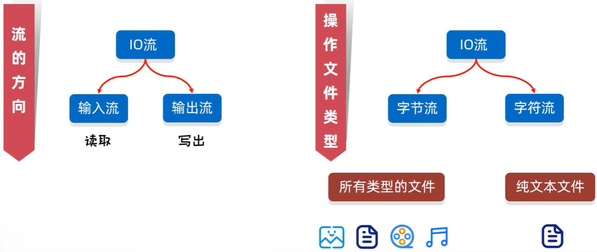
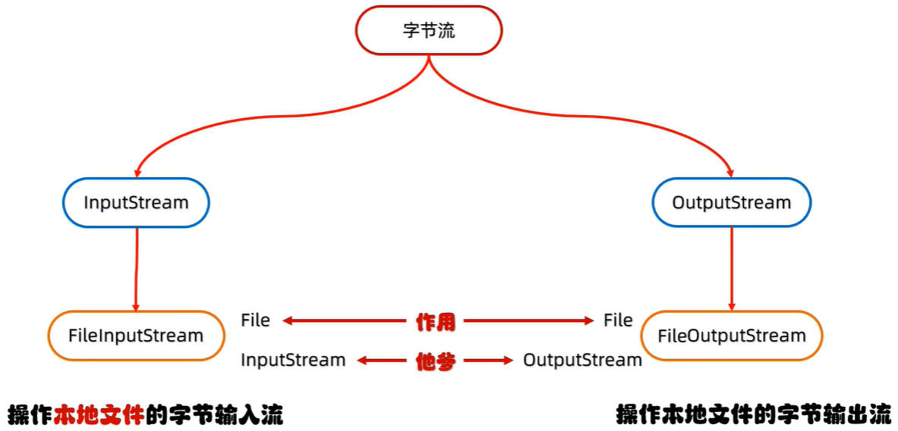

# Java IO流向、IO类型、IO字节流

IO 流：是存储、读取数据的解决方案。

IO 流，指的是以**（运行在内存中的）程序**为参照物，**读（Input）**、**写（Output）**本地文件，或网络中的数据。

## 一、Java IO 流向

IO 流的方向：

- 输出流：用于写出（Output、Writer）；
- 输入流：用于读取（Input，Reader）

## 二、Java IO 类型

IO 流操作文件的类型：

- 字节流：可以操作**所有类型**的文件；
- 字符流：只能操作**纯文本**文件。



## 三、Java IO 体系结构

Java IO 流的体系结构：


其中字节流分为：

- 字节输入流 `InputStream` 抽象类；
- 字节输出流 `OutputStream` 抽象类；

其中字符流分为：

- 字符输入流 `Reader` 抽象类；
- 字符输出流 `Writer` 抽象类。

## 四、Java IO 字节流

Java IO 字节流的体系结构，如下图所示：



由上图可知，Java IO 字节流的命名规则是：Xxx + InputStream / OutputStream；比如：`FileInputStream`

### 4.1.FileOutputStream 子类

`FileOutputStream` 类，是用于操作**本地文件**的字节输出流，可以把程序中的数据，写入到文件中。使用步骤：

1. 创建字节输出流对象；
2. 写数据；
3. 释放资源。

#### 4.1.1.FileOutputStream 构造方法

`FileOutputStream` 构造方法，用于创建字节输出流对象。

##### 4.1.1.1.FileOutputStream(File file) 方法

`FileOutputStream(File file)`，根据 File 对象，创建字节输出流对象。

##### 4.1.1.2.FileOutputStream(String name) 方法

`FileOutputStream(String name)`，根据字符串表示的路径，创建字节输出流对象。

##### 4.1.1.3.FileOutputStream(File file, boolean append) 方法

`FileOutputStream(File file, boolean append)`，根据 File 对象，创建字节输出流对象，并决定**是否续写**

##### 4.1.1.4.FileOutputStream(String name, boolean append) 方法

`FileOutputStream(String name, boolean append)`，根据字符串表示的路径，创建字节输出流对象。并决定**是否续写**

创建字节输出流，并往文件中写入“a”字符。

demo-project/base-code/Day28/src/com/kkcf/io/Demo01.java

```java
package com.kkcf.io;

import java.io.FileOutputStream;
import java.io.IOException;

public class Demo01 {
    public static void main(String[] args) throws IOException {
        // 1.创建字节输出对象；
        FileOutputStream fos = new FileOutputStream("Day28/src/com/kkcf/io/a.txt");

        // 2.写数据；
        fos.write(97); // 在文件中，写入了 'a' 字符

        // 3.释放资源。
        fos.close();
    }
}
```

- 细节 1：如果文件不存在，会创建一个新的文件，但是要保证**父级路径存在**，否则会报错。
- 细节 2：如果文件存在，默认会在写入时覆盖文件内容，除非开启续写。
- 细节 3：每次使用完流后，都要**释放资源**。否则文件会处于被占用的状态。
- 细节 4：`write` 方法的参数是整数，表示写入字符对应的 ASCLL 码。

#### 4.1.2.FileOutputStream 成员方法

`FileOutputStream` 成员方法，用于往文件中，写入数据。常用的方法如下：

##### 4.1.2.1.void write(int b) 方法

`void write(int b)`，一次写一个字节数据

##### 4.1.2.2.void write(byte[] b) 方法

`void write(byte[] b)`，一次写一个字节数组数据

demo-project/base-code/Day28/src/com/kkcf/io/Demo01.java

```java
package com.kkcf.io;

import java.io.FileOutputStream;
import java.io.IOException;

public class Demo01 {
    public static void main(String[] args) throws IOException {
        // 1.创建字节输出对象；
        FileOutputStream fos = new FileOutputStream("Day28/src/com/kkcf/io/a.txt");

        // 2.写数据；
        fos.write(new byte[]{97, 98, 99, 100, 101}); // 写入 abcde

        // 3.释放资源。
        fos.close();
    }
}
```

> String 字符串对象，获取字节数组的方法：`byte[] getBytes()`

demo-project/base-code/Day28/src/com/kkcf/io/Demo01.java

```java
package com.kkcf.io;

import java.io.FileOutputStream;
import java.io.IOException;

public class Demo01 {
    public static void main(String[] args) throws IOException {
        // 1.创建字节输出对象；
        FileOutputStream fos = new FileOutputStream("Day28/src/com/kkcf/io/a.txt");

        // 2.写入数据
        String str1 = "ore,MechakuchaTamakoGaSukiTa!";
        byte[] bytes1 = str1.getBytes();
        fos.write(bytes1);

        fos.write("\n".getBytes()); // 换行

        String str2 = "watashi,MochizouDaisuki!";
        byte[] bytes2 = str2.getBytes();
        fos.write(bytes2);

        // 3.释放资源。
        fos.close();
    }
}
```

> 不同操作系统，换行符不同：
>
> - Windows 换行符：`\r\n`；
> - Linux 换行符：`\n`；
> - Mac 换行符：`\r`；
>
> Java 会针对不同的操作系统，进行换行符补全；

##### 4.1.2.3.void write(byte[] b, int off, int len) 方法

`void write(byte[] b, int off, int len)`，一次写一个字节数组的部分数据

demo-project/base-code/Day28/src/com/kkcf/io/Demo01.java

```java
package com.kkcf.io;

import java.io.FileOutputStream;
import java.io.IOException;

public class Demo01 {
    public static void main(String[] args) throws IOException {
        // 1.创建字节输出对象；
        FileOutputStream fos = new FileOutputStream("Day28/src/com/kkcf/io/a.txt");

        // 2.写数据；
        fos.write(new byte[]{97, 98, 99, 100, 101}, 1, 2); // 写入 bc

        // 3.释放资源。
        fos.close();
    }
}
```

使用字节输出流，写出换行符，进行换行：

字节输出流，续写：

创建一个可以续写的输出流对象：

demo-project/base-code/Day28/src/com/kkcf/io/Demo02.java

```java
package com.kkcf.io;

import java.io.FileOutputStream;
import java.io.IOException;

public class Demo02 {
    public static void main(String[] args) throws IOException {
        FileOutputStream fos = new FileOutputStream("Day28/src/com/kkcf/io/a.txt", true);

        fos.write("Dozo!".getBytes());

        fos.close();
    }
}
```

### 4.2.FileInputStream 子类

`FileInputStream` 是用于操作本地文件的字节输入流，可以把文件中的数据，读取到程序中。使用步骤：

1. 创建字节输入流对象；
2. 读数据；
3. 释放资源。

#### 4.2.1.FileInputStream 构造方法

`FileInputStream` 常用的构造方法如下：

##### 4.2.1.1.FileInputStream)(String name) 构造方法

`FileInputStream(String name)`，根据字符串表示的路径，创建字节输入流对象。

##### 4.2.1.2.FileInputStream)(File file) 构造方法

`FileInputStream(File file)`，根据 File 对象，创建字节输入流对象。

#### 4.2.2.FileInputStream 成员方法

`FileInputStream` 常用的成员方法如下；

##### 4.2.2.1.int read() 方法

`int read()`，从输入流读取一个字节的数据。

利用 `FileInputStream` 输入流，读取文件中的数据，返回的是二进制字节数据，在 ASCLL 码表中对应的十进制整数。

demo-project/base-code/Day28/src/com/kkcf/io/Demo03.java

```java
package com.kkcf.io;

import java.io.FileInputStream;
import java.io.IOException;

public class Demo03 {
    public static void main(String[] args) throws IOException {
        FileInputStream fis = new FileInputStream("Day28/src/com/kkcf/io/a.txt");

        int b1 = fis.read();

        System.out.println(b1); // 111
        System.out.println((char) b1); // o
    }
}
```

- 细节 1：`read` 方法，会**挨个**读取文件中的二进制字节，并返回二进制字节在 ASCLL 码表中对应的十进制数字；
- 细节 2：`read` 方法，读取完毕后，再进行调用，会返回 `-1`；

`FileInputStream` 输入流，与 `FileOutputStream` 输出流不同，读取的文件，如果不存在，那么会直接抛出异常。

- 输入流读取的文件，如果不存在，再创建一个空文件没有意义，因为里面没有数据，所以会直接抛出异常。

> 所有应用程序的意义，都在于对数据的组织和管理。

使用 `FileInputStream` 字节输入流，循环读取文件中的数据：

demo-project/base-code/Day28/src/com/kkcf/io/Demo04.java

```java
package com.kkcf.io;

import java.io.FileInputStream;
import java.io.IOException;

public class Demo04 {
    public static void main(String[] args) throws IOException {
        FileInputStream fis = new FileInputStream("Day28/src/com/kkcf/io/a.txt");

        int b;
        while ((b = fis.read()) != -1)
            System.out.print((char) b);

        fis.close();
    }
}
```

## 五、字节流实现文件拷贝

使用字节输入、输出流，实现文件的拷贝。

- 思路：边读边写

demo-project/base-code/Day28/src/com/kkcf/io/Demo05.java

```java
package com.kkcf.io;

import java.io.FileInputStream;
import java.io.FileOutputStream;
import java.io.IOException;

public class Demo05 {
    public static void main(String[] args) throws IOException {
        FileInputStream fis = new FileInputStream("Day28/src/com/kkcf/io/a.txt");
        FileOutputStream fos = new FileOutputStream("Day28/src/com/kkcf/io/b.txt");

        int b;
        while ((b = fis.read()) != -1)
            fos.write(b);

        fos.close();
        fis.close();
    }
}
```

- 释放资源的时候，**先开的流，后关闭**。

### 5.1.int read(byte[] buffer) 方法

一次读取一个字节，速度太慢。要让 `FileInputStream` 字节输入流，一次读取多个字节，可以使用如下方法：

| 方法名                           | 说明                 |
| -------------------------------- | -------------------- |
| `public int read(byte[] buffer)` | 一次读取一个字节数组 |

上面方法，用于一次读取一个字节数组，返回值表示**读到的字节数组长度**。

- 每次读取，会尽可能把数组填满；
- 数组的长度，一般使用 1024 的整数倍；比如：`1024 * 1024 * 5` 表示 5MB 字节数据。

demo-project/base-code/Day28/src/com/kkcf/io/Demo06.java

```java
package com.kkcf.io;

import java.io.FileInputStream;
import java.io.IOException;

public class Demo06 {
    public static void main(String[] args) throws IOException {
        FileInputStream fis = new FileInputStream("Day28/src/com/kkcf/io/a.txt");

        byte[] bytes = new byte[2]; // 创建长度为 2 的 byte 数组，用于字节输入流每次读 2 个字节

        int len;
        while ((len = fis.read(bytes)) != -1) {
            String str = new String(bytes, 0, len);
            System.out.println(str);
        }

        fis.close();
    }
}
```

- 细节 1：读到的字节数组，会覆盖传入的原数组中对应位置的元素。

> String 的构造方法 `String(byte[] bytes, int offset, int length)` 可以使用字节子数组，来构造一个新的 String 字符串。

重构文件拷贝的代码，并记录拷贝使用的时间（毫秒）：

demo-project/base-code/Day28/src/com/kkcf/io/Demo05.java

```java
package com.kkcf.io;

import java.io.FileInputStream;
import java.io.FileOutputStream;
import java.io.IOException;

public class Demo05 {
    public static void main(String[] args) throws IOException {
        long start = System.currentTimeMillis();

        FileInputStream fis = new FileInputStream("Day28/src/com/kkcf/io/a.txt");
        FileOutputStream fos = new FileOutputStream("Day28/src/com/kkcf/io/b.txt");

        byte[] bytes = new byte[1024 * 10254 * 5];
        int len;
        while ((len = fis.read(bytes)) != -1)
            fos.write(bytes, 0, len);

        fos.close();
        fis.close();

        long end = System.currentTimeMillis();
        System.out.println("用时：" + (end - start) + "ms");
    }
}
```

## 六、Java IO 异常捕获

### 1.try…catch…finally 代码块（了解）

`try…catch…finally` 代码块，其中 finally 代码块中的代码，一定会被执行，除非 JVM 虚拟机停止。

所以，可以使用 try…catch…finally 代码块，重构上方的代码，来进行关流操作；

这也是 Java IO 流异常捕获的完整写法：

demo-project/base-code/Day28/src/com/kkcf/io/Demo05.java

```java
package com.kkcf.io;

import java.io.FileInputStream;
import java.io.FileOutputStream;
import java.io.IOException;

public class Demo05 {
    public static void main(String[] args) {
        long start = System.currentTimeMillis();

        FileInputStream fis = null;
        FileOutputStream fos = null;
        try {
            fis = new FileInputStream("Day28/src/com/kkcf/io/a.txt");
            fos = new FileOutputStream("Day28/src/com/kkcf/io/b.txt");

            byte[] bytes = new byte[1024 * 10254 * 5];
            int len;
            while ((len = fis.read(bytes)) != -1)
                fos.write(bytes, 0, len);
        } catch (IOException e) {
            throw new RuntimeException(e);
        } finally {
            if (fos != null) {
                try {
                    fos.close();
                } catch (IOException e) {
                    e.printStackTrace();
                }
            }

            if (fis != null) {
                try {
                    fis.close();
                } catch (IOException e) {
                    e.printStackTrace();
                }
            }
        }

        long end = System.currentTimeMillis();
        System.out.println("用时：" + (end - start) + "ms");
    }
}
```

> 程序中出现的异常，一般都会直接抛出处理，因为后续介绍的 Spring 框架，会将程序中抛出的异常统一处理。

### 2.JDK7 AutoCloseable 接口（了解）

可以发现，上方关流的代码，写起来非常麻烦；

在 JDK7，Java 推出了 `AutoCloseable` 接口。实现该接口的类，在特定情况下，可以**自动释放资源/关流**。

- 比如：`FileInputStream` 类，继承自 `InputStream` 抽象类，该抽象类，又实现了 `Closeable` 接口，该接口，又继承自 `AutoCloseable` 接口；
- 所以 `FileInputStream` 、`FileOutputStream` 这些类，适用于特定情况。

特定情况一：JDK7 格式：

```java
try (创建流对象1; 创建流对象2) {
    可能出现异常的代码;
} catch (异常类名 变量名) {
    异常的处理代码;
}

资源自动释放
```

使用这种格式，重构上方代码：

demo-project/base-code/Day28/src/com/kkcf/io/Demo05.java

```java
package com.kkcf.io;

import java.io.FileInputStream;
import java.io.FileOutputStream;
import java.io.IOException;

public class Demo05 {
    public static void main(String[] args) {
        long start = System.currentTimeMillis();

        try (FileInputStream fis = new FileInputStream("Day28/src/com/kkcf/io/a.txt"); FileOutputStream fos = new FileOutputStream("Day28/src/com/kkcf/io/b.txt")) {

            byte[] bytes = new byte[1024 * 10254 * 5];
            int len;
            while ((len = fis.read(bytes)) != -1)
                fos.write(bytes, 0, len);
        } catch (IOException e) {
            e.printStackTrace();
        }

        long end = System.currentTimeMillis();
        System.out.println("用时：" + (end - start) + "ms");
    }
}
```

特定情况二：JDK9 格式：

```java
创建流对象1;
创建流对象2
try (流对象1; 流对象2) {
    可能出现异常的代码;
} catch (异常类名 变量名) {
    异常的处理代码;
}

资源自动释放
```

使用这种格式，重构上方代码：

demo-project/base-code/Day28/src/com/kkcf/io/Demo05.java

```java
package com.kkcf.io;

import java.io.FileInputStream;
import java.io.FileNotFoundException;
import java.io.FileOutputStream;
import java.io.IOException;

public class Demo05 {
    public static void main(String[] args) throws FileNotFoundException {
        long start = System.currentTimeMillis();

        FileInputStream fis = new FileInputStream("Day28/src/com/kkcf/io/a.txt");
        FileOutputStream fos = new FileOutputStream("Day28/src/com/kkcf/io/b.txt");

        try (fis; fos) {
            byte[] bytes = new byte[1024 * 10254 * 5];
            int len;
            while ((len = fis.read(bytes)) != -1)
                fos.write(bytes, 0, len);
        } catch (IOException e) {
            e.printStackTrace();
        }

        long end = System.currentTimeMillis();
        System.out.println("用时：" + (end - start) + "ms");
    }
}
```
