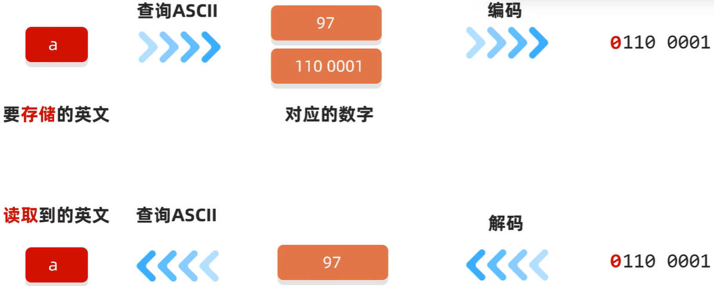
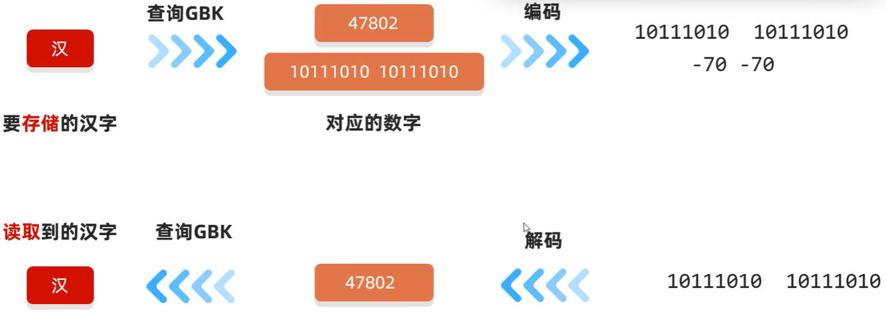
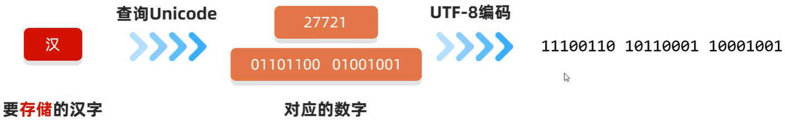
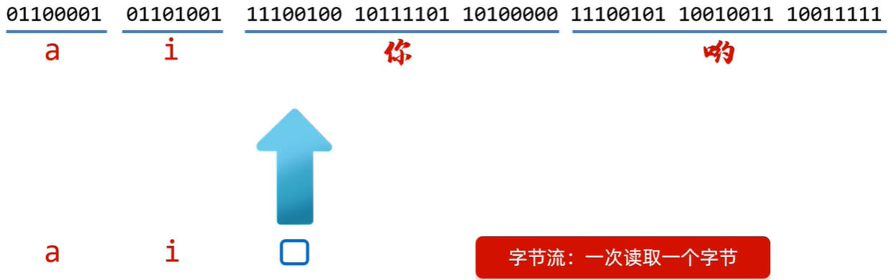
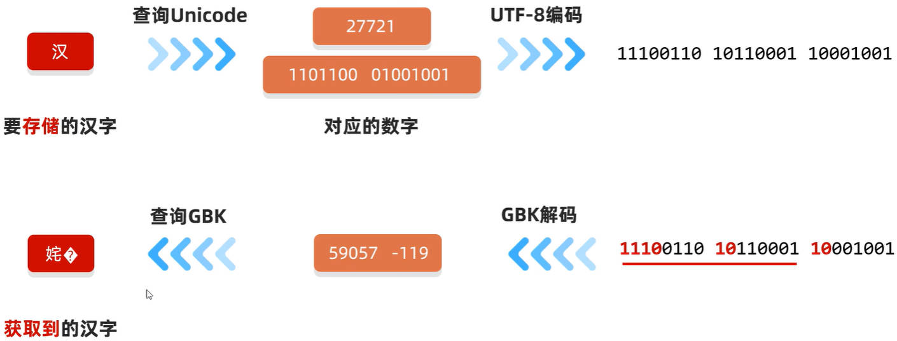

# Java IO 字符集

回顾：计算机存储数据的规则：在计算机中，任意数据都是以二进制的形式来存储的。

二进制就是以 0、1 组成的数据。

- 其中一个 0 或 1，称为一个 **bit（比特位）**；
- 八个比特位分为一组，就是一个**字节**，它可以存储（2^8^ = 256）个数字。

字节，是计算机中最小的存储单元。

计算机在存储一个**英文字母**时，会使用 ASCLL 字符集，进行编码，编码后的结果，仅需要**一个字节**存储即可。

## 一、ASCLL 字符集

ASCLL 字符集，共有 128 个字符，所以只用一个字节（最大存储 256 个数据）就可以存储。

- 比如：字符 a，在计算机中的存储过程，如下图所示：



ASCLL 编码规则：前面补 0，补齐 8 位。

ASCLL 解码规则：直接将二进制字节转成十进制。

## 二、其它字符集

对于汉字来说，也需要一张类似于 ASCLL 的码表，将所有汉字字符，与唯一的一个数字对应。所以出现了：

- **GB2312** 字符集编码，是 1981 年 5 月 1 日 发布的简体中文汉字编码国家标准。收录 7445 个图形字符，其中包括 6763 个汉字。
- **BIG5** 字符集编码，是 1984 年实施的台湾地区繁体中文标准字符集，共收录 13053 个中文字。
- **GBK** 字符集编码，是 2000 年 3 月 17 日发布，收录 21003 个汉字，包含国家标准 GB13000-1 中的全部中日韩汉字，有 BIG5 编码中的所有汉字。
- **Unicode** 字符集编码，国际标准字符集，它将世界各种语言的每个字符定义一个唯一的编码，以满足跨语言、跨平台的文本信息转化。

> Windows 操作系统简体中文版，默认使用的就是 **GBK** 字符集编码；系统别称是 **ANSI**

## 三、GBK 字符集

GBK 字符集，完全兼容 ASCLL 字符集。

### 3.1.GBK 字符集中的英文字母

GBK 字符集，英文字母的存储、读取，与 ASCLL 字符集一样：


GBK 英文字母编码规则：前面补 0，补齐 8 位。

GBK 英文字母解码规则：直接转成十进制。

### 2.GBK 字符集中的汉字

GBK 字符集，汉字的存储：过程如下：



GBK 字符集中，汉字的编码规则：

- 规则 1：一个汉字，使用 **2 个字节**存储，分别是**高位字节**、**低位字节**。
- 规则 2：高位字节二进制，一定以 1 开头，转成十进制后是一个负数；这是为了与英文字母进行区分。

### 3.GBK 编码规则练习

下方是按照 GBK 字符集编码后得到的二进制字节，请说出有几个中文字符，几个英文字符。

- 第一组：10111010 10111010（汉）01100001（a）
- 第二组：01110111（w）01100101（e）01100101（e）
- 第三组：10111111 11001001（可）101100001 0101110（爱）10111110 10110010（静）10110001 10100110（宝）

## 四、Unicode 字符集

**Unicode 字符集**，同样也完全兼容 ASCLL 字符集。它有很多编码规则，比如：

- **UTF-16** 编码规则：使用 2-4 个字节保存字符。
- **UTF-32** 编码规则，固定使用 4 个字节保存字符。
- **UTF-8** 编码规则：用 1-4 个字节保存字符。

> UTF（Unicode Transfer Format）

其中，UTF-8 编码规则：用的最多。

- 英文字符（ASCLL 字符集中的字符），使用 1 个字节，二进制第一位是 0，转成十进制是正数；
- 中文字符，使用 **3 个字节**。二进制第一位是 1，第一个字节转成十进制是负数。

| UTF-8 编码方式（二进制）               |
| -------------------------------------- |
| 0xxxxxxx（ASCLL 码）                   |
| 110xxxxx 10xxxxxxx                     |
| 1110xxxx  10xxxxxxx 10xxxxxxx          |
| 11110xxx 10xxxxxxx 10xxxxxxx 10xxxxxxx |

### 1.UTF-8 编码规则中的英文

UTF-8 字符集，英文字母的存储、读取，与 ASCLL 字符集一样


### 2.UTF-8 编码规则中的汉字

UTF-8 字符集，中文汉字的存储、读取，过程如下

- 第一个字节的首位，一定是 1；



### 3.UTF-8 编码规则练习

UTF-8 **不是字符集**，它是 Unicode 字符集的一种**编码规则**。

以下是 Unicode 字符集，利用 UTF-8 编码之后的二进制数据，请说出有几个中文，几个英文；

- 第一组：01110111（w）01100101（e）01100101（e）
- 第二组：01100001（a）01101010（i）11100100 10111101 10100000（你）11100101 10010011 10100110（哦）

## 五、乱码的产生

乱码产生的原因，有两个：

原因一：读取时，未读完整个汉字字符；

- 比如：当使用字节流，一次读取一个字节时，读到汉字本应该要读三个字节，但是只读了一个字节。



原因二：编码和解码的方式不统一。如下图所示：



所以，为了不产生乱码，应该采取如下措施：

- 措施一：不用字节流，读取纯文本文件；
- 措施二：编码、解码都使用同一种**字符集**，并按照同一个**编码规则**进行。

> 使用字节流拷贝文件，不会出现乱码；
>
> 只要打开拷贝文件的编辑器，使用的是原文件的字符集和编码规则即可。

## 六、Java 编码和解码

编码的过程，就是把要存储的数据，按照特定字符集的编码规则，转为字节，存储在硬盘中；

所以，使用 Java `String` 类编码，返回值是一个字节数组。常用的方法如下：

| 方法名                                       | 说明                   |
| -------------------------------------------- | ---------------------- |
| `public byte[] getBytes()`                   | 使用默认字符集进行编码 |
| `public byte[] getBytes(String charsetName)` | 使用指定字符集进行编码 |

demo-project/base-code/Day28/src/com/kkcf/io/CharsetDemo01.java

```java
package com.kkcf.io;

import java.io.UnsupportedEncodingException;
import java.util.Arrays;

public class CharsetDemo01 {
    public static void main(String[] args) throws UnsupportedEncodingException {
        String str = "wee可爱";

        // 默认编码方式：IDEA 使用 UTF-8 编码规则；英文字符 1 个字节，中文字符 3 个字节
        byte[] bytes1 = str.getBytes();
        System.out.println(bytes1.length); // 9（1 + 1 + 1 + 3 + 3）
        System.out.println(Arrays.toString(bytes1)); // [119, 101, 101, -27, -113, -81, -25, -120, -79]

        // 指定 GBK 的编码方式。英文字符 1 个字节，中文字符 2 个字节
        byte[] bytes2 = str.getBytes("GBK");
        System.out.println(bytes2.length); // 7（1 + 1 + 1 + 2 + 2）
        System.out.println(Arrays.toString(bytes2)); // [119, 101, 101, -65, -55, -80, -82]
    }
}
```

> IDEA 默认使用 Unicode 字符集的 UTF-8 编码规则；
>
> Eclipse 默认使用 GBK 字符集的编码规则。

Java `String` 类解码的方法如下，是利用 `String` 类的**构造方法**实现的：

| 方法名                                     | 说明                   |
| ------------------------------------------ | ---------------------- |
| `String(byte[] bytes)`                     | 使用默认字符集进行解码 |
| `String(byte[] bytes, String charsetName)` | 使用指定字符集进行解码 |

demo-project/base-code/Day28/src/com/kkcf/io/CharsetDemo01.java

```java
package com.kkcf.io;

import java.io.UnsupportedEncodingException;
import java.util.Arrays;

public class CharsetDemo01 {
    public static void main(String[] args) throws UnsupportedEncodingException {
        String str = "wee最棒";

        // 编码
        byte[] bytes1 = str.getBytes(); // // 默认编码方式：IDEA 使用 UTF-8 编码规则；英文字符 1 个字节，中文字符 3 个字节
        System.out.println(bytes1.length); // 9（1 + 1 + 1 + 3 + 3）
        System.out.println(Arrays.toString(bytes1)); // [97, 105, -28, -67, -96, -27, -109, -90]

        byte[] bytes2 = str.getBytes("GBK"); // 指定 GBK 的编码方式。英文字符 1 个字节，中文字符 2 个字节
        System.out.println(bytes2.length); // 7（1 + 1 + 1 + 2 + 2）
        System.out.println(Arrays.toString(bytes2)); // [97, 105, -60, -29, -59, -74]

        // 默认解码方式：IDEA 使用 UTF-8 解码规则
        String msg1 = new String(bytes1);
        System.out.println(msg1); // wee可爱

        String msg2 = new String(bytes2);
        System.out.println(msg2); // wee�ɰ�

        // 指定 GBK 的解码方式
        String msg3 = new String(bytes1, "GBK");
        System.out.println(msg3); // wee鍙埍

        String msg4 = new String(bytes2, "GBK");
        System.out.println(msg4); // wee可爱
    }
}
```
