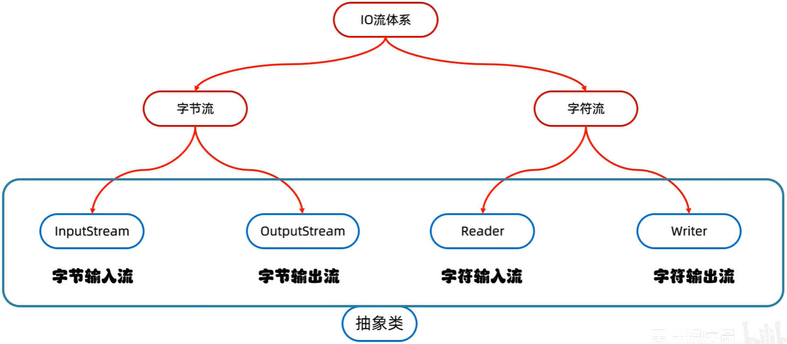
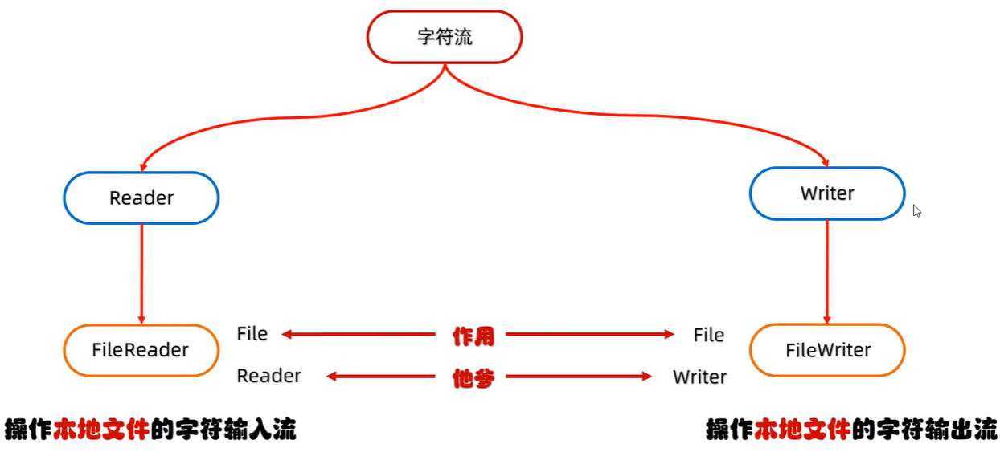
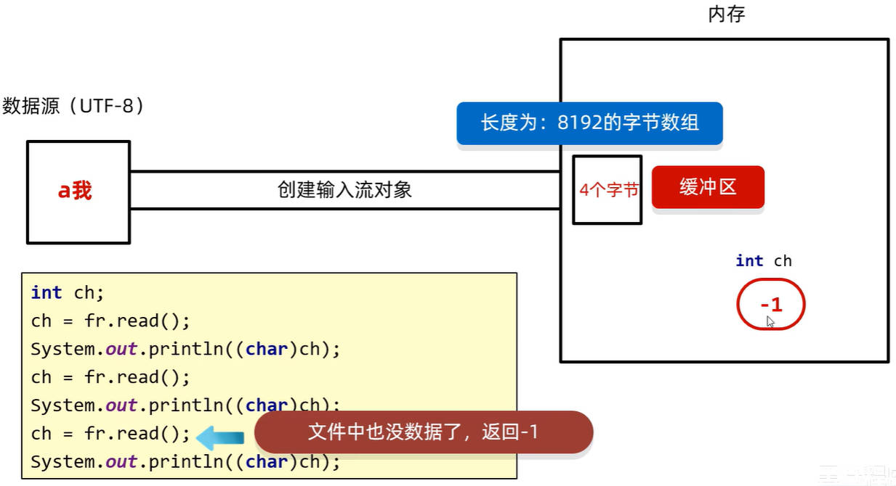
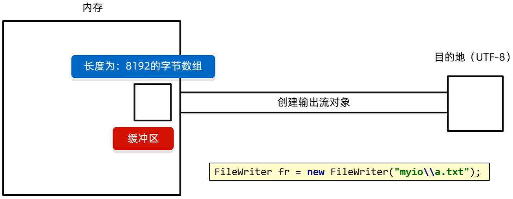

# Java IO 字符流

在同一编码规则下（比如 UTF-8），读取英文字符时读一个字节，读取中文字符时读三个字节，这样的流，就是字符流。

字符流的底层，基于字节流：**字符流 = 字节流 + 字符集编码**；

字符流的特点：

- 输入流：默认一次读一个字节，遇到汉字这样的特殊字符时，根据字符集编码规则，一次读多个字节；
- 输出流：底层会把数据，按照指定的字符集和编码规则，进行编码，转变成字节，再写到文件中。

字符流，非常适合**纯文本文件**的读、写操作。

回顾 Java IO 的体系结构：



Java IO 字符流的体系结构，如下图所示：



由上图可知，IO 字符流的命名规则是：Xxx + Reader / Writer；比如：`FileReader`

## 一、FileReader 子类

`FileReader` 是用于操作本地文件的字符输入流，可以把文件中的数据，读取到程序中。使用步骤：

1. 创建字符输入流对象；
2. 读取数据；
3. 释放资源。

### 1.1.FileReader 构造方法

`FileReader` 构造方法，用于创建字符输入流对象。

- 细节：如果文件不存在，直接报错。

#### 1.1.1.FileReader(File file) 构造方法

`public FileReader(File file)`，根据 File 对象，创建字符输入流并关联本地文件。

#### 1.1.2.FileReader(String pathname) 构造方法

`public FileReader(String pathname)`，根据字符串表示的文件路径，创建字符输入流并关联本地文件。

### 1.2.FileReader 成员方法

`FileReader` 成员方法，用于读取数据：

#### 1.2.1.int read() 方法

`public int read()`，读取数据，读到末尾返回 -1；

会**挨个**读取字节，遇到汉字这样的特殊字符，会根据字符集编码规则读取多个字节：然后返回一个按照该字符集解码后的二进制对应的**十进制整数**。它也表示在字符集上字符对应的数字。

比如在 Unicode 字符集的 UTF-8 编码规则下：

- 英文字符，文件里面存储了字符’a‘，它编码后的二进制数据 0110 0001；`read` 方法读取时，会解码并转成十进制，即 `97`；
- 中文字符，文件里面存储了字符‘静’，它编码后的二进制数据 11101001 10011101 10011001，`read` 方法读取时，会解码并转成十进制，即 `38745`；

案例理解：创建字符输入流，读取文件中的数据。

demo-project/base-code/Day28/src/com/kkcf/io/Demo07.java

```java
package com.kkcf.io;

import java.io.FileReader;
import java.io.IOException;

public class Demo07 {
    public static void main(String[] args) throws IOException {
        FileReader fr = new FileReader("Day28/src/com/kkcf/io/abc.txt");

        int ch;
        while ((ch = fr.read()) != -1)
            System.out.print(ch); // 251053622932423362293242321916274262957723376652811310251052006326368219162742639292342552010265292358313576265281

        fr.close();
    }
}
```

如果要输出字符，还需要对返回的整数，进行强转。

demo-project/base-code/Day28/src/com/kkcf/io/Demo07.java

```java
package com.kkcf.io;

import java.io.FileReader;
import java.io.IOException;

public class Demo07 {
    public static void main(String[] args) throws IOException {
        FileReader fr = new FileReader("Day28/src/com/kkcf/io/abc.txt");

        int ch;
        while ((ch = fr.read()) != -1)
            System.out.print((char) ch);

        /*我超级超级喜欢玉子！
        我也最喜欢饼藏了，请讲！*/

        fr.close();
    }
}
```

#### 1.2.2.int read(char[] buffer) 方法

`public int read(char[] buffer)`，读取多个数据，读到末尾返回 -1

用于一次读取多个字符，读取的字符数量，会尽量填满传入的 char 数组。

- 该方法，将**读取字节**，**解码**，**强转**三步操作合并了，并把最终得到的字符，放到了数组中。
- 该方法，返回读取到的字符数组长度。

demo-project/base-code/Day28/src/com/kkcf/io/Demo08.java

```java
package com.kkcf.io;

import java.io.FileReader;
import java.io.IOException;

public class Demo08 {
    public static void main(String[] args) throws IOException {
        FileReader fr = new FileReader("Day28/src/com/kkcf/io/abc.txt");

        char[] chs = new char[2];
        int len = 0;
        while ((len = fr.read(chs)) != -1)
            System.out.print(new String(chs, 0, len));

        /*我超级超级喜欢玉子！
        我也最喜欢饼藏了，请讲！*/

        fr.close();
    }
}
```

#### 1.2.3.int close() 方法

`public int close()`，释放资源/关流

## 二、FileWriter 子类

`FileWriter` 是用于操作本地文件的字符输出流，它可以把程序中的数据，写入到文件中。使用步骤：

1. 创建字符输出流对象；
2. 写入数据；
3. 释放资源。

### 2.1.FileWriter 构造方法

`FileWriter` 构造方法，用于创建字符输出流对象。

- 细节 1：如果文件不存在，会创建一个新的文件，但是要保证父级路径是存在的。
- 细节 2：如果文件已存在，则会清空文件再写入，除非开启续写。

#### 2.1.1.FileWriter(File file) 构造方法

`public FileWriter(File file)`，根据 File 对象，创建字符输出流。

#### 2.1.2.FileWriter(String pathname) 构造方法

`public FileWriter(String pathname)`，根据文件路径字符串，创建字符输出流。

#### 2.1.3.FileWriter(File file, boolean append) 构造方法

`public FileWriter(File file, boolean append)`，根据 File 对象，创建字符输出流，并决定是否续写。

#### 2.1.4.FileWriter(String pathname, boolean append) 构造方法

`public FileWriter(String pathname, boolean append)`，根据文件路径字符串，创建字符输出流，。

### 2.2.FileWriter 成员方法

`FileWriter` 成员方法，用于写入数据：

#### 2.2.1.void write(int c) 方法

`void write(int c)`，写出一个字符

- 细节 1：如果 `write` 方法的参数是 int 类型的整数，实际写入到文件中的，是 int 整数在字符集中对应的字符。

demo-project/base-code/Day28/src/com/kkcf/io/Demo09.java

```java
package com.kkcf.io;

import java.io.FileWriter;
import java.io.IOException;

public class Demo09 {
    public static void main(String[] args) throws IOException {
        FileWriter fw = new FileWriter("Day28/src/com/kkcf/io/cba.txt");

        fw.write(38745); // 写入 静

        fw.close();
    }
}
```

#### 2.2.2.void write(String str) 方法

`void write(String str)`，写出一个字符串

demo-project/base-code/Day28/src/com/kkcf/io/Demo09.java

```java
package com.kkcf.io;

import java.io.FileWriter;
import java.io.IOException;

public class Demo09 {
    public static void main(String[] args) throws IOException {
        FileWriter fw = new FileWriter("Day28/src/com/kkcf/io/cba.txt");

        fw.write("可爱静宝"); // 在 Unicode 字符集下的 UTF-8 编码规则下，写入了 12 个字节

        fw.close();
    }
}
```

#### 2.2.3.void write(String str, int off, int len) 方法

`void write(String str, int off, int len)`，写出一个字符串的一部分

#### 2.2.4.void write(char[] cbuf) 方法

`void write(char[] cbuf)`，写出一个字符数组

- 本质上，还是按照字符集的编码规则，写入字节。

demo-project/base-code/Day28/src/com/kkcf/io/Demo09.java

```java
package com.kkcf.io;

import java.io.FileWriter;
import java.io.IOException;

public class Demo09 {
    public static void main(String[] args) throws IOException {
        FileWriter fw = new FileWriter("Day28/src/com/kkcf/io/cba.txt");

        char[] chs = {'w', 'e', 'e', '静'};
        fw.write(chs);

        fw.close();
    }
}
```

#### 2.2.5.void write(char[] cbuf, int off, int len) 方法

`void write(char[] cbuf, int off, int len)`，写出一个字符数组的一部分

## 三、字符流原理分析

### 1.Reader 字符输入流底层原理

创建字符输入流（Reader）对象时，底层会关联文件，并创建**缓冲区**，一个长度为 `8192` 的**字节数组**。

1. 每次读取（read）操作时，会判断缓冲区中，是否有数据可以被读取；
2. 如果没有，就会从文件中读取数据，尽可能的装满缓冲区。
3. 如果文件中也没有数据了，则返回 -1；



> 字节输入流（InputSream）没有缓冲区的特性

理解下方代码：

demo-project/base-code/Day28/src/com/kkcf/test/Test1.java

```java
package com.kkcf.test;

import java.io.FileReader;
import java.io.FileWriter;
import java.io.IOException;

public class Test1 {
    public static void main(String[] args) throws IOException {
        FileReader fr = new FileReader("Day28/src/com/kkcf/test/a.txt");
        // 从文件中读取数据，尽可能装满缓冲区
        fr.read();

        // 创建字符输出流，关联文件，会清空文件
        FileWriter fw = new FileWriter("Day28/src/com/kkcf/test/b.txt");

        int ch;
        while ((ch = fr.read()) != -1)
            fw.write(ch); // 只能读取到缓冲区中的字节了

        fw.close();
        fr.close();
    }
}
```

### 2.Writer 字符输出流底层原理

创建字符输出流（Writer）对象时，底层也会关联文件，并创建**缓冲区**，一个长度为 `8192` 的字节数组。

1. 每次写入（write）操作时，会判断缓冲区中，是否已经被填满；
2. 如果没有，就会将字节数据，写入到缓冲区中。
3. 缓冲区中的字符数据，被写入到文件中有三个时机：
   - 缓冲区装满的时候；
   - 手动刷新（调用 `flush` 方法）的时候；
   - 释放资源的时候。



`Writer` 字符输出流对象的 `flush` 和 `close` 方法：

| 方法名                | 说明                               |
| --------------------- | ---------------------------------- |
| `public void flush()` | 将缓冲区中的数据，刷新到本地文件中 |
| `public void close()` | 释放资源/关流                      |

他们的区别在于：

- `flush` 刷新之后，还可以继续往文件中写出数据。
- `close` 关流之后，无法再往文件中写出数据。

demo-project/base-code/Day28/src/com/kkcf/test/Test2.java

```java
package com.kkcf.test;

import java.io.FileWriter;
import java.io.IOException;

public class Test2 {
    public static void main(String[] args) throws IOException {
        FileWriter fw = new FileWriter("Day28/src/com/kkcf/test/b.txt");

        fw.write("可爱");
        fw.flush();
        fw.write("静宝");

        fw.close();
    }
}
```

## 四、字节流、字符流如何选择

字节流一般用于：拷贝任意类型的文件。

字符流一般用于：1.读取纯文本文件中的数据；2.往纯文本文件中写入数据。

## 五、综合练习

### 1.练习一：拷贝文件夹

拷贝一个文件夹下的所有内容，到另一个文件夹下，考虑子文件夹。

demo-project/base-code/Day28/src/com/kkcf/test/Test3.java

```java
package com.kkcf.test;

import java.io.File;
import java.io.FileInputStream;
import java.io.FileOutputStream;
import java.io.IOException;

public class Test3 {
    /**
     * 此方法用于：拷贝文件夹
     * @param src 源文件夹
     * @param dest 目标文件夹
     * @throws IOException IO异常
     */
    private static void copy(File src, File dest) throws IOException {
        // 创建目标文件夹
        boolean flag = dest.mkdirs();
        if (flag) System.out.println("新建了文件夹：" + dest.getName());

        File[] files = src.listFiles();
        if (files == null) return;

        for (File file : files) {
            if (file.isFile()) {
                // 拷贝
                FileInputStream fis = new FileInputStream(file);
                FileOutputStream fos = new FileOutputStream(new File(dest, file.getName()));

                byte[] bytes = new byte[1024 * 1024 * 5];
                int len;
                while ((len = fis.read(bytes)) != -1)
                    fos.write(bytes, 0, len);

                fos.close();
                fis.close();
            } else {
                copy(file, new File(dest, file.getName()));
            }
        }
    }

    public static void main(String[] args) throws IOException {
        File src = new File("Day28/src/com/kkcf/test/abc");
        File dest = new File("Day28/src/com/kkcf/test/dest");

        copy(src, dest);
    }
}
```

### 2.练习二：文件加密

为了保证文件的安全性，需要对原始文件进行加密存储，在使用的时候，再对其进行解密处理。

- 加密原理：对原始文件中的每一个字节数据，进行更改，然后将更改后的数据存储到新的文件中。
- 解密原理：读取加密之后的文件，按照加密的规则反向操作，变成原始文件。

> `^` 逻辑异或运算符，可用于计算数字，会将运算元，转为二进制数字进行运算。
>
> 如果一个数字，^ 异或运算另外一个数字两次，会得到它本身
>
> ```java
> System.out.println(100 ^ 10); // 110
> System.out.println(100 ^ 10 ^ 10); // 100
> ```

使用 ^ 逻辑异或运算符，进行加密、解密操作；

demo-project/base-code/Day28/src/com/kkcf/test/Test4.java

```java
package com.kkcf.test;

import java.io.File;
import java.io.FileInputStream;
import java.io.FileOutputStream;
import java.io.IOException;

public class Test4 {
    private static void encryption(File src, File dest) throws IOException {
        FileInputStream fis = new FileInputStream(src);
        FileOutputStream fos = new FileOutputStream(dest);

        int b;
        while((b = fis.read()) != -1)
            fos.write(b ^ 2);

        fos.close();
        fis.close();
    }

    public static void main(String[] args) throws IOException {
        // 加密
        File src = new File("Day28/src/com/kkcf/test/secret.txt");
        File dest = new File("Day28/src/com/kkcf/test/encry.txt");

        encryption(src, dest);

        // 解密
        src = new File("Day28/src/com/kkcf/test/encry.txt");
        dest = new File("Day28/src/com/kkcf/test/decry.txt");

        encryption(src, dest);
    }
}
```

> encryption 单词，表示加密。
>
> decryption 单词，表示解密。

### 3.练习三：修改文件中的数据

文本文件中，有数据：2-1-9-4-7-8；将文件中的数据进行排序，变成：1-2-4-7-8-9。

- 文件不要换行，否则会有换行符；
- Windows 上的非 UTF-8 编码的文件，可能会有 bom 头，即文件开头隐藏的字符标记，其中记录了一些文件的信息，比如：文件的字符集编码。

可结合 Stream 流来实现：

demo-project/base-code/Day28/src/com/kkcf/test/Test5.java

```java
package com.kkcf.test;

import java.io.FileInputStream;
import java.io.FileOutputStream;
import java.io.IOException;
import java.util.Arrays;
import java.util.StringJoiner;

public class Test5 {
    public static void main(String[] args) throws IOException {
        // 读取
        FileInputStream fis = new FileInputStream("Day28/src/com/kkcf/test/sort.txt");

        StringBuilder sb = new StringBuilder();
        int b;
        while ((b = fis.read()) != -1)
            sb.append((char) b);

        String[] newArr = Arrays.stream(sb.toString().split("-"))
                .map(Integer::parseInt)
                .sorted()
                .map(i -> Integer.toString(i))
                .toArray(String[]::new);


        StringJoiner sj = new StringJoiner("-", "", "");
        Arrays.stream(newArr).forEach(sj::add);
        System.out.println(sj);

        // 写入，创建字节输出流，会清空文件中的内容
        FileOutputStream fos = new FileOutputStream("Day28/src/com/kkcf/test/sort.txt");
        fos.write(sj.toString().getBytes());

        fos.close();
        fis.close();
    }
}
```
