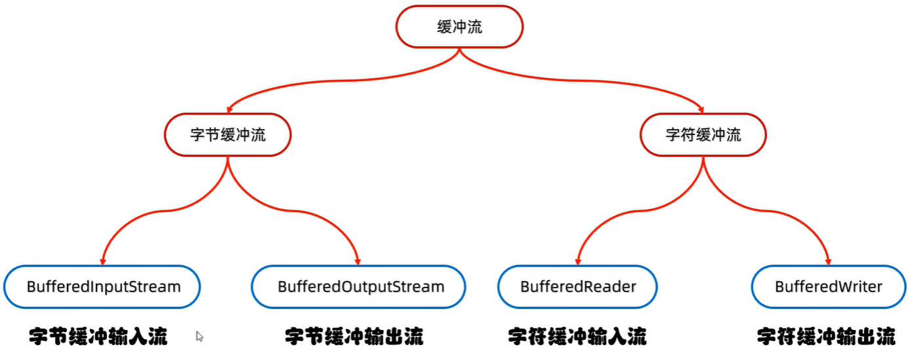
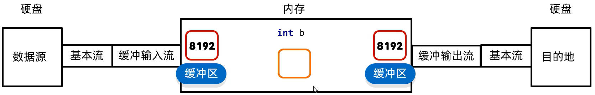

# Java IO 高级流-缓冲流

“File”开头的字节、字符流，是 Java IO 的**基本流**；

在基本流的基础上，进行封装，额外添加一些功能的流，称为**高级流**。

Java IO 高级流有：

- 缓冲流；
- 转换流；
- 序列化流；
- 打印流；
- 压缩流；
- ……

Java 缓冲流的体系结构，如下图所示：



> `FileReader`、`FileWriter` 字符输入、输出流中，已经加入了缓冲的功能；
>
> `BufferedReader`、`BufferedWriter` 字符缓冲输入、输出流，相较于上面的基本流，性能提升不是很大。但有两个非常好用的方法。

## 一、BufferInputStream、BufferOutputStream 字节缓冲流

字节缓冲流，底层自带了长度为 8192 **字节数组**缓冲区，以提高性能。

缓冲流不能直接读取、写入；在创建缓冲流的对象时，要关联基本流。真正读写数据的，还是**基本流**。

字节缓冲流，常用的构造方法如下：

| 方法名                                     | 说明                                                     |
| ------------------------------------------ | -------------------------------------------------------- |
| `public BufferInputStream(InputStream ls)` | 把基本流，包装成缓冲流（高级流），提高**读取**数据的性能 |
| `public BufferOutputStream(OutStream os)`  | 把基本流，包装成缓冲流（高级流），提高**写出**数据的性能 |

### 1.1.字节缓冲流拷贝文件

使用字节缓冲流，拷贝文件：

demo-project/base-code/Day29/src/com/kkcf/io/Demo01.java

```java
package com.kkcf.io;

import java.io.*;

public class Demo01 {
    public static void main(String[] args) throws IOException {
        BufferedInputStream bis = new BufferedInputStream(new FileInputStream("Day29/src/com/kkcf/io/a.txt"));
        BufferedOutputStream bos = new BufferedOutputStream(new FileOutputStream("Day29/src/com/kkcf/io/b.txt"));

        int b;
        while ((b = bis.read()) != -1)
            bos.write((char) b);

        bos.close();
        bis.close();
    }
}
```

- 字节缓冲输入、输出流，底层会创建长度为 8192 **字节数组**的缓冲区，提高读取、写入性能。
- 字节缓冲输入、输出流，调用 `close` 方法关流，会关闭关联的基本流。

重构上方的代码，一次读取多个字节。

demo-project/base-code/Day29/src/com/kkcf/io/Demo01.java

```java
package com.kkcf.io;

import java.io.*;

public class Demo01 {
    public static void main(String[] args) throws IOException {
        BufferedInputStream bis = new BufferedInputStream(new FileInputStream("Day29/src/com/kkcf/io/a.txt"));
        BufferedOutputStream bos = new BufferedOutputStream(new FileOutputStream("Day29/src/com/kkcf/io/b.txt"));

        byte[] bytes = new byte[1024];
        int len;
        while ((len = bis.read(bytes)) != -1)
            bos.write(bytes, 0, len);

        bos.close();
        bis.close();
    }
}
```

### 1.2.字节缓冲流的原理

字节缓冲流的原理，如下图所示：



内存中的操作，非常快；所以字节缓冲流，相比于基本流提高了效率，实际上指的是节约了读取本地文件的时间。

## 二、BufferReader、BufferWriter 字符缓冲流

字符缓冲流，底层自带了长度为 8192 **字符数组**的缓冲区，以提高性能；

常用的构造方法如下：

| 方法名                          | 说明                                                 |
| ------------------------------- | ---------------------------------------------------- |
| `public BufferReader(Reader r)` | 把基本流，包装成缓冲流（高级流），提高读取数据的性能 |
| `public BufferWriter(Writer w)` | 把基本流，包装成缓冲流（高级流），提高写出数据的性能 |

### 2.1.字符缓冲流的基本使用

字符缓冲流，有两个非常好用的特有方法，如下方所示：

| 字符缓冲输入流特有方法     | 说明                                        |
| -------------------------- | ------------------------------------------- |
| `public String readLine()` | 读取一行数据，没有数据可读时，则会返回 null |

- 细节 1：该方法，读取到换行符时，会结束读取（不会读取换行符）。

案例理解：读取文件中的数据，打印到控制台：

demo-project/base-code/Day29/src/com/kkcf/io/Demo02.java

```java
package com.kkcf.io;

import java.io.BufferedReader;
import java.io.FileReader;
import java.io.IOException;

public class Demo02 {
    public static void main(String[] args) throws IOException {
        BufferedReader br = new BufferedReader(new FileReader("Day29/src/com/kkcf/io/a.txt"));

        String s;
        while ((s = br.readLine()) != null)
            System.out.println(s);

        br.close();
    }
}
```

| 字符缓冲输出流特有方法  | 说明             |
| ----------------------- | ---------------- |
| `public void newLine()` | 跨平台输出换行符 |

案例理解：往文件中，写入两行数据：

demo-project/base-code/Day29/src/com/kkcf/io/Demo03.java

```java
package com.kkcf.io;

import java.io.BufferedWriter;
import java.io.FileWriter;
import java.io.IOException;

public class Demo03 {
    public static void main(String[] args) throws IOException {
        BufferedWriter bw = new BufferedWriter(new FileWriter("Day29/src/com/kkcf/io/b.txt"));

        bw.write("你嘴角上扬的样子，百度搜索不到");
        bw.newLine();
        bw.write("如果我结婚了，你一定要来哦，没有新娘我会很尴尬");
        bw.newLine();

        bw.close();
    }
}
```

如果要创建字节缓冲输出流，并开启续写，那么应在关联的基本流上，开启续写：

demo-project/base-code/Day29/src/com/kkcf/io/Demo03.java

```java
package com.kkcf.io;

import java.io.BufferedWriter;
import java.io.FileWriter;
import java.io.IOException;

public class Demo03 {
    public static void main(String[] args) throws IOException {
        BufferedWriter bw = new BufferedWriter(new FileWriter("Day29/src/com/kkcf/io/b.txt", true));

        bw.write("你嘴角上扬的样子，百度搜索不到");
        bw.newLine();
        bw.write("如果我结婚了，你一定要来哦，没有新娘我会很尴尬");
        bw.newLine();

        bw.close();
    }
}
```

### 2.2.字符缓冲流的原理

字符缓冲流的原理，与字节缓冲流类似：


**字符缓冲流**的缓冲区，是长度为 8192 的**字符数组**，即 **16k** 的缓冲区；

**字节缓冲流**的缓冲区，是长度为 8192 的**字节数组**，即 **8k** 的缓冲区；

## 三、字节缓冲流综合练习

### 3.1.练习一：读取数据并排序

读取 csb.txt 文本文件中的数据，并按照每行开头的序号，进行排序；将排序后的数据，写入到 result.txt 文本文件中。

- 使用字符缓冲输入、输出流，结合 `TreeMap` 来进行排序。

demo-project/base-code/Day29/src/com/kkcf/test/Test1.java

```java
package com.kkcf.test;

import java.io.*;
import java.util.Map;
import java.util.TreeMap;

public class Test1 {
    public static void main(String[] args) throws IOException {
        // 读取
        BufferedReader br = new BufferedReader(new FileReader("Day29/src/com/kkcf/test/csb.txt"));

        //ArrayList<String> list = new ArrayList<>();
        TreeMap<Integer, String> tm = new TreeMap<>();
        String line;
        while ((line = br.readLine()) != null) {
            String[] strArr = line.split("\\.");
            tm.put(Integer.parseInt(strArr[0]), strArr[1]);
        }

        br.close();

        // 排序
        /*list.sort((Comparator<String>) (o1, o2) -> {
            String numStr1 = o1.split("\\.")[0];
            String numStr2 = o2.split("\\.")[0];

            return Integer.parseInt(numStr1) - Integer.parseInt(numStr2);
        });*/

        // 写入
        BufferedWriter bw = new BufferedWriter(new FileWriter("Day29/src/com/kkcf/test/result.txt"));

        for (Map.Entry<Integer, String> entry : tm.entrySet()) {
            bw.write(entry.getKey() + "." + entry.getValue());
            bw.newLine();
        }

        bw.close();
    }
}
```

- String 类的 `split` 方法中，传入的“`.`” 要加上 `\\`，在 Java 中表示转义字符；否则会被当作正则表达式。

### 3.2.练习二：统计程序运行次数

实现一个验证程序运行次数的程序，要求如下：

当程序运行超过 3 次时，给出提示；“本软件只能免费使用 3 次，欢迎注册会员后继续使用”。

- 思路：将程序运行的次数，记录在本地文件中。

demo-project/base-code/Day29/src/com/kkcf/test/Test2.java

```java
package com.kkcf.test;

import java.io.*;

public class Test2 {
    public static void main(String[] args) throws IOException {
        // 读取次数
        BufferedReader br = new BufferedReader(new FileReader("Day29/src/com/kkcf/test/count.txt"));
        String s = br.readLine();
        br.close();

        // 判断
        int count = Integer.parseInt(s);
        System.out.println(++count <= 3 ? "欢迎使用本软件，第 " + count + " 次使用免费" : "本软件只能免费使用 3 次，欢迎您注册会员后，继续使用");

        // 写入次数
        BufferedWriter bw = new BufferedWriter(new FileWriter("Day29/src/com/kkcf/test/count.txt"));
        bw.write(String.valueOf(count));
        bw.close();
    }
}
```

- IO 流，应该随用随创建。用完就关闭。
