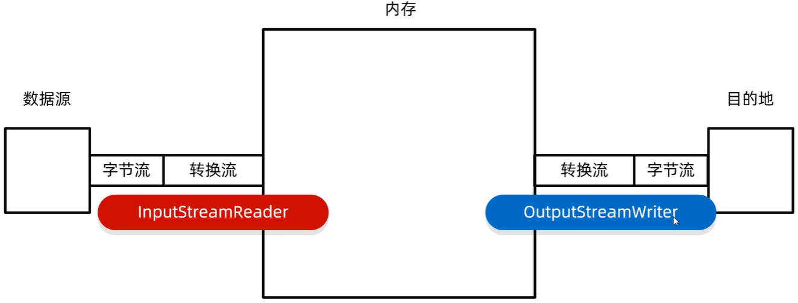

# Java IO 之转换流

转换流，属于字符流，它只有两个实现类；

- 字符转换输入流：InputStreamReader
- 字符转换输出流：OutputStreamWriter

转换流，是字节流和字符流之间的桥梁。它的内存原理如图所示：



## 一、转换流的作用

转换流的作用：

- 作用 1：指定字符集，来读、写文件的内容（JDK11 淘汰）
- 作用 2：用字节流，调用字符流的方法。

### 1.作用一：指定字符集读写数据

案例理解：利用转换流，按照指定的字符集编码规则，读取文件中的内容。

demo-project/base-code/Day29/src/com/kkcf/convert/Demo01.java

```java
package com.kkcf.convert;

import java.io.FileInputStream;
import java.io.IOException;
import java.io.InputStreamReader;

public class Demo01 {
    public static void main(String[] args) throws IOException {
        InputStreamReader isr = new InputStreamReader(new FileInputStream("Day29/src/com/kkcf/convert/gbkFile.txt"), "GBK");

        int ch;
        while ((ch = isr.read()) != -1)
            System.out.print((char) ch);

        isr.close();
    }
}
```

- 这种方式，读取文件中的内容，已经在 JDK11 被淘汰了。

在 JDK11，使用 FileReader 字符输入流，已经允许指定字符集编码，来读取数据了。

demo-project/base-code/Day29/src/com/kkcf/convert/Demo01.java

```java
package com.kkcf.convert;

import java.io.FileReader;
import java.io.IOException;
import java.nio.charset.Charset;

public class Demo01 {
    public static void main(String[] args) throws IOException {
        FileReader fr = new FileReader("Day29/src/com/kkcf/convert/gbkFile.txt", Charset.forName("GBK"));

        int ch;
        while ((ch = fr.read()) != -1)
            System.out.print((char) ch);

        fr.close();
    }
}
```

案例理解：使用字符转换输出流，往文件中写入数据。

demo-project/base-code/Day29/src/com/kkcf/convert/Demo02.java

```java
package com.kkcf.convert;

import java.io.FileOutputStream;
import java.io.IOException;
import java.io.OutputStreamWriter;

public class Demo02 {
    public static void main(String[] args) throws IOException {
        OutputStreamWriter osw = new OutputStreamWriter(new FileOutputStream("Day29/src/com/kkcf/convert/gbkFile.txt"), "GBK");

        osw.write("我超级超级喜欢玉子！");

        osw.close();
    }
}
```

- 这种方式，写出数据到文件中，已经在 JDK11 被淘汰了。

在 JDK11，使用 FileWriter 字符输出流，已经允许指定字符集编码，来写出数据了。

demo-project/base-code/Day29/src/com/kkcf/convert/Demo02.java

```java
package com.kkcf.convert;

import java.io.FileWriter;
import java.io.IOException;
import java.nio.charset.Charset;

public class Demo02 {
    public static void main(String[] args) throws IOException {
        FileWriter fw = new FileWriter("Day29/src/com/kkcf/convert/gbkFile.txt", Charset.forName("GBK"));

        fw.write("我超级超级喜欢玉子！");

        fw.close();
    }
}
```

案例理解：将 GBK 编码的文件，转为 UTF-8 编码的文件。

JDK11 以前的方案：

demo-project/base-code/Day29/src/com/kkcf/convert/Demo03.java

```java
package com.kkcf.convert;

import java.io.*;

public class Demo03 {
    public static void main(String[] args) throws IOException {
        InputStreamReader isr = new InputStreamReader(new FileInputStream("Day29/src/com/kkcf/convert/gbkFile.txt"), "GBK");
        OutputStreamWriter osw = new OutputStreamWriter(new FileOutputStream("Day29/src/com/kkcf/convert/utf8File.txt")); // IDEA 默认使用 UTF-8 编码

        int b;
        while ((b = isr.read()) != -1)
            osw.write(b);

        osw.close();
        isr.close();
    }
}
```

JDK11 以后的方案：

demo-project/base-code/Day29/src/com/kkcf/convert/Demo03.java

```java
package com.kkcf.convert;

import java.io.*;
import java.nio.charset.Charset;

public class Demo03 {
    public static void main(String[] args) throws IOException {
        FileReader fr = new FileReader("Day29/src/com/kkcf/convert/gbkFile.txt", Charset.forName("GBK"));
        FileWriter fw = new FileWriter("Day29/src/com/kkcf/convert/utf8File.txt");

        int b;
        while ((b = fr.read()) != -1)
            fw.write(b);

        fw.close();
        fr.close();
    }
}
```

### 2.作用二：用字节流调用字符流的方法

案例理解：利用字节流，读取文件中的数据，不能出现乱码，每次读一整行。分析：

- 不能出现乱码，只能使用字符流；
- 每次读一整行，只能使用字符缓冲输入流。

思路：所以，要把字节流，转成字符流。

demo-project/base-code/Day29/src/com/kkcf/convert/Demo04.java

```java
package com.kkcf.convert;

import java.io.*;

public class Demo04 {
    public static void main(String[] args) throws IOException {
        FileInputStream fis = new FileInputStream("Day29/src/com/kkcf/convert/utf8File.txt");
        InputStreamReader isr = new InputStreamReader(fis);
        BufferedReader br = new BufferedReader(isr);

        String line;
        while ((line = br.readLine()) != null)
            System.out.println(line);

        br.close();
    }
}
```
