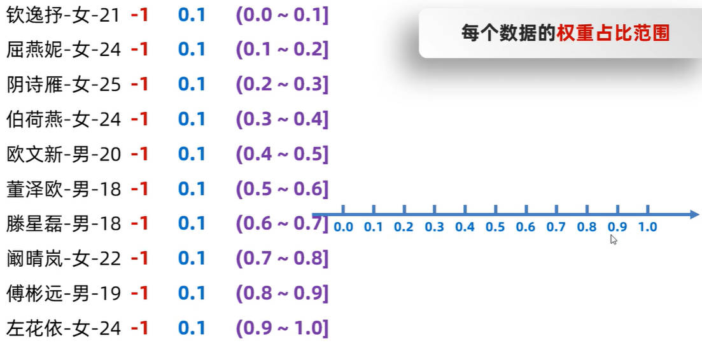

# Java IO 综合练习（一）

## 一、制造假数据

制造假数据，也是开发中的一个能力。在各个网站上爬取数据，是其中一个办法。

下面是三个用于爬取数据的网站：

- [获取姓氏](https://hanyu.baidu.com/shici/detail?pid=0b2f26d4c0ddb3ee693fdb1137ee1b0d&from=kg0)

- [获取男生名字](http://www.haoming8.cn/baobao/10881.html)

- [获取女生名字](http://www.haoming8.cn/baobao/7641.html)

demo-project/base-code/Day30/src/com/kkcf/iopractice/Test1.java

```java
package com.kkcf.iopractice;

import java.io.BufferedWriter;
import java.io.FileWriter;
import java.io.IOException;
import java.io.InputStreamReader;
import java.net.URL;
import java.net.URLConnection;
import java.util.*;
import java.util.regex.Matcher;
import java.util.regex.Pattern;

public class Test1 {
    /**
     * 此方法用于：爬取网页数据
     *
     * @param url 网站 url
     * @return 网站数据
     * @throws IOException 异常
     */
    public static String webCrawler(String url) throws IOException {
        // 用于拼接爬取到的数据
        StringBuilder sb = new StringBuilder();

        // 创建 URL 对象
        URL url1 = new URL(url);

        // 打开 url
        URLConnection urlConnection = url1.openConnection();

        // 获取字节流读取数据，又因为网站上有中文，所以要转成字符流
        InputStreamReader isr = new InputStreamReader(urlConnection.getInputStream());

        char[] chs = new char[1024 * 1024 * 5];
        int len;
        while ((len = isr.read(chs)) != -1)
            sb.append(chs, 0, len);

        isr.close();
        return sb.toString();
    }

    /**
     * 此方法用于：正则表达式匹配
     *
     * @param str   网站数据
     * @param regex 正则表达式
     * @param index 匹配正则表达式中第几组
     * @return 匹配到的数据
     */
    public static ArrayList<String> getData(String str, String regex, int index) {
        ArrayList<String> lastNameList = new ArrayList<>();

        // 正则表达式匹配
        Pattern pattern = Pattern.compile(regex);
        Matcher matcher = pattern.matcher(str);
        while (matcher.find())
            lastNameList.add(matcher.group(index));

        return lastNameList;
    }

    /**
     * 此方法用于：处理姓氏数据
     *
     * @param lastNameTempList 姓氏数据
     * @return 存储姓氏的集合
     */
    private static ArrayList<Character> getLastNameData(ArrayList<String> lastNameTempList) {
        ArrayList<Character> result = new ArrayList<>();

        for (String s : lastNameTempList)
            for (int i = 0; i < s.length(); i++)
                result.add(s.charAt(i));

        return result;
    }

    /**
     * 此方法用于：处理男性名字数据（去重）
     *
     * @param maleNameTempList 男性名字数据
     * @return 男性名字
     */
    private static ArrayList<String> getMaleNameData(ArrayList<String> maleNameTempList) {
        HashSet<String> set = new HashSet<>(maleNameTempList);
        return new ArrayList<>(set);
    }

    /**
     * 此方法用于：处理女性名字数据（分隔）
     *
     * @param femaleNameTempList 女性名字数据
     * @return 女性名字
     */
    private static ArrayList<String> getFemaleNameData(ArrayList<String> femaleNameTempList) {
        ArrayList<String> result = new ArrayList<>();

        for (String s : femaleNameTempList)
            result.addAll(Arrays.asList(s.split(" ")));

        return result;
    }

    /**
     * 此方法用于：生成姓名列表假数据
     *
     * @param lastNameList   姓氏列表
     * @param maleNameList   男性名称列表
     * @param femaleNameList 女性名称列表
     * @param maleCount      女性名称个数
     * @param femaleCount    男性名称个数
     * @return 姓名列表
     */
    private static ArrayList<String> mockNameList(ArrayList<Character> lastNameList, ArrayList<String> maleNameList, ArrayList<String> femaleNameList, int maleCount, int femaleCount) {
        ArrayList<String> result = new ArrayList<>();

        Random r = new Random();

        HashSet<String> tempSet = new HashSet<>();

        // 生成男性名字（姓氏 + 名字）
        for (int i = 0; i < maleCount; ) {
            int index = r.nextInt(lastNameList.size());
            String name = lastNameList.get(index) + maleNameList.get(i);
            if (!tempSet.contains(name)) {
                tempSet.add(name);
                result.add(name + "-男-" + (r.nextInt(23) + 18)); // 18-40
                i++;
            }
        }

        // 生成女性名字（姓氏 + 名字）
        for (int i = 0; i < femaleCount; ) {
            int index = r.nextInt(lastNameList.size());
            String name = lastNameList.get(index) + femaleNameList.get(i);
            if (!tempSet.contains(name)) {
                tempSet.add(name);
                result.add(name + "-女-" + (r.nextInt(23) + 18));
                i++;
            }
        }

        Collections.shuffle(result);

        return result;
    }

    public static void main(String[] args) throws IOException {
        String LAST_NAME_URL = "https://hanyu.baidu.com/shici/detail?pid=0b2f26d4c0ddb3ee693fdb1137ee1b0d&from=kg0";
        String MALE_NAME_URL = "http://www.haoming8.cn/baobao/10881.html";
        String FEMALE_NAME_URL = "http://www.haoming8.cn/baobao/7641.html";

        // 爬取数据
        String lastNameStr = webCrawler(LAST_NAME_URL); // 赵钱孙李，周吴郑王。
        String maleNameStr = webCrawler(MALE_NAME_URL); // 修永, 浩恒
        String femaleNameStr = webCrawler(FEMALE_NAME_URL); // 彤舞 芊静 艾丝 惠蕙 语月, 依莹 瑶馨 曼珍 逸云 微婉

        // 处理数据
        ArrayList<String> lastNameTempList = getData(lastNameStr, "(\\W{4})(，|。)", 1);
        ArrayList<String> maleNameTempList = getData(maleNameStr, "([\\u4E00-\\u9FA5]{2})(、|。)", 1);
        ArrayList<String> femaleNameTempList = getData(femaleNameStr, "([\\u4E00-\\u9FA5]{2} ){4}[\\u4E00-\\u9FA5]{2}", 0);

        // 处理数据2
        ArrayList<Character> lastNameList = getLastNameData(lastNameTempList);
        ArrayList<String> maleNameList = getMaleNameData(maleNameTempList);
        ArrayList<String> femaleNameList = getFemaleNameData(femaleNameTempList);

        // 姓氏和名字拼接;
        ArrayList<String> namelist = mockNameList(lastNameList, maleNameList, femaleNameList, 70, 70);

        // 写出数据
        BufferedWriter bw = new BufferedWriter(new FileWriter("Day30/src/com/kkcf/iopractice/name.txt"));

        for (String s : namelist) {
            bw.write(s);
            bw.newLine();
        }

        bw.close();
    }
}
```

- 正则表达式匹配器 `matcher.group(index)`，参数 `index` 为 `0` 时，默认获取匹配到的所有字符串；
- 数组转集合的方法：`Arrays.asList(array)`

### 1.Hutool 包中的爬取工具

利用 Hutool 包中的工具类，进行网络爬取，详见[示例](https://www.hutool.cn/docs/#/http/%E6%A1%88%E4%BE%8B1-%E7%88%AC%E5%8F%96%E5%BC%80%E6%BA%90%E4%B8%AD%E5%9B%BD%E7%9A%84%E5%BC%80%E6%BA%90%E8%B5%84%E8%AE%AF)

```java
//请求列表页
String listContent = HttpUtil.get("https://www.oschina.net/action/ajax/get_more_news_list?newsType=&p=2");

//使用正则获取所有标题
List<String> titles = ReUtil.findAll("<span class=\"text-ellipsis\">(.*?)</span>", listContent, 1);

for (String title : titles) {
    //打印标题
    Console.log(title);
}
```

重构上方的代码：

demo-project/base-code/Day30/src/com/kkcf/iopractice/Test2.java

```java
package com.kkcf.iopractice;

import cn.hutool.core.io.FileUtil;
import cn.hutool.core.util.ReUtil;
import cn.hutool.http.HttpUtil;

import java.util.*;

public class Test2 {
    // ……

    public static void main(String[] args) {
        String LAST_NAME_URL = "https://hanyu.baidu.com/shici/detail?pid=0b2f26d4c0ddb3ee693fdb1137ee1b0d&from=kg0";
        String MALE_NAME_URL = "http://www.haoming8.cn/baobao/10881.html";
        String FEMALE_NAME_URL = "http://www.haoming8.cn/baobao/7641.html";

        // 爬取数据
        String lastNameStr = HttpUtil.get(LAST_NAME_URL);
        String maleNameStr = HttpUtil.get(MALE_NAME_URL);
        String femaleNameStr = HttpUtil.get(FEMALE_NAME_URL);

        // 处理数据
        List<String> lastNameTempList = ReUtil.findAll("(\\W{4})(，|。)", lastNameStr, 1);
        List<String> maleNameTempList = ReUtil.findAll("([\\u4E00-\\u9FA5]{2})(、|。)", maleNameStr, 1);
        List<String> femaleNameTempList = ReUtil.findAll("([\\u4E00-\\u9FA5]{2} ){4}[\\u4E00-\\u9FA5]{2}", femaleNameStr, 0);

        // 处理数据2
        // ……

        // 姓氏和名字拼接;
        // ……

        // 写出数据
        FileUtil.writeLines(namelist, "name.txt", "UTF-8");
    }
}

```

- 细节 1：使用 Hutool 包，指定的相对路径，是相对 .class 编译文件来说的

## 二、随机点名器

有一个文本文件中，存储了班级里同学的信息，每一个信息占一行；

格式为：张三-男-23-1，分别表示姓名、性别、年龄、权重

要求，每次被点到的学生，再次被点到的概率，在原先的基础上，降低一半；

举例：80 个学生，点名 5 次，每次都点到小A，概率变化情况如下：

- 第一次点到每人（小 A）概率：1.25%
- 第二次小A概率：0.625%，其它人概率：1.2579%
- 第三次小A概率：0.3125%，其它人概率：1.261867%
- ……

### 1.带权重的随机思想

思路：带权重的随机。

- 为每一个学生，设置一个**权重**，它的**权重占比**为：`个人权重 / 总权重`。
- 假设有 10 个学生，那么每个学生的权重占比就是 0.1；
- 在数轴上，可以把 0.0 - 1.0 分成 10 等份，每一个学生占据其中的一份；



创建一个 JavaBean 类 `Student`，用于封装学生类：

- 里面有属性：姓名、性别、年龄、**权重**；

学生类 `Student`：

demo-project/base-code/Day30/src/com/kkcf/iopractice/Student.java

```java
package com.kkcf.iopractice;

public class Student {
    private String name;
    private int age;
    private char gender;
    private double weight;

    public Student() {
    }

    public Student(String name, int age, char gender, double weight) {
        this.name = name;
        this.age = age;
        this.gender = gender;
        this.weight = weight;
    }
  
    // getter、setter……

    // toString……
}
```

测试类：

demo-project/base-code/Day30/src/com/kkcf/iopractice/Test3.java

```java
package com.kkcf.iopractice;

import java.io.*;
import java.util.ArrayList;
import java.util.Arrays;

public class Test3 {
    public static void main(String[] args) throws IOException {
        ArrayList<Student> stus = new ArrayList<>();

        // 读取学生信息，并初始化学生对象
        BufferedReader br = new BufferedReader(new FileReader("Day30/src/com/kkcf/iopractice/name.txt"));

        String line; // 张三-男-23-1
        while ((line = br.readLine()) != null) {
            String[] str = line.split("-");
            Student stu = new Student(str[0], Integer.parseInt(str[2]), str[1].charAt(0), Double.parseDouble(str[3]));
            stus.add(stu);
        }

        br.close();

        // 计算权重总和
        double weightSum = 0;
        for (Student stu : stus)
            weightSum += stu.getWeight();

        // 计算每一个人的权重占比，放入 arr 数组中
        double[] arr = new double[stus.size()];
        for (int i = 0; i < stus.size(); i++)
            arr[i] = stus.get(i).getWeight() / weightSum;

        // 计算每一个人的权重占比范围
        for (int i = 1; i < arr.length; i++)
            arr[i] = arr[i] + arr[i - 1];

        // System.out.println(Arrays.toString(arr)); // [0.1, 0.2, 0.30000000000000004, 0.4, 0.5, 0.6, 0.7, 0.7999999999999999, 0.8999999999999999, 0.9999999999999999]

        // 在权重范围内，随机抽取一个数字，将它与权占比数组映射得到学生对象集合索引
        double random = Math.random(); // 0.0 - 1.0 之间的小数
        int i = Arrays.binarySearch(arr, random); // 返回一个 (-插入点 - 1) 整数
        int index = -i - 1;

        Student student = stus.get(index);
        System.out.println("随机点名到学生：" + student.getName());

        // 修改权重
        double newWeight = student.getWeight() / 2;
        student.setWeight(newWeight);

        // 把集合中的学生数据，再次写入到文件中
        BufferedWriter bw = new BufferedWriter(new FileWriter("Day30/src/com/kkcf/iopractice/name.txt"));

        for (Student stu : stus) {
            bw.write(stu.toString());
            bw.newLine();
        }

        bw.close();
    }
}
```

- `Arrays.binarySearch` 方法，返回一个 `(-插入点索引 - 1)` 整数

## 三、登陆注册

写一个登录程序，将正确的用户名和密码，手动保存在本地 userinfo.txt 文本文件中。

保存格式为：username=zhangsan%password=123&count=0

让用户键盘录入用户名、密码；

如果与文本文件中一致，则显示登陆成功；否则显示登陆失败。连续错三次，则锁定用户。

demo-project/base-code/Day30/src/com/kkcf/iopractice/Test4.java

```java
package com.kkcf.iopractice;

import java.io.*;
import java.util.Scanner;

public class Test4 {
    public static void main(String[] args) throws IOException {
        // 读取文件中的数据
        BufferedReader br = new BufferedReader(new FileReader("Day30/src/com/kkcf/iopractice/userinfo.txt"));
        String line = br.readLine();
        br.close();

        // 获取正确的用户名、密码、登录次数
        String[] split = line.split("&");
        String[] arr1 = split[0].split("=");
        String[] arr2 = split[1].split("=");
        String[] arr3 = split[2].split("=");
        String accurateUsername = arr1[1];
        String accuratePassword = arr2[1];
        int count = Integer.parseInt(arr3[1]);

        Scanner sc = new Scanner(System.in);

        if (count > 2) {
            System.out.println("账号已被锁定");
            return;
        }
        count++;

        System.out.println("请输入用户名：");
        String username = sc.nextLine();

        System.out.println("请输入密码：");
        String password = sc.nextLine();

        if (username.equals(accurateUsername) && password.equals(accuratePassword)) {
            System.out.println("登录成功");
            count = 0;
        } else {
            System.out.println(count == 3 ? "登录失败，账号已被锁定" : "登录失败，还剩下 " + (3 - count) + " 次机会");
        }

        // 写出数据
        BufferedWriter bw = new BufferedWriter(new FileWriter("Day30/src/com/kkcf/iopractice/userinfo.txt"));
        bw.write("username=" + accurateUsername + "&password=" + accuratePassword + "&count=" + count);
        bw.close();
    }
}
```
