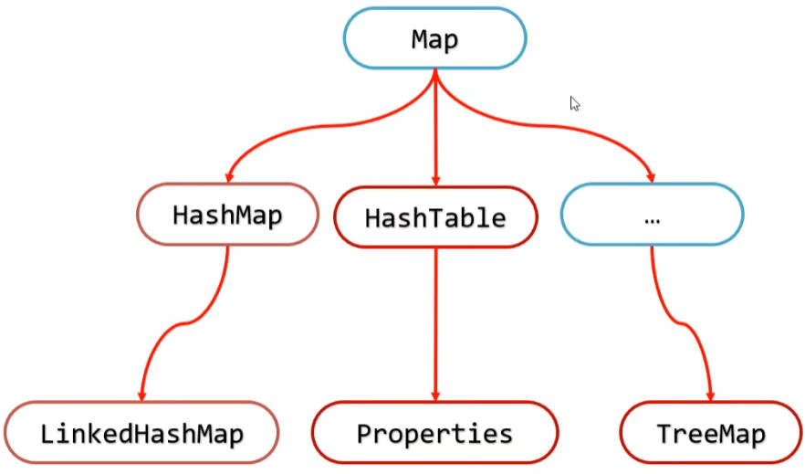

# Java IO 综合练习（二）

## 一、拼图小游戏-登录界面完善

将拼图小游戏中用户登录的信息，保存在本地文件 userinfo.txt 中。读取这些信息的时机应该在哪？

- 因为，只要登录界面不关闭，那么就不会修改文件中的数据；
- 所以，一般在**打开登录界面时**，读取文件中的数据；而不是点击登录按钮后读取。

### 1.静态代码块和构造方法的选择

加载文件中用户信息的逻辑，可以写在静态代码块，或者构造方法中；

- 静态代码块，随着类的加载而加载，**只执行一次**；
- 构造方法，每次创建登录界面对象（打开登录界面）时，都会执行。

分析可知，如果要加入注册逻辑，那么登录界面加载用户信息的逻辑，就要写在构造方法里。

- 因为注册逻辑，会改变 userinfo.txt 中保存的用户信息。

重构 `LoginFrame` 类，

- 并注释掉静态代码块：将 User 列表集合 `allUsers`，改为非静态的；
- 将加载用户信息的逻辑，放在构造方法中。

demo-project/puzzelgame/src/com/kkcf/ui/LoginJFrame.java

```java
public class LoginJFrame extends JFrame implements MouseListener {
    // ……

    // 创建一个集合存储正确的用户名和密码
    // static ArrayList<User> list = new ArrayList<>();
    ArrayList<User> allUsers = new ArrayList<>();

    /*static {
        list.add(new User("zhangsan", "123"));
        list.add(new User("lisi", "1234"));
    }*/

    public LoginJFrame() {
        // 读取文本文件中的用户信息
        readUserInfo();

        // ……
    }

    private void readUserInfo() {
        List<String> userInfoList = FileUtil.readUtf8Lines("D:\\Workshop\\tutorial\\JAVASE\\demo-project\\puzzelgame\\src\\com\\kkcf\\ui\\userinfo.txt");
        for (String userinfo : userInfoList) {
            String[] arr = userinfo.split("&");
            String[] arr1 = arr[0].split("=");
            String[] arr2 = arr[1].split("=");

            allUsers.add(new User(arr1[1], arr2[1]));
        }
        System.out.println(allUsers);
    }
}
```

## 二、拼图小游戏-注册界面完善

在登录界面，点击注册按钮：

- 关闭当前登录界面；
- 打开注册界面

demo-project/puzzelgame/src/com/kkcf/ui/LoginJFrame.java

```java
public class LoginJFrame extends JFrame implements MouseListener {
    // ……
    public void mouseReleased(MouseEvent e) {
        // ……
        if (obj == loginBtn) {
            // ……
        } else if (obj == registerBtn) {
            registerBtn.setIcon(new ImageIcon("image/login/注册按钮.png"));
            // 关闭当前登录页面
            this.setVisible(false);
            // 打开注册界面
            new RegisterJFrame(allUsers);
        } else if (obj == rightCode) {
            // ……
        }
    }
}
```

点击“重置”按钮后：将用户名、密码、再次输入密码输入框清空：

demo-project/puzzelgame/src/com/kkcf/ui/RegisterJFrame.java

```java
public class RegisterJFrame extends JFrame implements MouseListener {
    // ……
    @Override
    public void mouseClicked(MouseEvent e) {
        if (e.getSource() == submit) {

        } else if (e.getSource() == reset) {
            username.setText("");
            password.setText("");
            rePassword.setText("");
        }
    }
    // ……
}
```

点击“注册”按钮后：

- 判断用户名、密码不能为空；
- 判断两次密码输入是否一致；
- 判断用户名、密码格式是否正确；
- 判断用户名是否已经重复；
- 添加用户；
- 写入文件；
- 提示注册成功。

在 `RegisterJFrame` 类的构造方法中，接收 user 用户列表。

demo-project/puzzelgame/src/com/kkcf/ui/RegisterJFrame.java

```java
import cn.hutool.core.io.FileUtil;
// ……

public class RegisterJFrame extends JFrame implements MouseListener {
    ArrayList<User> allUsers = new ArrayList<>();

    public RegisterJFrame(ArrayList<User> allUsers) {
        this.allUsers = allUsers;
        initFrame();
        initView();
        setVisible(true);
    }
    // ……

    @Override
    public void mouseClicked(MouseEvent e) {
        if (e.getSource() == submit) {
            String username = this.username.getText();
            String password = this.password.getText();
            String rePassword = this.rePassword.getText();
            // 用户名、密码不能为空
            if (username.isEmpty() || password.isEmpty() || rePassword.isEmpty()) {
                showDialog("用户名、密码不能为空");
                return;
            }

            // 两次密码要一致
            if (!password.equals(rePassword)) {
                showDialog("两次输入密码不一致");
                return;
            }

            // 用户名、密码格式要正确
            if (!username.matches("[a-zA-Z0-9_-]{3,16}")) {
                showDialog("用户名格式不正确");
                return;
            }
            if (!password.matches(".{3,}")) {
                showDialog("密码格式不正确");
                return;
            }

            // 用户名是否重复
            if (containUser(username)) {
                showDialog("用户名已存在");
                return;
            }

            // 添加用户
            allUsers.add(new User(username, password));

            // 写出到文件
            FileUtil.writeLines(allUsers, "D:\\Workshop\\tutorial\\JAVASE\\demo-project\\puzzelgame\\src\\com\\kkcf\\ui\\userinfo.txt", "UTF-8");

            // 提示注册成功。
            showDialog("注册成功");

            // 关闭注册界面，打开登录界面
            this.setVisible(false);
            new LoginJFrame();
        }
        // ……
    }

    private boolean containUser(String username) {
        for (User user : allUsers)
            if (username.equals(user.getUsername())) return true;

        return false;
    }
}
```

重写 User 类中的 `toString` 方法，使得写出数据到 userinfo.txt 文本文件时，格式是正确的。

demo-project/puzzelgame/src/com/kkcf/javabean/User.java

```java
package com.kkcf.javabean;

public class User {
    // ……

    @Override
    public String toString() {
        return "username=" + username + "&password=" + password;
    }
}

```

## 三、拼图小游戏-存档读档

### 1.添加“存档”、”读档“菜单

在游戏界面的菜单中，添加”存档“和”读档“。

demo-project/puzzelgame/src/com/kkcf/ui/GameJFrame.java

```java
public class GameJFrame extends JFrame implements KeyListener, ActionListener, MouseListener {
    // ……
    JMenuItem saveItem0 = new JMenuItem("存档0（空）");
    JMenuItem saveItem1 = new JMenuItem("存档1（空）");
    JMenuItem saveItem2 = new JMenuItem("存档2（空）");
    JMenuItem saveItem3 = new JMenuItem("存档3（空）");
    JMenuItem saveItem4 = new JMenuItem("存档4（空）");

    JMenuItem loadItem0 = new JMenuItem("读档0（空）");
    JMenuItem loadItem1 = new JMenuItem("读档1（空）");
    JMenuItem loadItem2 = new JMenuItem("读档2（空）");
    JMenuItem loadItem3 = new JMenuItem("读档3（空）");
    JMenuItem loadItem4 = new JMenuItem("读档4（空）");
    // ……
    private void initJMenuBar() {
        // ……
        JMenu saveJMenu = new JMenu("存档");
        JMenu loadJMenu = new JMenu("读档");

        // ……
        saveJMenu.add(saveItem0);
        saveJMenu.add(saveItem1);
        saveJMenu.add(saveItem2);
        saveJMenu.add(saveItem3);
        saveJMenu.add(saveItem4);

        loadJMenu.add(loadItem0);
        loadJMenu.add(loadItem1);
        loadJMenu.add(loadItem2);
        loadJMenu.add(loadItem3);
        loadJMenu.add(loadItem4);

        // ……
        functionMenu.add(saveJMenu);
        functionMenu.add(loadJMenu);

        saveItem0.addActionListener(this);
        saveItem1.addActionListener(this);
        saveItem2.addActionListener(this);
        saveItem3.addActionListener(this);
        saveItem4.addActionListener(this);
        loadItem0.addActionListener(this);
        loadItem1.addActionListener(this);
        loadItem2.addActionListener(this);
        loadItem3.addActionListener(this);
        loadItem4.addActionListener(this);

    }
}
```

### 2.存档逻辑

点击”存档“后，将游戏数据写入到本地。

要写入文件中的数据有：data、x、y、path、stepCount

demo-project/puzzelgame/src/com/kkcf/ui/GameJFrame.java

```java
public class GameJFrame extends JFrame implements KeyListener, ActionListener, MouseListener {
    // 用于存放图片的随即索引
    int[][] data = new int[4][4];

    // 记录空白方块，在二维数组中的位置
    int x = 0;
    int y = 0;

    // 记录图片路径
    String path = "image/animal/animal3/";

    // 记录玩了多少步
    int stepCount = 0;
  
    // ……
}
```

创建一个 JavaBean 类 `GameInfo`，用于封装上面的信息；

- 为它实现 `Serializable` 接口，用于**字节序列化输出流**写入文件。

JavaBean `GameInfo` 类：

demo-project/puzzelgame/src/com/kkcf/javabean/GameInfo.java

```java
package com.kkcf.javabean;

import java.io.Serializable;
import java.util.Arrays;

public class GameInfo implements Serializable {
    // 用于存放图片的随即索引
    private int[][] data = new int[4][4];

    // 记录空白方块，在二维数组中的位置
    private int x = 0;
    private int y = 0;

    // 记录图片路径
    private String path = "image/animal/animal3/";

    // 记录玩了多少步
    int stepCount = 0;

    // constructor……

    // getter、setter……

    // toString……
}
```

`GameJFrame` 类中，编写存档逻辑：

demo-project/puzzelgame/src/com/kkcf/ui/GameJFrame.java

```java
@Override
public void actionPerformed(ActionEvent e) {
    // 获取当前被点击的菜单条目（item）对象
    Object obj = e.getSource();

    if (……) {
        // ……
    } else if (obj == this.saveItem0 || obj == this.saveItem1 || obj == this.saveItem2 || obj == this.saveItem3 || obj == this.saveItem4) {
        // 获取点击存档的序号
        JMenuItem item = (JMenuItem) obj;
        String text = item.getText();
        int index = text.charAt(2) - '0'; // 获取存档的索引

        // 写出存档数据
        try {
            ObjectOutputStream oos = new ObjectOutputStream(new FileOutputStream("save\\save" + index + ".data"));
            GameInfo gi = new GameInfo(this.data, this.x, this.y, this.path, this.stepCount);
            oos.writeObject(gi);
            oos.close();
        } catch (IOException ex) {
            ex.printStackTrace();
        }

        // 修改存档的展示信息
        item.setText("存档" + index + "（" + this.stepCount + "步）");

        // 修改读档的展示信息
        this.loadJMenu.getItem(index).setText("读档" + index + "（" + this.stepCount + "步）");
    }
    // ……
}
```

### 3.读档逻辑

`GameJFrame` 类中，编写读档逻辑：

- 点击”读档“后，将读取存档中的数据。

demo-project/puzzelgame/src/com/kkcf/ui/GameJFrame.java

```java
@Override
public void actionPerformed(ActionEvent e) {
    // 获取当前被点击的菜单条目（item）对象
    Object obj = e.getSource();

    if (……) {
        // ……
    } else if (obj == this.loadItem0 || obj == this.loadItem1 || obj == this.loadItem2 || obj == this.loadItem3 || obj == this.loadItem4) {
        // 获取点击读档的序号
        JMenuItem item = (JMenuItem) obj;
        String text = item.getText();
        int index = text.charAt(2) - '0';

        // 使用字节反序列化输入流，读取存档数据
        GameInfo gi = null;
        try {
            ObjectInputStream ois = new ObjectInputStream(new FileInputStream("save\\save" + index + ".data"));
            gi = (GameInfo) ois.readObject();
            ois.close();
        } catch (IOException ex) {
            ex.printStackTrace();
        } catch (ClassNotFoundException ex) {
            ex.printStackTrace();
        }

        this.data = gi.getData();
        this.x = gi.getX();
        this.y = gi.getY();
        this.path = gi.getPath();
        this.stepCount = gi.getStepCount();

        // 刷新页面
        initImage();
    }
}
```

### 4.加载“存档”，“读档”菜单

在**游戏启动时**，要根据存档文件，加载“存档”，“读档”菜单。

demo-project/puzzelgame/src/com/kkcf/ui/GameJFrame.java

```java
/**
 * 此方法用于，初始化菜单栏
 */
private void initJMenuBar() {
    // ……

    initGameinfo();

    // 给整个界面，设置菜单
    this.setJMenuBar(jMenuBar);
}

/**
 * 此方法用于，加载存档，取每一个存档中，记录的步数
 */
private void initGameinfo() {
    // 加载存档，取每一个存档中，记录的步数
    File file = new File("save\\");

    for (File f : Objects.requireNonNull(file.listFiles())) {
        GameInfo gi = null;
        try {
            ObjectInputStream ois = new ObjectInputStream(new FileInputStream(f));
            gi = (GameInfo) ois.readObject();
            ois.close();
        } catch (IOException e) {
            throw new RuntimeException(e);
        } catch (ClassNotFoundException e) {
            throw new RuntimeException(e);
        }

        int stepCount1 = gi.getStepCount();

        String fname = f.getName();
        int index = fname.charAt(4) - '0';
        this.saveJMenu.getItem(index).setText("存档" + index + "(" + stepCount1 + ")");
        this.loadJMenu.getItem(index).setText("读档" + index + "(" + stepCount1 + ")");
    }
}
```

## 四、properties 配置文件、Properties 类

有了配置文件，就可以把程序的设置，永久化存储。

如果要修改参数，不需要改动代码，直接修改配置文件就可以了。否则只要修改代码，就要重新打包、重新发布，非常麻烦。

> 常见的配置文件有：
>
> - xml
> - properties
> - ini
> - YAML

properties 配置文件，以 `.properties` 后缀名结尾；其中的数据，以键值对的形式存储，比如：

```properties
width=603
height=680
image=animal3
wechat=about.png
```

- 左边是键，右边是值。

在 Java 中，可以使用 `Properties` 类，从 properties 配置文件中，读取、写出数据。

`Properties` 类，属于 Map 双列集合体系结构：



`Properties` 是一个双列集合， 拥有 Map 集合的所有特点。它有一些特有的方法：

- 可以把集合中的数据，按照键值对的形式，写到配置文件当中。
- 也可以把配置文件中的数据，读取到程序的双列集合中来。

`Properties` 不是一个泛型类，原则上可以添加任意类型的键和值，但在实际开发中，一般只添加 String 类型的键和值。

### 1.Map 中的方法

Map 双列集合中有 `put` 方法、`keySet` 方法、`get` 方法等等。

demo-project/base-code/Day24/src/com/kkcf/properties/Test1.java

```java
package com.kkcf.properties;

import java.util.Properties;

public class Test1 {
    public static void main(String[] args) {
        Properties prop = new Properties();

        // 添加键值对元素
        prop.put("aaa", "111");
        prop.put("bbb", "222");
        prop.put("ccc", "333");
        prop.put("ddd", "444");

        System.out.println(prop); // {aaa=111, ccc=333, bbb=222, ddd=444}

        // 遍历集合
        for (Object key : prop.keySet()) {
            Object val = prop.get(key);
            System.out.println(key + "=" + val);
            /*aaa=111
            ccc=333
            bbb=222
            ddd=444*/
        }
    }
}
```

### 2.store 特有方法

将 `Properties` 集合中的数据，写出到文件中，使用 `store` 方法

demo-project/base-code/Day24/src/com/kkcf/properties/Test2.java

```java
package com.kkcf.properties;

import java.io.BufferedWriter;
import java.io.FileWriter;
import java.io.IOException;
import java.util.Properties;

public class Test2 {
    public static void main(String[] args) throws IOException {
        Properties p = new Properties();

        p.put("aaa", "bbb");
        p.put("ccc", "ddd");
        p.put("eee", "fff");

        BufferedWriter bw = new BufferedWriter(new FileWriter("Day24/src/com/kkcf/properties/a.txt"));

        // 写出数据 - 普通做法
        /*for (Map.Entry<Object, Object> entry : p.entrySet()) {
            bw.write(entry.getKey() + "=" + entry.getValue());
            bw.newLine();
        }*/

        // 写出数据 - store 方法，可传入字节、字符输出流。
        p.store(bw, "This is a test"); // 第二个参数是备注

        bw.close();
    }
}
```

### 3.load 特有方法

利用 `Properties` 集合，读取 .properties 配置文件中的数据，使用 `load` 方法。

demo-project/base-code/Day24/src/com/kkcf/properties/Test3.java

```java
package com.kkcf.properties;

import java.io.FileInputStream;
import java.io.IOException;
import java.util.Properties;

public class Test3 {
    public static void main(String[] args) throws IOException {
        Properties p = new Properties();

        FileInputStream fis = new FileInputStream("Day24/src/com/kkcf/properties/a.properties");
        // 可传入字节、字符输入流。
        p.load(fis);
        fis.close();

        System.out.println(p); // {aaa=bbb, ccc=ddd, eee=fff}
    }
}
```

## 五、拼图小游戏-配置文件

把点击“关于我们”要展示的图片，放到配置文件中。

在项目根目录下 ，创建一个 account.properties 配置文件，在其中配置公众号图片的路径，格式如下：

demo-project/puzzelgame/account.properties

```properties
#account=image/damie.jpg
account=image/girl/girl11/all.jpg
```

在 `GameJFrame` 类中，加载配置文件

demo-project/puzzelgame/src/com/kkcf/ui/GameJFrame.java

```java
@Override
public void actionPerformed(ActionEvent e) {
    // 获取当前被点击的菜单条目（item）对象
    Object obj = e.getSource();

    if (……) {
        // ……
    } else if (obj == accountItem) {
        // 创建一个弹框对象
        JDialog jDialog = new JDialog();
        // 创建一个管理图片的容器对象 JLabel
        JLabel jLabel = new JLabel(new ImageIcon(loadAccountPath()));
        // ……
    }
}

/**
 * 此方法用于，从 account.properties 配置文件中，加载公众号图片路径
 * @return
 */
public String loadAccountPath() {
    Properties p = new Properties();

    try {
        FileInputStream fis = new FileInputStream("account.properties");
        p.load(fis);
        fis.close();
    } catch (IOException e) {
        throw new RuntimeException(e);
    }

    return (String) p.get("account");
}
```
