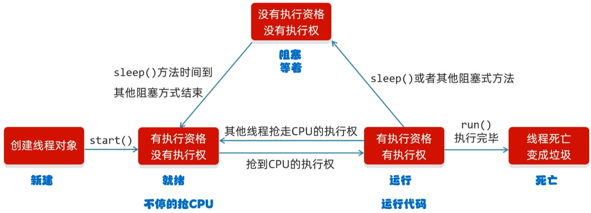

# Java 多线程之并发并行、实现方式、Thread 类和方法、生命周期、线程安全、锁和死锁

**线程**是操作系统，能够进行运算调度的**最小单位**；

线程被包含在**进程**之中，是进程中的实际运作单位。

进程是程序的基本执行实体。一个软件运行，就会产生至少一个进程：


线程可理解为，应用软件中，互相独立，又可同时运行的功能。这样的功能比较多，就形成了**多线程**。

多线程的应用场景：

- 程序中的耗时操作；比如：
  - 拷贝，迁移大文件。
  - 加载大量的资源文件。
- 所有的聊天软件；
- 所有的后台服务器。

## 一、多线程并发、并行

**并发**，是多线程中的概念，指的是在**同一时段**，有多个指令在**单个** CPU 线程上交替执行。

**并行**，是多线程中的概念，指的是在**同一时刻**，有多个指令在**多个** CPU 线程上同时执行。

> 计算机的 CPU 规格有：
>
> - 2 核 4 线程。
> - 4 核 8 线程。
> - ……
>
> 上面的线程数，就代表计算机在同一时刻，可以执行的线程数。

计算机中，并发、并行有可能同时发生。

## 二、Java 多线程实现方式

JVM 虚拟机允许应用程序，**并行**地运行多个线程。

### 1.继承 Thread 类

在 Java 中，`Thread` 类，表示线程。

使用 `Thread` 类，实现多线程的步骤：

1. 自定义一个类，继承 `Thread` 类；
2. 在自定义类中，重写 `run` 方法；
3. 创建多个自定义类对象，并启动线程。

自定义 `MyThread` 类，继承 `Thread` 类：

demo-project/base-code/Day31/src/com/kkcf/thread/MyThread.java

```java
package com.kkcf.thread;

public class MyThread extends Thread {
    @Override
    public void run() {
        for (int i = 0; i < 100; i++)
            System.out.println(super.getName() + "Hello frog");
    }
}
```

测试类：

demo-project/base-code/Day31/src/com/kkcf/thread/Demo01.java

```java
package com.kkcf.thread;

public class Demo01 {
    public static void main(String[] args) {
        MyThread mt1 = new MyThread();
        MyThread mt2 = new MyThread();

        // 为线程设置名称
        mt1.setName("线程1");
        mt2.setName("线程2");

        mt1.start();
        mt2.start();
    }
}
```

### 2.实现 Runnable 接口

使用 `Runable` 接口，实现多线程的步骤：

1. 自定义类，实现 `Runable` 接口；
2. 在自定义类，实现 `run` 方法；
3. 创建自定义类实例对象；
4. 创建多个 `Thread` 类对象，传入自定义类的实例对象；
5. 开启线程。

自定义 `MyRun` 类，实现 `Runnable` 接口

demo-project/base-code/Day31/src/com/kkcf/runable/MyRun.java

```java
package com.kkcf.runable;

public class MyRun implements Runnable {
    @Override
    public void run() {
        for (int i = 0; i < 100; i++) {
            // 在打印前，先获取到线程对象
            Thread t = Thread.currentThread();
            System.out.println(t.getName() + "Hello Frog");
        }
    }
}
```

测试类：

demo-project/base-code/Day31/src/com/kkcf/runable/Demo01.java

```java
package com.kkcf.runable;

public class Demo01 {
    public static void main(String[] args) {
        // 创建 MyRun 类的实例对象，表示多线程要实现的任务
        MyRun mr = new MyRun();

        // 创建线程对象
        Thread t1 = new Thread(mr);
        Thread t2 = new Thread(mr);

        // 给线程设置名字
        t1.setName("线程1");
        t2.setName("线程2");

        // 开启线程
        t1.start();
        t2.start();
    }
}
```

### 3.实现 Callable 接口、使用 Future 接口

继承 `Thread` 类、实现 `Runnable` 接口，这两种多线程的实现方式，在 `run` 方法中都没有返回值。

如果想要获取多线程运行的结果，就要使用实现 `Callable` 接口、使用 `Futrure` 接口的方式。

具体步骤如下：

1. 自定义类，实现 `Callable` 泛型接口，泛型表示返回值的类型。
2. 在自定义类中，重写 `call` 方法，该方法有返回值，表示多线程运行的结果。
3. 创建自定义类的实例对象，表示多线程要实现的任务。
4. 创建多个 `Future` 接口实现类 `FutureTask` 类的实例对象，传入任务对象，用于管理多线程任务运行的结果。
5. 创建多个 `Thread` 类的实例对象，并启动线程。

开启两个线程，求 1-100 的和。

自定义类 `MyCallable`

demo-project/base-code/Day31/src/com/kkcf/callable/MyCallable.java

```java
package com.kkcf.callable;

import java.util.concurrent.Callable;

public class MyCallable implements Callable<Integer> {
    @Override
    public Integer call() throws Exception {
        int sum = 0;

        for (int i = 1; i <= 100; i++)
            sum += i;

        return sum;
    }
}
```

测试类：

demo-project/base-code/Day31/src/com/kkcf/callable/Demo01.java

```java
package com.kkcf.callable;

import java.util.concurrent.ExecutionException;
import java.util.concurrent.FutureTask;

public class Demo01 {
    public static void main(String[] args) throws ExecutionException, InterruptedException {
        MyCallable mc = new MyCallable();

        FutureTask<Integer> ft1 = new FutureTask<>(mc);
        FutureTask<Integer> ft2 = new FutureTask<>(mc);

        Thread t1 = new Thread(ft1);
        Thread t2 = new Thread(ft2);

        t1.start();
        t2.start();

        // 获取多线程运行的结果
        Integer result1 = ft1.get();
        Integer result2 = ft2.get();
        System.out.println(result1);
        System.out.println(result2);
    }
}
```

总结：三种方式，如何选择：

- 要得到返回值，选择：
  - 实现 `Callable` 接口，使用 `Future` 接口（优点：使用接口的方式实现，扩展性强，可以继承其它类，编程比较复杂）。
- 不需要得到返回值：选择：
  - 继承 `Thread` 类（优点：使用继承的方式实现，编程比较简单；缺点：可扩展性差，不能继承其它类）；
  - 实现 `Runable` 接口（优点：使用接口的方式实现，扩展性强，可以继承其它类，编程比较复杂）；

## 三、Thread 类常用方法

`Thread` 类常用方法如下：

| 方法名                              | 说明                                     |
| ----------------------------------- | ---------------------------------------- |
| `String getName)()`                 | 返回此线程的名称                         |
| `void setName(String name)`         | 设置线程的名称（也为构造方法传参来设置） |
| `static Thread currentThread()`     | 获取当前线程的对象                       |
| `static void sleep(long time)`      | 让线程休眠指定的时间（单位：毫秒）       |
| `void setPriority(int newPriority)` | 设置线程优先级                           |
| `final int getPriority`             | 获取线程的优先级                         |
| `final void setDaemon(boolean on)`  | 设置守护进程                             |
| `static void yield()`               | 设置礼让线程（出让线程）                 |
| `void join()`                       | 设置插入线程（插队线程）                 |

- 线程优先级越高，抢占到 CPU 执行权的概率越高。
- 线程有默认名字，格式 `Thread-xxx`，`xxx` 是以 0 开始的序号。

### 1.getName、setName 方法

上面的示例中，演示了 `getName`、`setName` 方法的使用；

还可以使用 `Thread` 类的**构造方法**，为线程设置名字。

自定义类 `MyThread`：

- 构造方法不能被继承，要使用 super 关键字调用。

demo-project/base-code/Day31/src/com/kkcf/thread/MyThread.java

```java
package com.kkcf.thread;

public class MyThread extends Thread {
    public MyThread() {
    }

    public MyThread(String name) {
        super(name);
    }

    @Override
    public void run() {
        for (int i = 0; i < 100; i++)
            System.out.println(super.getName() + "Hello frog");
    }
}
```

测试类：

demo-project/base-code/Day31/src/com/kkcf/thread/Demo02.java

```java
package com.kkcf.thread;

public class Demo02 {
    public static void main(String[] args) {
        MyThread mt1 = new MyThread("飞机");
        MyThread mt2 = new MyThread("坦克");

        mt1.start();
        mt2.start();
    }
}
```

### 2.currentThread 静态方法

`currentThread` 静态方法，用于获取当前线程的对象。

在测试类的 `main` 方法中，直接获取线程的名称。

demo-project/base-code/Day31/src/com/kkcf/thread/Demo03.java

```java
package com.kkcf.thread;

public class Demo03 {
    public static void main(String[] args) {
        System.out.println(Thread.currentThread().getName()); // main
    }
}
```

1. 在 JVM 虚拟机启动之后，会自动启动多条线程；
2. 其中一个就是 main 线程，它的作用是调用 `main` 方法，执行里面的代码。
3. 所以在测试类 `main` 方法中的代码，都是运行在 `main` 线程中的。

### 3.sleep 静态方法

`sleep` 静态方法，用于指定线程休眠的时间（单位：毫秒）

- 线程执行到这个静态方法，就会在执行处停留相应的时间；
- 当时间到了后，线程会自动醒来，执行下面的其它代码。

案例 1：将 main 线程，休眠 5s

demo-project/base-code/Day31/src/com/kkcf/thread/Demo04.java

```java
package com.kkcf.thread;

public class Demo04 {
    public static void main(String[] args) throws InterruptedException {
        System.out.println("哈哈哈哈哈哈哈哈哈哈哈哈");
        Thread.sleep(5000);
        System.out.println("红红火火恍恍惚惚嘿嘿");
    }
}
```

案例 2：为交替执行的两个线程，进行休眠：

- 这种做法，可以让多线程任务执行的更加均匀。

自定义类 `MyThread`；

demo-project/base-code/Day31/src/com/kkcf/thread/MyThread.java

```java
package com.kkcf.thread;

public class MyThread extends Thread {
    public MyThread() {
    }

    public MyThread(String name) {
        super(name);
    }

    @Override
    public void run() {
        for (int i = 0; i < 100; i++) {
            try {
                Thread.sleep(1000);
            } catch (InterruptedException e) {
                throw new RuntimeException(e);
            }
            System.out.println(super.getName() + "Hello frog");
        }
    }
}
```

测试类：

demo-project/base-code/Day31/src/com/kkcf/thread/Demo02.java

```java
package com.kkcf.thread;

public class Demo02 {
    public static void main(String[] args) {
        MyThread mt1 = new MyThread("飞机");
        MyThread mt2 = new MyThread("坦克");

        mt1.start();
        mt2.start();
    }
}
```

### 4.setPriority、getPriority 方法

计算机中，线程的调度分为两种：

- **抢占式调度**，默认的方式，指的是多个线程，在抢夺 CPU 的执行权；
  - CPU 在什么时候，执行哪个线程，执行多长时间，都是不确定的；所以默认线程执行具有**随机性**。

- **非抢占式调度**，指的是多个线程，轮流被 CPU 执行。

在 Java 中，线程执行采用的是**抢占式调度**的方式，

Java 线程的优先级越大，抢到 CPU 执行权的概率就越大。

Java 线程的优先级分为 10 挡；最小 `1`，最大 `10`；默认 `5`；

获取线程的默认优先级：

demo-project/base-code/Day31/src/com/kkcf/runable/Demo02.java

```java
package com.kkcf.runable;

public class Demo02 {
    public static void main(String[] args) {
        MyRun1 mr = new MyRun1();

        Thread t1 = new Thread(mr);
        Thread t2 = new Thread(mr);

        System.out.println(t1.getPriority()); // 5
        System.out.println(t2.getPriority()); // 5
        Thread.currentThread().getPriority(); // 5
    }
}
```

在线程创建后，设置线程的优先级：

demo-project/base-code/Day31/src/com/kkcf/runable/Demo02.java

```java
package com.kkcf.runable;

public class Demo02 {
    public static void main(String[] args) {
        MyRun1 mr = new MyRun1();

        Thread t1 = new Thread(mr, "飞机");
        Thread t2 = new Thread(mr, "坦克");

        t1.setPriority(10);
        t2.setPriority(1);

        t1.start();
        t2.start();
    }
}
```

### 5.setDaemon 方法（守护线程）用的少

`setDaemon` 方法，用于设置守护进程；

当其它的非守护线程执行完毕后，守护线程也没有继续执行的必要了，它会**陆续**结束（不是立刻结束）。

创建两个自定义类：`MyThread1`、`MyThread2`，继承自 `Thread` 类。

demo-project/base-code/Day31/src/com/kkcf/thread/MyThread1.java

```java
package com.kkcf.thread;

public class MyThread1 extends Thread {
    @Override
    public void run() {
        for (int i = 0; i < 10; i++) {
            System.out.println(Thread.currentThread().getName() + "@" + i);
        }
    }
}
```

demo-project/base-code/Day31/src/com/kkcf/thread/MyThread2.java

```java
package com.kkcf.thread;

public class MyThread2 extends Thread {
    @Override
    public void run() {
        for (int i = 0; i < 100; i++) {
            System.out.println(Thread.currentThread().getName() + "@" + i);
        }
    }
}
```

在测试类，设置 `MyThread2` 类创建的线程，为守护进程：

demo-project/base-code/Day31/src/com/kkcf/thread/Demo05.java

```java
package com.kkcf.thread;

public class Demo05 {
    public static void main(String[] args) {
        MyThread1 t1 = new MyThread1();
        MyThread2 t2 = new MyThread2();

        t1.setName("wee");
        t2.setName("zzt");

        t2.setDaemon(true);

        t1.start();
        t2.start();
    }
}
```

守护线程的应用场景之一：在聊天软件中，发送文件；

- 可将发送文件的线程，设置为聊天线程的守护线程；
- 当聊天窗口关闭后，发送文件也会被终止。


### 6.yield 静态方法（礼让线程）

`yield` 方法，用于设置礼让（出让）线程；

礼让线程，会交还 CPU 执行权，给多个线程抢夺；这会尽可能的**让多个线程执行的更加均匀**。

自定义类 `MyThread3`，在 `run` 方法中，设置礼让线程。

```java
package com.kkcf.thread;

public class MyThread3 extends Thread {
    @Override
    public void run() {
        for (int i = 0; i < 100; i++) {
            System.out.println(Thread.currentThread().getName() + ":" + i);

            Thread.yield();
        }
    }
}
```

测试类：

demo-project/base-code/Day31/src/com/kkcf/thread/Demo06.java

```java
package com.kkcf.thread;

public class Demo06 {
    public static void main(String[] args) {
        MyThread3 t1 = new MyThread3();
        MyThread3 t2 = new MyThread3();

        t1.setName("飞机");
        t2.setName("坦克");

        t1.start();
        t2.start();
    }
}
```

### 7.join 方法（插队线程）用的少

`join` 静态方法，用于设置插队线程。

一个线程，设置了插队线程，会在当前线程之前执行。

demo-project/base-code/Day31/src/com/kkcf/thread/Demo07.java

```java
package com.kkcf.thread;

public class Demo07 {
    public static void main(String[] args) throws InterruptedException {
        MyThread2 t = new MyThread2();
        t.setName("土豆");

        t.start();
        // 设置插入线程，将 t 线程，放在当前线程（main 线程）前执行。
        t.join();
        // 当前线程 main
        for (int i = 0; i < 10; i++) {
            System.out.println(Thread.currentThread().getName() + ":" + i);
        }
    }
}
```

## 四、线程的生命周期

线程的生命周期，如下图所示：



- 执行资格，表示抢夺 CPU 执行权的资格；
- 执行权，表示被 CPU 执行。

注意：`sleep` 静态方法，设置的睡眠时间到时后，不会立即执行线程中的代码，而是要先抢夺 CPU 的执行权。

## 五、线程安全问题

案例理解：电影院有三个窗口卖票，总共有 100 张票：

自定义类 `MovieTicketSaleThread`，继承自 `Thread` 类。

demo-project/base-code/Day31/src/com/kkcf/test/MovieTicketSaleThread.java

```java
package com.kkcf.test;

public class MovieTicketSaleThread extends Thread {
    static int ticketCount = 0;

    public MovieTicketSaleThread() {
    }

    public MovieTicketSaleThread(String name) {
        super(name);
    }

    @Override
    public void run() {
        while (this.ticketCount < 100) {
            try {
                Thread.sleep(100);
            } catch (InterruptedException e) {
                e.printStackTrace();
            }
            System.out.println(Thread.currentThread().getName() + "正在卖第" + (++ticketCount) + "张票");
        }
    }
}
```

- `static int ticketCount = 0;` 表示电影院已经卖了 0 张票。

测试类：

demo-project/base-code/Day31/src/com/kkcf/test/Test01.java

```java
package com.kkcf.test;

public class Test01 {
    public static void main(String[] args) {
        MovieTicketSaleThread t1 = new MovieTicketSaleThread("窗口1");
        MovieTicketSaleThread t2 = new MovieTicketSaleThread("窗口2");
        MovieTicketSaleThread t3 = new MovieTicketSaleThread("窗口3");

        t1.start();
        t2.start();
        t3.start();
    }
}
```

以上做法，会出现两个问题：

- 问题 1：两个不同窗口，会卖出同一张票；
- 问题 2：卖出的总票数，会超出 100 张。

这是因为，线程在执行**每行代码**的时候，CPU 的使用权，随时都有可能被其它线程抢走。这体现了线程**抢占式调度**执行的**随机性**。

### 1.同步代码块和锁

解决以上问题，要用到**同步代码块**，即把一个代码块**锁住**。使用 `synchronized` 关键字和锁对象，格式为：

```java
synchronized (锁对象) {
    操作共享数据的代码块……
}
```

锁对象，可以是**任意 Java  对象**，但要求必须是唯一的，否则同步代码块无效。

锁有如下特点：

- 特点 1：锁默认打开，当有一个线程进入，则关闭；
- 特点 2：锁里面的代码全部执行完，线程出来，锁自动打开；

使用同步代码块，重构 `MovieTicketSaleThread` 类里面的代码：

demo-project/base-code/Day31/src/com/kkcf/test/MovieTicketSaleThread.java

```java
package com.kkcf.test;

public class MovieTicketSaleThread extends Thread {
    static int ticketCount = 0;

    // 锁对象
    // static final Object lock = new Object();

    public MovieTicketSaleThread() {
    }

    public MovieTicketSaleThread(String name) {
        super(name);
    }

    @Override
    public void run() {
        while (true) {
            synchronized (MovieTicketSaleThread.class) {
                try {
                    Thread.sleep(10);
                } catch (InterruptedException e) {
                    System.out.println(e.getMessage());
                }

                if (ticketCount < 100)
                    System.out.println(Thread.currentThread().getName() + "正在卖第" + (++ticketCount) + "张票");
                else
                    break;
            }
        }
    }
}
```

- 细节 1：同步代码块，不能写在循环的外面，否则循环体会被一个进程执行完毕，锁才会开放。
- 细节 2：锁对象，一般会使用当前类的字节码文件对象，即 `MovieTicketSaleThread.class`，因为它是唯一的。

### 2.同步方法

如果要把一个方法中的所有代码，都使用同步代码块包裹，那么可以直接使用**同步方法**。

同步方法的格式：

```java
修饰符 synchronized 返回值类型 方法名(参数列表) {}
```

同步方法的特点：

- 特点 1：同步方法，可以锁住方法里面的所有代码；
- 特点 2：同步方法的锁对象，不能自己指定。
  - 如果是**静态方法**，锁对象是当前类的字节码文件对象；
  - 如果是**非静态方法**，锁对象是 `this`，即调用方法的对象。

使用 `Runable` 接口，和同步方法，重构上面的 `MovieTicketSaleThread` 类；

demo-project/base-code/Day31/src/com/kkcf/test/MovieTicketSaleRunable.java

```java
package com.kkcf.test;

public class MovieTicketSaleRunable implements Runnable {
    int ticketCount = 0;

    private synchronized boolean goooo() {
        try {
            Thread.sleep(10);
        } catch (InterruptedException e) {
            System.out.println(e.getMessage());
        }

        if (ticketCount < 100) {
            System.out.println(Thread.currentThread().getName() + "正在卖第" + (++ticketCount) + "张票");
            return false;
        }
        return true;
    }

    @Override
    public void run() {
        while (true) {
            if (goooo()) break;
        }
    }
}
```

- 使用实现 `Runable` 接口的方式实现多线程，在测试类中，只会创建一个 `MovieTicketSaleRunable` 对象，所以
  - `int ticketCount = 0;` 可以不使用 `static` 修饰。
  - 同步方法的锁，被设为 `this`，也是唯一的。
  - 因此，在多线程场景中，使用同步方法时，应使用“实现 `Runable` 接口“的方案。

测试类：

demo-project/base-code/Day31/src/com/kkcf/test/Test02.java

```java
package com.kkcf.test;

public class Test02 {
    public static void main(String[] args) {
        MovieTicketSaleRunable mtsr = new MovieTicketSaleRunable();

        Thread t1 = new Thread(mtsr, "窗口1");
        Thread t2 = new Thread(mtsr, "窗口2");
        Thread t3 = new Thread(mtsr, "窗口3");

        t1.start();
        t2.start();
        t3.start();
    }
}
```

#### 1.StringBuffer 类

Java 的 `StringBuffer` 类，相比于 `StringBuilder` 类，它们的功能都是一样的，只不过 `StringBuffer` 是线程安全的。

`StringBuffer` 类，里面的所有成员方法，都被 `synchronized` 关键字修饰，它们都**是同步方法**。

> 总结：编写多线程代码，遵循 3 步操作：
>
> 1. 循环；
> 2. 同步代码块；
> 3. 判断共享数据的逻辑，是否到了末尾；
>    - 到末尾，跳出循环；
>    - 没到末尾，执行核心逻辑。

## 六、Lock 锁

同步代码块，同步方法中的锁，都是自动上锁，自动解锁的。

为了更清晰的表达如何上锁，如何解锁；JDK5 以后，提供了一个锁接口 `Lock`。

`Lock` 是一个接口，它相比 `synchronized` 关键字声明的同步代码块、同步方法，可以获得更加广泛的锁定操作。其中有方法：

- `void lock()`，用于上锁；
- `void unlock()`，用于解锁；

这里使用 `Lock` 接口的实现类 `ReentrantLock`，来进行锁对象的实例化。

重构上方的 `MovieTicketSaleThread` 类。

自定义类 `MovieTicketSaleThread1`：

demo-project/base-code/Day31/src/com/kkcf/test/MovieTicketSaleThread1.java

```java
package com.kkcf.test;

import java.util.concurrent.locks.ReentrantLock;

public class MovieTicketSaleThread1 extends Thread {
    static int ticketCount = 0;
    static final ReentrantLock lock = new ReentrantLock();

    public MovieTicketSaleThread1() {
    }

    public MovieTicketSaleThread1(String name) {
        super(name);
    }

    @Override
    public void run() {
        while (true) {
            //synchronized (MovieTicketSaleThread.class) {
            lock.lock();
            try {
                Thread.sleep(10);
                if (ticketCount < 100) {
                    System.out.println(Thread.currentThread().getName() + "正在卖第" + (++ticketCount) + "张票");
                } else {
                    break;
                }
            } catch (InterruptedException e) {
                System.out.println(e.getMessage());
                throw new RuntimeException(e);
            } finally {
                lock.unlock();
            }
            //}
        }
    }
}
```

- 细节 1：在继承 `Thread` 类的自定义类中，`Lock` 锁的实例对象，要加 `static final` 关键字修饰，表示唯一的一把锁。
- 细节 2：如果执行 break 语句跳出循环代码的线程，正处于上锁状态，那么其它线程会卡在上锁处，等待上锁线程锁的释放，然而上锁的线程已跳出循环，不会执行释放锁的代码。这会导致程序不能停止；
  - 解决上面的问题，就要利用 `try…catch…finally` 代码块中 `finally` 代码块必会执行的特性，把解锁的代码 `lock.unlock();` 放入其中执行。

测试类：

demo-project/base-code/Day31/src/com/kkcf/test/Test01.java

```java
package com.kkcf.test;

public class Test01 {
    public static void main(String[] args) {
        MovieTicketSaleThread1 t1 = new MovieTicketSaleThread1("窗口1");
        MovieTicketSaleThread1 t2 = new MovieTicketSaleThread1("窗口2");
        MovieTicketSaleThread1 t3 = new MovieTicketSaleThread1("窗口3");

        t1.start();
        t2.start();
        t3.start();
    }
}
```

## 七、死锁问题

死锁，是一个代码错误情况，指的是锁里面嵌套了锁。导致程序卡死；

理解下方代码：

自定义类 `DeadThread`，继承自 `Thread` 类

demo-project/base-code/Day31/src/com/kkcf/test/DeadThread.java

```java
package com.kkcf.test;

public class DeadThread extends Thread {
    static final Object obja = new Object();
    static final Object objb = new Object();

    @Override
    public void run() {
        while (true) {
            if ("线程A".equals(this.getName())) {
                synchronized (obja) {
                    System.out.println("线程A拿到了A锁，准备拿B锁");
                    synchronized (objb) {
                        System.out.println("线程A拿到了B锁，顺利执行完一轮");
                    }
                }
            } else {
                synchronized (objb) {
                    System.out.println("线程B拿到了B锁，准备拿A锁");
                    synchronized (obja) {
                        System.out.println("线程B拿到了A锁，顺利执行完一轮");
                    }
                }
            }
        }
    }
}
```

测试类：

demo-project/base-code/Day31/src/com/kkcf/test/Test03.java

```java
package com.kkcf.test;

public class Test03 {
    public static void main(String[] args) {
        DeadThread t1 = new DeadThread();
        DeadThread t2 = new DeadThread();

        t1.setName("线程A");
        t2.setName("线程B");

        t1.start();
        t2.start();
    }
}
```

注意，在开发中，**不要让两个锁嵌套**。
