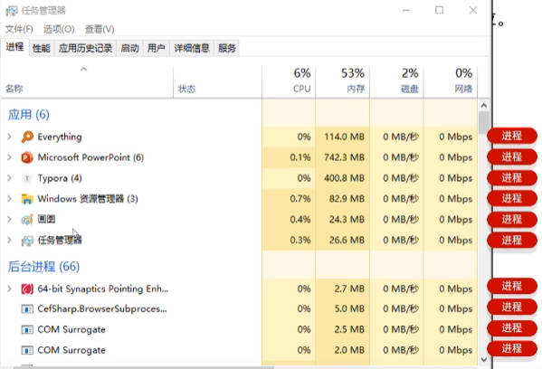

# Java 多线程

**线程**是操作系统，能够进行运算调度的最小单位，它被包含在**进程**之中，是进程中的实际运作单位。

进程是程序的基本执行实体。一个软件运行，就会产生至少一个进程：

线程可理解为，引用软件中互相独立，又可同时运行的功能。这样的功能比较多，就形成了**多线程**。

多线程的应用场景：

- 程序中的耗时操作；比如：
  - 拷贝，迁移大文件。
  - 加载大量的资源文件。
- 所有的聊天软件；
- 所有的后台服务器。

## 一、多线程-并发、并行

**并发**，是多线程中的概念，指的是在**同一时段**，有多个指令在**单个** CPU 线程上交替执行。

**并行**，是多线程中的概念，指的是在**同一时刻**，有多个指令在**多个** CPU 线程上同时执行。

> 计算机的 CPU 规格有：
>
> - 2 核 4 线程。
> - 4 核 8 线程。
> - ……
>
> 上面的线程数，就代表计算机在同一时刻，可以执行的线程数。
