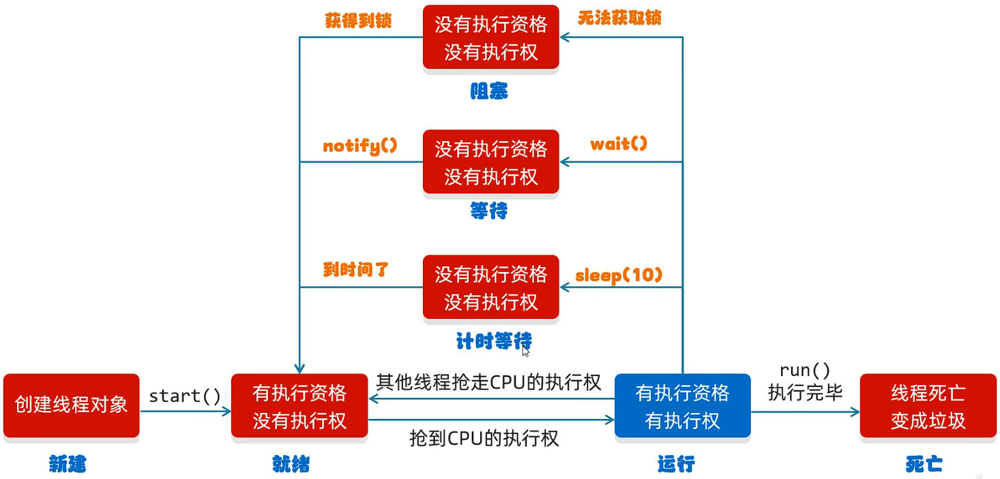

# Java 多线程之生产者消费者模式、阻塞对列

## 一、生产者消费者模式

**生产者消费者模式**，又称为**等待唤醒机制**，是一个十分经典的多线程设计模式。

等待唤醒机制，会让两个随机执行的线程，有规律的执行，比如：交替执行。

- 其中一个线程，被视为生产者，用于生产数据；
- 另一个线程，被视为消费者，用于消费数据。

将生产者消费者模式，抽象为“顾客-厨师”模型后：顾客作为消费者，厨师作为生产者：

- 消费者顾客：
  1. 判断桌子上是否有食物；
  2. 如果没有，则等待；
  3. 如果有，则吃完食物；
  4. 唤醒等待的厨师制作食物；

- 生产者厨师：
  1. 判断桌子上是否有食物：
  2. 如果有，则等待；
  3. 如果没有，则制作食物；
  4. 把食物放在桌子上；
  5. 唤醒等待的顾客吃食物。

- 控制生产者和消费者执行的第三者是：桌子。

其中涉及到的锁对象（任意且唯一的对象，`Object` 类）中的方法有

| 方法名             | 声明                             |
| ------------------ | -------------------------------- |
| `void wait()`      | 当前线程等待，直到被其它线程唤醒 |
| `void notify()`    | 随机唤醒单个线程（不常用）       |
| `void notifyAll()` | 唤醒所有线程                     |

> 回顾：编写多线程代码，遵循 4 步操作：
>
> 1. 写循环体；
> 2. 写同步代码块；
> 3. 判断共享数据，是否到了末尾；
>    - 到末尾，跳出循环
>    - 没到末尾，执行核心逻辑

### 1.基本实现

使用代码，实现上面的模型：

定义第三者桌子类 `Desk`：

demo-project/base-code/Day31/src/com/kkcf/producer_consumer/Desk.java

```java
package com.kkcf.producer_consumer;

public class Desk {
    // 是否有咖啡：0 表示没有，1 表示有
    public static int coffeFlag = 0;

    // 表示顾客最多喝 10 杯咖啡
    public static int count = 10;

    // 锁对象
    public static final Object lock = new Object();
}
```

厨师类：`Cook`，继承自 `Thread` 类

demo-project/base-code/Day31/src/com/kkcf/producer_consumer/Cook.java

```java
package com.kkcf.producer_consumer;

public class Cook extends Thread {
    @Override
    public void run() {
        while (true) {
            synchronized (Desk.lock) {
                if (Desk.count > 0) {
                    // 核心逻辑
                    if (Desk.coffeFlag == 1) {
                        // 桌子上有咖啡，则等待
                        try {
                            Desk.lock.wait(); // 锁对象，与线程绑定
                        } catch (InterruptedException e) {
                            e.printStackTrace();
                        }
                    } else {
                        // 桌子上没有咖啡，则做咖啡；
                        System.out.println("厨师做了一杯咖啡");

                        // 将咖啡放在桌上，修改桌子的状态
                        Desk.coffeFlag = 1;

                        // 咖啡做完，唤醒顾客，喝咖啡
                        Desk.lock.notifyAll();
                    }

                } else {
                    break;
                }
            }
        }

    }
}
```

- `Desk.lock` 时 Desk 类里面的一个静态常量，表示唯一锁对象。
- `Desk.lock.wait()` 表示使用锁对象唤醒。
- `Desk.lock.notifyAll()` 表示同唤醒锁对象锁住的所有线程。

顾客类 `Foodie`，继承自 `Thread`：

demo-project/base-code/Day31/src/com/kkcf/producer_consumer/Foodie.java

```java
package com.kkcf.producer_consumer;

public class Foodie extends Thread {
    @Override
    public void run() {
        while (true) {
            synchronized (Desk.lock) {
                if (Desk.count > 0) {
                    // 核心逻辑
                    if (Desk.coffeFlag == 0) {
                        // 桌子上没有咖啡，则等待
                        try {
                            Desk.lock.wait(); // 锁对象，与线程绑定
                        } catch (InterruptedException e) {
                            e.printStackTrace();
                            throw new RuntimeException(e);
                        }
                    } else {
                        // 桌子上有咖啡，则喝
                        System.out.println("顾客正在喝咖啡，还能再喝" + (--Desk.count) + "杯咖啡");

                        // 桌上的咖啡被喝完了，修改桌子的状态
                        Desk.coffeFlag = 0;

                        // 喝完后，唤醒厨师，做咖啡
                        Desk.lock.notifyAll();
                    }
                } else {
                    break;
                }
            }
        }
    }
}
```

测试类：

demo-project/base-code/Day31/src/com/kkcf/producer_consumer/Test.java

```java
package com.kkcf.producer_consumer;

public class Test {
    public static void main(String[] args) {
        Foodie foodie = new Foodie();
        Cook cook = new Cook();

        foodie.setName("顾客");
        cook.setName("厨师");

        foodie.start();
        cook.start();
    }
}
```

### 2.阻塞队列实现

可以将上面案例中的桌子，看成一个队列：

- 队列中，只有一个元素时，就是上面的情况。
- 队列中，有多个元素时，先放入的元素先被取出。

如果队列中有多个元素，那么：

- 厨师会将做好的面条，放入（`put`）队列中，直到队列放满后，会等待，也称为**阻塞**。
- 顾客从队列中取（`take`）一杯咖啡，直到队列为空后，会等待，也称为**阻塞**。

阻塞队列，实现了 `Iterable`、`Collection`、`Queue`、`BlockingQueue` 接口；

- 可知，阻塞队列，是一个实现了迭代器的单列集合。

阻塞队列，常见的实现类有

- `ArrayBlockingQueue`，底层是数组，**有界**（必须指定长度）。
- `LinkedBlockingQueue`，底层是链表，**无界**（无需指定长度），最大长度为 int 类型的最大值。

使用阻塞队列，重构上面的代码：

厨师类 `Cook`：

- 将阻塞对列 `queue` 作为成员属性，定义在类中，使用构造方法初始化，保证它的唯一。

demo-project/base-code/Day31/src/com/kkcf/blocking_queues/Cook.java

```java
package com.kkcf.blocking_queues;

import java.util.concurrent.ArrayBlockingQueue;

public class Cook extends Thread {
    private final ArrayBlockingQueue<String> queue;

    public Cook(ArrayBlockingQueue<String> queue) {
        this.queue = queue;
    }

    @Override
    public void run() {
        while (true) {
            // 不断把咖啡，放到阻塞队列中
            try {
                queue.put("咖啡");
                System.out.println("厨师放了一杯咖啡");
            } catch (InterruptedException e) {
                throw new RuntimeException(e);
            }
        }
    }
}
```

- `put` 方法底层使用了锁，不用自行再定义锁，否则会造成锁的嵌套。
- `System.out.println("厨师放了一杯咖啡");` 输出语句代码，写在了锁的外面，在打印时，可能会造成连续打印的效果；但是对共享数据不会产生影响。

顾客类 `Foodie`：

demo-project/base-code/Day31/src/com/kkcf/blocking_queues/Foodie.java

```java
package com.kkcf.blocking_queues;

import java.util.concurrent.ArrayBlockingQueue;

public class Foodie extends Thread {
    private final ArrayBlockingQueue<String> queue;

    public Foodie(ArrayBlockingQueue<String> queue) {
        this.queue = queue;
    }

    @Override
    public void run() {
        while (true) {
            // 不断从队列中，取出咖啡
            String food = null;
            try {
                food = queue.take();
                System.out.println("顾客拿到一个" + food);
            } catch (InterruptedException e) {
                throw new RuntimeException(e);
            }
        }
    }
}
```

- `take` 方法底层使用了锁，不用再自行定义锁，否则会造成锁的嵌套。
- `System.out.println("顾客拿到一个" + food);` 输出语句代码，写在了锁的外面，在打印时，可能会造成连续打印的效果；但是对共享数据不会产生影响。

测试类：

demo-project/base-code/Day31/src/com/kkcf/blocking_queues/Test.java

```java
package com.kkcf.blocking_queues;

import java.util.Queue;
import java.util.concurrent.ArrayBlockingQueue;

public class Test {
    public static void main(String[] args) {
        ArrayBlockingQueue<String> queue = new ArrayBlockingQueue<String>(1);  // 有界的阻塞队列，必须指定长度

        Cook c = new Cook(queue);
        Foodie f = new Foodie(queue);

        c.start();
        f.start();
    }
}
```

## 二、线程六种状态

在 Java 中，线程六种状态使用 [Thread.State](https://docs.oracle.com/en/java/javase/17/docs/api/java.base/java/lang/Thread.State.html) 来表示，分别有：

1. `NEW`（新建状态），表示线程对象创建。
2. `RUNNABLE`（就绪状态），表示 `start` 方法调用；
3. `BLOCKED`（阻塞状态）， 表示无法获得锁对象。
4. `WAITING`（等待状态），表示 `wait` 方法调用。
5. `TIMED_WAITING`（计时等待状态），表示 `sleep` 方法调用。
6. `TERMINATIED`（结束状态），表示全部代码运行完毕。

如下图所示：



- 上图的“运行”状态，仅为了方便理解，实际上没有该状态。
- 一旦线程抢夺到了 CPU 的执行权，JVM 虚拟机就会将线程交给 CPU 来执行。所以没有“运行”状态。
