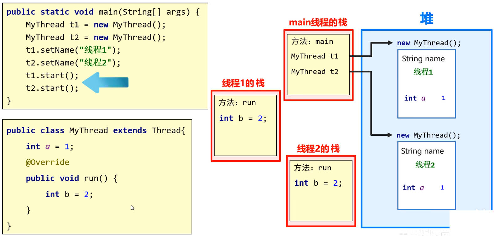

# Java 多线程之综合练习

## 一、练习一：卖电影票

一共有 1000 张电影票，可以在两个窗口领取，假设每次领取的时间为 3000 毫秒；

要求，请用多线程模拟卖票过程，并打印剩余电影票的数量。

`MovieTicketSaleThread2` 线程类。

demo-project/base-code/Day31/src/com/kkcf/test/MovieTicketSaleThread2.java

```java
package com.kkcf.test;

public class MovieTicketSaleThread2 extends Thread {
    public static int ticketCount = 0;

    @Override
    public void run() {
        while (true) {
            synchronized (MovieTicketSaleThread2.class) {
                try {
                    Thread.sleep(3000);
                } catch (InterruptedException e) {
                    throw new RuntimeException(e);
                }

                if (++ticketCount > 1000) break;

                System.out.println(Thread.currentThread().getName() + "正在卖第" + (ticketCount) + "张票");
            }
        }
    }
}
```

测试类：

demo-project/base-code/Day31/src/com/kkcf/test/Test4.java

```java
package com.kkcf.test;

public class Test4 {
    public static void main(String[] args) {
        MovieTicketSaleThread2 t1 = new MovieTicketSaleThread2();
        MovieTicketSaleThread2 t2 = new MovieTicketSaleThread2();

        t1.setName("窗口1");
        t2.setName("窗口2");

        t1.start();
        t2.start();
    }
}
```

## 二、练习二：送礼物

有 100 份礼品，两个人同时发送，当剩下的礼品小于 10 份的时候，则不再送出。

利用多线程模拟该过程，并将线程的名字和礼物的剩余数量打印出来。

自定义 `SendGiftsThread` 线程类：

demo-project/base-code/Day31/src/com/kkcf/test/SendGiftsThread.java

```java
package com.kkcf.test;

public class SendGiftsThread extends Thread {
    public static int giftCount = 100;

    public SendGiftsThread() {
    }

    public SendGiftsThread(String name) {
        super(name);
    }

    @Override
    public void run() {
        while (true) {
            synchronized (SendGiftsThread.class) {

                if (--giftCount < 9) break;

                System.out.println(Thread.currentThread().getName() + "送出了一份礼物，还剩" + giftCount + "个礼物");
            }
        }
    }
}
```

测试类

demo-project/base-code/Day31/src/com/kkcf/test/Test05.java

```java
package com.kkcf.test;

public class Test05 {
    public static void main(String[] args) {
        SendGiftsThread t1 = new SendGiftsThread("同学A");
        SendGiftsThread t2 = new SendGiftsThread("同学B");

        t1.start();
        t2.start();
    }
}
```

## 三、练习三：打印奇数数字

同时开启两个线程，共同获取 1-100 之间的所有数字。

要求：输出所有的奇数。

自定义 `OddThread` 线程类：

demo-project/base-code/Day31/src/com/kkcf/test/OddThread.java

```java
package com.kkcf.test;

public class OddThread extends Thread {
    public static int num = 100;

    public OddThread() {
    }

    public OddThread(String name) {
        super(name);
    }

    @Override
    public void run() {
        while (true) {
            synchronized (OddThread.class) {
                if (--num < 0) break;

                if (num % 2 == 1)
                    System.out.println(Thread.currentThread().getName() + "获取到奇数：" + num);
            }
        }
    }
}
```

测试类：

demo-project/base-code/Day31/src/com/kkcf/test/Test06.java、

```java
package com.kkcf.test;

public class Test06 {
    public static void main(String[] args) {
        OddThread t1 = new OddThread("线程1");
        OddThread t2 = new OddThread("线程2");

        t1.start();
        t2.start();
    }
}
```

## 四、练习四：抢红包

抢红包也用到了多线程，假设 100 块，分成了 3 个红包，现在有 5 个人去枪；

其中，红包是共享数据。5 个人是 5 条线程。打印结果如下：

- xxx 抢到了 xxx 元
- xxx 抢到了 xxx 元
- xxx 抢到了 xxx 元
- xxx 没有抢到，
- xxx 没有抢到，

为实现精确计算，使用 `BigDecimal` 表示小数。

```java
package com.kkcf.test;

import java.math.BigDecimal;
import java.math.RoundingMode;
import java.util.Random;

public class RedEnvelopeThread extends Thread {
    // 最小的中奖金额
    static final BigDecimal MIN = BigDecimal.valueOf(0.01);
    // 红包金额
    static BigDecimal money = BigDecimal.valueOf(100);
    // 红包个数
    static int count = 3;

    @Override
    public void run() {
        synchronized (RedEnvelopeThread.class) {
            Random r = new Random();

            if (count == 0) {
                System.out.println(Thread.currentThread().getName() + "没有抢到红包。");
                return;
            }

            // 判断共享数据，是否到末尾
            BigDecimal price = BigDecimal.valueOf(0);

            if (count == 1) {
                // 最后一个红包，剩余所有的钱，都是中奖金额
                price = money;
            } else {
                // 计算红包金额
                BigDecimal bounds = money.subtract(MIN.multiply(BigDecimal.valueOf((count - 1))));
                price = BigDecimal.valueOf(r.nextDouble(bounds.doubleValue()));

                // 红包的金额，不能小于最小值
                if (price.compareTo(MIN) < 0) price = MIN;
                price = price.setScale(2, RoundingMode.HALF_UP); // 四舍五入
            }

            // 从 money 中，去掉当前中奖金额
            money = money.subtract(price);

            // 红包的个数 - 1
            count--;

            System.out.println(Thread.currentThread().getName() + "抢到了" + price + "元");
        }
    }
}
```

- `r.nextDouble` 方法，只有 JDK17 才能用。

测试类：

demo-project/base-code/Day31/src/com/kkcf/test/Test07.java

```java
package com.kkcf.test;

public class Test07 {
    public static void main(String[] args) {
        RedEnvelopeThread t1 = new RedEnvelopeThread();
        RedEnvelopeThread t2 = new RedEnvelopeThread();
        RedEnvelopeThread t3 = new RedEnvelopeThread();
        RedEnvelopeThread t4 = new RedEnvelopeThread();
        RedEnvelopeThread t5 = new RedEnvelopeThread();

        t1.setName("小A");
        t2.setName("小B");
        t3.setName("小C");
        t4.setName("小D");
        t5.setName("小E");

        t1.start();
        t2.start();
        t3.start();
        t4.start();
        t5.start();
    }
}
```

## 五、练习五：抽奖箱抽奖

有一个抽奖池，其中存放了奖励的金额 {10, 5, 20, 50, 100, 200, 500, 800, 2, 80, 300, 700};

创建两个抽奖箱（线程），设置线程名称分别为”抽奖箱1”、“抽奖箱2”，随机从抽奖池中，获取奖项元素并打印在控制台上，格式如下：

- 抽奖箱 1 又产生了一个 10 元大奖
- ……

思路：使用 ArrayList 集合，其中有 remove 方法，用于抽奖和去重。

demo-project/base-code/Day31/src/com/kkcf/test/LotteryThread.java

```java
package com.kkcf.test;

import java.util.ArrayList;
import java.util.Collections;

public class LotteryThread extends Thread {
    // 抽奖池，使用构造方法来初始化，保证多线程共享的数据是唯一的
    public ArrayList<Integer> list;

    public LotteryThread(ArrayList<Integer> list) {
        this.list = list;
    }

    @Override
    public void run() {
        while (true) {
            synchronized (LotteryThread.class) {
                if (list.isEmpty()) return;

                // 打乱抽奖池，并抽奖
                Collections.shuffle(list);
                Integer price = list.remove(0);
                System.out.println(super.getName() + "又产生了一个大 " + price + "元大奖");
            }

            // 让多线程执行更加均匀
            try {
                Thread.sleep(10);
            } catch (InterruptedException e) {
                throw new RuntimeException(e);
            }
        }
    }
}
```

- 使用构造方法，传入集合对象，来实现数据共享

> 同一个线程连续执行，通常是因为数据量比较小；
>
> 为了让线程执行的更加均匀，通常会把 `Thread.sleep()` 方法，写在同步代码块的**外面**。

测试类：

demo-project/base-code/Day31/src/com/kkcf/test/Test08.java

```java
package com.kkcf.test;

import java.util.ArrayList;
import java.util.Arrays;

public class Test08 {
    public static void main(String[] args) {
        ArrayList<Integer> list = new ArrayList<>(Arrays.asList(10, 5, 20, 50, 100, 200, 500, 800, 2, 80, 300, 700));

        LotteryThread t1 = new LotteryThread(list);
        LotteryThread t2 = new LotteryThread(list);

        t1.setName("抽奖箱1");
        t2.setName("抽奖箱2");

        t1.start();
        t2.start();
    }
}

```

## 六、练习六：多线程统计并求最大值

在上一题基础上，继续完成如下需求：

每次抽奖的过程中，不打印，抽完一次性打印。格式：

- 在此次抽奖过程中，抽奖箱1总共产生6个奖项，分别为：10,20,100,500,2,300 最高奖项为 300 元，总计额为 932 元
- ……

重构 `LotteryThread` 类：

- 需要增加两个静态属性，用于表示两个抽奖箱抽中的奖。

demo-project/base-code/Day31/src/com/kkcf/test/LotteryThread.java

```java
package com.kkcf.test;

import java.util.ArrayList;
import java.util.Collections;

public class LotteryThread extends Thread {
    public static ArrayList<Integer> list1 = new ArrayList<>(); // 抽奖箱 1
    public static ArrayList<Integer> list2 = new ArrayList<>(); // 抽奖箱 2
    public ArrayList<Integer> list; // 抽奖池，使用构造方法初始化

    public LotteryThread(ArrayList<Integer> list) {
        this.list = list;
    }

    @Override
    public void run() {
        while (true) {
            synchronized (LotteryThread.class) {
                String name = super.getName();

                if (list.isEmpty()) {
                    //抽奖箱 1 总共产生了 6 个奖项，分别为：10,20,100,500,2,300 最高奖项为 300 元，总计额为 932 元
                    if ("抽奖箱1".equals(name)) {
                        System.out.println(name + "共产生了" + list1.size() + "个奖项，分别为" + list1 + "，其中最高奖项为" + Collections.max(list1) + "元，总计额为：" + list1.stream().reduce(0, Integer::sum) + " 元");
                    } else {
                        System.out.println(name + "共产生了" + list2.size() + "个奖项，分别为" + list2 + "，其中最高奖项为" + Collections.max(list2) + "元，总计额为：" + list2.stream().reduce(0, Integer::sum) + " 元");
                    }
                    return;
                }

                Collections.shuffle(list);
                Integer price = list.remove(0);

                if ("抽奖箱1".equals(name)) {
                    list1.add(price);
                } else {
                    list2.add(price);
                }
                //System.out.println(name + "又产生了一个大 " + price + "元大奖");
            }

            try {
                Thread.sleep(10);
            } catch (InterruptedException e) {
                throw new RuntimeException(e);
            }
        }
    }
}
```

如果有多个抽奖箱，上方代码是不适用的，再次重构 `LotteryThread` 类：

- 在 `run` 方法中，定义一个 `boxList` 集合，用于表示执行 `run` 方法的线程（抽奖箱）抽中的奖。

demo-project/base-code/Day31/src/com/kkcf/test/LotteryThread.java

```java
package com.kkcf.test;

import java.util.ArrayList;
import java.util.Collections;

public class LotteryThread extends Thread {
    public static ArrayList<Integer> list1 = new ArrayList<>(); // 抽奖箱 1
    public static ArrayList<Integer> list2 = new ArrayList<>(); // 抽奖箱 2
    public ArrayList<Integer> list;

    public LotteryThread(ArrayList<Integer> list) {
        this.list = list;
    }

    @Override
    public void run() {
        ArrayList<Integer> boxList = new ArrayList<>();

        while (true) {
            synchronized (LotteryThread.class) {
                String name = super.getName();

                if (list.isEmpty()) {
                    //抽奖箱 1 总共产生了 6 个奖项，分别为：10,20,100,500,2,300 最高奖项为 300 元，总计额为 932 元
                    System.out.println(name + "共产生了" + boxList.size() + "个奖项，分别为" + boxList + "，其中最高奖项为" + Collections.max(boxList) + "元，总计额为：" + boxList.stream().reduce(0, Integer::sum) + " 元");
                    return;
                }

                Collections.shuffle(list);
                Integer price = list.remove(0);

                boxList.add(price);
            }

            try {
                Thread.sleep(10);
            } catch (InterruptedException e) {
                throw new RuntimeException(e);
            }
        }
    }
}
```

### 1.多线程内存原题

在 JVM 虚拟机中，堆内存是唯一的，栈内存不是唯一的。每一条线程，都有自己的栈。

Java 多线程内存原理图，如下图所示：



## 七、练习七：多线程之间的比较

在上一题基础上，继续完成需求：打印格式如下所示：

- 在此次抽奖过程中，抽奖箱1总共产生了6个奖项，分别为：10,20,100,500,2,300，最高奖项为 300 元，总计额为 932 元
- ……
- 在此次抽奖过程中，抽奖箱2产生最大奖项，该奖金额为 800 元。

思路，比较两个线程的奖项时，要等待两个线程**运行完毕**，才能比较；

将线程奖项中的最大值，看作线程运行的结果，进行返回。

创建 `LotteryCallable` 类，实现 `Callable` 接口

demo-project/base-code/Day31/src/com/kkcf/test/LotteryCallable.java

```java
package com.kkcf.test;

import java.util.ArrayList;
import java.util.Collections;
import java.util.concurrent.Callable;

public class LotteryCallable implements Callable<Integer> {
    public ArrayList<Integer> list;

    public LotteryCallable(ArrayList<Integer> list) {
        this.list = list;
    }

    @Override
    public Integer call() throws Exception {
        ArrayList<Integer> boxList = new ArrayList<>();

        while (true) {
            synchronized (LotteryThread.class) {
                String name = Thread.currentThread().getName();

                if (list.isEmpty()) {
                    Integer max = Collections.max(boxList);
                    //抽奖箱 1 总共产生了 6 个奖项，分别为：10,20,100,500,2,300 最高奖项为 300 元，总计额为 932 元
                    System.out.println(name + "共产生了" + boxList.size() + "个奖项，分别为" + boxList + "，其中最高奖项为" + max + "元，总计额为：" + boxList.stream().reduce(0, Integer::sum) + " 元");

                    return boxList.isEmpty() ? null : max;
                }

                Collections.shuffle(list);
                Integer price = list.remove(0);

                boxList.add(price);
            }

            Thread.sleep(10);
        }

    }
}
```

测试类：

- 创建两个 FutureTask 对象，用于接收两个线程返回的结果，

demo-project/base-code/Day31/src/com/kkcf/test/Test09.java

```java
package com.kkcf.test;

import java.util.ArrayList;
import java.util.Arrays;
import java.util.concurrent.ExecutionException;
import java.util.concurrent.FutureTask;

public class Test09 {
    public static void main(String[] args) throws ExecutionException, InterruptedException {
        ArrayList<Integer> list = new ArrayList<>(Arrays.asList(10, 5, 20, 50, 100, 200, 500, 800, 2, 80, 300, 700));

        LotteryCallable c1 = new LotteryCallable(list);
        LotteryCallable c2 = new LotteryCallable(list);

        FutureTask<Integer> ft1 = new FutureTask<>(c1);
        FutureTask<Integer> ft2 = new FutureTask<>(c2);

        Thread t1 = new Thread(ft1, "抽奖箱1");
        Thread t2 = new Thread(ft2, "抽奖箱2");

        t1.start();
        t2.start();

        Integer max1 = ft1.get();
        Integer max2 = ft2.get();

        boolean flag = max1 > max2;
        Integer max = flag ? max1 : max2;
        String maxNo = flag ? "1" : "2";

        System.out.println("在此次抽奖过程中，抽奖箱" + maxNo + "产生最大奖项，该奖金额为 " + max + " 元。");

    }
}
```
