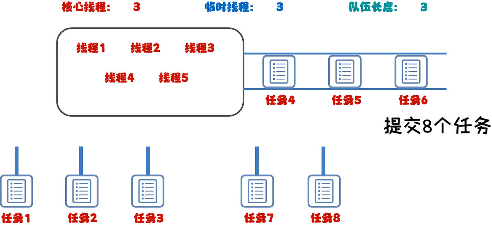
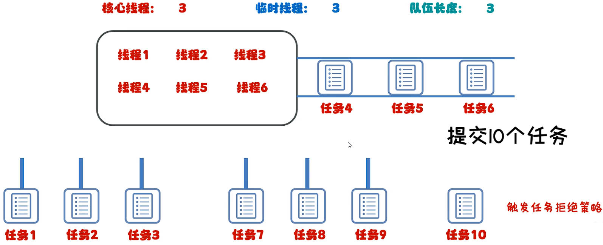

# Java多线程之线程池

之前多线程的实践中：

- 用到线程的时候，就创建；
- 用完之后，线程消失；

这么做，会造成系统资源的浪费。

可以准备一个容器，用于存放创建好的线程，用于以后任务的复用，这个容器就是**线程池**。

## 一、线程池的核心逻辑

1. 创建一个池子，里面是空的。
2. 提交任务时，池子会创建新的线程对象，任务执行完毕，线程归还给池子。
3. 下次再提交任务时，池子不需要再创建新的线程，直接复用已有的线程即可。
4. 如果提交任务时，池子中没有空闲的线程，也无法创建新的线程，任务就会排队等待。

## 二、线程池代码实现

线程池代码实现，一共有三步：

1. 创建线程池；
2. 提交任务；
3. 所有的任务执行完毕，关闭线程池。

> 实际开发中，线程池很少关闭，因为服务器都是 24h 运行的。

`Executor` 是线程池的工具类，可以调用其中的**静态方法**，获取不同类型的线程池对象。

| 静态方法名                                                   | 上面                                                |
| ------------------------------------------------------------ | --------------------------------------------------- |
| `public static ExecutorService newCachedThreadPool()`        | 创建一个没有上限的线程池（上限是 int 类型的最大值） |
| `public static ExecutorService newFixedThreadPool(int nThreads)` | 创建一个有上限的线程池                              |

### 1.newCachedThreadPool 方法使用

创建自定义类，继承 `Runnable` 类。

demo-project/base-code/Day31/src/com/kkcf/threadpoll/MyRunnable.java

```java
package com.kkcf.threadpoll;

public class MyRunnable implements Runnable {

    @Override
    public void run() {
        for (int i = 0; i < 100; i++) {
            System.out.println(Thread.currentThread().getName() + ":" + i);
        }
    }
}
```

测试类：

- 创建 5 个线程，放在线程池中。

demo-project/base-code/Day31/src/com/kkcf/threadpoll/Demo01.java

```java
package com.kkcf.threadpoll;

import java.util.concurrent.ExecutorService;
import java.util.concurrent.Executors;

public class Demo01 {
    public static void main(String[] args) {
        ExecutorService pool = Executors.newCachedThreadPool();

        MyRunnable r1 = new MyRunnable();
        MyRunnable r2 = new MyRunnable();
        MyRunnable r3 = new MyRunnable();
        MyRunnable r4 = new MyRunnable();
        MyRunnable r5 = new MyRunnable();

        pool.submit(r1);
        pool.submit(r2);
        pool.submit(r3);
        pool.submit(r4);
        pool.submit(r5);

        pool.shutdown();
    }
}
```

每次提交前，让线程睡眠 1s，这样线程池中的线程就可以看到**复用**的效果。

demo-project/base-code/Day31/src/com/kkcf/threadpoll/Demo01.java

```java
package com.kkcf.threadpoll;

import java.util.concurrent.ExecutorService;
import java.util.concurrent.Executors;

public class Demo01 {
    public static void main(String[] args) throws InterruptedException {
        ExecutorService pool = Executors.newCachedThreadPool();

        MyRunnable r1 = new MyRunnable();
        MyRunnable r2 = new MyRunnable();
        MyRunnable r3 = new MyRunnable();
        MyRunnable r4 = new MyRunnable();
        MyRunnable r5 = new MyRunnable();

        pool.submit(r1);
        Thread.sleep(1000);
        pool.submit(r2);
        Thread.sleep(1000);
        pool.submit(r3);
        Thread.sleep(1000);
        pool.submit(r4);
        Thread.sleep(1000);
        pool.submit(r5);

        pool.shutdown();
    }
}
```

### 2.newFixedThreadPool 方法使用

测试类：

demo-project/base-code/Day31/src/com/kkcf/threadpoll/Demo01.java

```java
package com.kkcf.threadpoll;

import java.util.concurrent.ExecutorService;
import java.util.concurrent.Executors;

public class Demo01 {
    public static void main(String[] args) throws InterruptedException {
        ExecutorService pool = Executors.newFixedThreadPool(3);

        MyRunnable r1 = new MyRunnable();
        MyRunnable r2 = new MyRunnable();
        MyRunnable r3 = new MyRunnable();
        MyRunnable r4 = new MyRunnable();
        MyRunnable r5 = new MyRunnable();

        pool.submit(r1);
        pool.submit(r2);
        pool.submit(r3);
        pool.submit(r4);
        pool.submit(r5);

        pool.shutdown();
    }
}
```

- 提交 5 个 Runnable 实例对象作为任务，但只会运行在 3 个线程上。因为线程池的容量就是 3 个。
- 前 3 个任务在提交时，分别会创建 1 个线程，后 2 个任务在提交时，会进入阻塞排队状态。

## 三、自定义线程池

使用工具类 `Executor` 创建的线程池，不够灵活：线程池的大小，被固定住了。

这时需要用到 `ThreadPoolExecutor` 类，自定义线程池：

自定义线程池，有如下七个核心元素：

- 核心线程数量（不能小于 0）
- 线程池中最大线程数量（最大数量 >= 核心线程数量）
- 空闲时间（值）（不能小于 0）
- 空闲时间（单位）（用 `TimeUnit` 指定）
- 阻塞队列（不能为 null）
- 创建线程的方式（不能为 null）
- 要执行的任务过多时的解决方案（不能为 null）

临时线程的创建时机是：当核心线程都被占用，阻塞队列也排满后，才会创建临时线程：如下图所示：

- 所以，当任务提交数 > 核心线程数 + 阻塞对列长度时，任务提交的顺序，不一定是任务线程执行的顺序。



如果提交的任务数 > 核心线程数 + 阻塞队列长度 + 临时线程数，那么超过部分的任务，就会触发任务拒绝策略。

- 任务拒绝策略默认就是 `ThreadPoolExecutor.AbortPolicy` 舍弃。



任务拒绝策略有如下几种：

| 任务拒绝策略                           | 说明                                                       |
| -------------------------------------- | ---------------------------------------------------------- |
| ThreadPoolExecutor.AbortPolicy         | 默认策略，丢弃任务并抛出 RejectedExecutionException 异常   |
| ThreadPoolExecutor.CallerRunsPolicy    | 丢弃任务，但是不抛出异常（这是不推荐的做法）               |
| ThreadPoolExecutor.DiscardOldestPolicy | 抛弃阻塞队列中，等待最久的任务，然后把当前任务加入到队列中 |
| ThreadPoolExecutor.DiscardPolicy       | 调用任务的 run 方法，绕过线程池直接执行                    |

在测试类中，创建自定义线程池。

demo-project/base-code/Day31/src/com/kkcf/threadpoll/Demo02.java

```java
package com.kkcf.threadpoll;

import java.util.concurrent.ArrayBlockingQueue;
import java.util.concurrent.Executors;
import java.util.concurrent.ThreadPoolExecutor;
import java.util.concurrent.TimeUnit;

public class Demo02 {
    public static void main(String[] args) {
        ThreadPoolExecutor pool = new ThreadPoolExecutor(
                3, // 核心线程数
                6, // 最大线程数
                60, // 空闲线程存活时间
                TimeUnit.SECONDS, // 时间单位
                new ArrayBlockingQueue<>(3), // 任务阻塞队列
                Executors.defaultThreadFactory(), // 线程工厂创建线程
                new ThreadPoolExecutor.AbortPolicy() // 任务拒绝策略
        );

        MyRunnable r1 = new MyRunnable();
        MyRunnable r2 = new MyRunnable();
        MyRunnable r3 = new MyRunnable();
        MyRunnable r4 = new MyRunnable();
        MyRunnable r5 = new MyRunnable();

        pool.submit(r1);
        pool.submit(r2);
        pool.submit(r3);
        pool.submit(r4);
        pool.submit(r5);

        pool.shutdown();
    }
}
```

### 1.最大并行数

以 4 核 8 线程的 CPU 为例：最大并行数，就是线程数，即 8；

有个别操作系统，不允许某一个软件使用所有线程，

所以一般在 Java 中要通过代码的方式，来查看 JVM 虚拟机的最大并行数。

demo-project/base-code/Day31/src/com/kkcf/threadpoll/Demo03.java

```java
package com.kkcf.threadpoll;

public class Demo03 {
    public static void main(String[] args) {
        int i = Runtime.getRuntime().availableProcessors();
        System.out.println(i); // 12（我当前电脑是 6 核 12 线程的）
    }
}
```

### 2.线程池的大小

任务的类型，分为两种：

- CPU 密集型：计算比较多；
- I/O 密集型：读取文件、读取数据库、发送网络请求比较多。

线程池中合适的线程数，要根据**任务的类型**，由**公式**计算而来：

- CPU 密集型：`最大并行数 + 1`
- I/O 密集性：`最大并行数 * 期望 CPU 利用率 * (总时间（CPU 计算时间 + 等待时间）/ CPU 计算时间)`
  - 比如：`12 * 100% * (100% / 50%) = 24`

> CPU 计算时间、等待时间是什么？
>
> 比如：从本地文件中，读取两个数据，并进行相加的操作，其中：
>
> - 读取两个文件中的数据，该操作由硬盘完成，CPU 是空闲的，所以算是 CPU 等待时间；
> - 两个数据进行相加，由 CPU 完成，算是 CPU 计算时间。
>
> CPU 计算时间、等待时间，可以用 thread dump 工具，测试获得。

## 四、多线程扩展

多线程扩展知识点，详见[此处](doc/多线程（额外扩展）.md)。
