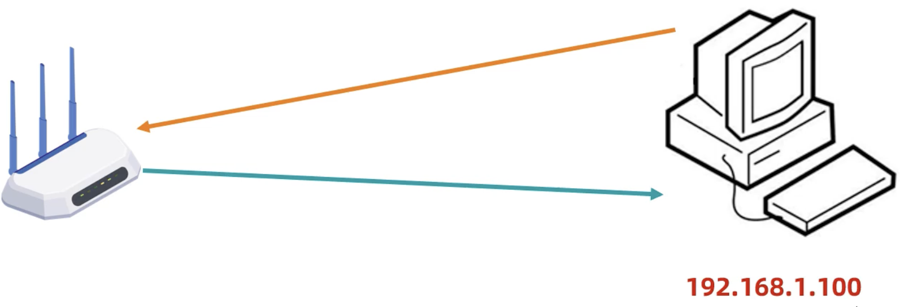

# Java 网络编程之软件架构、三要素、IP、InetAddress 类、端口号

## 一、网络编程的概念

网络编程，指的是在网络通信协议下，不同计算机上运行的程序，进行的数据传输；

网络编程，应用场景有：即时通信、网游对战、金融证券、国际贸易、邮件、……

网络编程，本质上就是计算机之间，通过网络进行数据传输。

Java 中，可以使用 java.net 包下的技术，轻松开发出常见的网络应用程序。

## 二、常见的软件架构

BS（Browser Server）架构，用户只需要在浏览器上，通过不同的地址，访问不同的服务器资源。

- BS 软件架构优点：
  - 开发者易于维护，不需要开发客户端，只需要开发服务器端和网页。
  - 用户使用方便，用户不需要下载更新客户端，打开浏览器就能使用。
- BS 软件架构缺点：
  - 如果应用过大，用户体验不好。

CS（Client Server）架构，在用户本地，需要安装客户端程序，在远程有一个服务器端程序。

- CS 软件架构优点：
  - 应用比较大时，客户体验较好，因为在安装客户端时，本地就会安装所需要的资源，所以资源加载速度快。
- CS 软件架构缺点：
  - 开发者维护成本高，需要维护客户端和服务器端应用程序。
  - 用户使用麻烦，需要及时更新客户端

## 三、网络编程三要素

要素一：**IP**，设备在网络中的地址，是设备的唯一标识。

要素二：**端口号**，应用程序在设备中的唯一标识。

要素三：**协议**，数据在网络传输中的规则。

- 常见的协议有：UDP、TCP、http、https、ftp……

## 三、IP

IP（ Internet Protocol），表示互联网协议地址，也称 IP 地址，是分配给上网设备的数字标签。它具有唯一性。

常见的 IP 有：IPv4，IPv6。

### 1.IPv4 介绍

IPv4（Internet Portocol version 4）表示互联网通信协议第四版。采用 32 位 bit 位地址长度，分为 4 组，每组 8 个 bit 位。

- 比如 11000000 10101000 00000001 01000010 就是一个 IPv4 地址。

IPv4 共有 2^32^ 个 IP 地址

二进制表示的 IP 地址，阅读性差，所以出现了**点分十进制表示法**。

- 即将每组的二进制数字，转为十进制表示，再以点号分割，

在二进制转十进制的过程中，没有负数，所以每组数字的范围是 0-255，转换上方的二进制得到：192.168.1.66

2019 年 11 月 26 肉，所有 IPv4 地址，被分配完毕。

### 2.IPv6 介绍

为了解决 IP 地址不够用的问题，出现了 IPv6。

IPv6（Internet Protocol version 6），表示互联网通信协议第六版，采用 128 位 bit 位地址长度，分为 8 组，每组 16 个 bit 位。

- 比如：00100000 00000001 00001101 10111000 00000000 00000000 00000000 00100011 00000000 00001000 00001000 00000000 00100000 00001100 01000001 01111010 就是一个 IPv6 地址。

IPv6 共有 2^128^ 个 IP 地址。

二进制表示的 IP 地址，阅读性差，所以针对 IPv6 地址，出现了**冒分十六进制表示法**：

- 即将每组的二进制数字，转为十六进制表示，再以冒号分割，

将上方的二进制，转为十六进制：

- 得到：2001:0DB8:0000:0023:0008:0800:200C:417A
- 省略每组前面的 0，可得：2001:DB8:0:23:8:800:200C:417A

IPv6 冒分十六进制表示法的特殊情况，如果中间出现了连续的 0，比如：FF01:0:0:0:0:0:0:1101

可以使用 **0 位压缩法**得到：FF01::1101

### 3.IPv4 的地址分类形式

IPv4 分为：

- 公网地址（万维网使用）；
- 私有地址（局域网使用）。

其中 192.168. 开头的，就是私有地址，范围是 192.168.0.0—192.168.255.255，专为组织机构内部使用，以此节约 IP。

比如：一个网吧中的所有电脑，往往是共享一个公网 IP，再由路由器，为每台电脑分配局域网 IP。

特殊 IP 地址：127.0.0.1，也称为本地回环地址。一般在 host 文件中，可使用 localhost 解析。

如果我的本地电脑，在局域网中的 IP 是 192.168.1.100，那么从本机往这个 IP 发送请求，会经过路由器。



如果从本机往 127.0.0.1 发送请求，会直接被本机网卡接收并返回。不会经过路由器。

### 4.IP 相关命令

查看本机的 Ip，执行命令：

Windows：

```cmd
ipconfig
```

Mac

```shell
ifconfig
```

ping 命令，可用来检查本机与目标主机的网络，是否畅通。

- 该主机的 IP 地址，可以是私有 IP，也可以是公网 IP

```shell
ping 192.168.1.100
```

## 四、InetAddress 类

Java 中，使用 `InetAddress` 类，来表示 IP；它有两个子类：

- Inet4Address 类；表示 IPv4 地址。
- Inet6Address 类，表示 IPv6 地址。

InetAddress 类没有提供构造方法，用于 `new` 操作符创建对象。

InetAddress 类中的静态方法 `getByName` ，会判断当前使用的是 IPv4 还是 IPv6 地址，并返回对应的子类实例对象。

demo-project/base-code/Day33/src/com/kkcf/ip/Demo01.java

```java
package com.kkcf.ip;

import java.net.InetAddress;
import java.net.UnknownHostException;

public class Demo01 {
    public static void main(String[] args) throws UnknownHostException {
        // 传入 IP 地址
        InetAddress address = InetAddress.getByName("10.33.157.90");
        System.out.println(address); // /10.33.157.90

        // 传入主机名
        InetAddress address1 = InetAddress.getByName("ZeTiandeMacBook-Pro.local");
        System.out.println(address1); // ZeTiandeMacBook-Pro.local/127.0.0.1

        // 获取主机名，如果获取不到，会返回一个 iP
        String hostName = address1.getHostName();
        System.out.println(hostName); // ZeTiandeMacBook-Pro.local

        // 获取主机地址
        String hostAddress = address1.getHostAddress();
        System.out.println(hostAddress); // 127.0.0.1
    }
}
```

## 五、端口号

端口号，是应用程序在设备中的唯一标识。一个端口号，只能被一个应用程序使用。

端口号，是两个字节表示的整数；取值范围是 0—65535

- 0—1023 之间的端口号，用于一些系统自带，或知名的应用程序服务。
- 开发者一般使用 1024—65535 之间的端口号。
