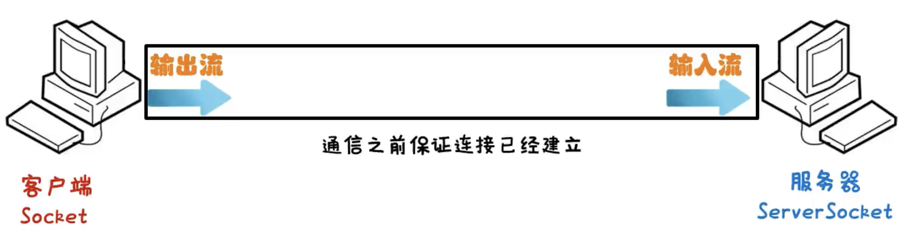

# Java 网络编程之协议

计算机互相通信的模型，主要有两种：

- OSI 参考模型：将网络通信分为 7 层，是世界互联协议标准，全球通信规范，但协议过于理想化，未能在因特网上进行广泛推广。
- TCP / IP 参考模型，又称为 TCP / IP 协议，事实上的国际标准。

| OSI 参考模型 | TCP/IP 参考模型 | TCP/IP 参考模型各层对应协议 | 面向哪些                                           |
| ------------ | --------------- | --------------------------- | -------------------------------------------------- |
| 应用层       | 应用层          | HTTP, FTP, Telnet, DNS, ……  | 应用程序比如：浏览器，邮箱，开发者一般在这一层开发 |
| 表示层       |                 |                             |                                                    |
| 会话层       |                 |                             |                                                    |
| 传输层       | 传输层          | TCP、UDP, ……                | 选择传输使用的 TCP、UDP 协议。                     |
| 网络层       | 网络层          | IP, ICMP, ARP, ……           | 封装自己的 IP，对方的 IP 等信息                    |
| 数据链路层   | 物理链路层      | 硬件设备：01010010101……     | 转换成二进制利用物理设备传输。                     |
| 物理层       |                 |                             |                                                    |

> HTTP, FTP, Telnet, DNS, ……协议，基于 TCP、UDP, ……协议封装；
>
> TCP、UDP, ……协议又基于 IP, ICMP, ARP, …… 协议封装。
>
> TCP 协议中的三次握手、四次挥手就是基于 ICMP 协议的。

计算机网络中，连接和通信的规则，被称为网络通信协议。

## 一、UDP 协议

UDP（User Datagram Protocol）用户数据报协议。是面向无连接的通信协议。

- 两个通信的计算机之间，发送方不管是否与接收方建立连接成功，都会发送数据。

UDP 协议，特点是：通信速度快，有大小限制（64k），数据不安全、易丢失。

UDP 协议，适用于丢失一点数据，不会有很大影响的场景。

- 比如：视频会议，网络通话，

### 1.Java UDP 通信

UDP 通信程序，发送数据的过程，就好比寄快递，有如下几步：

1. 找快递公司；--> 创建发送端的 DatagramSocket 对象。
2. 打包礼物；--> 数据打包 DatagramPacked。
3. 快递公司发送包裹；--> 发送数据。
4. 肤浅走人。--> 释放资源。

demo-project/base-code/Day33/src/com/kkcf/udp/SendMessage.java

```java
package com.kkcf.udp;

import java.io.IOException;
import java.net.*;

public class SendMessage {
    public static void main(String[] args) throws IOException {
        // 创建 DatagramSocket 对象
        //   - 不传参数，表示随机绑定计算机上的一个端口，发送数据
        //   - 传惨，表示指定一个端口，发送数据
        DatagramSocket ds = new DatagramSocket();

        // 打包数据
        String str = "你很勇哦";
        byte[] bytes = str.getBytes();
        InetAddress ip = InetAddress.getByName("127.0.0.1");
        int port = 10086;

        DatagramPacket dp = new DatagramPacket(bytes, bytes.length, ip, port);

        // 发送数据
        ds.send(dp);

        // 释放资源
        ds.close();
    }
}
```

UDP 通信程序，接受数据的过程，就好比取快递，有如下几步：

1. 找快递公司；--> 创建接受端的 DatagramSocket 对象。
2. 接受快递箱子；--> 接收打包好的数据。
3. 从箱子里面获取礼物；--> 解析数据包。
4. 签收走人。--> 释放资源。

demo-project/base-code/Day33/src/com/kkcf/udp/ReciveMessage.java

```java
package com.kkcf.udp;

import java.io.IOException;
import java.net.DatagramPacket;
import java.net.DatagramSocket;
import java.net.InetAddress;
import java.net.SocketException;

public class ReciveMessage {
    public static void main(String[] args) throws IOException {
        // 创建 DatagramSocket 对象
        //     - 在接受数据时，一定要绑定端口，要与发送数据到目标端口一致。
        DatagramSocket ds = new DatagramSocket(10086);

        // 接收数据包
        byte[] bytes = new byte[1024];
        DatagramPacket dp = new DatagramPacket(bytes, bytes.length);
        ds.receive(dp); // 该方法是阻塞的，如果没有接受到数据，会在此处阻塞

        // 解析数据包
        byte[] data = dp.getData();
        int len = dp.getLength();
        InetAddress ip = dp.getAddress();
        int port = dp.getPort();

        System.out.println("接受到数据" + new String(data, 0, len));
        System.out.println("发送方ip" + ip);
        System.out.println("发送方端口" + port);


        // 释放资源
        ds.close();
    }
}
```

注意：先运行接收的程序，再运行发送的程序。

案例理解：聊天室，按照下面的要求实现程序：

- UDP 发送数据：数据来自于键盘录入，直到输入的数据“886”，发送数据结束；
- UDP 接收数据：因为接收端不知道发送端什么时候停止发送，故采用死循环接收。

创建发送数据的类 ChatroomSend.java：

demo-project/base-code/Day33/src/com/kkcf/udp/ChatroomSend.java

```java
package com.kkcf.udp;

import java.io.IOException;
import java.net.DatagramPacket;
import java.net.DatagramSocket;
import java.net.InetAddress;
import java.util.Scanner;

public class ChatroomSend {
    public static void main(String[] args) throws IOException {
        // 创建 DatagramSocket 对象
        DatagramSocket ds = new DatagramSocket();

        // 打包数据
        Scanner sc = new Scanner(System.in);

        String data = null;
        do {
            System.out.println("请输入要发送到数据：");
            data = sc.nextLine();
            byte[] bytes = data.getBytes();

            // 打包数据
            InetAddress address = InetAddress.getByName("127.0.0.1");
            int port = 10086;
            DatagramPacket dp = new DatagramPacket(bytes, bytes.length, address, port);

            // 发送数据
            ds.send(dp);
        } while (!("886".equals(data)));

        // 释放资源
        ds.close();
    }
}
```

- 将这个类，设置为可重复运行的类，用于创建多个聊天窗口。

> 在 IDEA 中，设置一个类，可以重复运行多次：
>
> - 右上角选中类文件 -> Edit Configuration -> Modify Option -> Allow Multiple Instance

创建接收数据的类：

demo-project/base-code/Day33/src/com/kkcf/udp/ChatRoomRecive.java

```java
package com.kkcf.udp;

import java.io.IOException;
import java.net.DatagramPacket;
import java.net.DatagramSocket;
import java.net.SocketException;

public class ChatRoomRecive {
    public static void main(String[] args) throws IOException {
        // 创建 DatagramSocket 对象
        DatagramSocket ds = new DatagramSocket(10086);

        // 接收数据包
        byte[] bytes = new byte[1024];
        DatagramPacket dp = new DatagramPacket(bytes, bytes.length);


        while (true) {
            ds.receive(dp); // 阻塞方法

            // 解析数据包
            byte[] data = dp.getData();
            int len = dp.getLength();
            String ip = dp.getAddress().getHostAddress();
            String hostName = dp.getAddress().getHostName();

            System.out.println("接受到数据" + new String(data, 0, len));
            System.out.println("发送方ip" + ip);
            System.out.println("发送方主机名" + hostName);
        }

        // 释放资源
        //ds.close();
    }
}
```

UDP 的三种通信方式：

- 单播；给单个主机发送信息。
  - 以上代码，都是单播的案例。
- 组播：给一组主机发送信息。
  - 组播地址：224.0.0.0 ~ 239.255.255.255；
  - 其中：224.0.0.0 ~ 224.0.0.255 为预留的组播地址
- 广播：给局域网中所有主机发送数据。
  - 广播地址：255.255.255.255

#### 1.UDP 组播

组播发送端：

demo-project/base-code/Day33/src/com/kkcf/udp/MulticastSend.java

```java
package com.kkcf.udp;

import java.io.IOException;
import java.net.DatagramPacket;
import java.net.InetAddress;
import java.net.MulticastSocket;

public class MulticastSend {
    public static void main(String[] args) throws IOException {
        // 创建 MulticastSocket 对象
        MulticastSocket ms = new MulticastSocket();

        // 创建 DatagramPacket 对象
        String data = "你好，你好！";
        byte[] bytes = data.getBytes();
        InetAddress address = InetAddress.getByName("224.0.0.1"); // 指定组播地址
        int port = 10086;

        DatagramPacket dp = new DatagramPacket(bytes, bytes.length, address, port);

        // 发送数据
        ms.send(dp);

        // 释放资源
        ms.close();
    }
}
```

组播接收端：

demo-project/base-code/Day33/src/com/kkcf/udp/MulticastRecive.java

```java
package com.kkcf.udp;

import java.io.IOException;
import java.net.DatagramPacket;
import java.net.InetAddress;
import java.net.MulticastSocket;

public class MulticastRecive {
    public static void main(String[] args) throws IOException {
        // 创建 MulticastSocket 对象
        MulticastSocket ms = new MulticastSocket(10086); // 指定接收数据的端口

        // 将当前本机，添加到 224.0.0.1 的这一组当中
        InetAddress address = InetAddress.getByName("224.0.0.1");
        ms.joinGroup(address);

        // 创建 Datagram 数据包对象
        byte[] bytes = new byte[1024];
        DatagramPacket dp = new DatagramPacket(bytes, bytes.length);

        // 接收数据
        ms.receive(dp); // 阻塞

        // 接续数据
        byte[] data = dp.getData();
        int len = dp.getLength();
        String hostAddress = dp.getAddress().getHostAddress();
        String hostName = dp.getAddress().getHostName();

        System.out.println("接受到数据" + new String(data, 0, len));
        System.out.println("发送方ip" + hostAddress);
        System.out.println("发送方主机名" + hostName);

        // 释放资源
        ms.close();
    }
}
```

- 当创建多个接收端实例对象时，它们都可以接收发送端发送的数据，因为他们加入了同一个组 224.0.0.1。

#### 2.UDP 广播

将发送端 ip 设为 255.255.255.255，就变成了广播。

广播发送端：

demo-project/base-code/Day33/src/com/kkcf/udp/BroadcastSend.java

```java
package com.kkcf.udp;

import java.io.IOException;
import java.net.DatagramPacket;
import java.net.InetAddress;
import java.net.MulticastSocket;

public class BroadcastSend {
    public static void main(String[] args) throws IOException {
        // 创建 MulticastSocket 对象
        MulticastSocket ms = new MulticastSocket();

        // 创建 DatagramPacket 对象
        String data = "你好，你好！";
        byte[] bytes = data.getBytes();
        InetAddress address = InetAddress.getByName("255.255.255.255"); // 指定组播地址
        int port = 10086;

        DatagramPacket dp = new DatagramPacket(bytes, bytes.length, address, port);

        // 发送数据
        ms.send(dp);

        // 释放资源
        ms.close();
    }
}
```

广播接收端，与单播接收端一样。

## 二、TCP 协议

TCP（Transmission Control Protocol）传输控制协议，是面向连接的通信协议。

- 两个通信的计算机之间，确保连接成功后，才能发送数据。

TCP 协议，特点是：通讯速度慢，没有大小限制，数据安全。

TCP 协议，适用于不能有数据丢失的应用场景，比如：下载软件，文字聊天、发送邮件。

TCP 协议，是一种可靠的网络通信协议，它要求在通信的两端，各建立一个 Socket 对象。

- 通信之前，要保证连接已经建立；
- 通过 Socket 产生 IO 流，来进行网络通信。



TCP 协议，发送数据的步骤：

1. 创建客户端的 Socket 对象（Socket），与指定服务器连接。
2. 获取输出流，写出数据；
3. 释放资源

demo-project/base-code/Day33/src/com/kkcf/tcp/Client.java

```java
package com.kkcf.tcp;

import java.io.IOException;
import java.io.OutputStream;
import java.net.Socket;

public class Client {
    public static void main(String[] args) throws IOException {
        // 创建 Socket 对象，连接服务器端，如果连接不上，会抛出异常
        Socket socket = new Socket("127.0.0.1", 10086);

        // 从连接通道中，获取字节输出流
        OutputStream os = socket.getOutputStream();

        // 写数据
        os.write("你好，你好".getBytes());

        // 释放资源
        os.close(); // 可关，可不关
        socket.close(); // 必须关，会连同关闭 os 流。
    }
}
```

- `new Socket("127.0.0.1", 10086);` 会建立与服务端的连接，底层通过“**三次握手**”建立连接。
- `socket.close()`，底层使用“**四次挥手**”，断开连接，并保证连接通道里面的数据已经处理完毕了。

TCP 协议，接收数据的步骤：

1. 创建服务器的 Socket 对象（ServerSocket）；
2. 监听客户端连接，返回一个 Socket 对象；
3. 获取输入流，读数据，并把数据显示在控制台。
4. 释放资源。

demo-project/base-code/Day33/src/com/kkcf/tcp/Server.java

```java
package com.kkcf.tcp;

import java.io.IOException;
import java.io.InputStream;
import java.net.ServerSocket;
import java.net.Socket;

public class Server {
    public static void main(String[] args) throws IOException {
        // 创建对象 ServerSocket
        ServerSocket serverSocket = new ServerSocket(10086); // 指定端口号

        // 监听客户端端 socket 连接
        Socket socket = serverSocket.accept(); // 阻塞

        // 从连接通道中，获取字节输入流，读取数据
        InputStream is = socket.getInputStream();
        int b;
        while ((b = is.read()) != -1)
            System.out.print((char) b);

        // 释放资源
        is.close();
        socket.close(); // socket 连接通道关闭
        serverSocket.close(); // 服务端 socket 关闭.
    }
}
```

上面的做法，不能处理汉子这样的特殊字符。使用字符转换输入流和字符缓冲输入流，优化上面的代码：

demo-project/base-code/Day33/src/com/kkcf/tcp/Server.java

```java
package com.kkcf.tcp;

import java.io.BufferedReader;
import java.io.IOException;
import java.io.InputStream;
import java.io.InputStreamReader;
import java.net.ServerSocket;
import java.net.Socket;

public class Server {
    public static void main(String[] args) throws IOException {
        // 创建对象 ServerSocket
        ServerSocket serverSocket = new ServerSocket(10086); // 指定端口号

        // 监听客户端端 socket 连接
        Socket socket = serverSocket.accept(); // 阻塞

        // 从连接通道中，获取字节输入流，读取数据
        InputStream is = socket.getInputStream();

        BufferedReader br = new BufferedReader(new InputStreamReader(is));
        String line;
        while ((line = br.readLine()) != null)
            System.out.println(line);

        // 释放资源
        is.close();
        socket.close(); // socket 连接通道关闭
        serverSocket.close(); // 服务端 socket 关闭.
    }
}
```

### 1.三次握手

TCP 通信协议中，客户端与服务端建立连接，会经过三次握手，这是为了确保连接建立。

如下图所示：


三次握手，就是一个为了建立连接，反复确认的过程。

### 2.四次挥手

TCP 通信协议中，客户端与服务端断开，会经过四次挥手，这是为了确保连接断开，并保证数据处理完毕。。


