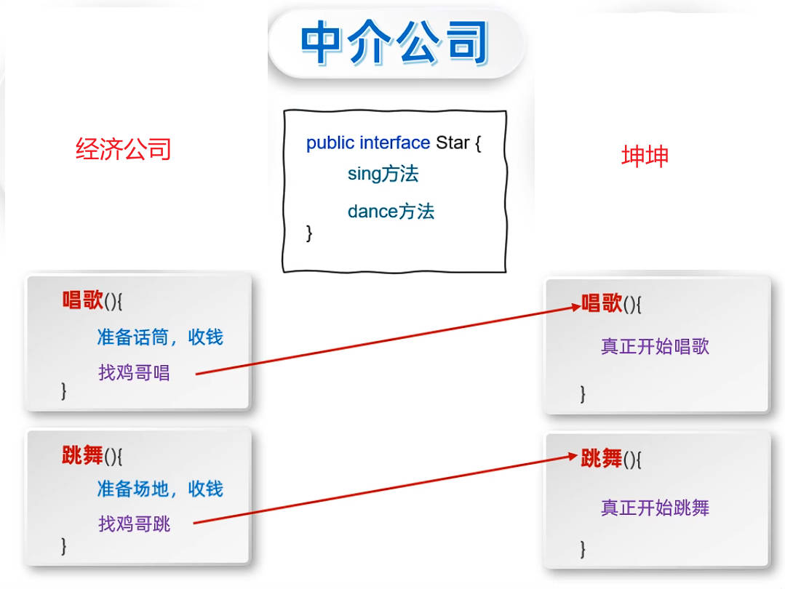
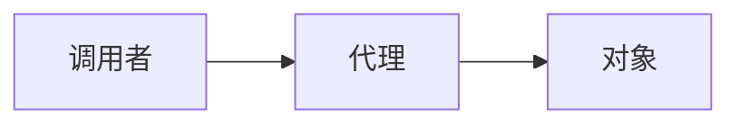

# Java 动态代理

往原有的代码中，直接添加代码，称为“**侵入式修改**”。

动态代理，可以**无侵入式的**为代码增加额外的功能。

如果一个对象，认为自己身上干的事情太多，就可以通过代理，转移部分职责。

对象要有什么方法想要被代理，那么代理对象就一定要有对应的方法。

- 代理对象中的方法，会把准备工作做完；
- 再去调用对象中的方法。

将要代理的方法，写在一个接口中，对象和代理都要实现这个接口。



调用者，通过代理，来调用对象中的方法。



创建一个接口 `Star`，表示对象要代理的方法。

demo-project/base-code/Day35/src/com/kkcf/dynamicproxy/Star.java

```java
package com.kkcf.dynamicproxy;

public interface Star {
    String sing(String name);

    void dance();
}
```

创建明星类 `BigStar`，实现 `Star` 接口。

demo-project/base-code/Day35/src/com/kkcf/dynamicproxy/BigStar.java

```java
package com.kkcf.dynamicproxy;

public class BigStar implements Star {
    private String name;

    // constructors……

    // getter、setter……

    @Override
    public String sing(String name) {
        System.out.println(this.name + "正在唱" + name);
        return "谢谢";
    }

    @Override
    public void dance() {
        System.out.println(this.name + "正在跳舞");
    }
}
```

`java.lang.reflect.Proxy` 类，提供了为对象生成代理对象的方法：

`public static Object newProxyInstance(ClassLoader loader, Class<?>[] interface, InvocationHandler h)`，其中：

- 参数一：`ClassLoader loader` 用于指定用哪个类加载器，去加载生成的代理对象。一般使用当前类的字节码文件对象，获取类加载器。
- 参数二：`Class<?>[] interface` 以数组的形式指定接口，这些接口用于指定生成的代理有哪些方法。
- 参数三：`InvocationHandler h` 用来指定生成的代理对象要干什么事情。一般使用实现了 `InvocationHandler` 接口的匿名内部类对象实例。

> 类加载器，用于把字节码文件，加载到内存中。

定义一个工具类 `ProxyUtil`，用于创建代理对象。

demo-project/base-code/Day35/src/com/kkcf/dynamicproxy/ProxyUtil.java

```java
package com.kkcf.dynamicproxy;

import java.lang.reflect.InvocationHandler;
import java.lang.reflect.Method;
import java.lang.reflect.Proxy;

public class ProxyUtil {
    public static Star createProxy(Object bigStar) {
        return (Star) Proxy.newProxyInstance(
                ProxyUtil.class.getClassLoader(), // 参数一
                new Class[]{Star.class}, // 参数二
                new InvocationHandler() { // 参数三
                    @Override
                    public Object invoke(Object proxy, Method method, Object[] args) throws Throwable {
                        if ("sing".equals(method.getName()))
                            System.out.println("准备话筒，收钱");
                        else if ("dance".equals(method.getName()))
                            System.out.println("准备场地，收钱");

                        return method.invoke(bigStar, args);
                    }
                }
        );
    }
}
```

- `InvocationHandler` 是函数式接口，其中 `invoke` 方法的参数分析；
  - 参数一：代理的对象。
  - 参数二：要运行的方法的实例对象（与反射有关）。
  - 参数三：调用方法，传递的实参。

测试类：

demo-project/base-code/Day35/src/com/kkcf/dynamicproxy/Test.java

```java
package com.kkcf.dynamicproxy;

public class Test {
    public static void main(String[] args) {
        // 创建代理对象
        Star proxy = ProxyUtil.createProxy(new BigStar("坤坤"));

        String result = proxy.sing("只因你太美");

        /*准备话筒，收钱
        坤坤正在唱只因你太美*/

        System.out.println(result); // 谢谢

        proxy.dance();

        /*准备场地，收钱
        坤坤正在跳舞*/
    }
}
```
